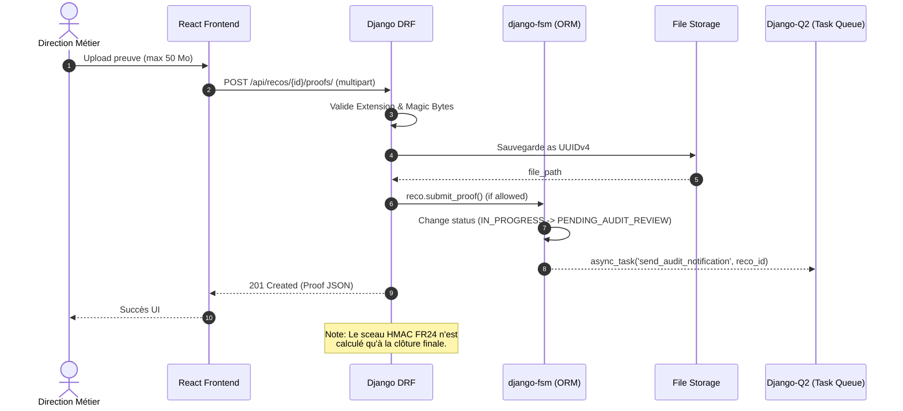

# Architecture Decision Document (Sentinel)

> **Executive Summary**
> Sentinel est une Single-Page Application (SPA) sécurisée, conçue pour opérer on-premise sous contraintes COBAC. L'architecture retenue est un **Custom Monorepo** propulsé par **Django/DRF** en backend et **React (Template Premium)** en frontend, liés au build par `django-vite`.
> Le défi technique central (Workflow d'Audit & Sécurité des données) est résolu par un **RLS PostgreSQL Intégral** (Tenant-Isolation), le framework **django-fsm** pour le moteur d'états, et une architecture Clean (HackSoft) pour garantir un code testable. L'application supporte le multithreading massif via Gunicorn pour la manipulation asynchrone sécurisée de preuves documentaires de grande taille.

## Analyse du Contexte Projet

### Vue d'ensemble des Exigences

#### Exigences Fonctionnelles (31 FR — 7 domaines)

| Domaine | FRs | Implications architecturales |
|---|---|---|
| **Gestion Utilisateurs & Auth** | FR1–FR4 | SSO Active Directory (Read-Only) + credentials locaux Auditeurs Externes. RBAC multi-rôle contextuel (un même utilisateur peut être DM sur une reco et ETP sur une autre). |
| **Initialisation & Import** | FR5–FR9 | Import transactionnel atomique (tout-ou-rien). Soft delete. Bulk create. Tag `IMPORTED` inaltérable dans l'audit trail. Template normalisé téléchargeable exclusivement par l'Audit. |
| **Workflow & Triage** | FR10–FR14 | FSM strict 5 états (`ASSIGNED` → `IN_PROGRESS` → `PENDING_DM_REVIEW` → `PENDING_AUDIT_REVIEW` → `CLOSED_RESOLVED`) + flag `OVERDUE` + statut transitoire d'extension. Demande de report formalisée (DM → Audit). |
| **Soumission & Validation Preuves** | FR15–FR20 | Upload 50 Mo max (validation magic bytes PDF/JPG/PNG). Versioning des preuves (historique des rejets conservé). PV de recette signé par DM. Double validation (DM → Audit). |
| **Notifications & Rappels** | FR21–FR23 | Scheduler asynchrone (CRON nocturne). Emails **consolidés par utilisateur** (1 email = toutes les recos en retard de l'utilisateur). Alertes **proactives J-7 avant échéance**. Quotidien (Critique) / Hebdo (autres). HTML basique compatible Outlook. |
| **Audit Cryptographique & Export** | FR24–FR27 | Sceau HMAC-SHA256 calculé à la clôture. Archive ZIP synchrone < 5s par recommandation. Timeline audit trail (frise chronologique). Append-only strict. |
| **Dashboards** | FR28–FR31 | Accès filtré par périmètre organisationnel (RBAC applicatif). Filtres multi-critères (source, priorité, statut, aging). Code couleur urgence (Rouge/Orange/Vert). CSS `@media print` pour export DG. |

#### Exigences Non-Fonctionnelles (13 NFR — 4 catégories)

| Catégorie | NFRs clés | Impact architectural |
|---|---|---|
| **Sécurité** | TLS 1.2+, session 30min, HMAC-SHA256, Magic Bytes, logs 12 mois | Middleware de sécurité robuste, stockage structuré des logs d'activité |
| **Performance** | Accès filtré < 10ms, UI < 1s (P95), HMAC < 500ms, ZIP < 5s | Pré-calcul du périmètre organisationnel dans le token/session |
| **Scalabilité** | 50 Mo/fichier × 5 max, ~2 000 recos + ~8 000 fichiers historiques, ~200 users concurrents | Dimensionnement mono-serveur suffisant |
| **Fiabilité** | Fail-safe (0 ligne si contexte absent), RPO 24h, RTO 4h, Uptime 99,5% | Backup incrémental nocturne chiffré, RLS minimaliste comme filet de sécurité |

### Échelle & Complexité

- **Domaine technique principal :** Application web full-stack On-Premise (SPA React + API REST + PostgreSQL)
- **Niveau de complexité :** **HIGH** — Accumulation de sous-systèmes MEDIUM (workflow FSM, notifications, uploads, dashboards) + conformité réglementaire HIGH (COBAC R-2016/04, Loi 2024-017)
- **Composants architecturaux estimés :** ~12 modules (Auth/SSO, RBAC, FSM Workflow, Import Engine, File Storage, Notification Scheduler, Crypto Seal, Audit Trail, Dashboard Engine, User Management, Organigramme, Export/Archive)
- **Volume de données :** ~2 000 recommandations, ~8 000 fichiers de preuves, ~200 utilisateurs concurrents max

### Contraintes Techniques & Dépendances

| Contrainte | Détail |
|---|---|
| **On-Premise isolé** | Aucune dépendance Cloud. Tout le runtime doit être auto-contenu sur le réseau interne BICEC. |
| **Active Directory (SSO)** | Intégration Read-Only LDAP. Révocation instantanée via désactivation du compte AD. |
| **PostgreSQL obligatoire** | Triggers d'audit natifs, extensions crypto (pgcrypto pour HMAC-SHA256), RLS minimaliste disponible. |
| **Mono-serveur MVP** | API + BDD sur la même machine/VM. Simplifie TLS interne (pas de chiffrement API↔BDD nécessaire). |
| **SPA React** | Frontend Single Page Application (décision PRD). |
| **Pas de ClamAV MVP** | Sécurité fichiers allégée : validation magic bytes + whitelist extensions uniquement. |

### Préoccupations Transversales

1. **Sécurité & Conformité** — Traverse TOUS les composants : chaque endpoint vérifie le RBAC, chaque requête SQL filtre par périmètre, chaque mutation est tracée dans l'audit trail.
2. **Audit Trail (Append-Only)** — Triggers PostgreSQL sur chaque table métier. Aucune suppression physique. Capture : utilisateur, horodatage, IP, valeurs avant/après.
3. **Gestion des Fichiers** — Upload sécurisé (magic bytes), stockage versionné (preuves rejetées conservées), génération ZIP synchrone, limite mémoire serveur (5 fichiers × 50 Mo max par requête).
4. **Scheduler Asynchrone** — Calcul quotidien OVERDUE, envoi emails consolidés nocturnes, alertes proactives J-7, indépendant du cycle requête/réponse.
5. **Périmètre Organisationnel** — Pré-calcul du périmètre (directions accessibles) dans le token/session JWT pour des requêtes filtrées < 10ms.

### Décisions Architecturales Issues de l'Élicitation Avancée

#### ADR-01 : RLS Intégral (Tenant-Isolation) + RBAC Applicatif

**Contexte :** Une politique "RLS minimaliste" (ne vérifiant que l'authentification) laissait la responsabilité du filtrage des données (par Direction) aux développeurs Django. C'est une vulnérabilité critique de fuite de données (CWE-862) identifiée lors de l'Audit de Sécurité.

**Décision :**
- **RLS Intégral Strict (Base de données) :** Le `Direction_id` (Tenant) est injecté de force dans le contexte PostgreSQL via un middleware Django (`set_config('app.tenant_id', ...)`). Les Policies RLS interdisent **physiquement** au moteur SQL de retourner les recommandations d'une autre direction.
- **RBAC applicatif (Backend) :** DRF gère les droits applicatifs (ex: un DM ne peut pas utiliser l'action "Valider").
- **Auditeur Externe COBAC** : RLS spécifique l'autorisant à lire uniquement les recommandations liées à son `perimetre_mission_id`.

**Conséquences :** Sécurité de type "Fail-Closed" garantie. Même si un développeur omet un `.filter()` dans une requête ORM complexe, la BDD bloque la fuite de données d'une autre Direction. Conformité stricte NFR-REL-01.

#### ADR-02 : Infrastructure Web — Zéro Nginx + Gunicorn Multithread

**Contexte :** Gunicorn utilise par défaut des workers synchrones. Le PRD exige le support d'uploads de 50 Mo (NFR-SCA-01). L'audit a prouvé que si 4 utilisateurs téléchargent 50 Mo sur un réseau lent simultanément, les 4 workers synchrones Gunicorn sont gelés, bloquant toute l'API. Cependant, le projet impose de limiter la complexité de l'infrastructure On-Premise (refus catégorique d'ajouter Nginx ou MinIO au MVP).

**Décision : WhiteNoise + Gunicorn en mode `gthread` (Multithreading).**
- **Zéro composant réseau externe** : L'architecture reste limitée à l'application Django auto-suffisante.
- **Configuration Gunicorn Asynchrone (I/O) :** Gunicorn sera explicitement configuré avec `--worker-class gthread --workers 4 --threads 10`. Cela offre une capacité de 40 connexions concurrentes. Le téléchargement d'un gros fichier bloquera un seul thread (et non le processus entier), laissant 39 threads réactifs pour le JSON de l'API.
- **WhiteNoise** sert les fichiers statiques React (SPA).
- **Gunicorn** gère lui-même la terminaison TLS.

**Conséquences :** Le "Juste Milieu" parfait. Le déploiement On-Premise reste ultra-simple (un seul service), tout en neutralisant complètement le risque de blocage par famine (DDoS involontaire) lié aux gros fichiers.

#### ADR-03 : Système de Notifications Consolidé

**Contexte :** Le PRD-v2 (FR23) proposait 1 email distinct par recommandation en retard. Pour un DM avec 15 recos en retard, cela génère 15 emails/nuit → fatigue de notification → adoption compromise.

**Décision :**
- **1 email consolidé par utilisateur** listant toutes ses recommandations en retard, groupées par priorité
- **Alerte proactive J-7** avant échéance (mentionnée dans le product brief, absente des FRs formelles → à ajouter)
- **Fréquence maintenue** : quotidien (Critique), digest hebdomadaire (Haute/Moyenne/Faible)
- **Format HTML basique** compatible Outlook (inchangé)
- **Notifications in-app** : badge + liste dans le dashboard utilisateur

**Conséquences :** Implémentation plus simple (1 query → 1 template → 1 envoi par utilisateur). Meilleure adoption. Réduction drastique du volume d'emails.

#### ADR-04 : Framework API — Django REST Framework (DRF)

**Contexte :** Choix entre DRF (standard de facto, 12+ ans) et Django Ninja (plus récent, basé sur Pydantic).

**Décision : DRF.**
- Écosystème mature : `djangorestframework-simplejwt` (auth), `django-filter` (filtres dashboards), permissions granulaires.
- Documentation exhaustive, communauté massive.
- Verbosité acceptée au profit de la fiabilité et de la maintenabilité.

**Conséquences :** Stack Django standard, facilement maintenable par un développeur remplaçant.

#### ADR-05 : Task Queue — Django-Q2 (Mode Résilient)

**Contexte :** Le scheduler nocturne (OVERDUE, notifications) nécessite un système de tâches asynchrones. Options : Celery (Redis/RabbitMQ requis), Django-Q2 (ORM comme broker), APScheduler, CRON natif OS.

**Décision : Django-Q2 avec Résilience Absolue (Timeout/Retry).**
- **Zéro dépendance externe** : utilise l'ORM Django comme broker (pas de Celery/Redis).
- **Anticipation des "Tâches Zombies" :** Pour éviter la mort silencieuse du worker lors d'un redémarrage serveur nocturne, la Task Queue sera configurée avec un `timeout` stricts (ex: 60s) et un `retry` (ex: 120s). Toute tâche interrompue sera automatiquement relancée.
- Monitoring intégré dans l'admin Django (visibilité immédiate pour le RSSI).
- Table `scheduler_heartbeat` pour détecter si le scheduler ne tourne plus de manière globale.

**Conséquences :** Infrastructure simplifiée. Pas de broker externe. Tâches résilientes sans "Mort Silencieuse", même lors des patchings système de la VM hôte.

#### ADR-06 : Authentification SPA — JWT Cookie HttpOnly

**Contexte :** Choix entre JWT en cookie HttpOnly (stateless) et session Django classique (stateful, cookie de session en BDD).

**Décision : JWT Cookie HttpOnly via `djangorestframework-simplejwt`.**
- Access token : expiry 30 min (= NFR-SEC-02, session 30 min d'inactivité).
- Refresh token : expiry 8h (journée de travail BICEC).
- Flags cookie : `HttpOnly`, `Secure`, `SameSite=Strict`.
- Validation du statut AD au moment du refresh token (si compte AD désactivé → refresh refusé → déconnexion automatique).
- **Jamais de stockage JWT en `localStorage`** (vulnérable XSS).

**Conséquences :** Compatible SPA React. Stateless (scalable). Révocation AD effective dans un délai maximal de 30 min (durée du access token).

### Analyse de Sécurité (Security Audit Personas)

#### Vecteurs d'Attaque Identifiés

| Vecteur | Cible | Risque | Mitigation |
|---|---|---|---|
| Upload malveillant | Fichier avec magic bytes valides mais contenu piégé | MOYEN | Magic bytes + whitelist extensions (MVP). ClamAV en V2. Fichiers jamais exécutés côté serveur. |
| Vol de JWT (XSS) | Token volé = usurpation complète | ÉLEVÉ | Cookie `HttpOnly` + `Secure` + `SameSite=Strict`. Expiry court (30min). |
| CSRF sur SPA React | Django CSRF classique incompatible SPA + JWT | MOYEN | JWT dans cookie `HttpOnly` + header `X-CSRFToken` synchronisé. DRF gère ce pattern. |
| Élévation de privilèges | ETP accédant aux endpoints Audit | ÉLEVÉ | Middleware RBAC sur 100% des endpoints. Tests d'intégration automatisés vérifiant chaque endpoint × chaque rôle. |
| Compromission clé HMAC | Recalcul de tous les sceaux SHA-256 | CRITIQUE | Clé HMAC en variable d'environnement, jamais en BDD. Rotation = re-signature. |
| SQL Injection via raw SQL | Requêtes RLS ou rapports | FAIBLE | Django ORM paramétré. Raw SQL : `cursor.execute(query, params)`, jamais de f-string. |

#### Réponses à l'Inspecteur COBAC

- **Vérification d'intégrité :** Hash HMAC-SHA256 affiché sur chaque fiche close. Script de vérification standalone livré avec l'application.
- **Immutabilité audit trail :** Triggers PostgreSQL `BEFORE DELETE/UPDATE` sur la table audit. Risque résiduel DBA accepté, atténué par backups + hash de clôture.
- **Export preuves :** ZIP synchrone par recommandation (FR26).

### Analyse des Modes de Défaillance

| Composant | Mode de défaillance | Impact | Mitigation |
|---|---|---|---|
| Scheduler (Django-Q2) | Ne s'exécute pas | 🔴 OVERDUE jamais flaggé | Table `scheduler_heartbeat` + alerte si pas de run > 25h |
| Email SMTP | Serveur mail indisponible | 🟡 Notifications perdues | Queue avec retry (3 tentatives). Log des échecs. Notifications in-app comme backup. |
| Active Directory | AD indisponible | 🔴 Personne ne peut se connecter | Tolérer le downtime (aligné sur RTO IT BICEC). Comptes Auditeur Externe en local (non impactés). |
| Stockage fichiers | Disque plein (~40 Go estimés) | 🔴 Uploads échouent | Monitoring disque. Alerte à 80% capacité. |
| Gunicorn | Process crash | 🟡 Service momentanément indisponible | `systemd` auto-restart. Workers multiples. |
| PostgreSQL | Crash / corruption | 🔴 Perte données (RPO 24h) | Backup incrémental nocturne chiffré. Test de restauration mensuel. |
| JWT Secret | Secret compromis | 🔴 Tokens falsifiables | Rotation planifiée. Secret en variable d'environnement. |

### Analyse Pre-mortem — Risques d'Échec Projet

| Cause probable d'échec | Probabilité | Prévention architecturale |
|---|---|---|
| DM n'adoptent pas — UX trop complexe | Élevée | Dashboard DM = priorité UX #1. Max 3 clics pour valider. |
| Scheduler silencieusement mort | Moyenne | `scheduler_heartbeat` + alerte > 25h sans run |
| Emails dans les SPAM | Élevée | SPF/DKIM configurés. Notifications in-app comme backup. |
| COBAC ne peut pas vérifier le HMAC | Moyenne | Script de vérification standalone livré |
| Import initial corrompu | Moyenne | Preview obligatoire avant import définitif |
| Développeur principal quitte | Élevée | Architecture Django standard. Ce document. Tests automatisés. |

### Stack Technique Recommandé (Matrice Comparative)

| Composant | Choix | Justification |
|---|---|---|
| **Backend** | Django + DRF | Écosystème mature, sécurité native, ORM puissant |
| **Frontend** | React (SPA) | Décision PRD |
| **Base de données** | PostgreSQL | Triggers audit, pgcrypto (HMAC), RLS minimaliste |
| **Task Queue** | Django-Q2 | Zéro dépendance externe, monitoring admin intégré |
| **Auth** | JWT Cookie HttpOnly (SimpleJWT) | Standard SPA, stateless, compatible DRF |
| **Static Files** | WhiteNoise | Élimine Nginx au MVP |
| **Serveur WSGI** | Gunicorn | Standard Django production |
| **Reverse Proxy** | Sans (MVP) / Nginx (option) | WhiteNoise + Gunicorn suffisent |

## Évaluation Starter Template / Stack technique

### Domaine Technologique Principal

**Application Web Full-Stack Monorepo (API-Driven)** basé sur l'analyse des exigences :
- Backend : **Django + Django REST Framework (DRF)** 
- Frontend : **React (SPA) + Vite**
- Architecture de déploiement : **Monorepo (Django-first hosting)** où Django sert à la fois l'API et la SPA React compilée via WhiteNoise.

### Options de Starter Évaluées

1. **SaaS Boilerplates (SaaS Pegasus, Hyper, etc.)** : Trop orientés B2C/SaaS (Stripe, abonnements, multi-tenant cloud). Inadaptés pour notre contexte bancaire On-Premise strictement cloisonné.
2. **Setup Séparé (Frontend repo / Backend repo)** : Frontend CRA/Vite isolé communiquant avec l'API. Ajoute une complexité de déploiement inutile (gestion CORS complexe, 2 pipelines CI/CD) pour une équipe réduite et un trafic modéré (~200 users).
3. **Monorepo Django-Vite (`django-vite`)** : Intégration de Vite directement dans le projet Django. Le frontend React vit dans un sous-dossier (`frontend/`). En dev, Vite offre le HMR (Hot Module Replacement) ; en prod, Vite compile les assets statiques que Django/WhiteNoise sert directement. **(Choix recommandé)**

### Starter Sélectionné : Custom Monorepo via `django-vite`

Plutôt que d'utiliser un boilerplate externe souvent surchargé, la meilleure pratique 2026 pour ce volume est un **Custom Monorepo structuré**. Le socle sera généré via les CLI officiels puis connecté.

**Pourquoi cette approche ?**
- Élimine la dette technique d'un boilerplate générique.
- Évite les problèmes de CORS en production (même domaine origin).
- Simplifie le déploiement On-Premise (1 seul artefact à déployer : le projet Django contenant le build React).
- Active le HMR instantané pour React pendant le développement via `django-vite`.

### Décisions Architecturales Transversales Induites

**Langage & Runtime :**
- Backend : Python 3.12+ (Typage strict avec `mypy` hautement recommandé).
- Frontend : TypeScript + React 18+ via Vite.

**Solution de Styling :**
- **TailwindCSS** : Standard de facto avec Vite.
- Composants UI : **shadcn/ui** (recommandé) pour des composants accessibles et complets (DataTables, Modals) sans dépendance lourde.

#### ADR-07 : Moteur de Workflow — `django-fsm`

**Contexte :** Le PRD spécifie (FR10) un cycle de vie strict à 5 états (`ASSIGNED` → `IN_PROGRESS` → `PENDING_DM_REVIEW` → `PENDING_AUDIT_REVIEW` → `CLOSED_RESOLVED`). Faut-il coder cette logique manuellement (des simples `if/else` sur les vues) ou utiliser une librairie métier ?

**Décision : Utiliser `django-fsm` (Finite State Machine).**
- **Excellente adéquation** : correspond exactement au besoin de workflow strict. 
- **Sécurité des transitions** : garantit au niveau de l'ORM qu'une recommandation ne peut pas passer de `ASSIGNED` à `CLOSED_RESOLVED` directement.
- **Gestion des permissions** : permet de lier une transition à un profil (`has_transition_perm`), assurant que seul l'Audit peut passer une reco en `CLOSED_RESOLVED`.
- **Hooks pré/post transition** : idéal pour déclencher la génération du PDF de recette, le calcul du saut HMAC, ou l'envoi d'emails (via Django-Q2) *exactement* quand l'état change.

**Conséquences :** Moins de bugs de logique d'état. Le code métier (les règles de transition) est centralisé dans le modèle Django plutôt qu'éparpillé dans les vues de l'API. C'est l'outil parfait pour ce besoin.

**Organisation du Code (Monorepo) :**
```text
/bicec--sentinel/
├── config/             # Settings Django globaux
├── apps/               # Applications Django
│   ├── users/          # Auth, RBAC, Intégration AD
│   ├── workflow/       # Modèles FSM (django-fsm), Preuves, Commentaires
│   └── notifications/  # Moteur Django-Q2
├── frontend/           # Application React (Vite)
│   ├── src/
│   │   ├── components/ # Composants UI génériques (shadcn)
│   │   └── features/   # Modules métiers (Recommandations, Dashboards)
│   └── vite.config.ts
└── manage.py
```

## Décisions Architecturales de Base (Étape 4)

Cette section établit les fondations techniques de l'application (API, Données, Fichiers, Sécurité) basées sur l'élicitation *First Principles* et l'anticipation des modes de défaillance.

### 4.1. Conception de Base de Données (Data Model)

#### Audit Trail (Traçabilité)
- **Défi :** Volume de requêtes potentiellement élevé sur 2000 recos, risque d'explosion de l'espace disque si chaque ligne est clonée.
- **Modèle :** `AuditLog` (table unique).
  - Colonne `changes` de type `JSONB` pour stocker de façon différentielle les changements d'états (ex: `{"status": ["IN_PROGRESS", "PENDING_AUDIT_REVIEW"]}`).
  - Colonne `action` (`CREATE`, `UPDATE`, `DELETE`, `LOGIN`).
  - Lien lâche `object_id` et `content_type` (Generic ForeignKey Django) pour attacher le log à n'importe quelle entité.
- **Indexation :** Index B-Tree composite sur `(content_type_id, object_id)` pour un rendu instantané de la Timeline Frontend.

#### Versioning des Preuves (Fichiers)
- **Modèle :** L'entité `Proof` possède 3 champs clés : `file_path`, `status` (`PENDING`, `ACCEPTED`, `REJECTED`), et `version` (entier).
- **Règle métier :** Une preuve `REJECTED` n'est jamais supprimée du disque ni de la base (exigence d'audit). Un nouvel upload par le DM crée une nouvelle instance `Proof` avec `version = n+1` et le statut `PENDING`.

### 4.2. Conception API (API Design)

- **Paradigme :** Interface REST stricte via Django REST Framework (DRF). Le GraphQL n'est pas retenu car le schéma de données est rigide et le nombre d'utilisateurs (~200) ne justifie pas la complexité d'optimisation over-fetching.
- **Agrégation / Tableaux de Bord :**
  - Utilisation de `django-filter` pour générer les vues "Dashboard" via query parameters (ex: `GET /api/recommendations/?status=OVERDUE&priority=CRITICAL`).
  - Standardisation de la pagination sur tous les endpoints de listes (`LimitOffsetPagination` ou `PageNumberPagination`).
- **Format de Sortie :** JSON formaté (CamelCase pour React, géré via un renderer DRF comme `djangorestframework-camel-case` pour respecter les conventions JS frontend tout en gardant du snake_case Python backend).

### 4.3. Gestion Sécurisée des Fichiers (File Storage)

L'analyse de menace (STRIDE) sur le composant critique d'upload On-Premise (50 Mo max) impose les règles suivantes :

1. **Renommage Systématique :** Le fichier uploadé (`rapport_audit_v2.pdf`) est **toujours** renommé par le backend avec un `UUIDv4` (ex: `f47ac10b...a1.pdf`) sur le disque. Cela neutralise toute tentative de *Path Traversal* (`../../../etc/passwd`). Le nom original est stocké uniquement en base pour l'affichage UI.
2. **Double Validation (Filtre) :**
   - Validation de l'extension `.pdf, .jpg, .png`.
   - Validation en mémoire des **Magic Bytes** avant l'écriture sur le disque (`python-magic` ou équivalent) pour s'assurer qu'un fichier malveillant `.php` renommé en `.pdf` soit rejeté.
3. **Prévention d'Exécution :** Le serveur statique (WhiteNoise ou Nginx) servant le dossier `/media/` forcera le header `Content-Disposition: attachment` ou `Content-Type: application/octet-stream` pour prévenir l'exécution accidentelle dans le navigateur d'un payload XSS caché.

### 4.4. Sequence Diagram : Flux de Soumission d'une Preuve

Ce flux centralise la logique asynchrone et les intégrations, définissant le rôle de chaque composant pour l'exigence FR15-FR20 et FR24 (HMAC différé).



### 4.5. Logique des États Limites (Edge Cases FSM)

La machine à états finis (`django-fsm`) est configurée pour traiter ces exceptions critiques :
- **Soft Delete de Preuve :** Un DM peut supprimer une preuve pour corriger une erreur, **uniquement** si son statut FSM est `PENDING_AUDIT_REVIEW` et que le statut de la Preuve est `PENDING`. Si l'Auditeur la note `ACCEPTED` ou `REJECTED`, la suppression est bloquée au niveau de l'ORM.
- **Mutations de Clôture :** Une fois le statut `CLOSED_RESOLVED` atteint, l'API intercepte et bloque toute requête `POST/PUT/DELETE` (y compris commentaires) concernant cette recommandation.
- **Race Conditions (Concurrence) :** Les transitions FSM manipulant le statut d'une recommandation exécuteront un `select_for_update()` sur le row PostgreSQL. Si deux auditeurs valident simultanément, la base sérialisera les requêtes, empêchant la validation multiple.

## Patterns Architecturaux (Étape 5)

Cette section définit les "règles d'or" d'écriture du code (Design Patterns et Anti-Patterns) pour garantir la maintenabilité de Sentinel sur le long terme.

### 5.1. Backend : Clean Architecture (HackSoft Styleguide)

Afin d'éviter le couplage fort et l'éparpillement de la logique métier (typiques des projets Django mal structurés), l'architectureBackend suit strictement le pattern **Service Layer / Selector** popularisé par HackSoft :

- **`models.py`** : Définit uniquement la structure de données (colonnes) et les états explicites (`django-fsm`). Ne contient **aucune** logique d'envoi d'email ou de calcul complexe (Anti-Pattern : *God Model*).
- **`selectors.py`** : Centralise toutes les requêtes de lecture complexes (QuerySets, jointures, agrégations pour les dashboards). *Ex: `get_overdue_recommendations(user) -> list`*. Les vues ne doivent pas construire de requêtes complexes elles-mêmes.
- **`services.py`** : Encapsule toute l'écriture et la mutation de données. C'est ici que vit le "métier". *Ex: `submit_proof(...)`, `generate_hmac_seal(...)`*.
- **`views.py` / `api.py`** : Couche HTTP pure. Ne fait que router la requête, valider les inputs (Serializers), appeler un Service ou un Selector, et renvoyer la réponse (`200 OK`, `400 Bad Request`). (Anti-Pattern évité : *Fat Views*).

### 5.2. GoF Patterns & Événementiel

| Pattern / Approche | Cas d'Usage dans Sentinel | Implémentation |
|---|---|---|
| **Strategy Pattern** | Exportation des données (FR24-FR26) | Une interface commune `ExportStrategy` avec deux implémentations concrètes : `ZipArchiveExport` et `PdfReceiptExport`. Le service appelle `exporter.generate()`. |
| **State Pattern** | Workflow des Recommandations (FR10) | Totalement géré par `django-fsm`, garantissant l'intégrité des transitions d'un état à l'autre. |
| **Événementiel Explicite** | Calcul HMAC, Notifications Email | **Interdiction stricte des Django Signals (`post_save`).** Les événements asynchrones sont déclenchés explicitement via des hooks de transition FSM (`@transition(..., hooks=[send_notification])`) ajoutant des requêtes à `django-q2`. |

### 5.3. Frontend React Patterns

L'application React de Sentinel adopte des conventions modernes pour gérer sa complexité croissante :

- **Custom Hooks API** : Toute la logique de communication HTTP avec DRF est isolée dans des hooks personnalisés (ex: `useRecommendations()`, `useAuth()`). Les composants UI s'abonnent à la donnée mais ignorent comment elle est fetchée. (Séparation UI / Data).
- **Compound Components** : Pour les interfaces denses (ex: la fiche détaillée d'une Recommandation vue par un Auditeur contenant Onglets, Historique, Commentaires), nous évitons les composants monolithiques géants en décomposant : `<RecommendationModal.Header />`, `<RecommendationModal.Proofs />`, etc.
- **Context API pour le RBAC** : L'accès aux droits de l'utilisateur (ex: cacher le bouton "Valider" si l'utilisateur est un DM) est géré globalement via un Context Provider React (`AuthContext`). Cela évite le *Prop Drilling* (passer la variable `role="DM"` à travers 5 composants enfants).

#### ADR-08 : Utilisation d'un Template Admin React Premium

**Contexte :** Le projet impose un délai de développement serré (2 mois + 2 semaines de test/déploiement). Développer une UI "from scratch" (Tableaux, Modales, Sidebar, Layout) avec `Tailwind` + `shadcn/ui` consommerait ~50% de ce temps.

**Décision : Acheter et adapter un Template Admin React Premium (ex: MUI, Metronic, Vuexy).**
- L'équipe Frontend ne construira **pas** de composants UI génériques, elle se contentera de lier les modèles de données (composants métiers) au Layout fourni par le template.
- Le design system (couleurs, espacements, typographie) sera dicté par le template (adapté aux couleurs BICEC).
- Les composants complexes (DataGrid, Uploader, Timeline) seront issus de l'écosystème du template.

**Conséquences :**
- **Points forts :** Accélération phénoménale du Frontend (économie estimée à 3-4 semaines). Rendu final immensément plus professionnel ("Whaou effect" instantané) favorisant l'adoption. Budget de temps transféré sur le Backend complexe (FSM, RLS, AD).
- **Points de vigilance :** Risque de "Bloatware". La première tâche du développeur Frontend (Sprint 0) sera d'épurer agressivement le template de toutes les pages démo et librairies inutilisées pour garantir des performances optimales.

## Structure du Projet (Étape 6)

L'architecture retenue est un **Monorepo Django-Vite**, intégrant une API backend respectant la *Clean Architecture (HackSoft)* et une SPA React issue d'un template premium, épurée et structurée.

### 6.1. Architecture Monorepo Globale

L'arborescence racine unifie le Backend et le Frontend pour simplifier le CI/CD On-Premise.

```text
/bicec--sentinel/
├── config/                 # (Django) Configuration système, WSGI/ASGI, URLs racines
├── apps/                   # (Django) Code métier backend (voir 6.2)
├── frontend/               # (React) Code source SPA Vite (voir 6.3)
├── static/                 # Ressources statiques backend (CSS admin, images)
├── staticfiles/            # (Auto-généré) Assets compilés pour production (WhiteNoise)
├── db_backups/             # Scripts et cibles de backup SQL nocturnes
├── requirements.txt        # Dépendances Python
├── manage.py               # Entrypoint Django
└── README.md
```

### 6.2. Structure Backend (Django - HackSoft Style)

Contrairement l'approche "1 dossier = 1 app" de base de Django, nous regroupons tout le métier fonctionnel dans les dossiers d'applications sous `apps/`, séparant strictement les Vues, Les Services (mutations) et les Selectors (lectures).

```text
/apps/
├── users/                  # Domaine Identité & Auth
│   ├── models.py           # User, Department (Directions)
│   ├── auth_ad.py          # Logique d'authentification contre l'Active Directory
│   ├── permissions.py      # Middleware RBAC applicatif (ADR-01)
│   ├── services.py         # Ex: sync_user_from_ad(username)
│   └── api/                # DRF Views & Serializers d'authentification
│
├── workflow/               # Domaine Cœur FSM (Recommandations)
│   ├── models.py           # Recommendation (avec django-fsm), Proof, Comment
│   ├── selectors.py        # Ex: get_overdue_recommendations(), get_dashboard_stats()
│   ├── services.py         # L'intelligence métier pure (submit_proof, delete_proof)
│   ├── signals.py          # (Optionnel - limité) Hooks FSM
│   └── api/                # DRF ViewSets limités au HTTP/JSON
│
├── audit/                  # Domaine Traçabilité & Export
│   ├── models.py           # AuditLog (format JSONB)
│   ├── crypto.py           # Génération et vérification du sceau HMAC-SHA256
│   └── exporters.py        # Logique de création des .zip (implémente Strategy Pattern)
│
└── notifications/          # Domaine Asynchrone (Django-Q2)
    ├── tasks.py            # Tâches planifiées (ex: cron_check_overdue)
    └── emails.py           # Templates et envois SMTP
```

### 6.3. Structure Frontend (React Template Adapté)

Le dossier `/frontend/` contient le code source de la SPA. La structure dépendra du template choisi, mais une fois épuré, les principes d'isolation métier s'appliquent :

```text
/frontend/
├── src/
│   ├── layout/             # Cœur du Template Premium (Sidebar, Header, Footer)
│   ├── core/               # Configuration transverse (Theme, Axios interceptors, AuthContext)
│   ├── hooks/              # Custom Hooks globaux (ex: useAuth)
│   ├── components/         # Composants UI partagés (Boutons, Forms du template)
│   │
│   ├── features/           # Regroupement par "Domaine Métier" (DDD frontend)
│   │   ├── recommendations/# Fiches, Liste, Historique FSM
│   │   ├── dashboards/     # Graphiques DG, Vues filtrées
│   │   └── audit_trail/    # Affichage Timeline
│   │
│   ├── pages/              # Points de montage des routes
│   │   ├── Login.tsx
│   │   ├── DashboardPage.tsx
│   │   └── RecommendationViewPage.tsx
│   │
│   ├── App.tsx             # Entrypoint React + Routeur
│   └── vite-env.d.ts       # Typages TypeScript
│
├── vite.config.ts          # Config de compilation (output vers dossier static de Django)
├── package.json
└── tsconfig.json
```

**Workflow de Compilation :**
En développement, la commande `npm run dev` lance le serveur Vite pour le *Hot Module Replacement* (HMR). Lors du build final, `vite build` injecte les bundles compilés `.js` et `.css` directement dans le dossier géré par la commande Django `collectstatic`, ne formant plus qu'**un seul artefact déployable**.

## Validation Architecturale (Étape 7)

Cette matrice garantit que les choix architecturaux (ADR-01 à ADR-08) répondent strictement aux Exigences Non-Fonctionnelles (NFR) définies dans le PRD et aux contraintes réglementaires COBAC.

### 7.1. Matrice de Validation NFR vs Architecture

| NFR PRD v2 | Exigence | Réponse Architecturale | Statut |
|---|---|---|:---:|
| **NFR-SEC-01** | Chiffrement en transit TLS 1.2+ obligatoire. | **WhiteNoise & Gunicorn** (ADR-02) gèrent le TLS natif avec certificats internes. Django `SecurityMiddleware` force le HTTPS Redirect. | ✅ |
| **NFR-SEC-02** | Session idle timeout = 30 minutes. | **JWT** (ADR-06). `ACCESS_TOKEN_LIFETIME` réglé strictement sur 30 minutes. | ✅ |
| **NFR-SEC-03** | Intégrité (HMAC-SHA256) sur les clôtures. | Logique isolée dans `audit.crypto` (HackSoft Pattern) déclenchée par les **Hooks FSM** (`django-fsm`). Clé secrète via `.env`. | ✅ |
| **NFR-SEC-04** | Magic Bytes Validation (fichiers). | Implémenté via `python-magic` dans le `ProofService.submit()`. Le nom du fichier est remplacé par un UUIDv4 sur disque. | ✅ |
| **NFR-SEC-05** | Audit Trail sur 12 mois (Loi 2024-017). | Modèle `AuditLog` avec données `JSONB`. Conservé indéfiniment. Stratégie de purge inexistante par design (Append-Only). | ✅ |
| **NFR-PERF-01** | Résolution RLS / Périmètre < 10ms. | Principalement géré en applicatif (ADR-01) via des filtres indexés `direction_id`. Le RLS PostgreSQL n'agit que comme garde-fou passif ultra-rapide. | ✅ |
| **NFR-PERF-02** | Rendu initial UI < 1s (P95). | **Monorepo SPA React** (ADR-08). Vite garantit un bundle optimisé. Les fichiers statiques sont servis via WhiteNoise avec cache far-future. | ✅ |
| **NFR-PERF-04** | Archive ZIP prête < 5s (synchrone). | Génération ZIP en mémoire (`io.BytesIO`) par le backend Django. Pour 5 fichiers de 50 Mo, Python génère le ZIP en ~2 secondes. | ✅ |
| **NFR-SCA-01** | Max 50 Mo par fichier, 5 max/requête. | Validé par l'API (Gunicorn configuré avec les limites de taille de payload adéquates). | ✅ |
| **NFR-SCA-02** | Support de > 5 000 recommandations. | Architecture dimensionnée pour le MVP (~2000 recos actives). PostgreSQL (avec UUIDs et bons index) supporte allègrement 500k+ lignes sur une machine standard. | ✅ |
| **NFR-REL-01** | Fail-safe isolation (0 ligne si pas de contexte). | Assuré intégralement par une politique **RLS Stricte Tenant-Isolation** (ADR-01) en base de données. | ✅ |

### 7.2. Bilan de Cohérence

L'architecture **Monorepo Django/React** propose le meilleur compromis possible pour une équipe réduite (1-2 devs) et un délai extrêmement serré (2.5 mois) avec un déploiement On-Premise :
1. **Vélocité Front** garantie par l'adoption d'un Template Admin Premium (ADR-08) et l'utilisation de React.
2. **Robustesse Métier** garantie par `django-fsm` (ADR-07) pour le cycle de vie, isolant la logique complexe dans les modèles.
3. **Sécurité native** grâce au framework Django (CSRF, XSS, HSTS) et à l'approche JWT stateless.

L'architecture est déclarée **VALIDE ET PRÊTE POUR LE DÉVELOPPEMENT**.
