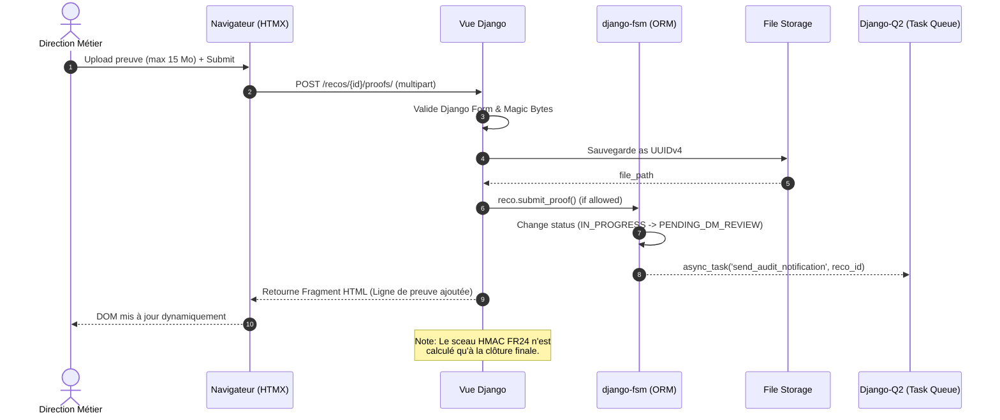

# Architecture Decision Document (Sentinel)

> **Executive Summary**
> Sentinel est une Multi-Page Application (SSR) sécurisée, conçue pour opérer on-premise sous contraintes COBAC. L'architecture retenue est un **Monolithe Django traditionnel** propulsé par **HTMX + Alpine.js** en frontend pour l'interactivité, et stylé avec **Tailwind CSS** (from-scratch).
> Le défi technique central (Workflow d'Audit & Sécurité des données) est résolu par un **RLS PostgreSQL Partiel** (garde-fou base de données) couplé à un **RBAC Applicatif** (filtrage métier via QuerySet Managers), le framework **django-fsm** pour le moteur d'états, et une architecture Clean (HackSoft) pour garantir un code testable. L'application supporte le multithreading massif via Gunicorn pour la manipulation asynchrone sécurisée de preuves documentaires de grande taille.

## Analyse du Contexte Projet

### Vue d'ensemble des Exigences

#### Exigences Fonctionnelles (31 FR — 7 domaines)

| Domaine | FRs | Implications architecturales |
|---|---|---|
| **Gestion Utilisateurs & Auth** | FR1–FR4 | Authentification locale Django (`django.contrib.auth`) pour le MVP. Intégration SSO Active Directory (Read-Only LDAP) différée en V2. RBAC multi-rôle contextuel (un même utilisateur peut être DM sur une reco et ETP sur une autre). |
| **Initialisation & Import** | FR5–FR9 | Import transactionnel atomique (tout-ou-rien). Soft delete. Bulk create. Tag `IMPORTED` inaltérable dans l'audit trail. Template normalisé téléchargeable exclusivement par l'Audit. |
| **Workflow & Triage** | FR10–FR14 | FSM strict 5 états (`ASSIGNED` → `IN_PROGRESS` → `PENDING_DM_REVIEW` → `PENDING_AUDIT_REVIEW` → `CLOSED_RESOLVED`) + flag `OVERDUE` + statut transitoire d'extension. Demande de report formalisée (DM → Audit). |
| **Soumission & Validation Preuves** | FR15–FR20 | Upload 15 Mo max (magic bytes médias + whitelist stricte XLSX/CSV/TXT/MSG/EML). Macros `.xlsm` interdites. Versioning des preuves. PV de recette signé. |
| **Notifications & Rappels** | FR21–FR23 | Scheduler asynchrone (CRON nocturne). Emails **consolidés par utilisateur** (1 email = toutes les recos en retard de l'utilisateur). Alertes **proactives J-7 avant échéance**. Quotidien (Critique) / Hebdo (autres). HTML basique compatible Outlook. |
| **Audit Cryptographique & Export** | FR24–FR27 | Sceau HMAC-SHA256 calculé à la clôture. Archive ZIP synchrone < 5s par recommandation. Timeline audit trail (frise chronologique). Append-only strict. |
| **Dashboards** | FR28–FR31 | Accès filtré par périmètre organisationnel (RBAC applicatif). Filtres multi-critères (source, priorité, statut, aging). Code couleur urgence (Rouge/Orange/Vert). CSS `@media print` pour export DG. |

#### Exigences Non-Fonctionnelles (13 NFR — 4 catégories)

| Catégorie | NFRs clés | Impact architectural |
|---|---|---|
| **Sécurité** | TLS 1.2+, session 30min, HMAC-SHA256, Magic Bytes, logs 12 mois | Middleware de sécurité robuste, stockage structuré des logs d'activité |
| **Performance** | Accès filtré < 10ms, UI < 1s (P95), HMAC < 500ms, ZIP < 5s | Pré-calcul du périmètre organisationnel dans la session Django |
| **Scalabilité** | 15 Mo/fichier × 5 max, ~1000 recos + ~2 000 fichiers historiques, ~200 users concurrents | Dimensionnement mono-serveur suffisant |
| **Fiabilité** | Fail-safe (0 ligne si contexte absent), RPO 24h, RTO 4h, Uptime 99,5% | Backup incrémental nocturne chiffré, RLS minimaliste comme filet de sécurité |

### Échelle & Complexité

- **Domaine technique principal :** Application web full-stack On-Premise (SSR MPA + HTMX + PostgreSQL)
- **Niveau de complexité :** **HIGH** — Accumulation de sous-systèmes MEDIUM (workflow FSM, notifications, uploads, dashboards) + conformité réglementaire HIGH (COBAC R-2016/04, Loi 2024-017)
- **Composants architecturaux estimés :** ~11 modules MVP (Auth Local, RBAC, FSM Workflow, Import Engine, File Storage, Notification Scheduler, Crypto Seal, Audit Trail, Dashboard Engine, User Management, Export/Archive) — SSO Active Directory ajouté en V2
- **Volume de données :** ~1 000 recommandations, ~8 000 fichiers de preuves, ~200 utilisateurs concurrents max

### Contraintes Techniques & Dépendances

| Contrainte | Détail |
|---|---|
| **On-Premise isolé** | Aucune dépendance Cloud. Tout le runtime doit être auto-contenu sur le réseau interne BICEC. |
| **Active Directory (V2)** | Différé au MVP. V2 : Intégration Read-Only LDAP. Révocation instantanée via désactivation du compte AD. MVP : Authentification locale Django (`django.contrib.auth`). |
| **PostgreSQL obligatoire** | Triggers d'audit natifs, extensions crypto (pgcrypto pour HMAC-SHA256), RLS minimaliste disponible. |
| **Mono-serveur MVP** | Application Django + BDD sur la même machine/VM. Simplifie TLS interne (pas de chiffrement App↔BDD nécessaire). |
| **Templates HTML + HTMX** | Fini l'API JSON et le React. Rendu HTML directement côté serveur. |
| **Pas de ClamAV MVP** | Sécurité fichiers allégée : validation magic bytes + whitelist extensions uniquement. |

### Préoccupations Transversales

1. **Sécurité & Conformité** — Traverse TOUS les composants : chaque endpoint vérifie le RBAC, chaque requête SQL filtre par périmètre, chaque mutation est tracée dans l'audit trail.
2. **Audit Trail (Append-Only)** — Triggers PostgreSQL sur chaque table métier. Aucune suppression physique. Capture : utilisateur, horodatage, IP, valeurs avant/après.
3. **Gestion des Fichiers** — Upload sécurisé (validation adaptative médias vs office), stockage versionné (preuves rejetées conservées), génération ZIP synchrone, limite mémoire serveur (5 fichiers × 15 Mo).
4. **Scheduler Asynchrone** — Calcul quotidien OVERDUE, envoi emails consolidés nocturnes, alertes proactives J-7, indépendant du cycle requête/réponse.
5. **Périmètre Organisationnel** — Pré-calcul du périmètre (directions accessibles) dans la session Django pour des requêtes filtrées < 10ms.

### Décisions Architecturales Issues de l'Élicitation Avancée

#### ADR-01 : RLS Partiel (Garde-fou BDD) + RBAC Applicatif (MVP)

**Contexte :** Une politique "RLS intégral strict" imposait d'injecter un `tenant_id` dans chaque contexte PostgreSQL via middleware, complexifiant chaque migration, chaque test et chaque seed. Pour le MVP, cette complexité est disproportionnée par rapport au risque réel (équipe de 1-2 devs, périmètre contrôlé).

**Décision :**
- **RBAC Applicatif Principal (Backend) :** Le filtrage métier est géré par des **QuerySet Managers** dédiés (`.for_tenant(user)`, `.for_direction(direction_id)`) appliqués systématiquement dans les Selectors (HackSoft). Les Vues Django gèrent les droits applicatifs (ex: un DM ne peut pas valider).
- **RLS Partiel (Garde-fou BDD) :** Des Policies RLS simples sur les tables critiques (`Recommendation`, `Proof`) agissent comme **filet de sécurité passif** en cas d'oubli de filtre dans le code applicatif. Le `Direction_id` est injecté via `set_config('app.tenant_id', ...)` dans un middleware Django.
- **Auditeur Externe COBAC** : QuerySet Manager spécifique filtrant par `perimetre_mission_id`.
- **Évolution V2** : Le RLS sera renforcé en "Intégral Strict" quand l'application sera mature et l'équipe plus large.
- **Contexte Asynchrone (Django-Q2) :** Les tâches asynchrones exécutées par le worker Django-Q2 (hors cycle requête HTTP) n'ont pas accès au middleware d'injection `set_config('app.tenant_id')`. Ces tâches doivent recevoir explicitement le `user_id` ou `direction_id` en paramètre et l'injecter manuellement dans le contexte PostgreSQL avant toute requête RLS.

**Conséquences :** Complexité de développement réduite de ~50% pour le MVP. La sécurité "Fail-Closed" est assurée par la combinaison RBAC applicatif (filtrage métier) + RLS partiel (garde-fou BDD). Conformité NFR-REL-01 maintenue.

#### ADR-02 : Infrastructure Web — Zéro Nginx + Gunicorn Multithread

**Contexte :** Gunicorn utilise par défaut des workers synchrones. Le PRD exige le support d'uploads de 15 Mo (NFR-SCA-01). L'audit a prouvé que si plusieurs utilisateurs téléchargent des fichiers volumineux sur un réseau lent simultanément, les workers synchrones Gunicorn sont gelés, bloquant toute l'application. Cependant, le projet impose de limiter la complexité de l'infrastructure On-Premise (refus catégorique d'ajouter Nginx ou MinIO au MVP).

> **Note V2 :** L'utilisation de Gunicorn comme terminateur TLS est un compromis MVP. En V2, l'ajout d'un reverse proxy (Nginx ou Caddy) est recommandé pour séparer TLS, rate limiting et headers de sécurité.

**Décision : WhiteNoise + Gunicorn en mode `gthread` (Multithreading).**
- **Zéro composant réseau externe** : L'architecture reste limitée à l'application Django auto-suffisante.
- **Configuration Gunicorn Asynchrone (I/O) :** Gunicorn sera explicitement configuré avec `--worker-class gthread --workers 4 --threads 10`. Cela offre une capacité de 40 connexions concurrentes. Le téléchargement d'un gros fichier bloquera un seul thread (et non le processus entier), laissant 39 threads réactifs pour le rendu HTML.
- **WhiteNoise** sert les fichiers statiques (CSS, JS, Fonts).
- **Gunicorn** gère lui-même la terminaison TLS.

**Conséquences :** Le "Juste Milieu" parfait. Le déploiement On-Premise reste ultra-simple (un seul service), tout en neutralisant complètement le risque de blocage par famine (DDoS involontaire) lié aux gros fichiers.

#### ADR-03 : Système de Notifications Consolidé

**Contexte :** Le PRD-v2 (FR23) proposait 1 email distinct par recommandation en retard. Pour un DM avec 15 recos en retard, cela génère 15 emails/nuit → fatigue de notification → adoption compromise.

**Décision :**
- **1 email consolidé par utilisateur** listant toutes ses recommandations en retard, groupées par priorité
- **Alerte proactive J-7** avant échéance (mentionnée dans le product brief, absente des FRs formelles → à ajouter)
- **Fréquence maintenue** : quotidien (Critique), digest hebdomadaire (Haute/Moyenne/Faible)
- **Format HTML basique** compatible Outlook (inchangé)
- **Notifications in-app** : badge + liste dans le dashboard utilisateur

**Conséquences :** Implémentation plus simple (1 query → 1 template → 1 envoi par utilisateur). Meilleure adoption. Réduction drastique du volume d'emails.

#### ADR-04 : L'abandon de l'API / DRF (Server-Side Rendering + HTMX)

**Contexte :** Une directive managériale a banni l'utilisation de JSON et d'API REST pour des raisons de simplicité de maintenance On-Premise.

**Décision : Les Vues et Templates Django couplés à HTMX.**
- La logique métier (HackSoft) renverra des *QuerySets* ou des *Context Dictionaries* directement aux Templates HTML Django.
- **HTMX** (`hx-get`, `hx-post`) sera utilisé pour obtenir l'interactivité d'une SPA (ex: modales dynamiques, soumission de formulaires sans rechargement de page) tout en recevant du HTML brut en retour du serveur, respectant la stricte interdiction du JSON.
- Les validations complexes (formulaires métier) utiliseront les `Django Forms`.

**Conséquences :** Suppression complète de `djangorestframework`. Architecture immensément plus simple à maintenir pour un développeur solo Python/Django. Zéro temps passé sur la sérialisation JSON. NFR-PERF-02 passe d'un TTFB JSON à un TTFB HTML (< 200ms).

#### ADR-05 : Task Queue — Django-Q2 (Mode Résilient)

**Contexte :** Le scheduler nocturne (OVERDUE, notifications) nécessite un système de tâches asynchrones. Options : Celery (Redis/RabbitMQ requis), Django-Q2 (ORM comme broker), APScheduler, CRON natif OS.

**Décision : Django-Q2 avec Résilience Absolue (Timeout/Retry).**
- **Zéro dépendance externe** : utilise l'ORM Django comme broker (pas de Celery/Redis).
- **Anticipation des "Tâches Zombies" :** Pour éviter la mort silencieuse du worker lors d'un redémarrage serveur nocturne, la Task Queue sera configurée avec un `timeout` stricts (ex: 60s) et un `retry` (ex: 120s). Toute tâche interrompue sera automatiquement relancée.
- **Intervalle de polling optimisé :** Le worker Django-Q2 sera configuré avec un `poll` interval de **10 secondes** (au lieu des 5s par défaut). Le besoin principal étant un batch nocturne, un polling agressif surchargerait inutilement PostgreSQL (requêtes `SELECT ... FOR UPDATE SKIP LOCKED` répétées).
- Monitoring intégré dans l'admin Django (visibilité immédiate pour le RSSI).
- Table `scheduler_heartbeat` pour détecter si le scheduler ne tourne plus de manière globale.

**Conséquences :** Infrastructure simplifiée. Pas de broker externe. Tâches résilientes sans "Mort Silencieuse", même lors des patchings système de la VM hôte.

#### ADR-06 : Authentification — Sessions Django Natives (MVP Local, AD en V2)

**Contexte :** L'interdiction du JSON et des API annule la pertinence d'une authentification stateless via JWT. L'intégration Active Directory (LDAP) est différée en V2 pour simplifier le MVP.

**Décision : Authentification locale par Sessions (Stateful).**
- **MVP** : L'utilisateur s'authentifie via le formulaire Django de base avec `django.contrib.auth`. Les comptes sont créés manuellement par l'administrateur (ou via import). Un cookie de session crypté, signé, et validé en base de données est déposé.
- **V2** : Intégration Active Directory (Read-Only LDAP) via `django-auth-ldap`. Synchronisation automatique des utilisateurs depuis l'AD. Révocation instantanée via désactivation du compte AD.
- Expiration fixée à 30 minutes d'inactivité (= NFR-SEC-02). **Implémentation :** `SESSION_COOKIE_AGE = 1800` combiné avec `SESSION_SAVE_EVERY_REQUEST = True` pour réinitialiser le timer à chaque requête (vrai idle timeout, pas une durée de vie fixe).
- Flags cookie : `HttpOnly`, `Secure`, `SameSite=Lax` (ou `Strict`).
- La protection CSRF native de Django protège automatiquement tous les POST/PUT.

**Conséquences :** Architecture MVP ultra-simple. Aucune dépendance au serveur AD (élimine le mode de défaillance AD). Révocation de session possible côté serveur. L'ajout de l'AD en V2 sera transparent grâce à l'architecture backend `django.contrib.auth` qui supporte nativement les backends d'authentification multiples.

### Analyse de Sécurité (Security Audit Personas)

#### Vecteurs d'Attaque Identifiés

| Vecteur | Cible | Risque | Mitigation |
|---|---|---|---|
| Upload malveillant | Fichier sain en apparence mais contenant payload/macros | MOYEN | Magic bytes (médias) + Rejet XLSM + Téléchargement forcé en Content-Disposition: attachment. ClamAV en V2. |
| Session Hijacking (XSS) | Cookie volé = usurpation complète | ÉLEVÉ | Cookie `HttpOnly` + `Secure` + `SameSite=Lax`. Expiry court (30min). |
| CSRF | Exécution d'actions forcées via requêtes cross-origin | MOYEN | Protection CSRF native Django activée globalement `` + header HTMX `hx-headers`. |
| Clickjacking | Intégration iframe frauduleuse de Sentinel | MOYEN | `X-Frame-Options: DENY` via `django.middleware.clickjacking.XFrameOptionsMiddleware` (activé par défaut). |
| Brute Force Login | Accès non autorisé par essais répétés | ÉLEVÉ | `django-axes` : verrouillage du compte après 5 tentatives échouées. Délai progressif. |
| Élévation de privilèges | ETP accédant aux endpoints Audit | ÉLEVÉ | Middleware RBAC sur 100% des endpoints. Tests d'intégration automatisés vérifiant chaque endpoint × chaque rôle. |
| Compromission clé HMAC | Recalcul de tous les sceaux SHA-256 | CRITIQUE | Clé HMAC en variable d'environnement, jamais en BDD. Rotation = re-signature. |
| SQL Injection via raw SQL | Requêtes RLS ou rapports | FAIBLE | Django ORM paramétré. Raw SQL : `cursor.execute(query, params)`, jamais de f-string. |

#### Réponses à l'Inspecteur COBAC

- **Vérification d'intégrité :** Hash HMAC-SHA256 affiché sur chaque fiche close. Script de vérification standalone livré avec l'application.
- **Immutabilité audit trail :** Triggers PostgreSQL `BEFORE DELETE/UPDATE` sur la table audit. Risque résiduel DBA accepté, atténué par backups + hash de clôture.
- **Export preuves :** ZIP synchrone par recommandation (FR26).

### Analyse des Modes de Défaillance

| Composant | Mode de défaillance | Impact | Mitigation |
|---|---|---|---|
| Scheduler (Django-Q2) | Ne s'exécute pas | 🔴 OVERDUE jamais flaggé | Table `scheduler_heartbeat` vérifiée par un **script CRON OS indépendant** (toutes les 2h) + alerte email RSSI si pas de run > 25h |
| Email SMTP | Serveur mail indisponible | 🟡 Notifications perdues | Queue avec retry (3 tentatives). Log des échecs. Notifications in-app comme backup. |
| ~~Active Directory~~ | ~~AD indisponible~~ | — | **Différé en V2.** MVP utilise l'authentification locale Django. Aucune dépendance AD. |
| Stockage fichiers | Disque plein (~40 Go estimés) | 🔴 Uploads échouent | Monitoring disque. Alerte à 80% capacité. |
| Gunicorn | Process crash | 🟡 Service momentanément indisponible | `systemd` auto-restart. Workers multiples. |
| PostgreSQL | Crash / corruption | 🔴 Perte données (RPO 24h) | Backup incrémental nocturne chiffré. Test de restauration mensuel. |
| Django SECRET_KEY | Secret compromis | 🔴 Sessions falsifiables, cookies forgés | Rotation planifiée. Secret en variable d'environnement (`.env`). Invalidation immédiate de toutes les sessions actives. |
| HMAC_SECRET | Clé perdue (VM reconstruite, `.env` non sauvegardé) | 🔴 Sceaux invérifiables, conformité COBAC compromise | Backup sécurisé séparé de la clé HMAC (coffre-fort numérique ou backup chiffré dédié). Procédure de re-signature documentée. |

### Analyse Pre-mortem — Risques d'Échec Projet

| Cause probable d'échec | Probabilité | Prévention architecturale |
|---|---|---|
| DM n'adoptent pas — UX trop complexe | Élevée | Dashboard DM = priorité UX #1. Max 3 clics pour valider. |
| Scheduler silencieusement mort | Moyenne | `scheduler_heartbeat` + alerte > 25h sans run |
| Emails dans les SPAM | Élevée | SPF/DKIM configurés. Notifications in-app comme backup. |
| COBAC ne peut pas vérifier le HMAC | Moyenne | Script de vérification standalone livré |
| Import initial corrompu | Moyenne | Preview obligatoire avant import définitif |
| Développeur principal quitte | Élevée | Architecture Django standard. Ce document. Tests automatisés. |

### Stack Technique Recommandé (Matrice Comparative)

| Composant | Choix | Justification |
|---|---|---|
| **Backend** | Django | Écosystème mature, sécurité native, ORM puissant |
| **Frontend (Serveur)** | Templates Django + HTMX | Interactivité SPA-like sans API JSON (ADR-04). Moteur de données Server-Side. |
| **Frontend (Client)** | Alpine.js | Gestion d'état UI local : modales, dropdowns, tabs, toggles, validation côté client. |
| **CSS Framework** | Tailwind CSS | Utility-first, responsive, design system from-scratch. Build via Node.js (PostCSS). |
| **HTMX Integration** | `django-htmx` | Middleware détection `HX-Request`, helpers pour les vues partials/fragments. |
| **Forms Styling** | `django-widget-tweaks` | Application des classes Tailwind CSS aux widgets Django Forms sans modifier le backend. |
| **Base de données** | PostgreSQL | Triggers audit, pgcrypto (HMAC), RLS partiel (garde-fou) |
| **Task Queue** | Django-Q2 | Zéro dépendance externe, monitoring admin intégré |
| **Auth** | Sessions Django Natives | Sécurité native, stateful, protection CSRF incluse |
| **Static Files** | WhiteNoise | Servi avec Gunicorn, compression brotli/gzip (statiques uniquement, pas media) |
| **Serveur WSGI** | Gunicorn | Standard Django production (`gthread`) |
| **Reverse Proxy** | Sans (MVP) | WhiteNoise + Gunicorn suffisent |

## Évaluation Starter Template / Stack technique

### Domaine Technologique Principal

**Application Web Monolithique SSR (Server-Side Rendering)** basé sur l'analyse des exigences :
- Backend & Logique de présentation : **Django**
- Frontend Interactivité (Serveur → Client) : **HTMX** — le moteur de données (échanges AJAX, fragments HTML, workflow FSM)
- Frontend Interactivité (Client-Side) : **Alpine.js** — le ciment UI (modales, dropdowns, tabs, toggles, validation client)
- Styling : **Tailwind CSS** — design system utility-first, from-scratch
- Architecture de déploiement : **Monolithe traditionnel**.

### Options de Starter Évaluées

1. **SaaS Boilerplates (SaaS Pegasus, Hyper, etc.)** : Trop orientés B2C/SaaS.
2. **Setup Séparé (React SPA / Django REST API)** : Abandonné suite à la directive architecturale. Ajoute une complexité de déploiement réseau, d'authentification JSON et un fort couplage des contrats de données.
3. **Monolithe Django + HTMX + Alpine.js + Tailwind CSS** : Utilise le moteur de template natif de Django (`django-templates`). HTMX et Alpine.js sont inclus via fichiers statiques locaux. Tailwind CSS est compilé via Node.js/PostCSS. **(Choix obligatoire et hautement recommandé)**

### Décisions Architecturales Transversales Induites

**Langage & Runtime :**
- Backend : Python 3.12+ (Typage strict avec `mypy`).
- Frontend : HTML5, Tailwind CSS, ES6 basique. Node.js requis uniquement pour la compilation Tailwind (PostCSS).

**Solution de Styling :**
- **Tailwind CSS from-scratch** : Design system construit avec les utility classes Tailwind. Plugin `@tailwindcss/forms` pour le styling natif des formulaires Django. Un template admin Tailwind premium pourra être intégré en option si nécessaire.

#### ADR-07 : Moteur de Workflow — `django-fsm`

**Contexte :** Le PRD spécifie (FR10) un cycle de vie strict à 5 états (`ASSIGNED` → `IN_PROGRESS` → `PENDING_DM_REVIEW` → `PENDING_AUDIT_REVIEW` → `CLOSED_RESOLVED`). Faut-il coder cette logique manuellement (des simples `if/else` sur les vues) ou utiliser une librairie métier ?

**Décision : Utiliser `django-fsm` (Finite State Machine).**
- **Excellente adéquation** : correspond exactement au besoin de workflow strict. 
- **Sécurité des transitions** : garantit au niveau de l'ORM qu'une recommandation ne peut pas passer de `ASSIGNED` à `CLOSED_RESOLVED` directement.
- **Gestion des permissions** : permet de lier une transition à un profil (`has_transition_perm`), assurant que seul l'Audit peut passer une reco en `CLOSED_RESOLVED`.
- **Hooks pré/post transition** : idéal pour déclencher la génération du PDF de recette, le calcul du saut HMAC, ou l'envoi d'emails (via Django-Q2) *exactement* quand l'état change.

**Conséquences :** Moins de bugs de logique d'état. Le code métier (les règles de transition) est centralisé dans le modèle Django plutôt qu'éparpillé dans les vues. C'est l'outil parfait pour ce besoin.

**Organisation du Code (Monolithe) :**
```text
/bicec--sentinel/
├── config/             # Settings Django globaux
├── apps/               # Applications Django
│   ├── users/          # Auth locale, RBAC (AD en V2)
│   ├── workflow/       # Modèles FSM (django-fsm), Preuves, Commentaires
│   └── notifications/  # Moteur Django-Q2
├── templates/          # Vues HTML (Base, Dashboards, Formulaires)
├── static/             # CSS (Tailwind compilé), JS (HTMX, Alpine.js), Images
└── manage.py
```

## Décisions Architecturales de Base (Étape 4)

Cette section établit les fondations techniques de l'application (API, Données, Fichiers, Sécurité) basées sur l'élicitation *First Principles* et l'anticipation des modes de défaillance.

### 4.1. Conception de Base de Données (Data Model)

#### Audit Trail (Traçabilité)
- **Défi :** Volume de requêtes potentiellement élevé sur 2000 recos, risque d'explosion de l'espace disque si chaque ligne est clonée.
- **Modèle :** `AuditLog` (table unique).
  - Colonne `changes` de type `JSONB` pour stocker de façon différentielle les changements d'états (ex: `{"status": ["IN_PROGRESS", "PENDING_AUDIT_REVIEW"]}`).
  - Colonne `action` (`CREATE`, `UPDATE`, `DELETE`, `LOGIN`).
  - Lien lâche `object_id` et `content_type` (Generic ForeignKey Django) pour attacher le log à n'importe quelle entité.
- **Indexation :** Index B-Tree composite sur `(content_type_id, object_id)` pour un rendu instantané de la Timeline Frontend.

#### Versioning des Preuves (Fichiers)
- **Modèle :** L'entité `Proof` possède 3 champs clés : `file_path`, `status` (`PENDING`, `ACCEPTED`, `REJECTED`), et `version` (entier).
- **Règle métier :** Une preuve `REJECTED` n'est jamais supprimée du disque ni de la base (exigence d'audit). Un nouvel upload par le DM crée une nouvelle instance `Proof` avec `version = n+1` et le statut `PENDING`.

### 4.2. Conception Vues / Frontend (SSR Design)

- **Paradigme :** Interface générée côté serveur avec les templates HTML de Django. L'interactivité asynchrone est gérée par **HTMX**.
- **Agrégation / Tableaux de Bord :**
  - Utilisation de `django-filter` conjointement avec HTMX pour rafraîchir dynamiquement les tableaux sur les événements `change` des sélecteurs sans recharger toute la page.
  - Standardisation de la pagination native combinée au comportement "Click to Load" ou "Infinite Scroll" de HTMX.
- **Format de Données :** Les Vues Django retournent des fragments HTML (Partial Templates) pré-rendus, injectés par HTMX dans le DOM. Zéro JSON.

### 4.3. Gestion Sécurisée des Fichiers (File Storage)

L'analyse de menace (STRIDE) sur le composant critique d'upload On-Premise (15 Mo max) impose les règles suivantes :

1. **Renommage Systématique :** Le fichier uploadé (`rapport_audit_v2.pdf`) est **toujours** renommé par le backend avec un `UUIDv4` (ex: `f47ac10b...a1.pdf`) sur le disque. Cela neutralise toute tentative de *Path Traversal* (`../../../etc/passwd`). Le nom original est stocké uniquement en base pour l'affichage UI.
2. **Double Validation Adaptative (Filtre de Sécurité) :**
   - **Pour PDF, JPG, PNG :** Validation stricte en mémoire des **Magic Bytes** avant l'écriture sur le disque (`python-magic`).
   - **Pour Excel & Mails :** Whitelist stricte `.xlsx`, `.csv`, `.msg`, `.eml`, `.txt`. Rejet formel des formats comportant des macros (`.xlsm`, `.docm`). Validation du type MIME primaire.
   - **Pour Logs/Texte :** Forçage d'encodage pour éviter l'injection XSS via payloads `.txt`.
3. **Prévention d'Exécution (Vue Django dédiée) :** Les fichiers uploadés (`MEDIA_ROOT`) ne sont **jamais** servis directement par un serveur web statique. WhiteNoise est exclusivement réservé aux fichiers statiques (`STATIC_ROOT` : CSS, JS, fonts) et ne supporte pas `/media/`. Une vue Django dédiée `DownloadProofView` (dans `workflow/views.py`) vérifiera les droits RBAC de l'utilisateur, puis renverra le fichier via **`FileResponse` en mode streaming** (`chunk_size=8192`) avec les headers `Content-Disposition: attachment` et `Content-Type: application/octet-stream`, empêchant toute exécution dans le navigateur. Le streaming garantit qu'un fichier volumineux ne bloque pas la mémoire du worker.

### 4.4. Sequence Diagram : Flux de Soumission d'une Preuve

Ce flux centralise la logique asynchrone et les intégrations, définissant le rôle de chaque composant pour l'exigence FR15-FR20 et FR24 (HMAC différé).


```mermaid
sequenceDiagram
    autonumber
    actor DM as Direction Métier
    participant HTML as Navigateur (HTMX)
    participant VUE as Vue Django
    participant FSM as django-fsm (ORM)
    participant Disk as File Storage
    participant Q2 as Django-Q2 (Task Queue)

    DM->>HTML: Upload preuve (max 15 Mo) + Submit
    HTML->>VUE: POST /recos/{id}/proofs/ (multipart)
    VUE->>VUE: Valide Django Form & Magic Bytes
    VUE->>Disk: Sauvegarde as UUIDv4
    Disk-->>VUE: file_path
    VUE->>FSM: reco.submit_proof() (if allowed)
    FSM->>FSM: Change status (IN_PROGRESS -> PENDING_DM_REVIEW)
    FSM-->>Q2: async_task('send_audit_notification', reco_id)
    VUE-->>HTML: Retourne Fragment HTML (Ligne de preuve ajoutée)
    HTML-->>DM: DOM mis à jour dynamiquement
    
    note over VUE: Note: Le sceau HMAC FR24 n'est<br/>calculé qu'à la clôture finale.
```

### 4.5. Logique des États Limites (Edge Cases FSM)

La machine à états finis (`django-fsm`) est configurée pour traiter ces exceptions critiques :
- **Soft Delete de Preuve :** Un DM peut supprimer une preuve pour corriger une erreur, **uniquement** si le statut FSM de la recommandation est `IN_PROGRESS` ou `PENDING_DM_REVIEW` et que le statut de la Preuve est `PENDING`. Une fois que l'Auditeur note la preuve `ACCEPTED` ou `REJECTED` (statut `PENDING_AUDIT_REVIEW` ou `CLOSED_RESOLVED`), la suppression est bloquée au niveau de l'ORM.
- **Mutations de Clôture :** Une fois le statut `CLOSED_RESOLVED` atteint, les Vues Django interceptent et bloquent toute requête `POST/PUT/DELETE` (y compris commentaires) concernant cette recommandation.
- **Race Conditions (Concurrence) :** Les transitions FSM manipulant le statut d'une recommandation exécuteront un `select_for_update()` sur le row PostgreSQL. Si deux auditeurs valident simultanément, la base sérialisera les requêtes, empêchant la validation multiple.

## Patterns Architecturaux (Étape 5)

Cette section définit les "règles d'or" d'écriture du code (Design Patterns et Anti-Patterns) pour garantir la maintenabilité de Sentinel sur le long terme.

### 5.1. Backend : Clean Architecture (HackSoft Styleguide)

Afin d'éviter le couplage fort et l'éparpillement de la logique métier (typiques des projets Django mal structurés), l'architecture Backend suit strictement le pattern **Service Layer / Selector** popularisé par HackSoft :

- **`models.py`** : Définit uniquement la structure de données (colonnes) et les états explicites (`django-fsm`). Ne contient **aucune** logique d'envoi d'email ou de calcul complexe (Anti-Pattern : *God Model*).
- **`selectors.py`** : Centralise toutes les requêtes de lecture complexes (QuerySets, jointures, agrégations pour les dashboards). *Ex: `get_overdue_recommendations(user) -> list`*. Les vues ne doivent pas construire de requêtes complexes elles-mêmes.
- **`services.py`** : Encapsule toute l'écriture et la mutation de données. C'est ici que vit le "métier". *Ex: `submit_proof(...)`, `generate_hmac_seal(...)`*.
- **`views.py`** : Couche HTTP pure basée sur les `TemplateView` ou fonctions. Ne fait que router la requête, valider les inputs (Django Forms), appeler un Service ou un Selector, et renvoyer le template HTML complet (ou un fragment HTML pour HTMX). (Anti-Pattern évité : *Fat Views*).

### 5.2. GoF Patterns & Événementiel

| Pattern / Approche | Cas d'Usage dans Sentinel | Implémentation |
|---|---|---|
| **Strategy Pattern** | Exportation des données (FR24-FR26) | Une interface commune `ExportStrategy` avec deux implémentations concrètes : `ZipArchiveExport` et `PdfReceiptExport`. Le service appelle `exporter.generate()`. |
| **State Pattern** | Workflow des Recommandations (FR10) | Totalement géré par `django-fsm`, garantissant l'intégrité des transitions d'un état à l'autre. |
| **Événementiel Explicite** | Calcul HMAC, Notifications Email | **Interdiction des Django Signals métier (`post_save`, `pre_save`).** Les événements asynchrones sont déclenchés explicitement via des hooks de transition FSM (`@transition(..., hooks=[send_notification])`) ajoutant des requêtes à `django-q2`. *Exception :* les signaux natifs d'authentification (`user_logged_in`, `user_login_failed`) sont autorisés pour l'audit trail. |

### 5.3. Frontend Patterns (HTMX + Alpine.js)

L'application Django-SSR de Sentinel adopte **HTMX** (moteur de données Server-Side) et **Alpine.js** (ciment UI Client-Side) pour rivaliser en fluidité avec une SPA :

**HTMX — Moteur de Données (Server-Side State) :**
- **Hypermedia As The Engine Of Application State (HATEOAS)** : Plutôt que de renvoyer du JSON et de le parser en JS, le serveur renvoie l'état directement sous forme de composant HTML (ex: une ligne de tableau de bord pré-colorée).
- **Fragments (Partial Templates)** : Les vues Django détectent si la requête est issue de HTMX (via `django-htmx` et le header `HX-Request`).
  - Si OUI : la vue ne renvoie que le fragment `_table_rows.html`.
  - Si NON (accès direct via l'URL) : la vue renvoie le layout complet `base.html` + `_table_rows.html`.
- **Cas d'usage Sentinel** : Mise à jour du workflow FSM (`hx-post`), filtrage dynamique des tableaux (`hx-get`), chargement de contenu dans les modales, pagination / infinite scroll.

**Alpine.js — Ciment UI (Client-Side Behavior) :**
- **DOM Manipulation & Micro-états Locaux** : Gère tout ce qui est éphémère, visuel et ne nécessite pas de persistance en base.
- **Cas d'usage Sentinel** : Ouverture/fermeture des menus et sidebar (`x-show`, `x-transition`), affichage et comportement des modales (après injection HTMX du contenu), validation côté client (désactiver un bouton tant qu'un champ est vide), tabs locales (basculer entre vues sans appeler le serveur).
- **Modales Dynamiques** : Au clic sur le bouton "Soumettre Preuve", `hx-get` demande le formulaire au serveur, `hx-target` injecte la réponse dans la div `#modal-container`, et Alpine.js gère l'affichage (`x-show`), la fermeture (Esc, clic extérieur) et les transitions.

#### ADR-08 : Styling — Tailwind CSS From-Scratch (Template Premium Optionnel)

**Contexte :** Le projet impose un délai de développement serré (2 mois). La stack officielle impose **Tailwind CSS** comme framework CSS. L'utilisation d'un template admin Tailwind premium est une option pour accélérer le développement, mais n'est pas obligatoire.

**Décision : Design system Tailwind CSS from-scratch, avec template admin Tailwind premium en option.**
- **Tailwind CSS** est compilé via **Node.js + PostCSS** (Node.js est déjà installé dans l'environnement de développement).
- Le plugin `@tailwindcss/forms` est utilisé pour styliser nativement les `Django Forms` (inputs, selects, checkboxes).
- Le fichier `tailwind.config.js` définit les couleurs métier (codes couleur urgence Rouge/Orange/Vert), la typographie, et les breakpoints responsive.
- En développement : `npx tailwindcss --watch` tourne en parallèle de `manage.py runserver`.
- En production : `npx tailwindcss --minify` avant `collectstatic`.
- **Option** : Un template admin Tailwind premium (ex: Mosaic, Windmill Dashboard, Tailwind UI) pourra être intégré ultérieurement pour accélérer le design des dashboards.

**Conséquences :**
- **Points forts :** Design system cohérent et maintenable. Classes utilitaires Tailwind éliminent les conflits CSS. Purge automatique du CSS inutilisé (< 20 Ko en production). Compatible nativement avec les attributs HTMX et Alpine.js.
- **Points de vigilance :** Nécessite Node.js pour la compilation (déjà installé). Les `Django Forms` nécessitent un widget renderer personnalisé pour appliquer les classes Tailwind (via `django-widget-tweaks` ou widget attrs custom).

## Structure du Projet (Étape 6)

L'architecture retenue est un **Monolithe Django SSR**, intégrant le code backend (Clean Architecture HackSoft) et les templates HTML frontend enrichis par HTMX et Alpine.js.

### 6.1. Architecture Monolithique Globale

L'arborescence racine unifie la logique Python et le rendu HTML pour une simplicité de déploiement maximale On-Premise.

```text
/bicec--sentinel/
├── config/                 # Configuration système, WSGI (Gunicorn), URLs racines
│   ├── settings/           # Settings Django (base.py, local.py, production.py)
│   ├── urls.py             # URLs racines
│   ├── wsgi.py             # Point d'entrée Gunicorn
│   └── middleware.py       # Middleware RLS (set_config), RBAC, sécurité
├── apps/                   # Code métier séparé par domaine (voir 6.2)
├── templates/              # Vues HTML, Fragments HTMX, Composants (voir 6.3)
├── static/                 # CSS compilé (Tailwind), JS (HTMX, Alpine.js), Images
├── tailwind.config.js      # Configuration Tailwind CSS (couleurs, typographie, breakpoints)
├── postcss.config.js       # Configuration PostCSS pour Tailwind
├── package.json            # Node.js — uniquement pour la compilation Tailwind CSS
├── staticfiles/            # (Auto-généré) Assets collectés pour la production
├── media/                  # Fichiers uploadés (preuves) — jamais servi par WhiteNoise
│   └── proofs/             # Preuves renommées en UUIDv4, organisées par reco
├── db_backups/             # Scripts et cibles de backup SQL nocturnes
├── tests/                  # Tests d'intégration cross-app (RBAC, RLS, E2E)
│   # Tests unitaires : dans chaque app (apps/*/tests/)
├── requirements.txt        # Dépendances Python
├── .env.example            # Template des variables d'environnement (SECRET_KEY, HMAC_SECRET, etc.)
├── manage.py               # Entrypoint Django
└── README.md
```

### 6.2. Structure Backend (Django - HackSoft Style)

Contrairement l'approche "1 dossier = 1 app" de base de Django, nous regroupons tout le métier fonctionnel dans les dossiers d'applications sous `apps/`, séparant strictement les Vues, Les Services (mutations) et les Selectors (lectures).

```text
/apps/
├── users/                  # Domaine Identité & Auth
│   ├── models.py           # User, Department (Directions)
│   ├── permissions.py      # Middleware RBAC applicatif (ADR-01)
│   ├── services.py         # Ex: create_user(), update_user_role()
│   ├── selectors.py        # Ex: get_users_by_direction()
│   ├── forms.py            # Formulaires Django (Login, Gestion utilisateurs)
│   ├── urls.py             # Routes du domaine Auth
│   ├── admin.py            # Interface admin Django (gestion des comptes)
│   └── views.py            # Vues Django natives et vues HTMX de login
│   # V2 : auth_ad.py (Logique d'authentification LDAP contre l'Active Directory)
│
├── workflow/               # Domaine Cœur FSM (Recommandations)
│   ├── models.py           # Recommendation (avec django-fsm), Proof, Comment
│   ├── selectors.py        # Ex: get_overdue_recommendations(), get_dashboard_stats()
│   ├── services.py         # L'intelligence métier pure (submit_proof, delete_proof)
│   ├── forms.py            # Formulaires Django (Soumission preuve, Commentaire, Import)
│   ├── urls.py             # Routes du domaine Workflow
│   ├── admin.py            # Interface admin (monitoring Django-Q2, recos)
│   └── views.py            # Contrôleurs HTML/HTMX (Dashboard, Détails, Uploads)
│
├── audit/                  # Domaine Traçabilité & Export
│   ├── models.py           # AuditLog (format JSONB)
│   ├── crypto.py           # Génération et vérification du sceau HMAC-SHA256
│   ├── views.py            # Vue Timeline audit trail (FR27)
│   ├── urls.py             # Routes du domaine Audit
│   └── exporters.py        # Logique de création des .zip (implémente Strategy Pattern)
│
└── notifications/          # Domaine Asynchrone (Django-Q2)
    ├── tasks.py            # Tâches planifiées (ex: cron_check_overdue)
    └── emails.py           # Templates et envois SMTP
```

### 6.3. Structure Frontend (Templates & HTMX)

Le dossier `/templates/` contient tout le rendu UI, organisé pour utiliser au mieux les fragments HTMX, les composants Alpine.js réutilisables, et le styling Tailwind CSS :

```text
/templates/
├── layouts/                # Squelettes principaux (ex: base.html avec le <head> global, Tailwind CSS)
├── components/             # Composants isolés réutilisables (boutons, modales, badges, cards)
│
├── users/                  # Pages spécifiques au domaine Auth (Login)
│
├── workflow/               # Pages spécifiques au domaine Recommandations
│   ├── dashboards/         # Vues complètes (ex: DG_dashboard.html)
│   ├── reco_detail.html    # Fiche d'une recommandation
│   └── partials/           # FRAGMENTS HTMX (renvoyés sans layout public)
│       ├── _proof_list.html
│       ├── _status_badge.html
│       └── _comment_row.html
```

**Workflow de Déploiement :**
Une seule étape de build CSS. En développement : `npx tailwindcss --watch` compile Tailwind en parallèle de `manage.py runserver`. Les fichiers JS (HTMX, Alpine.js) sont inclus en statique local. En production : le CSS Tailwind est **pré-compilé en local/CI** (`npx tailwindcss --minify -o static/css/styles.css`) avant déploiement sur la VM — **Node.js n'est PAS installé en production**. Puis `python manage.py collectstatic` consolide les assets avant de lancer Gunicorn.

## Validation Architecturale (Étape 7)

Cette matrice garantit que les choix architecturaux (ADR-01 à ADR-08) répondent strictement aux Exigences Non-Fonctionnelles (NFR) définies dans le PRD et aux contraintes réglementaires COBAC.

### 7.1. Matrice de Validation NFR vs Architecture

| NFR PRD v2 | Exigence | Réponse Architecturale | Statut |
|---|---|---|:---:|
| **NFR-SEC-01** | Chiffrement en transit TLS 1.2+ obligatoire. | **WhiteNoise & Gunicorn** (ADR-02) gèrent le TLS natif avec certificats internes. Django `SecurityMiddleware` force le HTTPS Redirect. | ✅ |
| **NFR-SEC-02** | Session idle timeout = 30 minutes. | **Sessions Natives** (ADR-06). `SESSION_COOKIE_AGE = 1800` + `SESSION_SAVE_EVERY_REQUEST = True` (vrai idle timeout). | ✅ |
| **NFR-SEC-03** | Intégrité (HMAC-SHA256) sur les clôtures. | Logique isolée dans `audit.crypto` (HackSoft Pattern) déclenchée par les **Hooks FSM** (`django-fsm`). Clé secrète via `.env`. | ✅ |
| **NFR-SEC-04** | Validation Fichiers Adaptative. | Implémenté dans `ProofService.submit()`: Magic bytes (médias) ou MIME/Extension stricte (Office/Texte). Le nom du fichier est remplacé par un UUIDv4 sur disque. | ✅ |
| **NFR-SEC-05** | Audit Trail sur 12 mois (Loi 2024-017). | Modèle `AuditLog` avec données `JSONB`. Conservé indéfiniment. Stratégie de purge inexistante par design (Append-Only). | ✅ |
| **NFR-PERF-01** | Résolution RLS / Périmètre < 10ms. | Principalement géré en applicatif (ADR-01) via des filtres indexés `direction_id`. Le RLS PostgreSQL n'agit que comme garde-fou passif ultra-rapide. | ✅ |
| **NFR-PERF-02** | Rendu HTML & UI < 200ms (P95). | **Monolithe SSR & HTMX** (ADR-04). Le TTFB est instantané car aucun overhead de parsing JSON client-side. PostgreSQL gère les données, Django le rendu natif. | ✅ |
| **NFR-PERF-03** | Overhead HMAC-SHA256 < 500ms. | Calcul HMAC natif Python (`hmac` stdlib) sur les métadonnées + hash fichiers pré-calculés. Latence mesurée négligeable (< 50ms typique). | ✅ |
| **NFR-PERF-04** | Archive ZIP prête < 5s (synchrone). | Génération ZIP en mémoire (`io.BytesIO`) par le backend Django. Pour 5 fichiers de 15 Mo, Python génère le ZIP en ~1-2 secondes. | ✅ |
| **NFR-SCA-01** | Max 15 Mo par fichier, 5 max/requête. | Validé par le backend Django (`DATA_UPLOAD_MAX_MEMORY_SIZE`) et Gunicorn configuré avec les limites de taille de payload adéquates. | ✅ |
| **NFR-SCA-02** | Support de > 5 000 recommandations et 20 000 fichiers. | Architecture dimensionnée pour le MVP (~1 000 recos actives). PostgreSQL (avec UUIDs et bons index) supporte allègrement 500k+ lignes sur une machine standard. | ✅ |
| **NFR-SCA-02b** | Import ne bloque pas la BDD pour les lectures. | Import exécuté en transaction atomique en arrière-plan (Django-Q2). Le MVCC natif de PostgreSQL assure l'isolation sans verrouillage des lectures concurrentes. | ✅ |
| **NFR-SCA-03** | Temps de réponse nominaux avec 200 utilisateurs concurrents. | Gunicorn `gthread` (4 workers × 10 threads = 40 slots). Suffisant pour ~200 utilisateurs actifs avec des requêtes SSR < 200ms. **V2 : ajuster workers/threads ou ajouter Nginx si montée en charge.** | ✅ |
| **NFR-REL-01** | Fail-safe isolation (0 ligne si pas de contexte). | Assuré par la combinaison **RBAC Applicatif** (QuerySet Managers `.for_tenant()`) + **RLS Partiel** (garde-fou BDD) (ADR-01). | ✅ |
| **NFR-REL-02** | RPO = 24 heures. | Backup incrémental nocturne chiffré (GPG) via `pg_dump` + `rsync` media. Détaillé en section 9.4. | ✅ |
| **NFR-REL-03** | RTO = 4 heures. | Procédure de restauration documentée (section 9.4). VM préconfigurée. Test de restauration mensuel obligatoire. | ✅ |
| **NFR-REL-04** | Uptime 99,5% (heures ouvrées). | `systemd` auto-restart (section 9.2). Workers multiples Gunicorn. Monitoring RSSI. | ✅ |

### 7.2. Bilan de Cohérence

L'architecture **Monolithe Django SSR (Django + HTMX + Tailwind CSS + Alpine.js)** propose le compromis absolu de viabilité, de sécurité et de vélocité pour une équipe réduite (1-2 devs) avec un déploiement On-Premise :
1. **Vélocité Extrême** garantie par l'absence totale d'API JSON, l'utilisation de HTMX + Alpine.js pour l'interactivité, et Tailwind CSS from-scratch pour le styling (ADR-08).
2. **Robustesse Métier** garantie par `django-fsm` (ADR-07) pour le cycle de vie, isolant la logique complexe dans les modèles.
3. **Sécurité Multiniveau** grâce aux Sessions Stateful Django natives (ADR-06), la protection CSRF globale automatique, le RBAC applicatif couplé au RLS partiel (ADR-01), et l'impossibilité d'intercepter des flux JSON sur le réseau.

L'architecture est déclarée **VALIDE ET PRÊTE POUR LE DÉVELOPPEMENT**.

## Stratégie de Test (Étape 8)

### 8.1. Pyramide de Tests

| Niveau | Outil | Cible | Couverture attendue |
|---|---|---|---|
| **Unitaire** | `pytest-django` | Services (`services.py`), Selectors (`selectors.py`), Crypto (`crypto.py`) | ≥ 90% sur la logique métier |
| **Intégration** | `pytest-django` + `RequestFactory` | Vues Django complètes (requête → template rendu), transitions FSM bout-en-bout | 100% des transitions FSM |
| **Sécurité (RBAC)** | `pytest-django` | Matrice complète : chaque endpoint × chaque rôle (ETP, DM, Audit, DG, Ext.) | 100% des endpoints |
| **E2E (Smoke)** | `playwright` (optionnel V2) | Parcours critique : Login → Upload preuve → Validation → Clôture | Parcours critique uniquement |

### 8.2. Fixtures & Données de Test

- **Factory Boy** (`factory_boy`) pour générer les objets Django (Recommandation, Proof, User) avec des états cohérents.
- **Fixtures FSM** : jeu de données couvrant chaque état du workflow (`ASSIGNED`, `IN_PROGRESS`, etc.) pour tester les transitions autorisées et interdites.
- **Base de test isolée** : chaque test s'exécute dans une transaction annulée (`@pytest.mark.django_db(transaction=True)` uniquement pour les tests RLS).

### 8.3. Tests Critiques Spécifiques

1. **Test RLS Partiel** : Vérifier qu'un utilisateur de la Direction A ne reçoit jamais de données de la Direction B, même via des requêtes ORM brutes sans `.filter()` (test du garde-fou BDD).
2. **Test HMAC** : Vérifier que le sceau HMAC-SHA256 calculé à la clôture est reproductible avec la même clé et les mêmes données.
3. **Test Magic Bytes** : Upload d'un fichier `.php` renommé en `.pdf` → rejet attendu.
4. **Test Concurrence FSM** : Deux validations simultanées sur la même recommandation → une seule doit réussir (`select_for_update`).
5. **Test Brute Force** : Vérifier que `django-axes` verrouille le compte après 5 tentatives échouées et que le délai progressif fonctionne.

### 8.4. Tests de Performance (Pré-Go-Live)

- **Outil :** `locust` (framework Python de test de charge).
- **Scénario cible :** Simuler 200 utilisateurs concurrents effectuant des opérations mixtes (consultation dashboard, soumission preuve, changement de statut FSM).
- **Critères de succès :** TTFB < 200ms (P95) pour les opérations de routine (NFR-PERF-02), zéro erreur HTTP 500.
- **Fréquence :** Exécuté une fois avant le Go-Live et après chaque modification significative de l'infrastructure.

## Processus de Déploiement On-Premise (Étape 9)

### 9.1. Déploiement Initial (Manuel)

```text
┌─────────────────────────────────────────────┐
│           VM BICEC (Linux)                   │
│                                             │
│  ┌─────────────┐    ┌──────────────────┐    │
│  │  Gunicorn   │    │   PostgreSQL     │    │
│  │  (gthread)  │◄──►│   + RLS + Audit  │    │
│  │  + TLS      │    │   Triggers       │    │
│  └─────────────┘    └──────────────────┘    │
│        │                                    │
│  ┌─────────────┐    ┌──────────────────┐    │
│  │  Django-Q2  │    │  SMTP Relay      │    │
│  │  (Worker)   │    │  (Exchange/BICEC)│    │
│  └─────────────┘    └──────────────────┘    │
└─────────────────────────────────────────────┘
```

### 9.2. Étapes de Déploiement

1. **Provisioning VM (Linux obligatoire)** : Python 3.12+, PostgreSQL 15+, certificats TLS internes. **Node.js NON requis** (CSS pré-compilé en local/CI). *Note : Gunicorn ne fonctionne pas sur Windows. La VM de production doit être Linux (Ubuntu LTS ou RHEL recommandé).*
2. **Configuration** : Copier `.env` avec `SECRET_KEY`, `HMAC_SECRET`, `DATABASE_URL`, `SMTP_*`. (V2 : ajouter `LDAP_*` pour l'intégration Active Directory).
3. **Installation** : `pip install -r requirements.txt` (dans un virtualenv).
4. **Migration BDD** : `python manage.py migrate` (inclut la création des policies RLS et triggers d'audit).
5. **Build CSS (local/CI)** : `npx tailwindcss --minify -i static/css/input.css -o static/css/styles.css` — commité dans le repo ou généré en CI.
6. **Collecte statiques** : `python manage.py collectstatic --noinput`.
7. **Lancement services** :
   - `gunicorn config.wsgi:application --worker-class gthread --workers 4 --threads 10 --certfile=... --keyfile=...`
   - `python manage.py qcluster` (worker Django-Q2).
8. **Supervision** : `systemd` (2 services : `sentinel-web.service` + `sentinel-worker.service`) avec `Restart=always`.

### 9.3. Mise à Jour (Procédure)

0. **Snapshot pré-migration** : `pg_dump sentinel_db > backup_pre_v{version}.sql` — point de restauration en cas d'échec.
1. `git pull` ou copie manuelle du code sur la VM (inclut le CSS Tailwind pré-compilé).
2. `pip install -r requirements.txt` (si nouvelles dépendances).
3. `python manage.py migrate` (si nouvelles migrations).
4. `python manage.py collectstatic --noinput`.
5. `sudo systemctl restart sentinel-web sentinel-worker`.
6. Vérification : accéder au dashboard et valider le numéro de version affiché.
7. **Rollback (si échec)** : Restaurer le snapshot SQL (`psql sentinel_db < backup_pre_v{version}.sql`), revenir au commit précédent, redémarrer les services.

### 9.4. Backup & Restauration

- **Backup nocturne** : `pg_dump` chiffré (GPG) vers un partage réseau ou disque externe. RPO = 24h.
- **Backup media** : `rsync` du dossier `media/proofs/` vers le même stockage de backup.
- **Test de restauration** : procédure mensuelle obligatoire sur un environnement de recette.
