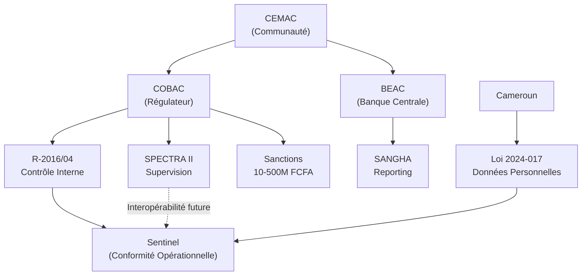

# 📊 Recherche Domaine — Audit Interne Bancaire et Cadre Réglementaire CEMAC

> **Analyste : Mary (Business Analyst Agent)**
> **Date : 2026-03-21**
> **Projet : Sentinel — BICEC**

---

## 1. Résumé Exécutif

Le domaine de l'audit interne bancaire en zone CEMAC est encadré par un arsenal réglementaire strict piloté par la COBAC (Commission Bancaire de l'Afrique Centrale). Le texte fondateur — **Règlement COBAC R-2016/04** — impose un dispositif de contrôle interne structuré et exige un suivi documenté des recommandations d'audit. Les sanctions pour non-conformité sont sévères : amendes atteignant **2,8 milliards de FCFA** et pouvant aller jusqu'au retrait d'agrément. La nouvelle **Loi camerounaise 2024-017** sur la protection des données personnelles (entrée en vigueur le 23 juin 2026) ajoute une couche d'obligations supplémentaires. Sentinel doit impérativement intégrer ces deux cadres réglementaires dès le MVP.

---

## 2. Cadre Réglementaire COBAC

### 2.1 Règlement COBAC R-2016/04 — Contrôle Interne

Le texte fondamental qui régit le contrôle interne des établissements de crédit et holdings financières dans la CEMAC. Il abroge et remplace le R-2001/07.

**Exigences clés directement liées à Sentinel :**

| Obligation réglementaire | Implication Sentinel |
|---|---|
| Dispositif de contrôle interne adapté à la nature, taille et risques de l'établissement | Sentinel doit être paramétrable par type de risque et macro-processus |
| Système d'identification, analyse, mesure et surveillance des risques pour chaque catégorie | Les KPIs par macro-processus et la cartographie des risques sont des fonctions futures pertinentes |
| Contrôle à deux niveaux : permanent (1er niveau) + périodique (2ème niveau = audit interne) | Sentinel adresse le 2ème niveau (suivi des recommandations d'audit) |
| Charte d'audit interne approuvée par l'organe délibérant | Sentinel pourrait stocker et versionner la charte d'audit |
| Rapports annuels sur le contrôle interne transmis au Secrétariat Général de la COBAC | Les exports et dashboards Sentinel doivent pouvoir alimenter ces rapports |
| Comité d'audit chargé d'évaluer la qualité du contrôle interne | Les tableaux de bord DG/Comité d'Audit sont un livrable MVP |

### 2.2 Méthodologie IIA et Alignement CEMAC

La réglementation COBAC s'aligne sur les principes de l'Institut des Auditeurs Internes (IIA) :

- **Indépendance** : L'audit interne doit être rattaché à l'organe délibérant/comité d'audit
- **Approche systématique** : Planification → Exécution → Communication → Suivi
- **Couverture complète** : Toutes les activités, filiales et succursales
- **Suivi exhaustif** : L'audit interne est explicitement chargé du suivi de la mise en œuvre des mesures correctrices

> 🔑 **Insight clé :** Le suivi des recommandations n'est pas optionnel — c'est une **obligation réglementaire explicite** de la COBAC. Sentinel ne vend pas un confort, il vend la **conformité**.

---

## 3. Loi Camerounaise 2024-017 — Protection des Données Personnelles

**Promulguée :** 23 décembre 2024
**Entrée en vigueur :** 23 juin 2026 (délai de 18 mois)
**Inspiration :** RGPD européen

### Obligations impactant Sentinel

| Obligation | Impact sur Sentinel |
|---|---|
| Consentement explicite pour le traitement des données | L'acceptation des CGU à la connexion SSO doit intégrer le consentement |
| Registre des activités de traitement | L'audit trail de Sentinel constitue ce registre *de facto* |
| Mesures techniques et organisationnelles de sécurité | Chiffrement au repos et en transit, RBAC, RLS |
| Notification sans délai en cas de violation de données | Procédure d'incident à documenter dans le PCA |
| Encadrement des transferts internationaux de données | Hébergement On-Premise = aucun transfert hors Cameroun → conformité native |
| Formation continue des employés | Sentinel doit intégrer un guide utilisateur / onboarding |

**Sanctions :** Amendes jusqu'à **50 millions de FCFA** + sanctions pénales.

> 🔑 **Insight clé :** Le choix On-Premise neutralise le principal risque de la Loi 2024-017 (transferts de données). C'est un différenciateur fort face aux solutions cloud.

---

## 4. Sanctions COBAC — La Réalité du Risque

### Barème réglementaire

- Holdings : **15 millions à 750 millions de FCFA**
- Établissements de crédit : **10 à 500 millions de FCFA**
- Cumul maximum : **1 milliard de FCFA** pour les banques
- Sanction ultime : **Retrait d'agrément**

### Exemples concrets documentés

| Année | Sanction | Montant / Type | Banques concernées |
|---|---|---|---|
| 2019 | Amendes pour violation changes et LBC/FT | **700 millions FCFA** (6 banques) | BGFIbank, Afriland, SG, SCB, UBA, **BICEC** |
| 2022 | Non-conformité changes | **2,8 milliards FCFA** (14 banques) | Banques opérant au Cameroun |
| Divers | Blâmes, démissions d'office | Dirigeants révoqués | Banque Atlantique Cameroun, CCA, NFC |

> ⚠️ **BICEC a déjà été sanctionnée en 2019.** C'est un argument massif pour l'adoption de Sentinel : démontrer à la COBAC que l'institution a pris les mesures correctives avec un outil traçable et auditable.

---

## 5. Écosystème Réglementaire CEMAC — Vue d'Ensemble

---

## 6. Terminologie Métier Essentielle

| Terme | Définition contextuelle |
|---|---|
| **Recommandation** | Mesure corrective prescrite par l'audit à l'issue d'un constat de défaillance |
| **Constat contradictoire** | Processus où l'audité valide ou conteste les observations avant formalisation |
| **PV de recette** | Procès-verbal par lequel le DM atteste que les preuves sont conformes avant envoi à l'audit |
| **Péché Capital** | Expression COBAC pour l'accumulation de recommandations non traitées |
| **Contrôle permanent** | 1er niveau : vérification continue par les opérationnels eux-mêmes |
| **Contrôle périodique** | 2ème niveau : missions d'audit interne planifiées |
| **Organe délibérant** | Conseil d'administration ou équivalent |
| **Organe exécutif** | Direction Générale |
| **CERBER** | Module SPECTRA pour les déclarations réglementaires des banques |
| **SESAME** | Module SPECTRA pour les déclarations des institutions de microfinance |
| **Append-only** | Architecture de stockage où les données ne peuvent être que ajoutées, jamais modifiées ni supprimées |
| **RLS (Row Level Security)** | Contrôle d'accès au niveau des lignes de la base de données |
