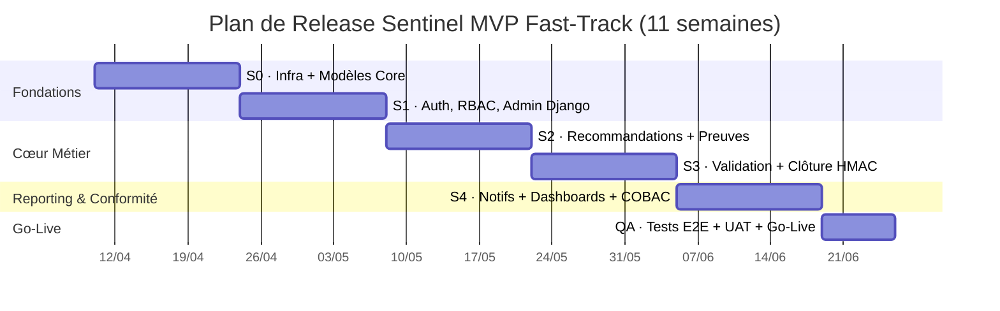

# Sprint Planning — Sentinel MVP v1.0 *(Fast-Track 11 semaines)*

> **Durée de sprint :** 2 semaines · **Équipe :** 1 Backend Dev + 1 Frontend Dev + 1 IT Admin (Sprint 0 uniquement)
> **Deadline MVP :** **11 semaines — Go-Live cible : 26 juin 2026**
> **Date de début :** 10 avril 2026
> **Référence :** [`epics-and-stories.md`](./epics-and-stories.md) · [`prd-v2.md`](./prd-v2.md) · [`architecture-v2.md`](./architecture-v2.md)

> [!IMPORTANT]
> **Révision Fast-Track (2026-04-09)** — Suite à la contrainte de délai réduit de 6 mois → 11 semaines, les éléments suivants sont **reportés en v2** :
> - 🔴 **S1.6 — RLS PostgreSQL** (3 pts) : le middleware RBAC reste la barrière unique en v1
> - 🔴 **S2.6 — Bulk Create** (4 pts) : création unitaire uniquement
> - 🔴 **E5 — Demandes de Report d'Échéance** (9 pts) : gestion via Admin Django + commentaire
> - 🔴 **E9 — Import Self-Service** (14 pts) : remplacement par un `management command` Django
> - 🟠 **S3.8 — UI Historique versions preuves** (2 pts) : données en base, UI reportée
> - 🟠 **S6.5 — Filtres HTMX dynamiques** (4 pts) : filtres serveur classiques (rechargement complet)
> - 🟠 **S6.4 Dashboard DG** (simplifié) : vue Audit filtrée par direction + rapport PDF par direction

---

## Philosophie de Priorisation

1. **Fondations d'abord :** L'infra et le RBAC bloquent tout le reste.
2. **Happy Path complet en priorité absolue :** Livrer le flux nominal (Audit crée → ETP soumet → DM valide → Audit clôture) dès le Sprint 3 (semaine 6).
3. **Parallélisation maximale Front/Back :** Chaque sprint alterne les responsabilités pour éviter les blocages.
4. **Reporting et conformité en Sprint 4 :** Notifications, dashboards, COBAC concentrés sur les 2 dernières semaines actives.

---

## Vue d'Ensemble des Sprints

---

## Détail des Sprints

---

### 🏗️ Sprint 0 — Infrastructure, DevOps & Modèles Core
**Dates :** 10 – 23 avril 2026
**Objectif :** L'environnement conteneurisé est prêt (`docker compose up` lance les 4 services) ET les fondations de données sont en place (Modèles User, Department, Delegation, AuditLog).
**NFR validées :** NFR-SEC-01 (TLS), NFR-REL-02 (Backup).

| Priorité | Story | Points | Assigné |
|:---:|---|:---:|---|
| 🔴 BLOQUANT | S0.1 · Dockerfile multi-stage | 3 | IT Admin |
| 🔴 BLOQUANT | S0.2 · Docker Compose (4 services, healthchecks) | 3 | IT Admin |
| 🔴 BLOQUANT | S0.3 · Nginx (TLS, HTTP→HTTPS, headers sécu) | 3 | IT Admin |
| 🔴 BLOQUANT | S1.1 · Modèle `User` custom (UUID + rôle) | 3 | Backend |
| 🔴 BLOQUANT | S1.2 · Modèle `Department` (hiérarchie) | 2 | Backend |
| 🔴 BLOQUANT | S1.3 · Modèle `Delegation` (intérims FR4) | 3 | Backend |
| 🔴 BLOQUANT | S1.7 · Modèle `AuditLog` (append-only + trigger) | 3 | Backend |
| 🟠 HAUTE | S0.5 · Fichier `.env.example` et secrets | 1 | IT Admin |
| 🟢 NORMALE | S0.4 · Script de backup nocturne | 2 | IT Admin |

**Total : 23 points**

**Critère de complétion du Sprint :**
- [ ] `docker compose up -d` → 4 conteneurs sains (healthcheck OK)
- [ ] HTTPS accessible sur `https://localhost` avec certificat auto-signé
- [ ] Migrations Django pour `User`, `Department`, `Delegation`, `AuditLog` appliquées sans erreur
- [ ] `python manage.py showmigrations` : tout vert

---

### 🔑 Sprint 1 — Authentification, RBAC & Admin Django
**Dates :** 24 avril – 7 mai 2026
**Objectif :** L'IT Admin peut créer l'organigramme et les utilisateurs. Un DM peut se connecter et voir son périmètre.
**FR validées :** FR1, FR3, FR4. **NFR validées :** NFR-SEC-02 (Session), NFR-PERF-01 (RBAC).

> [!NOTE]
> **S1.6 (RLS PostgreSQL) est reporté en v2.** Le middleware RBAC (S1.5) est le seul garde-fou en v1.

| Priorité | Story | Points | Assigné |
|:---:|---|:---:|---|
| 🔴 BLOQUANT | S1.4 · Login/Logout + anti-brute-force | 3 | Backend |
| 🔴 BLOQUANT | S1.5 · Middleware RBAC (périmètre tenant) | 5 | Backend |
| 🔴 BLOQUANT | S1.8 · Templates de base (layout + navigation) | 3 | Frontend |
| 🟠 HAUTE | S1.9 · Admin Django — `Department` | 2 | Backend |
| 🟠 HAUTE | S1.10 · Admin Django — `User` (+ révocation session) | 2 | Backend |
| 🟠 HAUTE | S1.11 · Admin Django — `Delegation` | 2 | Backend |
| 🟠 HAUTE | S1.13 · Admin Django — `SiteConfiguration` | 1 | Backend |
| 🟢 NORMALE | S1.12 · Admin Django — `AuditLog` (read-only) | 1 | Backend |

**Total : 19 points**

**Critère de complétion du Sprint :**
- [ ] Un DM peut se connecter, voir son périmètre, sa session expire à 30min
- [ ] L'IT Admin peut créer l'organigramme BICEC dans l'Admin Django
- [ ] Un ETP d'une direction ne peut pas voir les données d'une autre direction (test pytest RBAC)

---

### ⚙️ Sprint 2 — Recommandations (FSM + CRUD) & Preuves
**Dates :** 8 – 21 mai 2026
**Objectif :** L'Audit peut créer et assigner des recommandations. L'ETP peut uploader des preuves sécurisées. Le FSM bloque toute transition illégale.
**FR validées :** FR5, FR6, FR7, FR10, FR11, FR12, FR15, FR16, FR18, FR25.

> [!NOTE]
> **S2.6 (Bulk Create) est reporté en v2.** Création unitaire uniquement.
> **S3.8 (UI Historique versions) est reporté en v2.** Les données de versioning sont stockées mais sans vue dédiée.

| Priorité | Story | Points | Assigné |
|:---:|---|:---:|---|
| 🔴 BLOQUANT | S2.1 · Modèle `Recommendation` + `django-fsm` | 5 | Backend |
| 🔴 BLOQUANT | S2.2 · Transitions assignation (Audit) | 3 | Backend |
| 🔴 BLOQUANT | S2.3 · Transitions DM : `delegate_to_etp` + `accept_by_dm` | 3 | Backend |
| 🔴 BLOQUANT | S2.7 · Modèle `Comment` + Selectors `for_tenant()` | 3 | Backend |
| 🔴 BLOQUANT | S3.1 · Modèle `Proof` (statuts, versioning, types) | 3 | Backend |
| 🔴 BLOQUANT | S3.2 · `upload_proof()` + validation Magic Bytes | 5 | Backend |
| 🔴 BLOQUANT | S3.6 · Renommage UUID + stockage sécurisé | 2 | Backend |
| 🔴 BLOQUANT | S3.7 · Téléchargement sécurisé (contrôle RBAC) | 2 | Backend |
| 🟠 HAUTE | S2.5 · Création unitaire (formulaire HTMX) | 3 | Frontend + Backend |
| 🟠 HAUTE | S2.4 · Soft Delete (statut ASSIGNED uniquement) | 2 | Backend |
| 🟠 HAUTE | S3.3 · `submit_proofs()` → DRAFT→PENDING | 3 | Backend |
| 🟠 HAUTE | S3.4 · Soft Delete brouillon par auteur | 2 | Frontend |
| 🟢 NORMALE | S3.5 · Upload PV de Recette (par le DM) | 2 | Backend |

**Total : 38 points**

> [!WARNING]
> **Sprint le plus chargé Backend.** La parallélisation est possible : le Frontend peut commencer `S2.5` (formulaire HTMX) dès que `S2.1` est mergé. Prioriser impitoyablement les items 🔴 BLOQUANT.

**Critère de complétion du Sprint :**
- [ ] L'Audit crée une reco et l'assigne à un DM
- [ ] Le DM délègue à un ETP → statut `IN_PROGRESS`
- [ ] Un `.exe` renommé `.pdf` est rejeté par `python-magic`
- [ ] Un ETP uploade 3 DRAFT et les soumet → statut `PENDING_DM_REVIEW`
- [ ] Une transition illégale lève `TransitionNotAllowed` (test pytest)

---

### ✅ Sprint 3 — Validation DM/DG/Audit & Clôture HMAC
**Dates :** 22 mai – 4 juin 2026
**Objectif :** **Happy Path complet opérationnel.** L'Audit peut clôturer avec un sceau HMAC. La timeline de toutes les actions est consultable.
**FR validées :** FR17, FR19, FR20, FR24, FR27. **NFR validées :** NFR-SEC-03, NFR-PERF-03.

| Priorité | Story | Points | Assigné |
|:---:|---|:---:|---|
| 🔴 BLOQUANT | S4.1 · `submit_to_dm()` ETP → PENDING_DM_REVIEW | 2 | Backend |
| 🔴 BLOQUANT | S4.2 · `approve_by_dm()` → PENDING_AUDIT_REVIEW | 3 | Backend |
| 🔴 BLOQUANT | S4.3 · `reject_by_dm()` (motif obligatoire) | 2 | Backend |
| 🔴 BLOQUANT | S4.5 · `close_by_audit()` + HMAC-SHA256 | 5 | Backend |
| 🔴 BLOQUANT | S4.7 · Middleware immutabilité CLOSED_RESOLVED | 2 | Backend |
| 🟠 HAUTE | S4.4 · `submit_to_audit()` DM Porteur + DG Porteur | 3 | Backend |
| 🟠 HAUTE | S4.6 · `reject_by_audit()` (notif DM + ETP + DG) | 2 | Backend |
| 🟢 NORMALE | S4.8 · Vue Timeline (Audit Trail) | 3 | Frontend |

**Total : 22 points**

**Critère de complétion du Sprint :**
- [ ] **Happy Path complet testé de bout en bout** (pytest + Playwright)
- [ ] HMAC généré en ≤ 500ms
- [ ] Mutation post-CLOSED retourne `403 Forbidden`
- [ ] Timeline affiche toutes les transitions avec acteur, date et action

> 🚩 **Point de pilotage possible après Sprint 3 :** Le flux nominal est complet. Une démonstration interne est possible dès ce stade.

---

### 📊 Sprint 4 — Notifications, Dashboards & Conformité COBAC
**Dates :** 5 – 18 juin 2026
**Objectif :** Chaque rôle a son tableau de bord. Le moteur de relance est actif. Les inspecteurs COBAC ont leur accès cloisonné.
**FR validées :** FR21, FR22, FR23, FR28, FR29, FR30, FR31, FR2, FR26.

> [!WARNING]
> **Sprint le plus stratégique — parallélisation Front/Back obligatoire :**
> - **Backend** : E7 (Notifications/Scheduler) → E8 (COBAC modèles + vues + ZIP)
> - **Frontend** : E6 (Dashboards + Rapport PDF) → E8 (vues COBAC read-only) → templates email

**🔔 Notifications & Scheduler (E7)**

| Priorité | Story | Points | Assigné |
|:---:|---|:---:|---|
| 🔴 BLOQUANT | S7.1 · Modèles `Notification` + `Digest` | 3 | Backend |
| 🔴 BLOQUANT | S7.2 · `cron_check_overdue()` (flag OVERDUE) | 3 | Backend |
| 🔴 BLOQUANT | S7.3 · `cron_send_consolidated_notifications()` | 4 | Backend |
| 🟠 HAUTE | S7.4 · `cron_proactive_alerts()` (J-7) | 2 | Backend |
| 🟠 HAUTE | S7.5 · Template email HTML (Outlook compatible) | 3 | Frontend |
| 🟠 HAUTE | S7.7 · Notifications in-app (badge HTMX) | 3 | Frontend |
| 🟢 NORMALE | S7.6 · Heartbeat Scheduler + alerte RSSI | 2 | Backend |

**📊 Dashboards & Rapport PDF (E6 — simplifié)**

> [!NOTE]
> **S6.5 (Filtres HTMX dynamiques) est simplifié** : les filtres sont soumis par formulaire classique (rechargement complet de la liste). Pas de filtrage partiel HTMX.
> **S6.4 Dashboard DG** : copie du Dashboard Audit filtrée par direction + rapport PDF par direction.
> **S6.7 Rapport DG séparé** : fusionné dans S6.6 (rapport Audit avec filtre direction).

| Priorité | Story | Points | Assigné |
|:---:|---|:---:|---|
| 🔴 BLOQUANT | S6.1 · Dashboard Audit Interne (liste paginée + filtres serveur) | 3 | Frontend + Backend |
| 🔴 BLOQUANT | S6.2 · Dashboard Directeur Métier | 3 | Frontend + Backend |
| 🔴 BLOQUANT | S6.3 · To-Do List ETP | 2 | Frontend + Backend |
| 🟠 HAUTE | S6.4 · Dashboard DG (vue Audit filtrée direction + rapport PDF direction) | 3 | Frontend + Backend |
| 🟠 HAUTE | S6.6 · Rapport de synthèse Audit (UC15) + export PDF `@media print` | 3 | Frontend + Backend |
| 🟢 NORMALE | S6.8 · Indicateurs visuels priorité/statut (badges couleur) | 2 | Frontend |

**🌍 Conformité COBAC (E8)**

| Priorité | Story | Points | Assigné |
|:---:|---|:---:|---|
| 🔴 BLOQUANT | S8.1 · Modèle `ExternalMission` (périmètre) | 3 | Backend |
| 🔴 BLOQUANT | S8.2 · Vue liste Read-Only (périmètre mission) | 3 | Frontend + Backend |
| 🔴 BLOQUANT | S8.5 · Création compte Externe par l'Audit | 2 | Backend |
| 🟠 HAUTE | S8.3 · Export ZIP streamé (preuves + fiche synthèse) | 5 | Backend |
| 🟠 HAUTE | S8.4 · Vérification HMAC en temps réel (pastille) | 3 | Frontend + Backend |

**Total Sprint 4 : 48 points**

**Critère de complétion du Sprint :**
- [ ] Un email est reçu dans Exchange à 08h00 pour une reco OVERDUE
- [ ] Le badge in-app s'affiche et se marque lu via HTMX
- [ ] TTFB dashboard < 200ms avec 1000 recos en base (test de charge)
- [ ] Rapport UC15 imprimable en PDF (`@media print`)
- [ ] Dashboard DG affiche les statistiques de la direction sélectionnée + rapport PDF téléchargeable
- [ ] Un Externe ne voit que son périmètre de mission
- [ ] ZIP téléchargé en < 5s pour un dossier de 10 preuves

---

### 🚀 Semaine QA & Go-Live
**Dates :** 19 – 26 juin 2026
**Objectif :** Tests E2E critiques, UAT pilote BICEC, import SQL historique, Go-Live officiel.

| Priorité | Tâche | Assigné |
|:---:|---|---|
| 🔴 BLOQUANT | Tests Playwright E2E : Happy Path complet (Audit → ETP → DM → Clôture) | QA / Backend |
| 🔴 BLOQUANT | Tests Playwright E2E : Rejet DM + détection OVERDUE | QA |
| 🔴 BLOQUANT | UAT pilote (1 Direction pilote, 20 recommandations de test) | Tous |
| 🔴 BLOQUANT | Correction bugs UAT priorité CRITIQUE | Backend + Frontend |
| 🔴 BLOQUANT | Import SQL historique BICEC (~450+ recos via management command) | Backend + IT Admin |
| 🔴 BLOQUANT | Configuration organigramme BICEC réel dans l'Admin Django | IT Admin |
| 🟠 HAUTE | Polish UI minimal : pages 403/404/500 stylisées | Frontend |
| 🟠 HAUTE | Formation utilisateurs clés (Audit Interne, 1 DM pilote) | PM |
| 🟢 NORMALE | README & runbook de démarrage | Backend |

---

## Récapitulatif Exécutif

| Sprint | Dates | Epics | Points | Livrable Clé |
|---|---|---|---|---|
| **S0** | 10–23 avr. | E0 + E1 partiel | 23 | Docker + Nginx + Modèles Core |
| **S1** | 24 avr.–7 mai | E1 suite | 19 | Auth + RBAC + Admin Django |
| **S2** | 8–21 mai | E2 + E3 | 38 | FSM Recos + Upload preuves sécurisé |
| **S3** | 22 mai–4 juin | E4 | 22 | **Happy Path complet + Clôture HMAC** |
| **S4** | 5–18 juin | E6 + E7 + E8 | 48 | Dashboards + Notifications + COBAC |
| **QA** | 19–26 juin | — | — | Tests E2E + UAT + Go-Live |
| **Total** | **11 semaines** | **E0→E8** | **~150 pts** | **MVP Sentinel en production** |

> [!IMPORTANT]
> **Éléments reportés en v2 (post Go-Live) :**
> - S1.6 · RLS PostgreSQL (3 pts)
> - S2.6 · Bulk Create recommandations (4 pts)
> - E5 · Demandes de Report d'Échéance (9 pts) — solution : Admin Django + commentaire
> - E9 · Import Self-Service via UI (14 pts) — solution : management command Django
> - S3.8 · UI Historique versions preuves (2 pts) — données disponibles en base
> - S6.5 · Filtres HTMX dynamiques (4 pts) — simplifiés en filtres serveur classiques

| Priorité | Story | Points | Assigné |
|:---:|---|:---:|---|
| 🔴 BLOQUANT | S0.1 · Dockerfile multi-stage | 3 | IT Admin |
| 🔴 BLOQUANT | S0.2 · Docker Compose (4 services, healthchecks) | 3 | IT Admin |
| 🔴 BLOQUANT | S0.3 · Nginx (TLS, HTTP→HTTPS, headers sécu) | 3 | IT Admin |
| 🟠 HAUTE | S0.5 · Fichier `.env.example` et secrets | 1 | IT Admin |
| 🟢 NORMALE | S0.4 · Script de backup nocturne | 2 | IT Admin |

**Total : 12 points**

**Critère de complétion du Sprint :**
- [ ] `docker compose up -d` → 4 conteneurs sains (healthcheck OK)
- [ ] HTTPS accessible sur `https://localhost` avec certificat auto-signé
- [ ] Django admin accessible sur `/admin/`

---

### 🔑 Sprint 1 — Authentification, Modèles Core & Admin Django
**Objectif :** Les fondations des données sont en place. L'IT Admin peut créer l'organigramme et les utilisateurs.
**FR validées :** FR1, FR3, FR4. **NFR validées :** NFR-SEC-02 (Session), NFR-PERF-01 (RBAC), NFR-REL-01 (RLS).

| Priorité | Story | Points | Assigné |
|:---:|---|:---:|---|
| 🔴 BLOQUANT | S1.1 · Modèle `User` custom (UUID + rôle) | 3 | Backend |
| 🔴 BLOQUANT | S1.2 · Modèle `Department` (hiérarchie) | 2 | Backend |
| 🔴 BLOQUANT | S1.3 · Modèle `Delegation` (intérims FR4) | 3 | Backend |
| 🔴 BLOQUANT | S1.4 · Login/Logout + anti-brute-force | 3 | Backend |
| 🔴 BLOQUANT | S1.5 · Middleware RBAC (périmètre tenant) | 5 | Backend |
| 🔴 BLOQUANT | S1.6 · RLS PostgreSQL (garde-fou fail-safe) | 3 | Backend |
| 🔴 BLOQUANT | S1.7 · Modèle `AuditLog` (append-only + trigger) | 3 | Backend |
| 🟠 HAUTE | S1.8 · Templates de base (layout + navigation) | 3 | Frontend |
| 🟠 HAUTE | S1.9 · Admin Django — `Department` | 2 | Backend |
| 🟠 HAUTE | S1.10 · Admin Django — `User` (+ révocation session) | 2 | Backend |
| 🟠 HAUTE | S1.11 · Admin Django — `Delegation` | 2 | Backend |
| 🟢 NORMALE | S1.12 · Admin Django — `AuditLog` (read-only) | 1 | Backend |
| 🟢 NORMALE | S1.13 · Admin Django — `SiteConfiguration` | 1 | Backend |

**Total : 33 points** *(Sprint chargé – priorité absolue)*

**Critère de complétion du Sprint :**
- [ ] Un DM peut se connecter, voir son périmètre, sa session expire à 30min
- [ ] L'IT Admin peut créer l'organigramme BICEC dans l'Admin Django
- [ ] Un test pytest d'isolation RLS passe au vert

---

### ⚙️ Sprint 2 — Recommandations (Modèles, FSM, CRUD)
**Objectif :** L'Audit peut créer des recommandations, les assigner, et le FSM bloque toute transition illégale.
**FR validées :** FR5, FR6, FR7, FR10, FR11, FR12.

| Priorité | Story | Points | Assigné |
|:---:|---|:---:|---|
| 🔴 BLOQUANT | S2.1 · Modèle `Recommendation` + `django-fsm` | 5 | Backend |
| 🔴 BLOQUANT | S2.2 · Transitions assignation (Audit) | 3 | Backend |
| 🔴 BLOQUANT | S2.3 · Transitions DM : `delegate_to_etp` + `accept_by_dm` | 3 | Backend |
| 🔴 BLOQUANT | S2.7 · Modèle `Comment` + Selectors `for_tenant()` | 3 | Backend |
| 🟠 HAUTE | S2.5 · Création unitaire (formulaire HTMX) | 3 | Frontend + Backend |
| 🟠 HAUTE | S2.4 · Soft Delete (statut ASSIGNED uniquement) | 2 | Backend |
| 🟢 NORMALE | S2.6 · Bulk Create (formulaire multi-lignes) | 4 | Frontend + Backend |

**Total : 23 points**

**Critère de complétion du Sprint :**
- [ ] L'Audit crée une reco et l'assigne à un DM
- [ ] Le DM délègue à un ETP → statut `IN_PROGRESS`
- [ ] Une transition illégale lève `TransitionNotAllowed` (test pytest)

---

### 📎 Sprint 3 — Preuves & Sécurité Fichiers
**Objectif :** L'ETP peut uploader des preuves en DRAFT, la validation Magic Bytes bloque les fichiers dangereux.
**FR validées :** FR15, FR16, FR18, FR25. **NFR validées :** NFR-SEC-04, NFR-SCA-01.

| Priorité | Story | Points | Assigné |
|:---:|---|:---:|---|
| 🔴 BLOQUANT | S3.1 · Modèle `Proof` (statuts, versioning, types) | 3 | Backend |
| 🔴 BLOQUANT | S3.2 · `upload_proof()` + validation Magic Bytes | 5 | Backend |
| 🔴 BLOQUANT | S3.6 · Renommage UUID + stockage sécurisé | 2 | Backend |
| 🔴 BLOQUANT | S3.7 · Téléchargement sécurisé (contrôle RBAC) | 2 | Backend |
| 🟠 HAUTE | S3.3 · `submit_proofs()` → DRAFT→PENDING | 3 | Backend |
| 🟠 HAUTE | S3.4 · Soft Delete brouillon par auteur | 2 | Backend |
| 🟠 HAUTE | S3.8 · Historique des versions de preuves | 2 | Frontend |
| 🟢 NORMALE | S3.5 · Upload PV de Recette (par le DM) | 2 | Backend |

**Total : 21 points**

**Critère de complétion du Sprint :**
- [ ] Un `.exe` renommé `.pdf` est rejeté par `python-magic`
- [ ] Un ETP uploade 3 DRAFT et les soumet → statut `PENDING_DM_REVIEW`
- [ ] Un ETP d'une autre direction ne peut pas voir les preuves (test RBAC)

---

### ✅ Sprint 4 — Validation DM & Clôture Audit (HMAC)
**Objectif :** Le Happy Path complet est opérationnel. L'Audit peut clôturer avec un sceau HMAC.
**FR validées :** FR17, FR19, FR20, FR24, FR27. **NFR validées :** NFR-SEC-03, NFR-PERF-03.

| Priorité | Story | Points | Assigné |
|:---:|---|:---:|---|
| 🔴 BLOQUANT | S4.1 · `submit_to_dm()` ETP → PENDING_DM_REVIEW | 2 | Backend |
| 🔴 BLOQUANT | S4.2 · `approve_by_dm()` → PENDING_AUDIT_REVIEW | 3 | Backend |
| 🔴 BLOQUANT | S4.3 · `reject_by_dm()` (motif obligatoire) | 2 | Backend |
| 🔴 BLOQUANT | S4.5 · `close_by_audit()` + HMAC-SHA256 | 5 | Backend |
| 🔴 BLOQUANT | S4.7 · Middleware immutabilité CLOSED_RESOLVED | 2 | Backend |
| 🟠 HAUTE | S4.4 · `submit_to_audit()` DM Porteur + DG Porteur | 3 | Backend |
| 🟠 HAUTE | S4.6 · `reject_by_audit()` (notif DM + ETP + DG) | 2 | Backend |
| 🟢 NORMALE | S4.8 · Vue Timeline (Audit Trail) | 3 | Frontend |

**Total : 22 points**

**Critère de complétion du Sprint :**
- [ ] Happy Path complet testé de bout en bout (pytest + Playwright)
- [ ] HMAC généré en ≤ 500ms
- [ ] Mutation post-CLOSED retourne `403 Forbidden`

---

### 🔔 Sprint 5 — Notifications & Scheduler Django-Q2
**Objectif :** Le moteur de relance automatique est opérationnel. Les OVERDUE sont détectées chaque nuit.
**FR validées :** FR21, FR22, FR23.

| Priorité | Story | Points | Assigné |
|:---:|---|:---:|---|
| 🔴 BLOQUANT | S7.1 · Modèles `Notification` + `Digest` | 3 | Backend |
| 🔴 BLOQUANT | S7.2 · `cron_check_overdue()` (flag OVERDUE) | 3 | Backend |
| 🔴 BLOQUANT | S7.3 · `cron_send_consolidated_notifications()` | 4 | Backend |
| 🟠 HAUTE | S7.4 · `cron_proactive_alerts()` (J-7) | 2 | Backend |
| 🟠 HAUTE | S7.5 · Template email HTML (Outlook compatible) | 3 | Frontend |
| 🟠 HAUTE | S7.7 · Notifications in-app (badge HTMX) | 3 | Frontend |
| 🟢 NORMALE | S7.6 · Heartbeat Scheduler + alerte RSSI | 2 | Backend |

**Total : 20 points**

**Critère de complétion du Sprint :**
- [ ] Un email est reçu dans Exchange à 08h00 pour une reco OVERDUE
- [ ] Un seul email consolidé par utilisateur (pas de doublons)
- [ ] Le badge in-app s'affiche et se marque lu via HTMX

---

### 📊 Sprint 6 — Dashboards, Filtres HTMX & Rapport PDF (UC15)
**Objectif :** Chaque rôle a son tableau de bord. Les dashboards Audit et DG peuvent être imprimés.
**FR validées :** FR28, FR29, FR30, FR31. **NFR validées :** NFR-PERF-02.

| Priorité | Story | Points | Assigné |
|:---:|---|:---:|---|
| 🔴 BLOQUANT | S6.1 · Dashboard Audit Interne | 4 | Frontend + Backend |
| 🔴 BLOQUANT | S6.2 · Dashboard Directeur Métier | 3 | Frontend + Backend |
| 🔴 BLOQUANT | S6.3 · To-Do List ETP | 2 | Frontend + Backend |
| 🟠 HAUTE | S6.4 · Dashboard Direction Générale | 4 | Frontend + Backend |
| 🟠 HAUTE | S6.5 · Filtres dynamiques HTMX | 4 | Frontend |
| 🟠 HAUTE | S6.8 · Indicateurs visuels priorité/statut | 2 | Frontend |
| 🟢 NORMALE | S6.6 · Rapport de synthèse Audit (UC15) | 3 | Frontend + Backend |
| 🟢 NORMALE | S6.7 · Rapport DG (vue exécutive) | 2 | Frontend + Backend |

**Total : 24 points**

> **🚩 Point de pilotage BICEC possible :** Après Sprint 6, le Happy Path complet + dashboards sont disponibles pour un UAT restreint (1 Direction pilote, 20 recommandations test).

**Critère de complétion du Sprint :**
- [ ] TTFB dashboard < 200ms avec 1000 recos en base (test de charge)
- [ ] Filtres HTMX fonctionnels sans rechargement page
- [ ] Rapport UC15 imprimable

---

### 📅 Sprint 7 — Demandes de Report d'Échéance
**Objectif :** Les DM peuvent demander formellement un report. L'Audit décide. La date originale est préservée.
**FR validées :** FR13, FR14.

| Priorité | Story | Points | Assigné |
|:---:|---|:---:|---|
| 🔴 BLOQUANT | S5.1 · Modèle `ExtensionRequest` | 2 | Backend |
| 🔴 BLOQUANT | S5.2 · Formulaire de demande de report (DM) | 3 | Frontend + Backend |
| 🔴 BLOQUANT | S5.3 · Vue approbation/rejet Audit | 3 | Frontend + Backend |
| 🟠 HAUTE | S5.4 · Conservation `original_due_date` | 1 | Backend |

**Total : 9 points** *(Sprint volontairement light — budget pour la dette technique et les bugs du pilote)*

**Critère de complétion du Sprint :**
- [ ] Un report approuvé met à jour `due_date` mais préserve `original_due_date`
- [ ] Double affichage (date initiale + date révisée) sur la fiche

---

### 📥 Sprint 8 — Import Historique Atomique
**Objectif :** L'Audit peut importer les 450+ recommandations avec prévisualisation des erreurs.
**FR validées :** FR8, FR9.

| Priorité | Story | Points | Assigné |
|:---:|---|:---:|---|
| 🔴 BLOQUANT | S9.1 · Template Excel normalisé (téléchargeable) | 2 | Backend |
| 🔴 BLOQUANT | S9.2 · `preview_import()` (validation + aperçu erreurs) | 5 | Backend + Frontend |
| 🔴 BLOQUANT | S9.3 · `execute_import()` (transaction atomique) | 5 | Backend |
| 🟠 HAUTE | S9.4 · Tag `IMPORTED` + AuditLog groupé | 2 | Backend |

**Total : 14 points**

**Critère de complétion du Sprint :**
- [ ] Un import de 500 lignes réussit atomiquement
- [ ] Une erreur à la ligne 200 déclenche un ROLLBACK complet
- [ ] L'import est exécuté en async (dashboard non bloqué)

---

### 🌍 Sprint 9 — Audit Externe & Conformité COBAC
**Objectif :** Les inspecteurs COBAC/BEAC ont un accès cloisonné. L'export ZIP et la vérification HMAC fonctionnent.
**FR validées :** FR2, FR26. **NFR validées :** NFR-PERF-04.

| Priorité | Story | Points | Assigné |
|:---:|---|:---:|---|
| 🔴 BLOQUANT | S8.1 · Modèle `ExternalMission` (périmètre) | 3 | Backend |
| 🔴 BLOQUANT | S8.2 · Vue liste Read-Only (périmètre mission) | 3 | Frontend + Backend |
| 🔴 BLOQUANT | S8.5 · Création compte Externe par l'Audit | 2 | Backend |
| 🟠 HAUTE | S8.3 · Export ZIP streamé (preuves + fiche synthèse) | 5 | Backend |
| 🟠 HAUTE | S8.4 · Vérification HMAC en temps réel (pastille) | 3 | Frontend + Backend |

**Total : 16 points**

**Critère de complétion du Sprint :**
- [ ] Un Externe ne voit que son périmètre de mission
- [ ] ZIP téléchargé en < 5s pour un dossier de 10 preuves
- [ ] Pastille verte confirmée sur une reco intègre

---

### 🎨 Sprint 10 — Polish UI, Accessibilité & Tests E2E
**Objectif :** L'application est prête pour la démonstration Go-Live. L'UX est soignée, les tests E2E passent.

| Priorité | Tâche | Points | Assigné |
|:---:|---|:---:|---|
| 🔴 BLOQUANT | Tests Playwright E2E : Happy Path complet | 5 | QA |
| 🔴 BLOQUANT | Tests Playwright E2E : Rejet DM + OVERDUE | 3 | QA |
| 🟠 HAUTE | Polish UI : cohérence visuelle tous rôles | 4 | Frontend |
| 🟠 HAUTE | Page 403/404/500 soignées | 1 | Frontend |
| 🟠 HAUTE | Review WCAG accessibilité (contraste, labels) | 2 | Frontend |
| 🟢 NORMALE | Documentation opérationnelle (README + runbook) | 3 | Backend |

**Total : 18 points**

---

### 🚀 Sprint 11 — QA Finale & Go-Live
**Objectif :** UAT complet avec l'équipe BICEC. Correction des bugs remontés. Go-Live officiel.

| Priorité | Tâche | Assigné |
|:---:|---|---|
| 🔴 BLOQUANT | UAT pilote (1 Direction, 20 recommandations réelles) | Tous |
| 🔴 BLOQUANT | Correction bugs UAT priorité CRITIQUE | Backend + Frontend |
| 🔴 BLOQUANT | Import de l'historique réel BICEC (450+ recos) | Backend + IT Admin |
| 🔴 BLOQUANT | Configuration organigramme BICEC réel | IT Admin |
| 🟠 HAUTE | Formation utilisateurs (DM, ETP, Audit) | PM |
| 🟢 NORMALE | Livraison documentation utilisateur | PM |

---

## Récapitulatif Exécutif

| Sprint | Durée | Epics | Stories | Points | Livrable Clé |
|---|---|---|---|---|---|
| **S0** | 2 sem. | E0 | 5 | 12 | Docker + Nginx opérationnel |
| **S1** | 2 sem. | E1 | 13 | 33 | Auth + RBAC + Admin Django |
| **S2** | 2 sem. | E2 | 7 | 23 | FSM + CRUD Recommandations |
| **S3** | 2 sem. | E3 | 8 | 21 | Upload sécurisé + Magic Bytes |
| **S4** | 2 sem. | E4 | 8 | 22 | Happy Path complet + HMAC |
| **S5** | 2 sem. | E7 | 7 | 20 | Scheduler + Notifications |
| **S6** | 2 sem. | E6 | 8 | 24 | Dashboards + Rapport PDF · **🚩 Pilote BICEC possible** |
| **S7** | 2 sem. | E5 | 4 | 9 | Demandes de report |
| **S8** | 2 sem. | E9 | 4 | 14 | Import historique atomique |
| **S9** | 2 sem. | E8 | 5 | 16 | Accès COBAC + ZIP HMAC |
| **S10** | 2 sem. | — | — | 18 | Polish UI + Tests E2E |
| **S11** | 2 sem. | — | — | — | UAT + Go-Live |
| **Total** | **24 sem.** | **E0→E9** | **66** | **~212 pts** | **MVP Sentinel en production** |

> [!IMPORTANT]
> **Le point de pilotage naturel est après Sprint 6 (semaine 14).**
> À ce stade : Happy Path complet, 4 dashboards, rapport PDF et notifications sont opérationnels.
> L'équipe BICEC peut démarrer un pilote restreint (Direction des Risques) sur des données réelles,
> ce qui génère du feedback concret pour les sprints 7 à 9.
