# Sentinel — Diagrammes Système

> **Version :** 1.0
> **Date :** 2026-03-31
> **Sources :** PRD v2, Architecture.md, Product Brief v2
> **Format :** Mermaid (compatible GitLab, GitHub, VS Code Preview)

---

## Table des Matières

1. [Modèle Conceptuel de Données (MCD)](#1-modèle-conceptuel-de-données-mcd)
2. [Entity-Relationship Diagram (ERD)](#2-entity-relationship-diagram-erd)
3. [Diagramme de Machine à États (FSM)](#3-diagramme-de-machine-à-états-fsm)
4. [Diagrammes de Séquence](#4-diagrammes-de-séquence)
   - 4.1 Happy Path complet
   - 4.2 Soumission et Validation de Preuve
   - 4.3 Rejet et Re-soumission
   - 4.4 Demande de Report d'Échéance
   - 4.5 Import Historique Atomique
   - 4.6 Cycle de Notifications Asynchrones
   - 4.7 Export ZIP Auditeur Externe
   - 4.8 Authentification et Contrôle de Session
5. [Diagrammes de Cas d'Utilisation](#5-diagrammes-de-cas-dutilisation)
   - 5.1 Auditeur Interne
   - 5.2 Directeur Métier (DM)
   - 5.3 Employé Traitant (ETP)
   - 5.4 Direction Générale (DG)
   - 5.5 Auditeur Externe
   - 5.6 RSSI / Administrateur
6. [Diagramme de Classes](#6-diagramme-de-classes)

---

## 1. Modèle Conceptuel de Données (MCD)

Le MCD représente les entités métier et leurs relations conceptuelles indépendamment de l'implémentation technique.

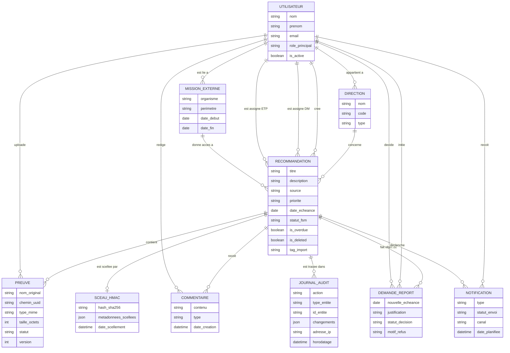
```mermaid
erDiagram
    UTILISATEUR {
        string nom
        string prenom
        string email
        string role_principal
        boolean is_active
    }

    DIRECTION {
        string nom
        string code
        string type
    }

    RECOMMANDATION {
        string titre
        string description
        string source
        string priorite
        date date_echeance
        string statut_fsm
        boolean is_overdue
        boolean is_deleted
        string tag_import
    }

    PREUVE {
        string nom_original
        string chemin_uuid
        string type_mime
        int taille_octets
        string statut
        int version
    }

    COMMENTAIRE {
        string contenu
        string type
        datetime date_creation
    }

    DEMANDE_REPORT {
        date nouvelle_echeance
        string justification
        string statut_decision
        string motif_refus
    }

    JOURNAL_AUDIT {
        string action
        string type_entite
        string id_entite
        json changements
        string adresse_ip
        datetime horodatage
    }

    SCEAU_HMAC {
        string hash_sha256
        json metadonnees_scellees
        datetime date_scellement
    }

    NOTIFICATION {
        string type
        string statut_envoi
        string canal
        datetime date_planifiee
    }

    MISSION_EXTERNE {
        string organisme
        string perimetre
        date date_debut
        date date_fin
    }

    UTILISATEUR ||--o{ DIRECTION : "appartient a"
    DIRECTION ||--o{ RECOMMANDATION : "concerne"
    UTILISATEUR ||--o{ RECOMMANDATION : "cree"
    UTILISATEUR ||--o{ RECOMMANDATION : "est assigne DM"
    UTILISATEUR ||--o{ RECOMMANDATION : "est assigne ETP"
    RECOMMANDATION ||--o{ PREUVE : "contient"
    UTILISATEUR ||--o{ PREUVE : "uploade"
    RECOMMANDATION ||--o{ COMMENTAIRE : "recoit"
    UTILISATEUR ||--o{ COMMENTAIRE : "redige"
    RECOMMANDATION ||--o{ DEMANDE_REPORT : "fait objet de"
    UTILISATEUR ||--o{ DEMANDE_REPORT : "initie"
    UTILISATEUR ||--o{ DEMANDE_REPORT : "decide"
    RECOMMANDATION ||--o| SCEAU_HMAC : "est scellee par"
    RECOMMANDATION ||--o{ JOURNAL_AUDIT : "est tracee dans"
    UTILISATEUR ||--o{ NOTIFICATION : "recoit"
    RECOMMANDATION ||--o{ NOTIFICATION : "declenche"
    UTILISATEUR ||--o{ MISSION_EXTERNE : "est lie a"
    MISSION_EXTERNE ||--o{ RECOMMANDATION : "donne acces a"
```

---

## 2. Entity-Relationship Diagram (ERD)

L'ERD détaille la structure de la base de données PostgreSQL avec les types de colonnes, clés primaires/étrangères et contraintes.

```mermaid
erDiagram
    users_department {
        uuid id PK
        varchar(100) name
        varchar(10) code UK
        varchar(20) type "DIRECTION | AGENCE | FILIALE"
        uuid parent_id FK "Self-referencing"
        boolean is_active
        timestamp created_at
        timestamp updated_at
    }

    users_user {
        uuid id PK
        varchar(150) username UK
        varchar(254) email UK
        varchar(128) password_hash
        varchar(50) first_name
        varchar(50) last_name
        varchar(20) role "AUDIT | DM | ETP | DG | EXTERNE | RSSI"
        uuid department_id FK
        boolean is_active
        boolean is_staff
        timestamp last_login
        timestamp date_joined
        timestamp created_at
        timestamp updated_at
    }

    workflow_recommendation {
        uuid id PK
        varchar(255) title
        text description
        varchar(20) source "INTERNE | COBAC | BEAC | CAC | NIF | CONSULTANT"
        varchar(10) priority "CRITIQUE | HAUTE | MOYENNE | FAIBLE"
        varchar(30) status "FSM: 5 etats"
        boolean is_overdue
        date due_date
        date original_due_date
        uuid created_by_id FK
        uuid assigned_dm_id FK
        uuid assigned_etp_id FK
        uuid department_id FK
        uuid macro_process_id FK "Pour KPIs analytiques"
        varchar(10) import_tag "IMPORTED | null"
        boolean is_deleted
        timestamp deleted_at
        text reference_rapport
        timestamp created_at
        timestamp updated_at
    }

    workflow_proof {
        uuid id PK
        uuid recommendation_id FK
        uuid uploaded_by_id FK
        varchar(255) original_filename
        varchar(255) file_path "UUID renamed"
        varchar(100) content_type
        integer file_size_bytes
        varchar(20) status "PENDING | ACCEPTED | REJECTED"
        integer version
        text rejection_reason
        varchar(10) proof_type "EVIDENCE | PV_RECETTE"
        timestamp created_at
    }

    workflow_comment {
        uuid id PK
        uuid recommendation_id FK
        uuid author_id FK
        text content
        varchar(20) type "SUBMISSION | VALIDATION | REJECTION | REASSIGN | REPORT | SYSTEM"
        timestamp created_at
    }

    workflow_extension_request {
        uuid id PK
        uuid recommendation_id FK
        uuid requested_by_id FK
        uuid decided_by_id FK
        date new_due_date
        text justification
        varchar(20) decision "PENDING | APPROVED | REJECTED"
        text rejection_reason
        timestamp created_at
        timestamp decided_at
    }

    audit_auditlog {
        uuid id PK
        uuid user_id FK
        varchar(20) action "CREATE | UPDATE | DELETE | LOGIN | LOGOUT | TRANSITION"
        varchar(50) content_type
        uuid object_id
        jsonb changes "Before/After diff"
        inet ip_address
        varchar(200) description
        timestamp created_at
    }

    audit_hmac_seal {
        uuid id PK
        uuid recommendation_id FK "1-to-1"
        varchar(64) hmac_hash
        jsonb sealed_metadata
        jsonb file_hashes "Hash de chaque preuve"
        uuid sealed_by_id FK
        timestamp sealed_at
    }

    notifications_notification {
        uuid id PK
        uuid user_id FK
        uuid recommendation_id FK
        varchar(30) type "ASSIGNMENT | SUBMISSION | OVERDUE | PROACTIVE_J7 | REJECTION | CLOSURE"
        varchar(10) channel "EMAIL | IN_APP"
        varchar(20) send_status "PENDING | SENT | FAILED"
        integer retry_count
        text error_message
        timestamp scheduled_at
        timestamp sent_at
        boolean is_read
        timestamp created_at
    }

    notifications_digest {
        uuid id PK
        uuid user_id FK
        varchar(20) digest_type "DAILY_CRITICAL | WEEKLY_DIGEST"
        jsonb recommendation_ids
        varchar(20) send_status "PENDING | SENT | FAILED"
        timestamp scheduled_at
        timestamp sent_at
    }

    users_external_mission {
        uuid id PK
        uuid auditor_id FK
        varchar(100) organization "COBAC | BEAC | CAC | NIF"
        text scope_description
        date start_date
        date end_date
        boolean is_active
        timestamp created_at
    }

    external_mission_recommendations {
        uuid id PK
        uuid mission_id FK
        uuid recommendation_id FK
    }

    django_q2_schedule {
        integer id PK
        varchar(255) name
        varchar(255) func
        text kwargs
        varchar(20) schedule_type
        integer minutes
        timestamp next_run
    }

    scheduler_heartbeat {
        uuid id PK
        timestamp last_heartbeat
        varchar(50) worker_name
        boolean is_healthy
    }

    users_interim_delegation {
        uuid id PK
        uuid absent_user_id FK
        uuid delegated_user_id FK
        date start_date
        date end_date
        boolean is_active
        timestamp created_at
    }

    users_user }o--|| users_department : "department_id"
    users_department }o--o| users_department : "parent_id"
    workflow_recommendation }o--|| users_department : "department_id"
    workflow_recommendation }o--|| users_user : "created_by_id"
    workflow_recommendation }o--o| users_user : "assigned_dm_id"
    workflow_recommendation }o--o| users_user : "assigned_etp_id"
    workflow_proof }o--|| workflow_recommendation : "recommendation_id"
    workflow_proof }o--|| users_user : "uploaded_by_id"
    workflow_comment }o--|| workflow_recommendation : "recommendation_id"
    workflow_comment }o--|| users_user : "author_id"
    workflow_extension_request }o--|| workflow_recommendation : "recommendation_id"
    workflow_extension_request }o--|| users_user : "requested_by_id"
    workflow_extension_request }o--o| users_user : "decided_by_id"
    audit_auditlog }o--|| users_user : "user_id"
    audit_hmac_seal |o--|| workflow_recommendation : "recommendation_id"
    audit_hmac_seal }o--|| users_user : "sealed_by_id"
    notifications_notification }o--|| users_user : "user_id"
    notifications_notification }o--o| workflow_recommendation : "recommendation_id"
    notifications_digest }o--|| users_user : "user_id"
    users_external_mission }o--|| users_user : "auditor_id"
    external_mission_recommendations }o--|| users_external_mission : "mission_id"
    external_mission_recommendations }o--|| workflow_recommendation : "recommendation_id"
    users_interim_delegation }o--|| users_user : "absent_user_id"
    users_interim_delegation }o--|| users_user : "delegated_user_id"
```

---

## 3. Diagramme de Machine à États (FSM)

Machine à états finis du cycle de vie d'une recommandation d'audit, gérée par `django-fsm`.

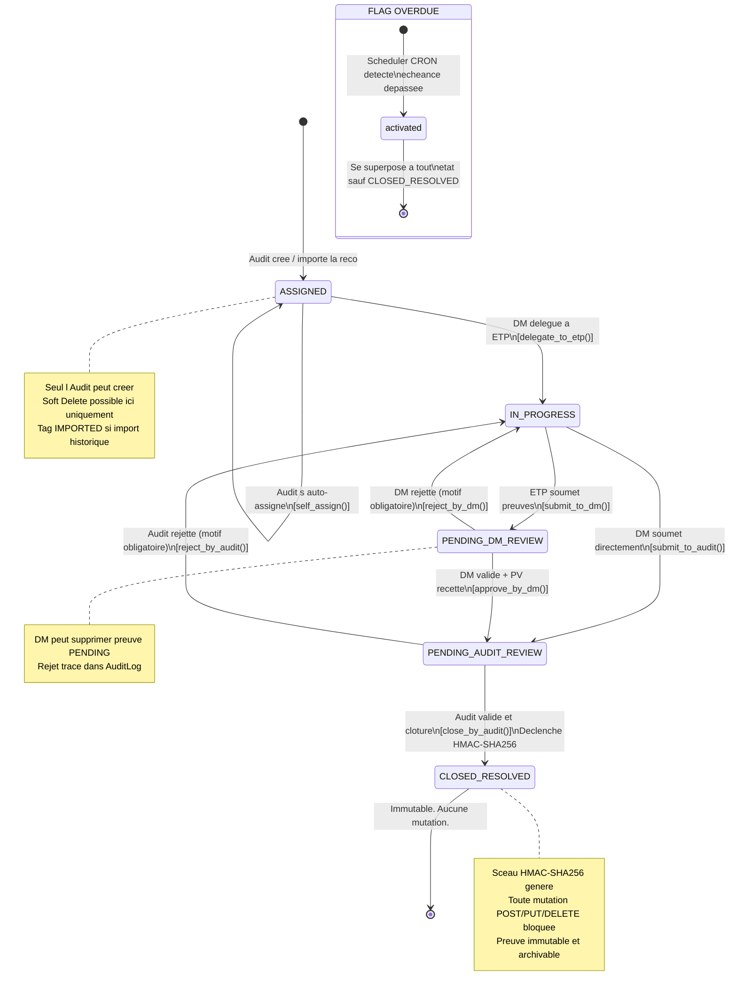
```mermaid
stateDiagram-v2
    [*] --> ASSIGNED : Audit cree / importe la reco

    state "ASSIGNED" as ASSIGNED
    state "IN_PROGRESS" as IN_PROGRESS
    state "PENDING_DM_REVIEW" as PENDING_DM_REVIEW
    state "PENDING_AUDIT_REVIEW" as PENDING_AUDIT_REVIEW
    state "CLOSED_RESOLVED" as CLOSED_RESOLVED

    ASSIGNED --> IN_PROGRESS : DM delegue a ETP\n[delegate_to_etp()]
    ASSIGNED --> ASSIGNED : Audit re-assigne DM\n[reassign_dm()]
    ASSIGNED --> ASSIGNED : Audit s auto-assigne\n[self_assign()]

    IN_PROGRESS --> PENDING_DM_REVIEW : ETP soumet preuves\n[submit_to_dm()]
    IN_PROGRESS --> PENDING_AUDIT_REVIEW : DM soumet directement\n[submit_to_audit()]

    PENDING_DM_REVIEW --> PENDING_AUDIT_REVIEW : DM valide + PV recette\n[approve_by_dm()]
    PENDING_DM_REVIEW --> IN_PROGRESS : DM rejette (motif obligatoire)\n[reject_by_dm()]

    PENDING_AUDIT_REVIEW --> CLOSED_RESOLVED : Audit valide et cloture\n[close_by_audit()]\nDeclenche HMAC-SHA256
    PENDING_AUDIT_REVIEW --> IN_PROGRESS : Audit rejette (motif obligatoire)\n[reject_by_audit()]

    CLOSED_RESOLVED --> [*] : Immutable. Aucune mutation.

    state "FLAG OVERDUE" as OVERDUE_NOTE {
        [*] --> activated : Scheduler CRON detecte\necheance depassee
        activated --> [*] : Se superpose a tout\netat sauf CLOSED_RESOLVED
    }

    note right of ASSIGNED
        Seul l Audit peut creer
        Soft Delete possible ici uniquement
        Tag IMPORTED si import historique
    end note

    note right of PENDING_DM_REVIEW
        DM peut supprimer preuve PENDING
        Rejet trace dans AuditLog
    end note

    note right of CLOSED_RESOLVED
        Sceau HMAC-SHA256 genere
        Toute mutation POST/PUT/DELETE bloquee
        Preuve immutable et archivable
    end note
```

### 3.1 Machine à États de la Preuve (Proof)

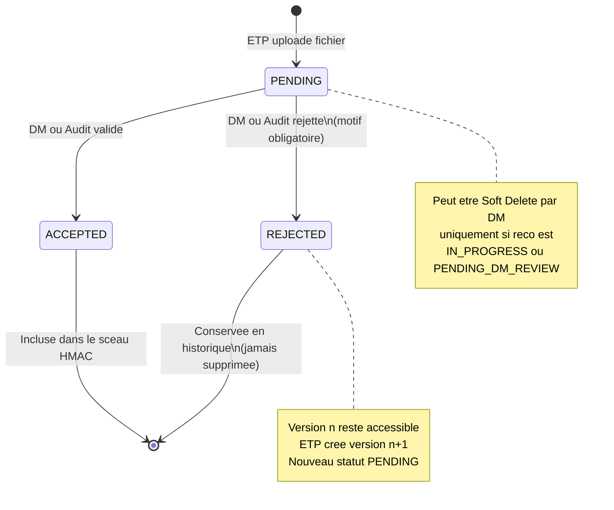
```mermaid
stateDiagram-v2
    [*] --> PENDING : ETP uploade fichier

    PENDING --> ACCEPTED : DM ou Audit valide
    PENDING --> REJECTED : DM ou Audit rejette\n(motif obligatoire)

    REJECTED --> [*] : Conservee en historique\n(jamais supprimee)
    ACCEPTED --> [*] : Incluse dans le sceau HMAC

    note right of PENDING
        Peut etre Soft Delete par DM
        uniquement si reco est
        IN_PROGRESS ou PENDING_DM_REVIEW
    end note

    note right of REJECTED
        Version n reste accessible
        ETP cree version n+1
        Nouveau statut PENDING
    end note
```

### 3.2 Machine à États de la Demande de Report

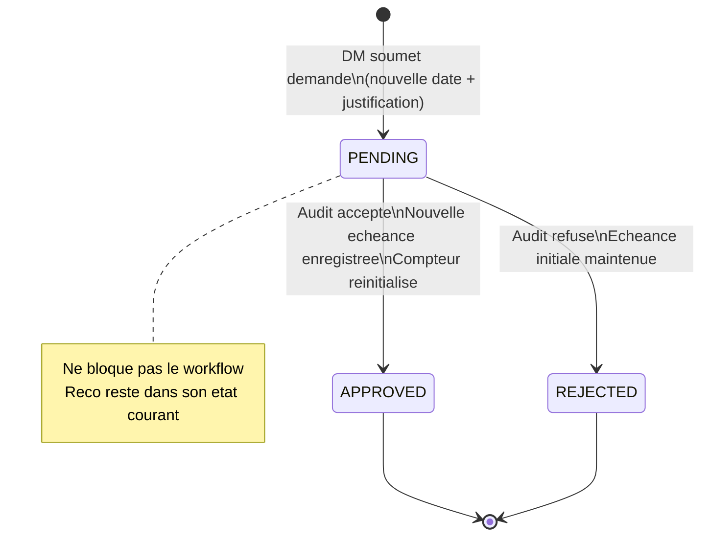
```mermaid
stateDiagram-v2
    [*] --> PENDING : DM soumet demande\n(nouvelle date + justification)

    PENDING --> APPROVED : Audit accepte\nNouvelle echeance enregistree\nCompteur reinitialise
    PENDING --> REJECTED : Audit refuse\nEcheance initiale maintenue

    APPROVED --> [*]
    REJECTED --> [*]

    note right of PENDING
        Ne bloque pas le workflow
        Reco reste dans son etat courant
    end note
```

---

## 4. Diagrammes de Séquence

### 4.1 Happy Path Complet (Assignation → Clôture)

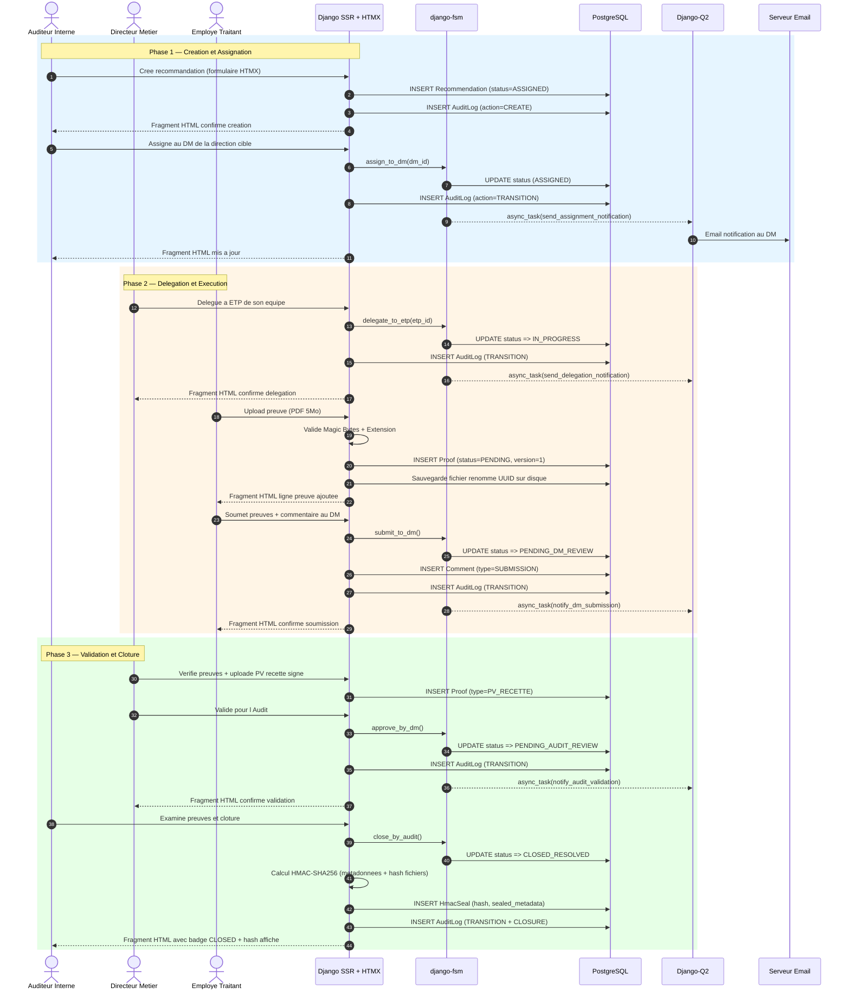
```mermaid
sequenceDiagram
    autonumber
    actor AU as Auditeur Interne
    actor DM as Directeur Metier
    actor ETP as Employe Traitant
    participant APP as Django SSR + HTMX
    participant FSM as django-fsm
    participant DB as PostgreSQL
    participant Q2 as Django-Q2
    participant SMTP as Serveur Email

    rect rgb(230, 245, 255)
        Note over AU, APP: Phase 1 — Creation et Assignation
        AU->>APP: Cree recommandation (formulaire HTMX)
        APP->>DB: INSERT Recommendation (status=ASSIGNED)
        APP->>DB: INSERT AuditLog (action=CREATE)
        APP-->>AU: Fragment HTML confirme creation

        AU->>APP: Assigne au DM de la direction cible
        APP->>FSM: assign_to_dm(dm_id)
        FSM->>DB: UPDATE status (ASSIGNED)
        APP->>DB: INSERT AuditLog (action=TRANSITION)
        FSM-->>Q2: async_task(send_assignment_notification)
        Q2->>SMTP: Email notification au DM
        APP-->>AU: Fragment HTML mis a jour
    end

    rect rgb(255, 245, 230)
        Note over DM, ETP: Phase 2 — Delegation et Execution
        DM->>APP: Delegue a ETP de son equipe
        APP->>FSM: delegate_to_etp(etp_id)
        FSM->>DB: UPDATE status => IN_PROGRESS
        APP->>DB: INSERT AuditLog (TRANSITION)
        FSM-->>Q2: async_task(send_delegation_notification)
        APP-->>DM: Fragment HTML confirme delegation

        ETP->>APP: Upload preuve (PDF 5Mo)
        APP->>APP: Valide Magic Bytes + Extension
        APP->>DB: INSERT Proof (status=PENDING, version=1)
        APP->>DB: Sauvegarde fichier renomme UUID sur disque
        APP-->>ETP: Fragment HTML ligne preuve ajoutee

        ETP->>APP: Soumet preuves + commentaire au DM
        APP->>FSM: submit_to_dm()
        FSM->>DB: UPDATE status => PENDING_DM_REVIEW
        APP->>DB: INSERT Comment (type=SUBMISSION)
        APP->>DB: INSERT AuditLog (TRANSITION)
        FSM-->>Q2: async_task(notify_dm_submission)
        APP-->>ETP: Fragment HTML confirme soumission
    end

    rect rgb(230, 255, 230)
        Note over DM, AU: Phase 3 — Validation et Cloture
        DM->>APP: Verifie preuves + uploade PV recette signe
        APP->>DB: INSERT Proof (type=PV_RECETTE)
        DM->>APP: Valide pour l Audit
        APP->>FSM: approve_by_dm()
        FSM->>DB: UPDATE status => PENDING_AUDIT_REVIEW
        APP->>DB: INSERT AuditLog (TRANSITION)
        FSM-->>Q2: async_task(notify_audit_validation)
        APP-->>DM: Fragment HTML confirme validation

        AU->>APP: Examine preuves et cloture
        APP->>FSM: close_by_audit()
        FSM->>DB: UPDATE status => CLOSED_RESOLVED
        APP->>APP: Calcul HMAC-SHA256 (metadonnees + hash fichiers)
        APP->>DB: INSERT HmacSeal (hash, sealed_metadata)
        APP->>DB: INSERT AuditLog (TRANSITION + CLOSURE)
        APP-->>AU: Fragment HTML avec badge CLOSED + hash affiche
    end
```

### 4.2 Soumission et Validation de Preuve (Détail Technique)

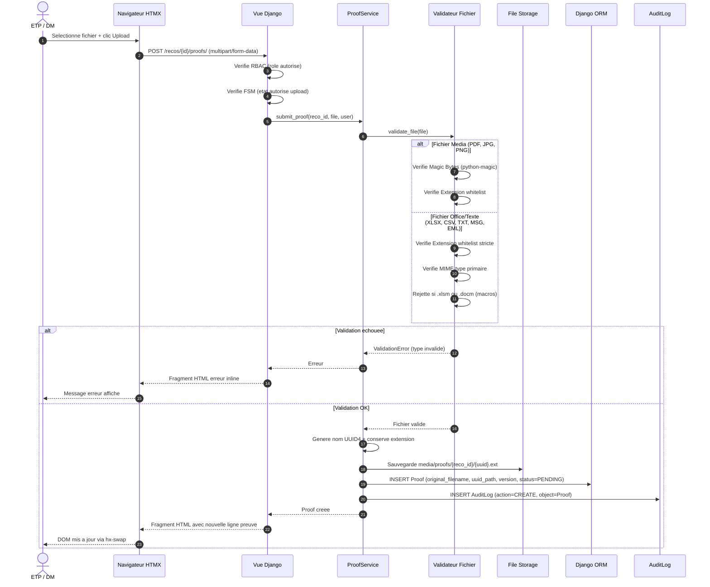
```mermaid
sequenceDiagram
    autonumber
    actor USER as ETP / DM
    participant HTML as Navigateur HTMX
    participant VUE as Vue Django
    participant SVC as ProofService
    participant VALID as Validateur Fichier
    participant DISK as File Storage
    participant ORM as Django ORM
    participant LOG as AuditLog

    USER->>HTML: Selectionne fichier + clic Upload
    HTML->>VUE: POST /recos/{id}/proofs/ (multipart/form-data)

    VUE->>VUE: Verifie RBAC (role autorise)
    VUE->>VUE: Verifie FSM (etat autorise upload)

    VUE->>SVC: submit_proof(reco_id, file, user)
    SVC->>VALID: validate_file(file)

    alt Fichier Media (PDF, JPG, PNG)
        VALID->>VALID: Verifie Magic Bytes (python-magic)
        VALID->>VALID: Verifie Extension whitelist
    else Fichier Office/Texte (XLSX, CSV, TXT, MSG, EML)
        VALID->>VALID: Verifie Extension whitelist stricte
        VALID->>VALID: Verifie MIME type primaire
        VALID->>VALID: Rejette si .xlsm ou .docm (macros)
    end

    alt Validation echouee
        VALID-->>SVC: ValidationError (type invalide)
        SVC-->>VUE: Erreur
        VUE-->>HTML: Fragment HTML erreur inline
        HTML-->>USER: Message erreur affiche
    else Validation OK
        VALID-->>SVC: Fichier valide
        SVC->>SVC: Genere nom UUID4 + conserve extension
        SVC->>DISK: Sauvegarde media/proofs/{reco_id}/{uuid}.ext
        SVC->>ORM: INSERT Proof (original_filename, uuid_path, version, status=PENDING)
        SVC->>LOG: INSERT AuditLog (action=CREATE, object=Proof)
        SVC-->>VUE: Proof creee
        VUE-->>HTML: Fragment HTML avec nouvelle ligne preuve
        HTML-->>USER: DOM mis a jour via hx-swap
    end
```

### 4.3 Rejet et Re-soumission

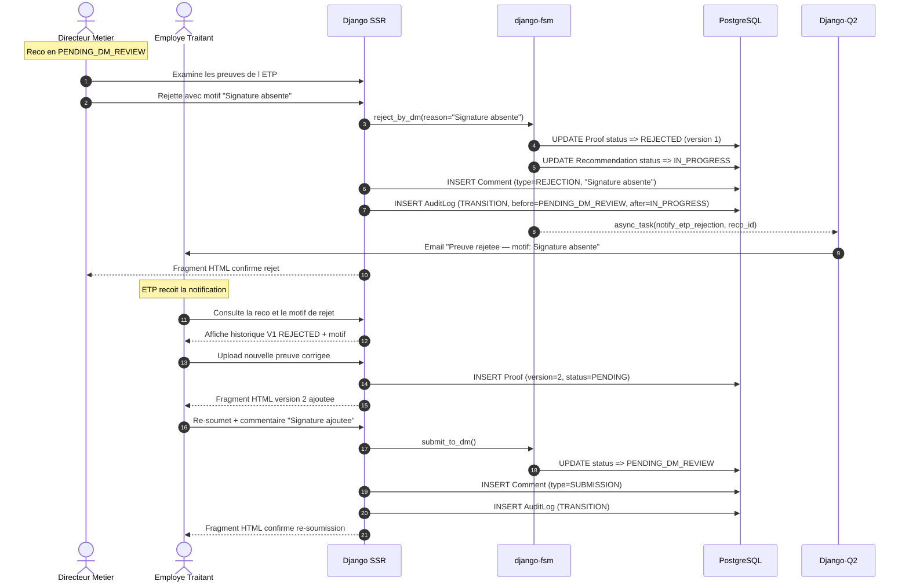
```mermaid
sequenceDiagram
    autonumber
    actor DM as Directeur Metier
    actor ETP as Employe Traitant
    participant APP as Django SSR
    participant FSM as django-fsm
    participant DB as PostgreSQL
    participant Q2 as Django-Q2

    Note over DM: Reco en PENDING_DM_REVIEW

    DM->>APP: Examine les preuves de l ETP
    DM->>APP: Rejette avec motif "Signature absente"
    APP->>FSM: reject_by_dm(reason="Signature absente")
    FSM->>DB: UPDATE Proof status => REJECTED (version 1)
    FSM->>DB: UPDATE Recommendation status => IN_PROGRESS
    APP->>DB: INSERT Comment (type=REJECTION, "Signature absente")
    APP->>DB: INSERT AuditLog (TRANSITION, before=PENDING_DM_REVIEW, after=IN_PROGRESS)
    FSM-->>Q2: async_task(notify_etp_rejection, reco_id)
    Q2->>ETP: Email "Preuve rejetee — motif: Signature absente"
    APP-->>DM: Fragment HTML confirme rejet

    Note over ETP: ETP recoit la notification

    ETP->>APP: Consulte la reco et le motif de rejet
    APP-->>ETP: Affiche historique V1 REJECTED + motif

    ETP->>APP: Upload nouvelle preuve corrigee
    APP->>DB: INSERT Proof (version=2, status=PENDING)
    APP-->>ETP: Fragment HTML version 2 ajoutee

    ETP->>APP: Re-soumet + commentaire "Signature ajoutee"
    APP->>FSM: submit_to_dm()
    FSM->>DB: UPDATE status => PENDING_DM_REVIEW
    APP->>DB: INSERT Comment (type=SUBMISSION)
    APP->>DB: INSERT AuditLog (TRANSITION)
    APP-->>ETP: Fragment HTML confirme re-soumission
```

### 4.4 Demande de Report d'Échéance

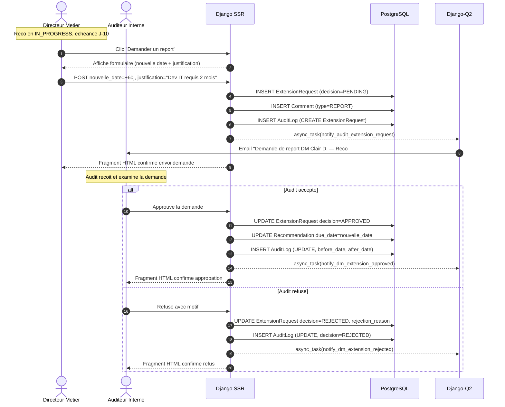
```mermaid
sequenceDiagram
    autonumber
    actor DM as Directeur Metier
    actor AU as Auditeur Interne
    participant APP as Django SSR
    participant DB as PostgreSQL
    participant Q2 as Django-Q2

    Note over DM: Reco en IN_PROGRESS, echeance J-10

    DM->>APP: Clic "Demander un report"
    APP-->>DM: Affiche formulaire (nouvelle date + justification)

    DM->>APP: POST nouvelle_date=+60j, justification="Dev IT requis 2 mois"
    APP->>DB: INSERT ExtensionRequest (decision=PENDING)
    APP->>DB: INSERT Comment (type=REPORT)
    APP->>DB: INSERT AuditLog (CREATE ExtensionRequest)
    APP-->>Q2: async_task(notify_audit_extension_request)
    Q2->>AU: Email "Demande de report DM Clair D. — Reco #42"
    APP-->>DM: Fragment HTML confirme envoi demande

    Note over AU: Audit recoit et examine la demande

    alt Audit accepte
        AU->>APP: Approuve la demande
        APP->>DB: UPDATE ExtensionRequest decision=APPROVED
        APP->>DB: UPDATE Recommendation due_date=nouvelle_date
        APP->>DB: INSERT AuditLog (UPDATE, before_date, after_date)
        APP-->>Q2: async_task(notify_dm_extension_approved)
        APP-->>AU: Fragment HTML confirme approbation
    else Audit refuse
        AU->>APP: Refuse avec motif
        APP->>DB: UPDATE ExtensionRequest decision=REJECTED, rejection_reason
        APP->>DB: INSERT AuditLog (UPDATE, decision=REJECTED)
        APP-->>Q2: async_task(notify_dm_extension_rejected)
        APP-->>AU: Fragment HTML confirme refus
    end
```

### 4.5 Import Historique Atomique

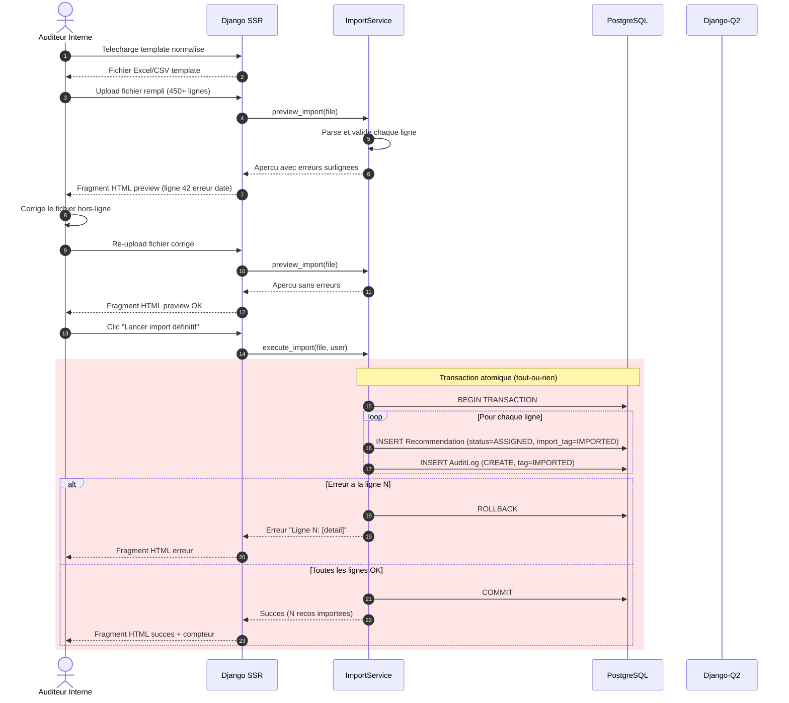
```mermaid
sequenceDiagram
    autonumber
    actor AU as Auditeur Interne
    participant APP as Django SSR
    participant SVC as ImportService
    participant DB as PostgreSQL
    participant Q2 as Django-Q2

    AU->>APP: Telecharge template normalise
    APP-->>AU: Fichier Excel/CSV template

    AU->>APP: Upload fichier rempli (450+ lignes)
    APP->>SVC: preview_import(file)
    SVC->>SVC: Parse et valide chaque ligne
    SVC-->>APP: Apercu avec erreurs surlignees
    APP-->>AU: Fragment HTML preview (ligne 42 erreur date)

    AU->>AU: Corrige le fichier hors-ligne

    AU->>APP: Re-upload fichier corrige
    APP->>SVC: preview_import(file)
    SVC-->>APP: Apercu sans erreurs
    APP-->>AU: Fragment HTML preview OK

    AU->>APP: Clic "Lancer import definitif"
    APP->>SVC: execute_import(file, user)

    rect rgb(255, 230, 230)
        Note over SVC, DB: Transaction atomique (tout-ou-rien)
        SVC->>DB: BEGIN TRANSACTION
        loop Pour chaque ligne
            SVC->>DB: INSERT Recommendation (status=ASSIGNED, import_tag=IMPORTED)
            SVC->>DB: INSERT AuditLog (CREATE, tag=IMPORTED)
        end
        alt Erreur a la ligne N
            SVC->>DB: ROLLBACK
            SVC-->>APP: Erreur "Ligne N: [detail]"
            APP-->>AU: Fragment HTML erreur
        else Toutes les lignes OK
            SVC->>DB: COMMIT
            SVC-->>APP: Succes (N recos importees)
            APP-->>AU: Fragment HTML succes + compteur
        end
    end
```

### 4.6 Cycle de Notifications Asynchrones (Scheduler Nocturne)

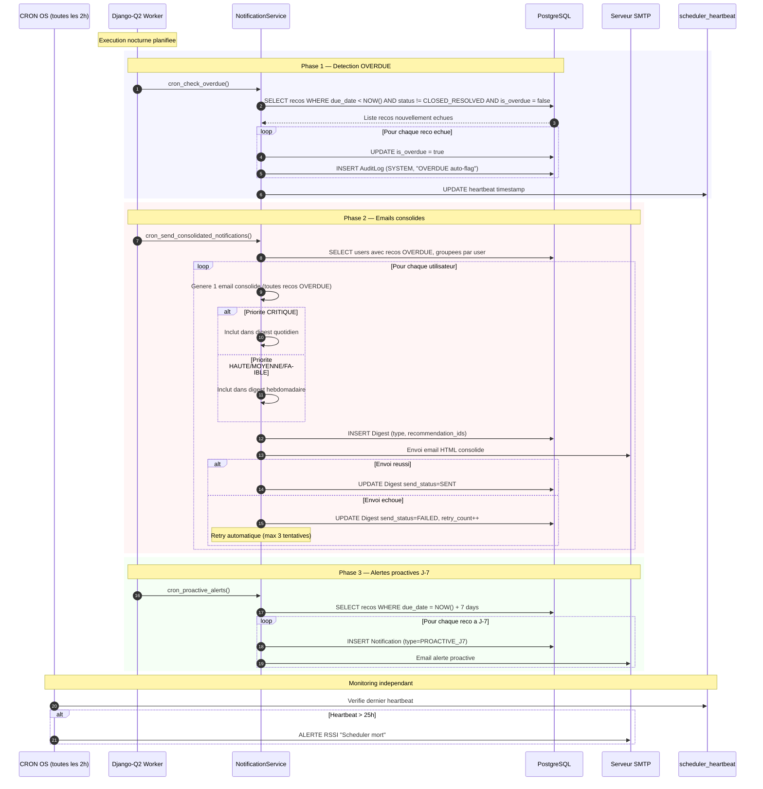
```mermaid
sequenceDiagram
    autonumber
    participant CRON as CRON OS (toutes les 2h)
    participant Q2W as Django-Q2 Worker
    participant SVC as NotificationService
    participant DB as PostgreSQL
    participant SMTP as Serveur SMTP
    participant HB as scheduler_heartbeat

    Note over Q2W: Execution nocturne planifiee

    rect rgb(245, 245, 255)
        Note over Q2W, DB: Phase 1 — Detection OVERDUE
        Q2W->>SVC: cron_check_overdue()
        SVC->>DB: SELECT recos WHERE due_date < NOW() AND status != CLOSED_RESOLVED AND is_overdue = false
        DB-->>SVC: Liste recos nouvellement echues
        loop Pour chaque reco echue
            SVC->>DB: UPDATE is_overdue = true
            SVC->>DB: INSERT AuditLog (SYSTEM, "OVERDUE auto-flag")
        end
        SVC->>HB: UPDATE heartbeat timestamp
    end

    rect rgb(255, 245, 245)
        Note over Q2W, SMTP: Phase 2 — Emails consolides
        Q2W->>SVC: cron_send_consolidated_notifications()
        SVC->>DB: SELECT users avec recos OVERDUE, groupees par user
        loop Pour chaque utilisateur
            SVC->>SVC: Genere 1 email consolide (toutes recos OVERDUE)
            alt Priorite CRITIQUE
                SVC->>SVC: Inclut dans digest quotidien
            else Priorite HAUTE/MOYENNE/FAIBLE
                SVC->>SVC: Inclut dans digest hebdomadaire
            end
            SVC->>DB: INSERT Digest (type, recommendation_ids)
            SVC->>SMTP: Envoi email HTML consolide
            alt Envoi reussi
                SVC->>DB: UPDATE Digest send_status=SENT
            else Envoi echoue
                SVC->>DB: UPDATE Digest send_status=FAILED, retry_count++
                Note over SVC: Retry automatique (max 3 tentatives)
            end
        end
    end

    rect rgb(245, 255, 245)
        Note over Q2W, SMTP: Phase 3 — Alertes proactives J-7
        Q2W->>SVC: cron_proactive_alerts()
        SVC->>DB: SELECT recos WHERE due_date = NOW() + 7 days
        loop Pour chaque reco a J-7
            SVC->>DB: INSERT Notification (type=PROACTIVE_J7)
            SVC->>SMTP: Email alerte proactive
        end
    end

    Note over CRON, HB: Monitoring independant
    CRON->>HB: Verifie dernier heartbeat
    alt Heartbeat > 25h
        CRON->>SMTP: ALERTE RSSI "Scheduler mort"
    end
```

### 4.7 Export ZIP Auditeur Externe (COBAC)

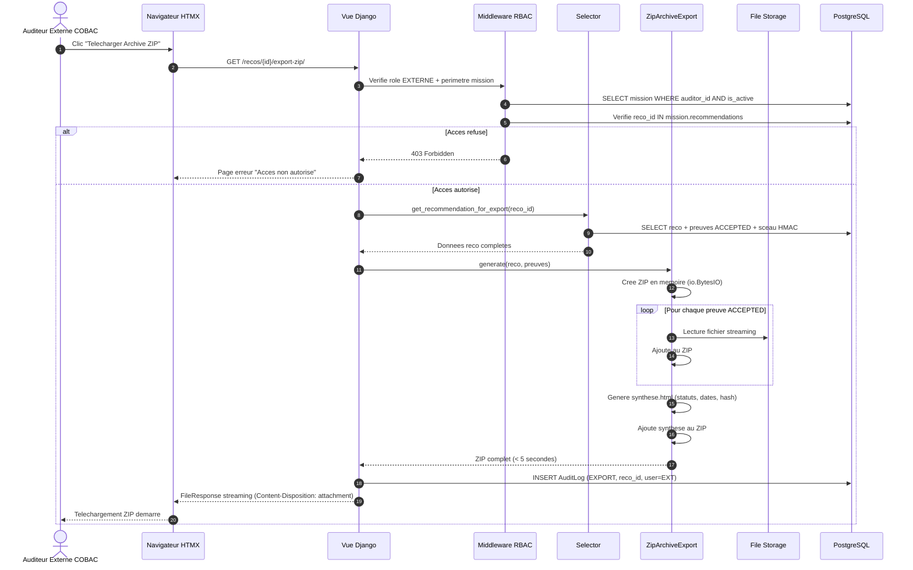
```mermaid
sequenceDiagram
    autonumber
    actor EXT as Auditeur Externe COBAC
    participant HTML as Navigateur HTMX
    participant VUE as Vue Django
    participant RBAC as Middleware RBAC
    participant SEL as Selector
    participant EXP as ZipArchiveExport
    participant DISK as File Storage
    participant DB as PostgreSQL

    EXT->>HTML: Clic "Telecharger Archive ZIP"
    HTML->>VUE: GET /recos/{id}/export-zip/

    VUE->>RBAC: Verifie role EXTERNE + perimetre mission
    RBAC->>DB: SELECT mission WHERE auditor_id AND is_active
    RBAC->>DB: Verifie reco_id IN mission.recommendations

    alt Acces refuse
        RBAC-->>VUE: 403 Forbidden
        VUE-->>HTML: Page erreur "Acces non autorise"
    else Acces autorise
        VUE->>SEL: get_recommendation_for_export(reco_id)
        SEL->>DB: SELECT reco + preuves ACCEPTED + sceau HMAC
        SEL-->>VUE: Donnees reco completes

        VUE->>EXP: generate(reco, preuves)
        EXP->>EXP: Cree ZIP en memoire (io.BytesIO)
        loop Pour chaque preuve ACCEPTED
            EXP->>DISK: Lecture fichier streaming
            EXP->>EXP: Ajoute au ZIP
        end
        EXP->>EXP: Genere synthese.html (statuts, dates, hash)
        EXP->>EXP: Ajoute synthese au ZIP
        EXP-->>VUE: ZIP complet (< 5 secondes)

        VUE->>DB: INSERT AuditLog (EXPORT, reco_id, user=EXT)
        VUE-->>HTML: FileResponse streaming (Content-Disposition: attachment)
        HTML-->>EXT: Telechargement ZIP demarre
    end
```

### 4.8 Authentification et Contrôle de Session

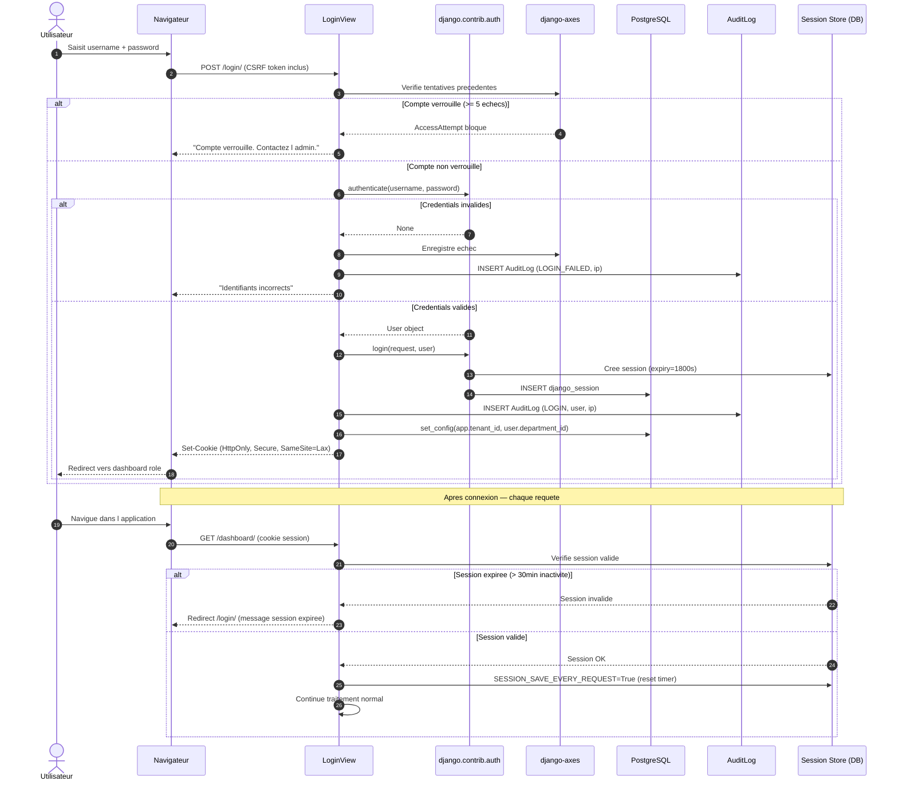
```mermaid
sequenceDiagram
    autonumber
    actor USER as Utilisateur
    participant HTML as Navigateur
    participant VUE as LoginView
    participant AUTH as django.contrib.auth
    participant AXES as django-axes
    participant DB as PostgreSQL
    participant LOG as AuditLog
    participant SESS as Session Store (DB)

    USER->>HTML: Saisit username + password
    HTML->>VUE: POST /login/ (CSRF token inclus)

    VUE->>AXES: Verifie tentatives precedentes
    alt Compte verrouille (>= 5 echecs)
        AXES-->>VUE: AccessAttempt bloque
        VUE-->>HTML: "Compte verrouille. Contactez l admin."
    else Compte non verrouille
        VUE->>AUTH: authenticate(username, password)
        alt Credentials invalides
            AUTH-->>VUE: None
            VUE->>AXES: Enregistre echec
            VUE->>LOG: INSERT AuditLog (LOGIN_FAILED, ip)
            VUE-->>HTML: "Identifiants incorrects"
        else Credentials valides
            AUTH-->>VUE: User object
            VUE->>AUTH: login(request, user)
            AUTH->>SESS: Cree session (expiry=1800s)
            AUTH->>DB: INSERT django_session
            VUE->>LOG: INSERT AuditLog (LOGIN, user, ip)
            VUE->>DB: set_config(app.tenant_id, user.department_id)
            VUE-->>HTML: Set-Cookie (HttpOnly, Secure, SameSite=Lax)
            HTML-->>USER: Redirect vers dashboard role
        end
    end

    Note over HTML, SESS: Apres connexion — chaque requete

    USER->>HTML: Navigue dans l application
    HTML->>VUE: GET /dashboard/ (cookie session)
    VUE->>SESS: Verifie session valide
    alt Session expiree (> 30min inactivite)
        SESS-->>VUE: Session invalide
        VUE-->>HTML: Redirect /login/ (message session expiree)
    else Session valide
        SESS-->>VUE: Session OK
        VUE->>SESS: SESSION_SAVE_EVERY_REQUEST=True (reset timer)
        VUE->>VUE: Continue traitement normal
    end
```

---

## 5. Diagrammes de Cas d'Utilisation

### 5.1 Auditeur Interne

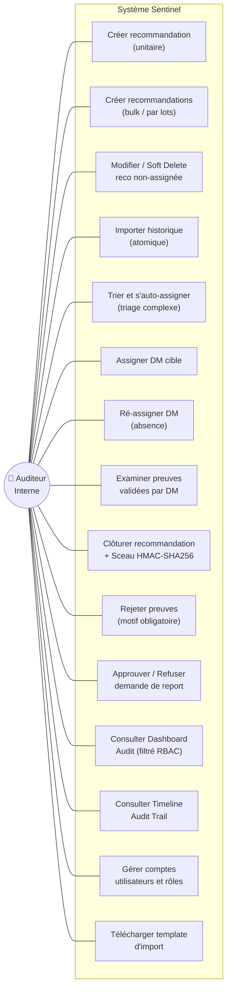
```mermaid
flowchart LR
    subgraph "Système Sentinel"
        UC1["Créer recommandation\n(unitaire)"]
        UC2["Créer recommandations\n(bulk / par lots)"]
        UC3["Modifier / Soft Delete\nreco non-assignée"]
        UC4["Importer historique\n(atomique)"]
        UC5["Trier et s'auto-assigner\n(triage complexe)"]
        UC6["Assigner DM cible"]
        UC7["Ré-assigner DM\n(absence)"]
        UC8["Examiner preuves\nvalidées par DM"]
        UC9["Clôturer recommandation\n+ Sceau HMAC-SHA256"]
        UC10["Rejeter preuves\n(motif obligatoire)"]
        UC11["Approuver / Refuser\ndemande de report"]
        UC12["Consulter Dashboard\nAudit (filtré RBAC)"]
        UC13["Consulter Timeline\nAudit Trail"]
        UC14["Gérer comptes\nutilisateurs et rôles"]
        UC15["Télécharger template\nd'import"]
    end

    AU(("🔵 Auditeur\nInterne"))

    AU --- UC1
    AU --- UC2
    AU --- UC3
    AU --- UC4
    AU --- UC5
    AU --- UC6
    AU --- UC7
    AU --- UC8
    AU --- UC9
    AU --- UC10
    AU --- UC11
    AU --- UC12
    AU --- UC13
    AU --- UC14
    AU --- UC15
```

### 5.2 Directeur Métier (DM)

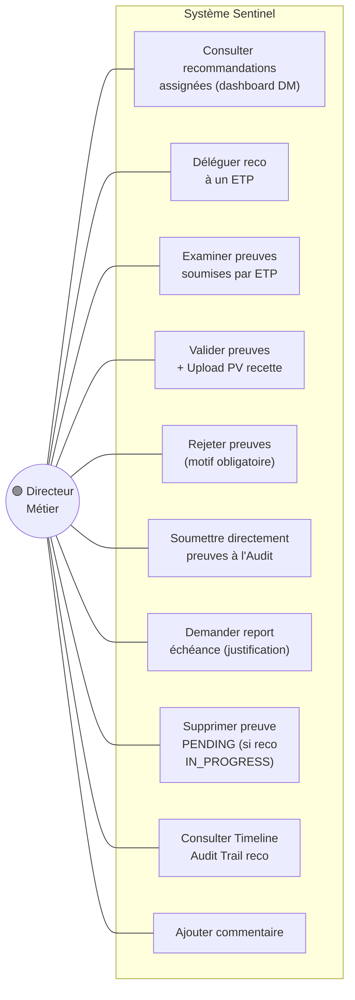
```mermaid
flowchart LR
    subgraph "Système Sentinel"
        UC1["Consulter recommandations\nassignées (dashboard DM)"]
        UC2["Déléguer reco\nà un ETP"]
        UC3["Examiner preuves\nsoumises par ETP"]
        UC4["Valider preuves\n+ Upload PV recette"]
        UC5["Rejeter preuves\n(motif obligatoire)"]
        UC6["Soumettre directement\npreuves à l'Audit"]
        UC7["Demander report\néchéance (justification)"]
        UC8["Supprimer preuve\nPENDING (si reco\nIN_PROGRESS)"]
        UC9["Consulter Timeline\nAudit Trail reco"]
        UC10["Ajouter commentaire"]
    end

    DM(("🟢 Directeur\nMétier"))

    DM --- UC1
    DM --- UC2
    DM --- UC3
    DM --- UC4
    DM --- UC5
    DM --- UC6
    DM --- UC7
    DM --- UC8
    DM --- UC9
    DM --- UC10
```

### 5.3 Employé Traitant (ETP)

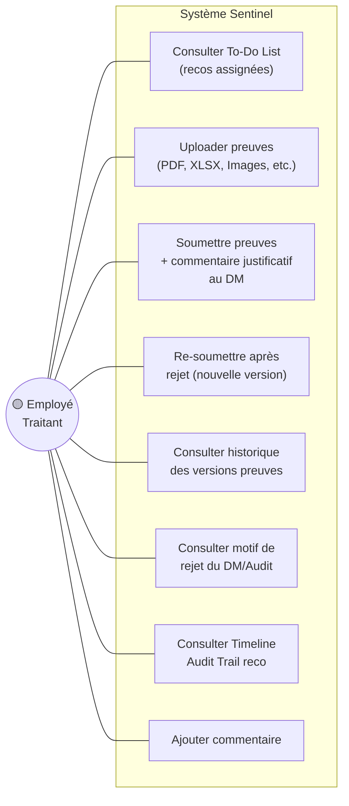
```mermaid
flowchart LR
    subgraph "Système Sentinel"
        UC1["Consulter To-Do List\n(recos assignées)"]
        UC2["Uploader preuves\n(PDF, XLSX, Images, etc.)"]
        UC3["Soumettre preuves\n+ commentaire justificatif\nau DM"]
        UC4["Re-soumettre après\nrejet (nouvelle version)"]
        UC5["Consulter historique\ndes versions preuves"]
        UC6["Consulter motif de\nrejet du DM/Audit"]
        UC7["Consulter Timeline\nAudit Trail reco"]
        UC8["Ajouter commentaire"]
    end

    ETP(("🟡 Employé\nTraitant"))

    ETP --- UC1
    ETP --- UC2
    ETP --- UC3
    ETP --- UC4
    ETP --- UC5
    ETP --- UC6
    ETP --- UC7
    ETP --- UC8
```

### 5.4 Direction Générale (DG)

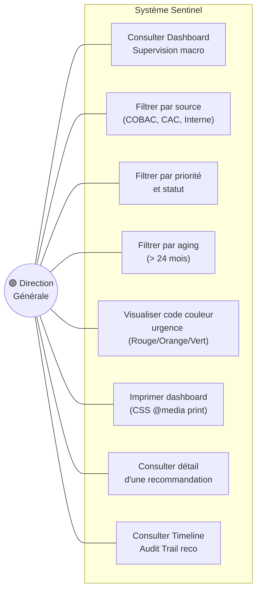
```mermaid
flowchart LR
    subgraph "Système Sentinel"
        UC1["Consulter Dashboard\nSupervision macro"]
        UC2["Filtrer par source\n(COBAC, CAC, Interne)"]
        UC3["Filtrer par priorité\net statut"]
        UC4["Filtrer par aging\n(> 24 mois)"]
        UC5["Visualiser code couleur\nurgence (Rouge/Orange/Vert)"]
        UC6["Imprimer dashboard\n(CSS @media print)"]
        UC7["Consulter détail\nd'une recommandation"]
        UC8["Consulter Timeline\nAudit Trail reco"]
    end

    DG(("🟣 Direction\nGénérale"))

    DG --- UC1
    DG --- UC2
    DG --- UC3
    DG --- UC4
    DG --- UC5
    DG --- UC6
    DG --- UC7
    DG --- UC8
```

### 5.5 Auditeur Externe (COBAC / BEAC / CAC)

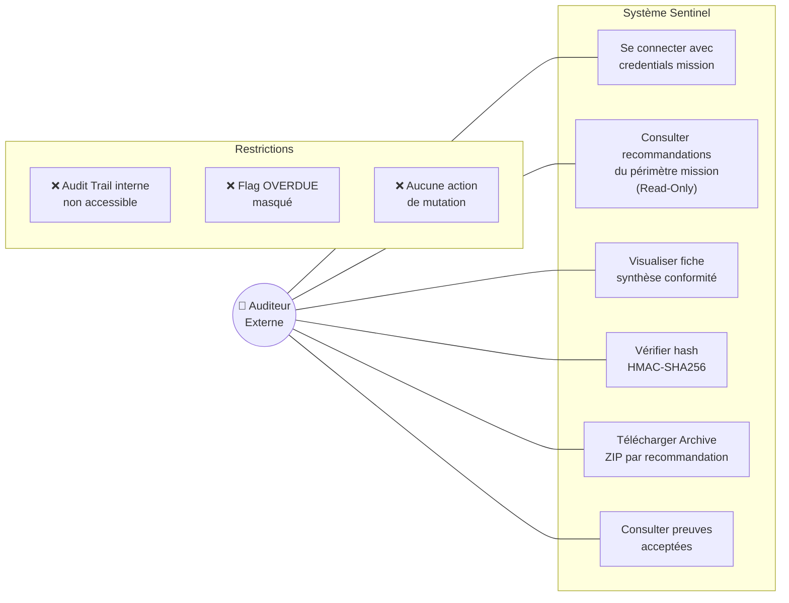
```mermaid
flowchart LR
    subgraph "Système Sentinel"
        UC1["Se connecter avec\ncredentials mission"]
        UC2["Consulter recommandations\ndu périmètre mission\n(Read-Only)"]
        UC3["Visualiser fiche\nsynthèse conformité"]
        UC4["Vérifier hash\nHMAC-SHA256"]
        UC5["Télécharger Archive\nZIP par recommandation"]
        UC6["Consulter preuves\nacceptées"]
    end

    subgraph "Restrictions"
        R1["❌ Audit Trail interne\nnon accessible"]
        R2["❌ Flag OVERDUE\nmasqué"]
        R3["❌ Aucune action\nde mutation"]
    end

    EXT(("🔴 Auditeur\nExterne"))

    EXT --- UC1
    EXT --- UC2
    EXT --- UC3
    EXT --- UC4
    EXT --- UC5
    EXT --- UC6
```

### 5.6 RSSI / Administrateur Système

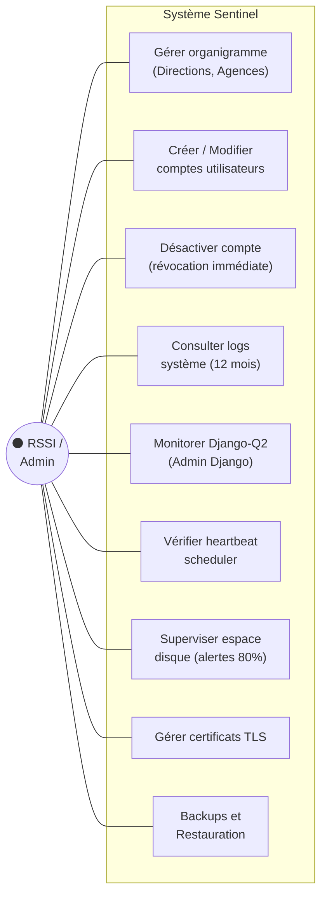
```mermaid
flowchart LR
    subgraph "Système Sentinel"
        UC1["Gérer organigramme\n(Directions, Agences)"]
        UC2["Créer / Modifier\ncomptes utilisateurs"]
        UC3["Désactiver compte\n(révocation immédiate)"]
        UC4["Consulter logs\nsystème (12 mois)"]
        UC5["Monitorer Django-Q2\n(Admin Django)"]
        UC6["Vérifier heartbeat\nscheduler"]
        UC7["Superviser espace\ndisque (alertes 80%)"]
        UC8["Gérer certificats TLS"]
        UC9["Backups et\nRestauration"]
    end

    RSSI(("⚫ RSSI /\nAdmin"))

    RSSI --- UC1
    RSSI --- UC2
    RSSI --- UC3
    RSSI --- UC4
    RSSI --- UC5
    RSSI --- UC6
    RSSI --- UC7
    RSSI --- UC8
    RSSI --- UC9
```

---

## 6. Diagramme de Classes

Architecture Clean (HackSoft Styleguide) avec les couches Models → Selectors → Services → Views.

```mermaid
classDiagram
    direction TB

    %% ===== DOMAIN: USERS =====
    namespace UsersApp {
        class Department {
            +UUID id
            +String name
            +String code
            +String type
            +Department parent
            +Boolean is_active
            +DateTime created_at
            +DateTime updated_at
            +get_children() List~Department~
            +get_full_hierarchy() List~Department~
        }

        class User {
            +UUID id
            +String username
            +String email
            +String first_name
            +String last_name
            +String role
            +Department department
            +Boolean is_active
            +DateTime last_login
            +DateTime date_joined
            +has_role(role_name) Boolean
            +get_accessible_departments() QuerySet
        }

        class ExternalMission {
            +UUID id
            +User auditor
            +String organization
            +String scope_description
            +Date start_date
            +Date end_date
            +Boolean is_active
            +ManyToMany recommendations
        }

        class UserSelector {
            +get_users_by_direction(dept_id) QuerySet
            +get_active_dm_for_direction(dept_id) QuerySet
            +get_etp_for_dm(dm_user) QuerySet
            +get_user_permissions(user) Dict
        }

        class UserService {
            +create_user(data) User
            +update_user_role(user_id, role) User
            +deactivate_user(user_id) None
            +invalidate_all_sessions(user_id) None
        }

        class RBACPermission {
            +check_permission(user, action, obj) Boolean
            +get_allowed_transitions(user, reco) List
            +inject_tenant_context(user) None
        }
    }

    %% ===== DOMAIN: WORKFLOW =====
    namespace WorkflowApp {
        class Recommendation {
            +UUID id
            +String title
            +Text description
            +SourceEnum source
            +PriorityEnum priority
            +FSMField status
            +Boolean is_overdue
            +Date due_date
            +Date original_due_date
            +User created_by
            +User assigned_dm
            +User assigned_etp
            +Department department
            +String import_tag
            +Boolean is_deleted
            +assign_to_dm(dm) void
            +delegate_to_etp(etp) void
            +submit_to_dm() void
            +submit_to_audit() void
            +approve_by_dm() void
            +reject_by_dm(reason) void
            +close_by_audit() void
            +reject_by_audit(reason) void
        }

        class Proof {
            +UUID id
            +Recommendation recommendation
            +User uploaded_by
            +String original_filename
            +String file_path
            +String content_type
            +Integer file_size_bytes
            +StatusEnum status
            +Integer version
            +String rejection_reason
            +ProofTypeEnum proof_type
            +DateTime created_at
        }

        class Comment {
            +UUID id
            +Recommendation recommendation
            +User author
            +Text content
            +CommentTypeEnum type
            +DateTime created_at
        }

        class ExtensionRequest {
            +UUID id
            +Recommendation recommendation
            +User requested_by
            +User decided_by
            +Date new_due_date
            +Text justification
            +DecisionEnum decision
            +Text rejection_reason
            +DateTime decided_at
        }

        class RecommendationSelector {
            +for_tenant(user) QuerySet
            +for_direction(dept_id) QuerySet
            +for_external_mission(mission_id) QuerySet
            +get_overdue_recommendations(user) QuerySet
            +get_dashboard_stats(user) Dict
            +get_by_status(status, user) QuerySet
            +get_aging_over_24months(user) QuerySet
        }

        class WorkflowService {
            +create_recommendation(data, user) Recommendation
            +bulk_create(data_list, user) List
            +soft_delete(reco_id, user) None
            +assign_dm(reco_id, dm_id, user) None
            +delegate_etp(reco_id, etp_id, user) None
            +reassign_dm(reco_id, new_dm_id, user) None
        }

        class ProofService {
            +submit_proof(reco_id, file, user) Proof
            +validate_file(file) Boolean
            +soft_delete_proof(proof_id, user) None
        }

        class ImportService {
            +preview_import(file) PreviewResult
            +execute_import(file, user) ImportResult
            +download_template() FileResponse
        }

        class ExtensionService {
            +request_extension(reco_id, data, user) ExtensionRequest
            +approve_extension(ext_id, user) None
            +reject_extension(ext_id, reason, user) None
        }
    }

    %% ===== DOMAIN: AUDIT =====
    namespace AuditApp {
        class AuditLog {
            +UUID id
            +User user
            +ActionEnum action
            +String content_type
            +UUID object_id
            +JSONB changes
            +IPAddress ip_address
            +String description
            +DateTime created_at
        }

        class HmacSeal {
            +UUID id
            +Recommendation recommendation
            +String hmac_hash
            +JSONB sealed_metadata
            +JSONB file_hashes
            +User sealed_by
            +DateTime sealed_at
        }

        class CryptoService {
            +generate_hmac_seal(reco) HmacSeal
            +verify_hmac_seal(reco) Boolean
            +compute_file_hash(file_path) String
        }

        class ExportStrategy {
            <<interface>>
            +generate(reco, preuves) BytesIO
        }

        class ZipArchiveExport {
            +generate(reco, preuves) BytesIO
        }

        class AuditTrailSelector {
            +get_timeline(reco_id) QuerySet
            +get_logs_by_user(user_id) QuerySet
            +get_system_logs(days) QuerySet
        }
    }

    %% ===== DOMAIN: NOTIFICATIONS =====
    namespace NotificationsApp {
        class Notification {
            +UUID id
            +User user
            +Recommendation recommendation
            +NotifTypeEnum type
            +ChannelEnum channel
            +StatusEnum send_status
            +Integer retry_count
            +DateTime scheduled_at
            +DateTime sent_at
            +Boolean is_read
        }

        class Digest {
            +UUID id
            +User user
            +DigestTypeEnum digest_type
            +JSONB recommendation_ids
            +StatusEnum send_status
            +DateTime scheduled_at
            +DateTime sent_at
        }

        class NotificationTask {
            +cron_check_overdue() None
            +cron_send_consolidated_notifications() None
            +cron_proactive_alerts() None
            +send_single_notification(notif_id) None
        }

        class EmailService {
            +send_consolidated_email(user, recos) Boolean
            +send_proactive_alert(user, reco) Boolean
            +send_assignment_notification(reco) Boolean
        }
    }

    %% ===== ENUMS =====
    namespace Enumerations {
        class SourceEnum {
            <<enumeration>>
            INTERNE
            COBAC
            BEAC
            CAC
            NIF
            CONSULTANT
        }

        class PriorityEnum {
            <<enumeration>>
            CRITIQUE
            HAUTE
            MOYENNE
            FAIBLE
        }

        class RecoStatusEnum {
            <<enumeration>>
            ASSIGNED
            IN_PROGRESS
            PENDING_DM_REVIEW
            PENDING_AUDIT_REVIEW
            CLOSED_RESOLVED
        }

        class ProofStatusEnum {
            <<enumeration>>
            PENDING
            ACCEPTED
            REJECTED
        }
    }

    %% ===== RELATIONSHIPS =====
    User "*" --> "1" Department : belongs to
    Department "0..1" --> "0..*" Department : parent
    ExternalMission "*" --> "1" User : auditor
    ExternalMission "*" --> "*" Recommendation : scoped to

    Recommendation "*" --> "1" Department : department
    Recommendation "*" --> "1" User : created_by
    Recommendation "*" --> "0..1" User : assigned_dm
    Recommendation "*" --> "0..1" User : assigned_etp
    Proof "*" --> "1" Recommendation : belongs to
    Proof "*" --> "1" User : uploaded_by
    Comment "*" --> "1" Recommendation : belongs to
    Comment "*" --> "1" User : author
    ExtensionRequest "*" --> "1" Recommendation : for
    ExtensionRequest "*" --> "1" User : requested_by
    ExtensionRequest "*" --> "0..1" User : decided_by

    AuditLog "*" --> "1" User : performed by
    HmacSeal "1" --> "1" Recommendation : seals
    HmacSeal "*" --> "1" User : sealed_by

    Notification "*" --> "1" User : for
    Notification "*" --> "0..1" Recommendation : about
    Digest "*" --> "1" User : for

    Recommendation ..> SourceEnum : uses
    Recommendation ..> PriorityEnum : uses
    Recommendation ..> RecoStatusEnum : FSM status
    Proof ..> ProofStatusEnum : uses

    ExportStrategy <|.. ZipArchiveExport : implements

    RecommendationSelector ..> Recommendation : reads
    WorkflowService ..> Recommendation : writes
    ProofService ..> Proof : writes
    CryptoService ..> HmacSeal : creates
    NotificationTask ..> Notification : creates
    NotificationTask ..> EmailService : uses
    AuditTrailSelector ..> AuditLog : reads
    UserSelector ..> User : reads
    UserService ..> User : writes
    RBACPermission ..> User : checks
    ImportService ..> WorkflowService : uses
    ExtensionService ..> ExtensionRequest : manages
```

---

## Annexe : Légende des Diagrammes

| Symbole | Signification |
|---|---|
| **FSM** | Finite State Machine (`django-fsm`) |
| **RBAC** | Role-Based Access Control (applicatif) |
| **RLS** | Row-Level Security (PostgreSQL) |
| **HMAC-SHA256** | Hash-based Message Authentication Code |
| **Q2** | Django-Q2 (Task Queue asynchrone) |
| **SSR** | Server-Side Rendering (Templates Django) |
| **HTMX** | Hypermedia framework (échanges HTML, pas JSON) |

---

> **Cohérence assurée avec :**
> - PRD v2 : 31 FRs, 13 NFRs
> - Architecture.md : ADR-01 à ADR-08, Clean Architecture HackSoft
> - Product Brief v2 : 6 rôles, 5 piliers fonctionnels
