# Sentinel — Diagrammes Système

> **Version :** 2.0 — resynchronisé sur le code implémenté
> **Date :** 2026-06-19 (révision) · base initiale 2026-03-31
> **Sources :** code `code/apps/*` (source de vérité), PRD v2, Architecture v2, Product Brief v2
> **Format :** Mermaid (compatible GitLab, GitHub, VS Code Preview)
>
> **Note de révision (v2) :** les diagrammes ont été réalignés sur l'implémentation réelle :
> FSM à **6 états** (dont `DRAFT`), modèle de preuves en **2 tables**
> (`EvidenceSubmission` + `EvidenceFile`), **référentiels paramétrables**
> (`RecommendationSource`, `OrgUnitType`), **provisioning Maker/Checker**
> (`UserProvisioningRequest`), **livrables** (`Deliverable`), **lots d'import**
> (`ImportBatch`) et **notifications in-app idempotentes**. Les éléments non encore
> implémentés (export ZIP, import historique, intérims, e-mail) sont marqués
> explicitement « **(backlog)** ».

---

## Table des Matières

1. [Modèle Conceptuel de Données (MCD)](#1-modèle-conceptuel-de-données-mcd)
2. [Entity-Relationship Diagram (ERD)](#2-entity-relationship-diagram-erd)
3. [Diagramme de Machine à États (FSM)](#3-diagramme-de-machine-à-états-fsm)
4. [Diagrammes de Séquence](#4-diagrammes-de-séquence)
   - 4.1 Happy Path complet
   - 4.2 Soumission et Validation de Preuve
   - 4.3 Rejet et Re-soumission
   - 4.4 Demande de Report d'Échéance
   - 4.5 Import Massif en DRAFT (Story 6.5) — Import Historique (Story 6.8, backlog)
   - 4.6 Cycle de Notifications In-App (Scheduler Nocturne)
   - 4.7 Export ZIP Auditeur Externe (Story 6.7 — à implémenter)
   - 4.8 Authentification et Contrôle de Session
   - 4.9 Provisioning des Comptes — Maker / Checker (Story 6.2.0)
5. [Diagrammes de Cas d'Utilisation](#5-diagrammes-de-cas-dutilisation)
   - 5.1 Auditeur Interne
   - 5.2 Directeur Métier (DM)
   - 5.3 Employé Traitant (ETP)
   - 5.4 Direction Générale (DG)
   - 5.5 Auditeur Externe
   - 5.6 Admin IT
   - 5.7 Checker / Administrateur Sentinel
6. [Diagramme de Classes](#6-diagramme-de-classes)
7. [Diagramme d'Architecture Logicielle](#7-diagramme-darchitecture-logicielle)
8. [Diagramme d'Architecture Physique (Déploiement)](#8-diagramme-darchitecture-physique-déploiement)
9. [Cycle de vie d'une recommandation (synthèse pour mémoire)](#9-cycle-de-vie-dune-recommandation-synthèse-pour-mémoire)
10. [Architecture logicielle — Vue 3 couches](#10-architecture-logicielle--vue-3-couches)

---

## 1. Modèle Conceptuel de Données (MCD)

Le MCD représente les entités métier de Sentinel et leurs relations conceptuelles.

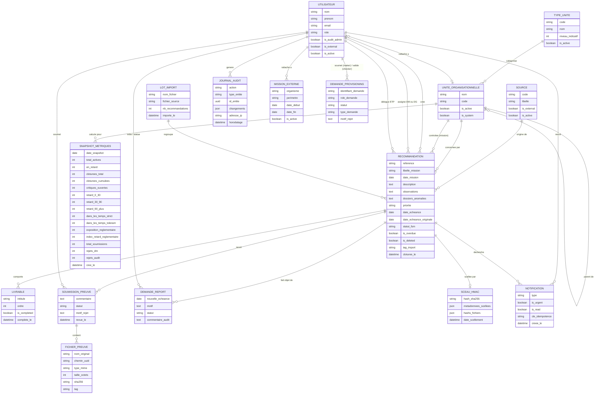
```mermaid
erDiagram
    UTILISATEUR {
        string nom
        string prenom
        string email
        string role
        boolean is_audit_admin
        boolean is_external
        boolean is_active
    }

    TYPE_UNITE {
        string code
        string nom
        int niveau_indicatif
        boolean is_active
    }

    UNITE_ORGANISATIONNELLE {
        string nom
        string code
        boolean is_active
        boolean is_system
    }

    SOURCE {
        string code
        string libelle
        boolean is_external
        boolean is_active
    }

    RECOMMANDATION {
        string reference
        string libelle_mission
        date date_mission
        text description
        text observations
        text dossiers_anomalies
        string priorite
        date date_echeance
        date date_echeance_originale
        string statut_fsm
        boolean is_overdue
        boolean is_deleted
        string tag_import
        datetime cloturee_le
    }

    LIVRABLE {
        string intitule
        int ordre
        boolean is_completed
        datetime complete_le
    }

    SOUMISSION_PREUVE {
        text commentaire
        string statut
        text motif_rejet
        datetime revue_le
    }

    FICHIER_PREUVE {
        string nom_original
        string chemin_uuid
        string type_mime
        int taille_octets
        string sha256
        string tag
    }

    DEMANDE_REPORT {
        date nouvelle_echeance
        text motif
        string statut
        text commentaire_audit
    }

    LOT_IMPORT {
        string nom_fichier
        string fichier_source
        int nb_recommandations
        datetime importe_le
    }

    JOURNAL_AUDIT {
        string action
        string type_entite
        uuid id_entite
        json changements
        string adresse_ip
        datetime horodatage
    }

    SCEAU_HMAC {
        string hash_sha256
        json metadonnees_scellees
        json hashs_fichiers
        datetime date_scellement
    }

    NOTIFICATION {
        string type
        boolean is_urgent
        boolean is_read
        string cle_idempotence
        datetime creee_le
    }

    SNAPSHOT_METRIQUES {
        date date_snapshot
        int total_actives
        int en_retard
        int cloturees_total
        int cloturees_cumulees
        int critiques_ouvertes
        int retard_0_30
        int retard_30_90
        int retard_90_plus
        int dans_les_temps_strict
        int dans_les_temps_tolerant
        int exposition_reglementaire
        int index_retard_reglementaire
        int total_soumissions
        int rejets_dm
        int rejets_audit
        datetime cree_le
    }

    MISSION_EXTERNE {
        string organisme
        string perimetre
        date date_debut
        date date_fin
        boolean is_active
    }

    DEMANDE_PROVISIONING {
        string identifiant_demande
        string role_demande
        string statut
        string type_demande
        text motif_rejet
    }

    TYPE_UNITE ||--o{ UNITE_ORGANISATIONNELLE : "categorise"
    UNITE_ORGANISATIONNELLE ||--o{ UNITE_ORGANISATIONNELLE : "parent de"
    UTILISATEUR }o--o| UNITE_ORGANISATIONNELLE : "rattache a"
    SOURCE ||--o{ RECOMMANDATION : "origine de"
    UNITE_ORGANISATIONNELLE ||--o{ RECOMMANDATION : "concernee par"
    UNITE_ORGANISATIONNELLE ||--o{ RECOMMANDATION : "controlee (mission)"
    UTILISATEUR ||--o{ RECOMMANDATION : "cree"
    UTILISATEUR ||--o{ RECOMMANDATION : "assigne DM ou DG"
    UTILISATEUR ||--o{ RECOMMANDATION : "delegue ETP"
    LOT_IMPORT ||--o{ RECOMMANDATION : "regroupe"
    RECOMMANDATION ||--o{ LIVRABLE : "comporte"
    RECOMMANDATION ||--o{ SOUMISSION_PREUVE : "recoit"
    SOUMISSION_PREUVE ||--o{ FICHIER_PREUVE : "contient"
    UTILISATEUR ||--o{ SOUMISSION_PREUVE : "soumet"
    RECOMMANDATION ||--o{ DEMANDE_REPORT : "fait objet de"
    UTILISATEUR ||--o{ DEMANDE_REPORT : "initie / statue"
    RECOMMANDATION ||--o| SCEAU_HMAC : "scellee par"
    UTILISATEUR ||--o{ JOURNAL_AUDIT : "genere"
    UTILISATEUR ||--o{ NOTIFICATION : "recoit"
    RECOMMANDATION ||--o{ NOTIFICATION : "declenche"
    UNITE_ORGANISATIONNELLE ||--o{ SNAPSHOT_METRIQUES : "calcule pour"
    UTILISATEUR ||--o{ MISSION_EXTERNE : "rattache a"
    UTILISATEUR ||--o{ DEMANDE_PROVISIONING : "soumet (maker) / valide (checker)"
```

> **Note :** la relation M2M `MISSION_EXTERNE → RECOMMANDATION` (cloisonnement de
> périmètre des auditeurs externes) n'est pas encore implémentée — **(backlog)**.

---

## 2. Entity-Relationship Diagram (ERD)

L'ERD détaille la structure complète de la base de données de Sentinel.

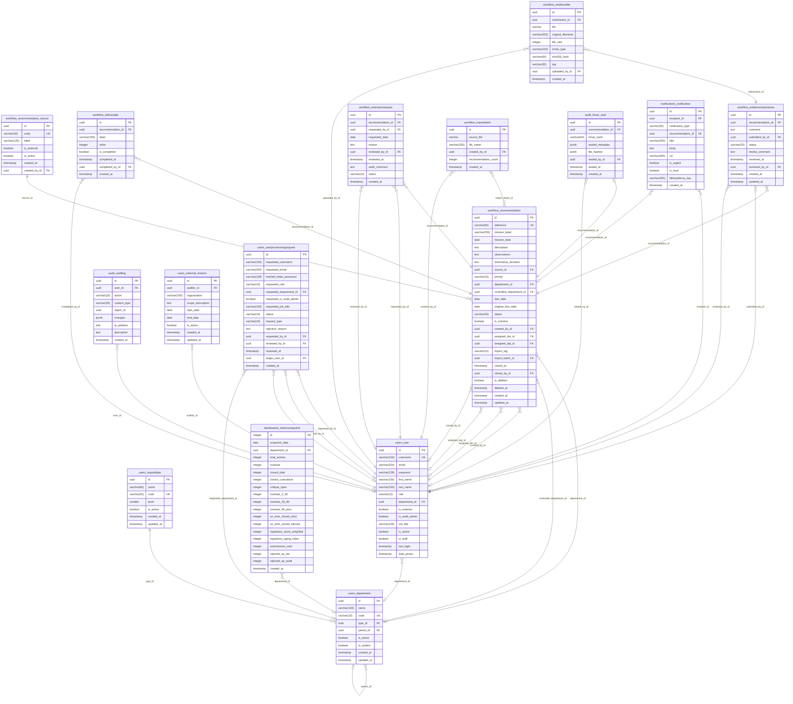
```mermaid
erDiagram
    users_orgunittype {
        uuid id PK
        varchar(60) name
        varchar(20) code UK
        smallint level
        boolean is_active
        timestamp created_at
        timestamp updated_at
    }

    users_department {
        uuid id PK
        varchar(100) name
        varchar(10) code UK
        uuid type_id FK
        uuid parent_id FK
        boolean is_active
        boolean is_system
        timestamp created_at
        timestamp updated_at
    }

    users_user {
        uuid id PK
        varchar(150) username UK
        varchar(254) email
        varchar(128) password
        varchar(150) first_name
        varchar(150) last_name
        varchar(10) role
        uuid department_id FK
        boolean is_external
        boolean is_audit_admin
        varchar(100) job_title
        boolean is_active
        boolean is_staff
        timestamp last_login
        timestamp date_joined
    }

    workflow_recommendation_source {
        uuid id PK
        varchar(30) code UK
        varchar(120) label
        boolean is_external
        boolean is_active
        timestamp created_at
        uuid created_by_id FK
    }

    workflow_recommendation {
        uuid id PK
        varchar(50) reference UK
        varchar(255) mission_label
        date mission_date
        text description
        text observations
        text anomalous_dossiers
        uuid source_id FK
        varchar(10) priority
        uuid department_id FK
        uuid controlled_department_id FK
        date due_date
        date original_due_date
        varchar(30) status
        boolean is_overdue
        uuid created_by_id FK
        uuid assigned_dm_id FK
        uuid assigned_etp_id FK
        varchar(10) import_tag
        uuid import_batch_id FK
        timestamp closed_at
        uuid closed_by_id FK
        boolean is_deleted
        timestamp deleted_at
        timestamp created_at
        timestamp updated_at
    }

    workflow_deliverable {
        uuid id PK
        uuid recommendation_id FK
        varchar(255) label
        integer order
        boolean is_completed
        timestamp completed_at
        uuid completed_by_id FK
        timestamp created_at
    }

    workflow_evidencesubmission {
        uuid id PK
        uuid recommendation_id FK
        text comment
        uuid submitted_by_id FK
        varchar(20) status
        text review_comment
        timestamp reviewed_at
        uuid reviewed_by_id FK
        timestamp created_at
        timestamp updated_at
    }

    workflow_evidencefile {
        uuid id PK
        uuid submission_id FK
        varchar file
        varchar(255) original_filename
        integer file_size
        varchar(100) mime_type
        varchar(64) sha256_hash
        varchar(20) tag
        uuid uploaded_by_id FK
        timestamp created_at
    }

    workflow_extensionrequest {
        uuid id PK
        uuid recommendation_id FK
        uuid requested_by_id FK
        date requested_date
        text reason
        uuid reviewed_by_id FK
        timestamp reviewed_at
        text audit_comment
        varchar(10) status
        timestamp created_at
    }

    workflow_importbatch {
        uuid id PK
        varchar source_file
        varchar(255) file_name
        uuid created_by_id FK
        integer recommendation_count
        timestamp created_at
    }

    audit_auditlog {
        uuid id PK
        uuid user_id FK
        varchar(20) action
        varchar(50) content_type
        uuid object_id
        jsonb changes
        inet ip_address
        text description
        timestamp created_at
    }

    audit_hmac_seal {
        uuid id PK
        uuid recommendation_id FK
        varchar(64) hmac_hash
        jsonb sealed_metadata
        jsonb file_hashes
        uuid sealed_by_id FK
        timestamp sealed_at
        timestamp created_at
    }

    notifications_notification {
        uuid id PK
        uuid recipient_id FK
        varchar(30) notification_type
        uuid recommendation_id FK
        varchar(200) title
        text body
        varchar(500) url
        boolean is_urgent
        boolean is_read
        varchar(255) idempotency_key
        timestamp created_at
    }

    dashboards_metricssnapshot {
        integer id PK
        date snapshot_date
        uuid department_id FK
        integer total_actives
        integer overdue
        integer closed_total
        integer closed_cumulative
        integer critique_open
        integer overdue_0_30
        integer overdue_30_90
        integer overdue_90_plus
        integer on_time_closed_strict
        integer on_time_closed_tolerant
        integer regulatory_stock_weighted
        integer regulatory_aging_index
        integer submissions_total
        integer rejected_by_dm
        integer rejected_by_audit
        timestamp created_at
    }

    users_external_mission {
        uuid id PK
        uuid auditor_id FK
        varchar(100) organization
        text scope_description
        date start_date
        date end_date
        boolean is_active
        timestamp created_at
        timestamp updated_at
    }

    users_userprovisioningrequest {
        uuid id PK
        varchar(150) requested_username
        varchar(254) requested_email
        varchar(128) hashed_initial_password
        varchar(10) requested_role
        uuid requested_department_id FK
        boolean requested_is_audit_admin
        varchar(100) requested_job_title
        varchar(10) status
        varchar(10) request_type
        text rejection_reason
        uuid requested_by_id FK
        uuid reviewed_by_id FK
        timestamp reviewed_at
        uuid target_user_id FK
        timestamp created_at
    }

    %% Relations
    users_orgunittype ||--o{ users_department : "type_id"
    users_user }o--o| users_department : "department_id"
    users_department }o--o| users_department : "parent_id"
    workflow_recommendation_source ||--o{ workflow_recommendation : "source_id"
    workflow_recommendation }o--o| users_department : "department_id"
    workflow_recommendation }o--o| users_department : "controlled_department_id"
    workflow_recommendation }o--|| users_user : "created_by_id"
    workflow_recommendation }o--o| users_user : "assigned_dm_id"
    workflow_recommendation }o--o| users_user : "assigned_etp_id"
    workflow_recommendation }o--o| users_user : "closed_by_id"
    workflow_importbatch }o--o{ workflow_recommendation : "import_batch_id"
    workflow_importbatch }o--|| users_user : "created_by_id"
    workflow_deliverable }o--|| workflow_recommendation : "recommendation_id"
    workflow_deliverable }o--o| users_user : "completed_by_id"
    workflow_evidencesubmission }o--|| workflow_recommendation : "recommendation_id"
    workflow_evidencesubmission }o--|| users_user : "submitted_by_id"
    workflow_evidencesubmission }o--o| users_user : "reviewed_by_id"
    workflow_evidencefile }o--|| workflow_evidencesubmission : "submission_id"
    workflow_evidencefile }o--|| users_user : "uploaded_by_id"
    workflow_extensionrequest }o--|| workflow_recommendation : "recommendation_id"
    workflow_extensionrequest }o--|| users_user : "requested_by_id"
    workflow_extensionrequest }o--o| users_user : "reviewed_by_id"
    audit_auditlog }o--o| users_user : "user_id"
    audit_hmac_seal |o--|| workflow_recommendation : "recommendation_id"
    audit_hmac_seal }o--o| users_user : "sealed_by_id"
    notifications_notification }o--|| users_user : "recipient_id"
    notifications_notification }o--o| workflow_recommendation : "recommendation_id"
    dashboards_metricssnapshot }o--o| users_department : "department_id"
    users_external_mission }o--|| users_user : "auditor_id"
    users_userprovisioningrequest }o--|| users_user : "requested_by_id"
    users_userprovisioningrequest }o--o| users_user : "reviewed_by_id"
    users_userprovisioningrequest }o--o| users_user : "target_user_id"
    users_userprovisioningrequest }o--o| users_department : "requested_department_id"
```

> **Tâches asynchrones** : la planification nocturne (détection OVERDUE, anticipation
> J-7/J-3) s'appuie sur **Django-Q2**, qui gère ses propres tables (`django_q_*`).
> **Non implémentés (backlog) :** `notifications_digest` (e-mail), table de jonction
> `external_mission_recommendations` (cloisonnement périmètre EXT), `users_interim_delegation`
> (intérims, FR4), table dédiée de heartbeat scheduler.

---

## 3. Diagramme de Machine à États (FSM)

Cycle de vie d'une recommandation d'audit, piloté par `django-fsm`. Chaque transition est protégée par des gardes conditionnelles : aucun changement d'état ne peut se produire en dehors des chemins autorisés ci-dessous.

### 3.1 Machine à États de la Recommandation

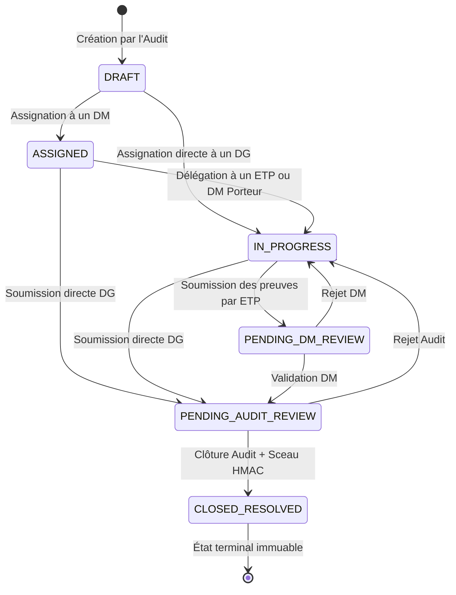
```mermaid
stateDiagram-v2
    [*] --> DRAFT : Création par l'Audit

    state "DRAFT" as DRAFT
    state "ASSIGNED" as ASSIGNED
    state "IN_PROGRESS" as IN_PROGRESS
    state "PENDING_DM_REVIEW" as PENDING_DM_REVIEW
    state "PENDING_AUDIT_REVIEW" as PENDING_AUDIT_REVIEW
    state "CLOSED_RESOLVED" as CLOSED_RESOLVED

    DRAFT --> ASSIGNED : Assignation à un DM
    DRAFT --> IN_PROGRESS : Assignation directe à un DG

    ASSIGNED --> IN_PROGRESS : Délégation à un ETP ou DM Porteur
    ASSIGNED --> PENDING_AUDIT_REVIEW : Soumission directe DG

    IN_PROGRESS --> PENDING_DM_REVIEW : Soumission des preuves par ETP
    IN_PROGRESS --> PENDING_AUDIT_REVIEW : Soumission directe DG

    PENDING_DM_REVIEW --> PENDING_AUDIT_REVIEW : Validation DM
    PENDING_DM_REVIEW --> IN_PROGRESS : Rejet DM

    PENDING_AUDIT_REVIEW --> CLOSED_RESOLVED : Clôture Audit + Sceau HMAC
    PENDING_AUDIT_REVIEW --> IN_PROGRESS : Rejet Audit

    CLOSED_RESOLVED --> [*] : État terminal immuable
```

**6 états — 10 transitions** vérifiées dans le code source (`models.py`, lignes 467–619).

| État | Description |
|:---|:---|
| `DRAFT` | Brouillon créé par l'Audit. Modifiable et supprimable (soft delete). |
| `ASSIGNED` | Assignée à un DM. En attente de prise en charge. |
| `IN_PROGRESS` | En cours de traitement par l'ETP ou le DM Porteur. |
| `PENDING_DM_REVIEW` | Preuves soumises, en attente de validation par le DM. |
| `PENDING_AUDIT_REVIEW` | Validée par le DM, en attente de décision finale de l'Audit. |
| `CLOSED_RESOLVED` | Clôturée définitivement. Sceau HMAC-SHA256 généré. Aucune mutation possible. |

> **Note :** Le flag `is_overdue` est un attribut calculé par le scheduler nocturne Django-Q2. Il se superpose à tout état actif (sauf `CLOSED_RESOLVED`) sans déclencher de transition FSM.

---

### 3.2 Machine à États de la Soumission de Preuves (EvidenceSubmission)

Le dossier de preuves est modélisé en deux tables : `EvidenceSubmission` (le lot) et `EvidenceFile` (les fichiers rattachés). Les fichiers d'un lot `DRAFT` sont supprimables ; dès `PENDING`, ils deviennent immuables.

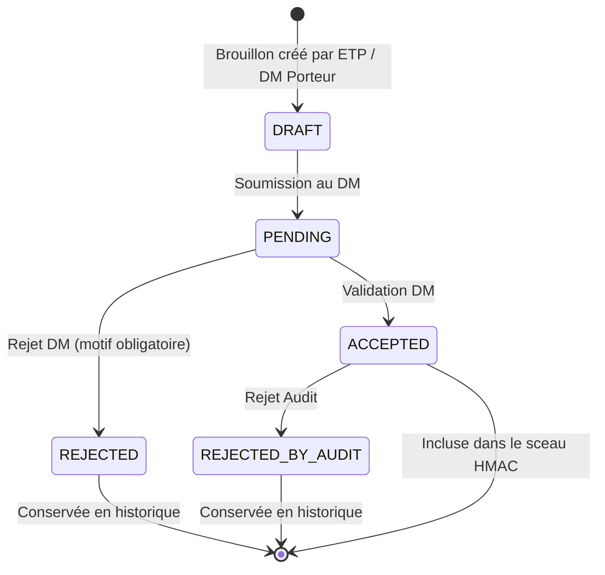
```mermaid
stateDiagram-v2
    [*] --> DRAFT : Brouillon créé par ETP / DM Porteur

    DRAFT --> PENDING : Soumission au DM
    PENDING --> ACCEPTED : Validation DM
    PENDING --> REJECTED : Rejet DM (motif obligatoire)
    ACCEPTED --> REJECTED_BY_AUDIT : Rejet Audit

    REJECTED --> [*] : Conservée en historique
    REJECTED_BY_AUDIT --> [*] : Conservée en historique
    ACCEPTED --> [*] : Incluse dans le sceau HMAC
```

---

### 3.3 Machine à États de la Demande de Report (ExtensionRequest)

Modèle satellite de la recommandation. Ne déclenche aucune transition FSM sur la recommandation elle-même. Une seule demande `PENDING` est autorisée par recommandation à la fois.

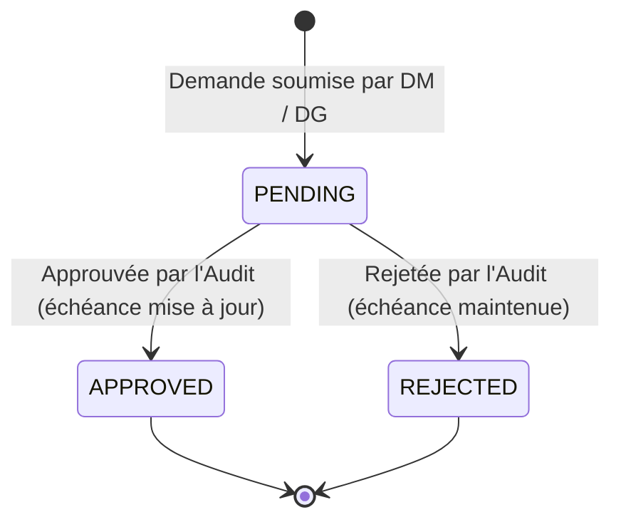
```mermaid
stateDiagram-v2
    [*] --> PENDING : Demande soumise par DM / DG

    PENDING --> APPROVED : Approuvée par l'Audit (échéance mise à jour)
    PENDING --> REJECTED : Rejetée par l'Audit (échéance maintenue)

    APPROVED --> [*]
    REJECTED --> [*]
```

---

## 4. Diagrammes de Séquence

### 4.1 Happy Path Complet (Assignation → Clôture)

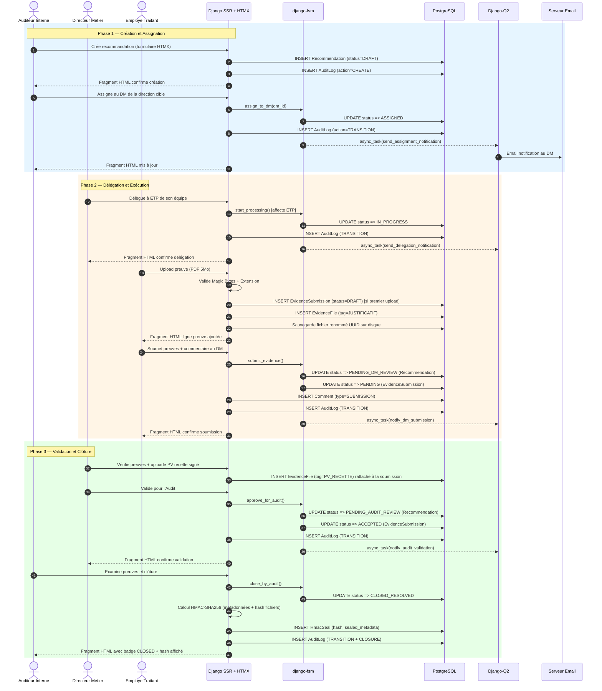
```mermaid
sequenceDiagram
    autonumber
    actor AU as Auditeur Interne
    actor DM as Directeur Metier
    actor ETP as Employe Traitant
    participant APP as Django SSR + HTMX
    participant FSM as django-fsm
    participant DB as PostgreSQL
    participant Q2 as Django-Q2
    participant SMTP as Serveur Email

    rect rgb(230, 245, 255)
        Note over AU, APP: Phase 1 — Création et Assignation
        AU->>APP: Crée recommandation (formulaire HTMX)
        APP->>DB: INSERT Recommendation (status=DRAFT)
        APP->>DB: INSERT AuditLog (action=CREATE)
        APP-->>AU: Fragment HTML confirme création

        AU->>APP: Assigne au DM de la direction cible
        APP->>FSM: assign_to_dm(dm_id)
        FSM->>DB: UPDATE status => ASSIGNED
        APP->>DB: INSERT AuditLog (action=TRANSITION)
        FSM-->>Q2: async_task(send_assignment_notification)
        Q2->>SMTP: Email notification au DM
        APP-->>AU: Fragment HTML mis à jour
    end

    rect rgb(255, 245, 230)
        Note over DM, ETP: Phase 2 — Délégation et Exécution
        DM->>APP: Délègue à ETP de son équipe
        APP->>FSM: start_processing() [affecte ETP]
        FSM->>DB: UPDATE status => IN_PROGRESS
        APP->>DB: INSERT AuditLog (TRANSITION)
        FSM-->>Q2: async_task(send_delegation_notification)
        APP-->>DM: Fragment HTML confirme délégation

        ETP->>APP: Upload preuve (PDF 5Mo)
        APP->>APP: Valide Magic Bytes + Extension
        APP->>DB: INSERT EvidenceSubmission (status=DRAFT) [si premier upload]
        APP->>DB: INSERT EvidenceFile (tag=JUSTIFICATIF)
        APP->>DB: Sauvegarde fichier renommé UUID sur disque
        APP-->>ETP: Fragment HTML ligne preuve ajoutée

        ETP->>APP: Soumet preuves + commentaire au DM
        APP->>FSM: submit_evidence()
        FSM->>DB: UPDATE status => PENDING_DM_REVIEW (Recommendation)
        FSM->>DB: UPDATE status => PENDING (EvidenceSubmission)
        APP->>DB: INSERT Comment (type=SUBMISSION)
        APP->>DB: INSERT AuditLog (TRANSITION)
        FSM-->>Q2: async_task(notify_dm_submission)
        APP-->>ETP: Fragment HTML confirme soumission
    end

    rect rgb(230, 255, 230)
        Note over DM, AU: Phase 3 — Validation et Clôture
        DM->>APP: Vérifie preuves + uploade PV recette signé
        APP->>DB: INSERT EvidenceFile (tag=PV_RECETTE) rattaché à la soumission
        DM->>APP: Valide pour l'Audit
        APP->>FSM: approve_for_audit()
        FSM->>DB: UPDATE status => PENDING_AUDIT_REVIEW (Recommendation)
        FSM->>DB: UPDATE status => ACCEPTED (EvidenceSubmission)
        APP->>DB: INSERT AuditLog (TRANSITION)
        FSM-->>Q2: async_task(notify_audit_validation)
        APP-->>DM: Fragment HTML confirme validation

        AU->>APP: Examine preuves et clôture
        APP->>FSM: close_by_audit()
        FSM->>DB: UPDATE status => CLOSED_RESOLVED
        APP->>APP: Calcul HMAC-SHA256 (métadonnées + hash fichiers)
        APP->>DB: INSERT HmacSeal (hash, sealed_metadata)
        APP->>DB: INSERT AuditLog (TRANSITION + CLOSURE)
        APP-->>AU: Fragment HTML avec badge CLOSED + hash affiché
    end
```

### 4.2 Soumission de Preuves (Détail Technique)

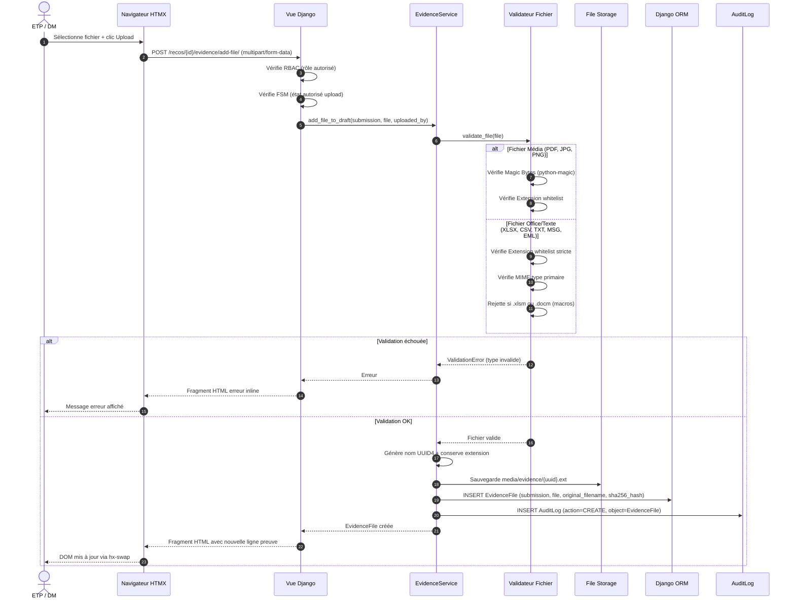
```mermaid
sequenceDiagram
    autonumber
    actor USER as ETP / DM
    participant HTML as Navigateur HTMX
    participant VUE as Vue Django
    participant SVC as EvidenceService
    participant VALID as Validateur Fichier
    participant DISK as File Storage
    participant ORM as Django ORM
    participant LOG as AuditLog

    USER->>HTML: Sélectionne fichier + clic Upload
    HTML->>VUE: POST /recos/{id}/evidence/add-file/ (multipart/form-data)

    VUE->>VUE: Vérifie RBAC (rôle autorisé)
    VUE->>VUE: Vérifie FSM (état autorisé upload)

    VUE->>SVC: add_file_to_draft(submission, file, uploaded_by)
    SVC->>VALID: validate_file(file)

    alt Fichier Média (PDF, JPG, PNG)
        VALID->>VALID: Vérifie Magic Bytes (python-magic)
        VALID->>VALID: Vérifie Extension whitelist
    else Fichier Office/Texte (XLSX, CSV, TXT, MSG, EML)
        VALID->>VALID: Vérifie Extension whitelist stricte
        VALID->>VALID: Vérifie MIME type primaire
        VALID->>VALID: Rejette si .xlsm ou .docm (macros)
    end

    alt Validation échouée
        VALID-->>SVC: ValidationError (type invalide)
        SVC-->>VUE: Erreur
        VUE-->>HTML: Fragment HTML erreur inline
        HTML-->>USER: Message erreur affiché
    else Validation OK
        VALID-->>SVC: Fichier valide
        SVC->>SVC: Génère nom UUID4 + conserve extension
        SVC->>DISK: Sauvegarde media/evidence/{uuid}.ext
        SVC->>ORM: INSERT EvidenceFile (submission, file, original_filename, sha256_hash)
        SVC->>LOG: INSERT AuditLog (action=CREATE, object=EvidenceFile)
        SVC-->>VUE: EvidenceFile créée
        VUE-->>HTML: Fragment HTML avec nouvelle ligne preuve
        HTML-->>USER: DOM mis à jour via hx-swap
    end
```

### 4.3 Rejet et Re-soumission

```mermaid
sequenceDiagram
    autonumber
    actor DM as Directeur Metier
    actor ETP as Employe Traitant
    participant APP as Django SSR
    participant FSM as django-fsm
    participant DB as PostgreSQL
    participant Q2 as Django-Q2

    Note over DM: Reco en PENDING_DM_REVIEW

    DM->>APP: Examine les preuves de l'ETP
    DM->>APP: Rejette avec motif "Signature absente"
    APP->>FSM: reject_evidence()
    FSM->>DB: UPDATE EvidenceSubmission status => REJECTED
    FSM->>DB: UPDATE Recommendation status => IN_PROGRESS
    APP->>DB: INSERT Comment (type=REJECTION, "Signature absente")
    APP->>DB: INSERT AuditLog (TRANSITION, before=PENDING_DM_REVIEW, after=IN_PROGRESS)
    FSM-->>Q2: async_task(notify_etp_rejection, reco_id)
    Q2->>ETP: Email "Preuve rejetée — motif: Signature absente"
    APP-->>DM: Fragment HTML confirme rejet

    Note over ETP: ETP reçoit la notification

    ETP->>APP: Consulte la reco et le motif de rejet
    APP-->>ETP: Affiche historique soumission REJECTED + motif

    ETP->>APP: Crée nouvelle soumission et upload fichier corrigé
    APP->>DB: INSERT EvidenceSubmission (status=DRAFT)
    APP->>DB: INSERT EvidenceFile (rattaché à la nouvelle soumission)
    APP-->>ETP: Fragment HTML mis à jour

    ETP->>APP: Re-soumet + commentaire "Signature ajoutée"
    APP->>FSM: submit_evidence()
    FSM->>DB: UPDATE status => PENDING_DM_REVIEW (Recommendation)
    FSM->>DB: UPDATE status => PENDING (EvidenceSubmission)
    APP->>DB: INSERT Comment (type=SUBMISSION)
    APP->>DB: INSERT AuditLog (TRANSITION)
    APP-->>ETP: Fragment HTML confirme re-soumission

### 4.4 Demande de Report d'Échéance

```mermaid
sequenceDiagram
    autonumber
    actor DM as Directeur Metier
    actor AU as Auditeur Interne
    participant APP as Django SSR
    participant DB as PostgreSQL
    participant Q2 as Django-Q2

    Note over DM: Reco en IN_PROGRESS, echeance J-10

    DM->>APP: Clic "Demander un report"
    APP-->>DM: Affiche formulaire (nouvelle date + justification)

    DM->>APP: POST nouvelle_date=+60j, justification="Dev IT requis 2 mois"
    APP->>DB: INSERT ExtensionRequest (decision=PENDING)
    APP->>DB: INSERT Comment (type=REPORT)
    APP->>DB: INSERT AuditLog (CREATE ExtensionRequest)
    APP-->>Q2: async_task(notify_audit_extension_request)
    Q2->>AU: Email "Demande de report DM Clair D. — Reco #42"
    APP-->>DM: Fragment HTML confirme envoi demande

    Note over AU: Audit recoit et examine la demande

    alt Audit accepte
        AU->>APP: Approuve la demande
        APP->>DB: UPDATE ExtensionRequest decision=APPROVED
        APP->>DB: UPDATE Recommendation due_date=nouvelle_date
        APP->>DB: INSERT AuditLog (UPDATE, before_date, after_date)
        APP-->>Q2: async_task(notify_dm_extension_approved)
        APP-->>AU: Fragment HTML confirme approbation
    else Audit refuse
        AU->>APP: Refuse avec motif
        APP->>DB: UPDATE ExtensionRequest decision=REJECTED, rejection_reason
        APP->>DB: INSERT AuditLog (UPDATE, decision=REJECTED)
        APP-->>Q2: async_task(notify_dm_extension_rejected)
        APP-->>AU: Fragment HTML confirme refus
    end
```

### 4.5 Import Massif en DRAFT (Story 6.5) — implémenté

Import « stateless » : un seul formulaire multipart porte le fichier. « Analyser »
fait un dry-run (rien créé) ; « Confirmer » re-soumet le **même** fichier vers l'endpoint
de confirmation, qui crée tout dans une **transaction atomique**. Plafond 50 lignes,
création en `DRAFT` (zéro notification, zéro FSM, zéro assignation).

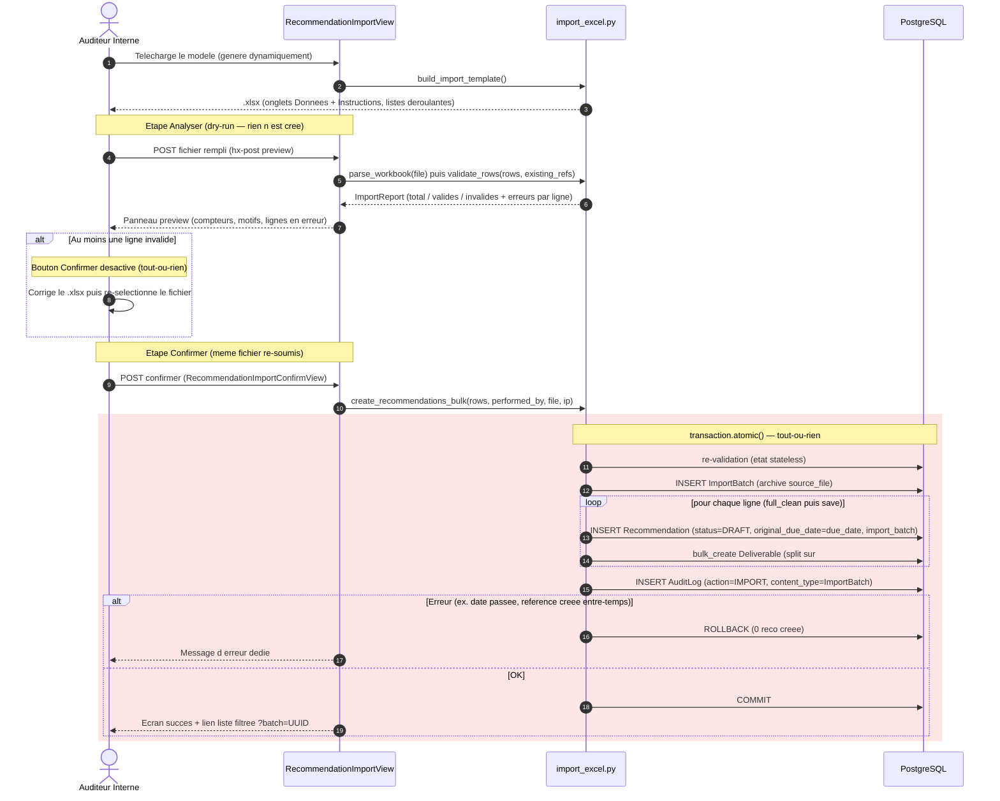
```mermaid
sequenceDiagram
    autonumber
    actor AU as Auditeur Interne
    participant APP as RecommendationImportView
    participant MOD as import_excel.py
    participant DB as PostgreSQL

    AU->>APP: Telecharge le modele (genere dynamiquement)
    APP->>MOD: build_import_template()
    MOD-->>AU: .xlsx (onglets Donnees + Instructions, listes deroulantes)

    Note over AU,APP: Etape Analyser (dry-run — rien n est cree)
    AU->>APP: POST fichier rempli (hx-post preview)
    APP->>MOD: parse_workbook(file) puis validate_rows(rows, existing_refs)
    MOD-->>APP: ImportReport (total / valides / invalides + erreurs par ligne)
    APP-->>AU: Panneau preview (compteurs, motifs, lignes en erreur)

    alt Au moins une ligne invalide
        Note over AU: Bouton Confirmer desactive (tout-ou-rien)
        AU->>AU: Corrige le .xlsx puis re-selectionne le fichier
    end

    Note over AU,APP: Etape Confirmer (meme fichier re-soumis)
    AU->>APP: POST confirmer (RecommendationImportConfirmView)
    APP->>MOD: create_recommendations_bulk(rows, performed_by, file, ip)
    rect rgb(255, 230, 230)
        Note over MOD,DB: transaction.atomic() — tout-ou-rien
        MOD->>DB: re-validation (etat stateless)
        MOD->>DB: INSERT ImportBatch (archive source_file)
        loop pour chaque ligne (full_clean puis save)
            MOD->>DB: INSERT Recommendation (status=DRAFT, original_due_date=due_date, import_batch)
            MOD->>DB: bulk_create Deliverable (split sur ;)
        end
        MOD->>DB: INSERT AuditLog (action=IMPORT, content_type=ImportBatch)
        alt Erreur (ex. date passee, reference creee entre-temps)
            MOD->>DB: ROLLBACK (0 reco creee)
            APP-->>AU: Message d erreur dedie
        else OK
            MOD->>DB: COMMIT
            APP-->>AU: Ecran succes + lien liste filtree ?batch=UUID
        end
    end
```

> **Import historique (Story 6.8 — backlog)** : un second flux, *distinct*, importera les
> recommandations **déjà clôturées** issues des archives (`status=CLOSED_RESOLVED`,
> `import_tag="IMPORTED"`, dates passées acceptées, preuves jointes via ZIP, jusqu'à
> 500 lignes). Il réutilisera `ImportBatch` et le pattern wizard de 6.5. Non encore
> implémenté.

### 4.6 Cycle de Notifications In-App (Scheduler Nocturne)

Implémenté en **in-app uniquement** (Stories 4.0/4.1/4.2). Une planification Django-Q2
appelle `run_nightly_notifications()` qui enchaîne deux services. Chaque notification est
**idempotente** par `(recipient, idempotency_key)` : un 2ᵉ run stable ne crée aucun
doublon, et un changement d'état (report, clôture) **réconcilie** (supprime) les
notifications devenues obsolètes. **Aucun e-mail** (canal e-mail = backlog post-MVP).

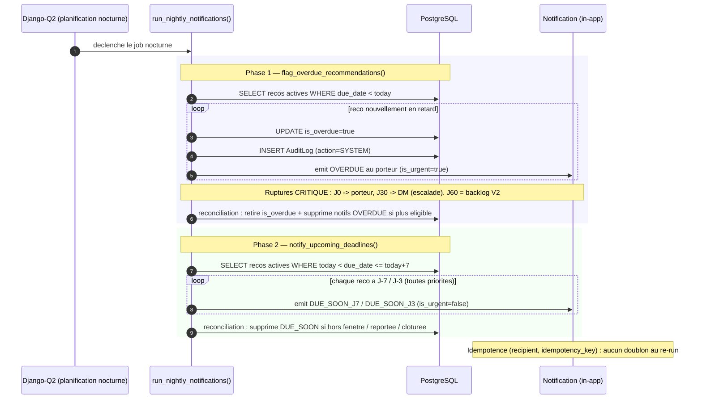
```mermaid
sequenceDiagram
    autonumber
    participant Q2 as Django-Q2 (planification nocturne)
    participant WF as run_nightly_notifications()
    participant DB as PostgreSQL
    participant NOTIF as Notification (in-app)

    Q2->>WF: declenche le job nocturne

    rect rgb(245, 245, 255)
        Note over WF,DB: Phase 1 — flag_overdue_recommendations()
        WF->>DB: SELECT recos actives WHERE due_date < today
        loop reco nouvellement en retard
            WF->>DB: UPDATE is_overdue=true
            WF->>DB: INSERT AuditLog (action=SYSTEM)
            WF->>NOTIF: emit OVERDUE au porteur (is_urgent=true)
        end
        Note over WF,NOTIF: Ruptures CRITIQUE : J0 -> porteur, J30 -> DM (escalade). J60 = backlog V2
        WF->>DB: reconciliation : retire is_overdue + supprime notifs OVERDUE si plus eligible
    end

    rect rgb(245, 255, 245)
        Note over WF,DB: Phase 2 — notify_upcoming_deadlines()
        WF->>DB: SELECT recos actives WHERE today < due_date <= today+7
        loop chaque reco a J-7 / J-3 (toutes priorites)
            WF->>NOTIF: emit DUE_SOON_J7 / DUE_SOON_J3 (is_urgent=false)
        end
        WF->>DB: reconciliation : supprime DUE_SOON si hors fenetre / reportee / cloturee
    end

    Note over NOTIF: Idempotence (recipient, idempotency_key) : aucun doublon au re-run
```

> **Lecture par l'utilisateur :** le badge + le dropdown HTMX de la topbar lisent la table
> `Notification` (non-lues, tri anti-chronologique). Marquage lu individuel / tout.

### 4.7 Export ZIP Auditeur Externe (COBAC)

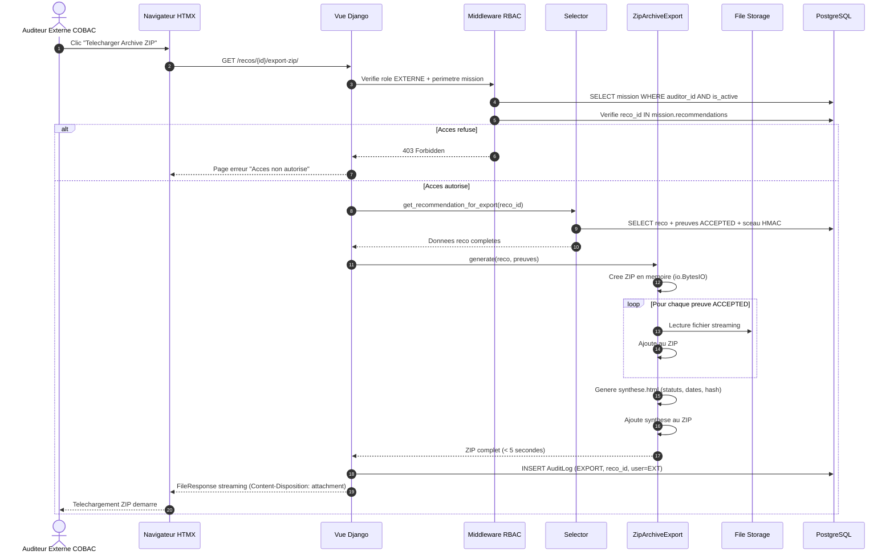
```mermaid
sequenceDiagram
    autonumber
    actor EXT as Auditeur Externe COBAC
    participant HTML as Navigateur HTMX
    participant VUE as Vue Django
    participant RBAC as Middleware RBAC
    participant SEL as Selector
    participant EXP as ZipArchiveExport
    participant DISK as File Storage
    participant DB as PostgreSQL

    EXT->>HTML: Clic "Telecharger Archive ZIP"
    HTML->>VUE: GET /recos/{id}/export-zip/

    VUE->>RBAC: Verifie role EXTERNE + perimetre mission
    RBAC->>DB: SELECT mission WHERE auditor_id AND is_active
    RBAC->>DB: Verifie reco_id IN mission.recommendations

    alt Acces refuse
        RBAC-->>VUE: 403 Forbidden
        VUE-->>HTML: Page erreur "Acces non autorise"
    else Acces autorise
        VUE->>SEL: get_recommendation_for_export(reco_id)
        SEL->>DB: SELECT reco + preuves ACCEPTED + sceau HMAC
        SEL-->>VUE: Donnees reco completes

        VUE->>EXP: generate(reco, preuves)
        EXP->>EXP: Cree ZIP en memoire (io.BytesIO)
        loop Pour chaque preuve ACCEPTED
            EXP->>DISK: Lecture fichier streaming
            EXP->>EXP: Ajoute au ZIP
        end
        EXP->>EXP: Genere synthese.html (statuts, dates, hash)
        EXP->>EXP: Ajoute synthese au ZIP
        EXP-->>VUE: ZIP complet (< 5 secondes)

        VUE->>DB: INSERT AuditLog (EXPORT, reco_id, user=EXT)
        VUE-->>HTML: FileResponse streaming (Content-Disposition: attachment)
        HTML-->>EXT: Telechargement ZIP demarre
    end
```

### 4.8 Authentification et Contrôle de Session

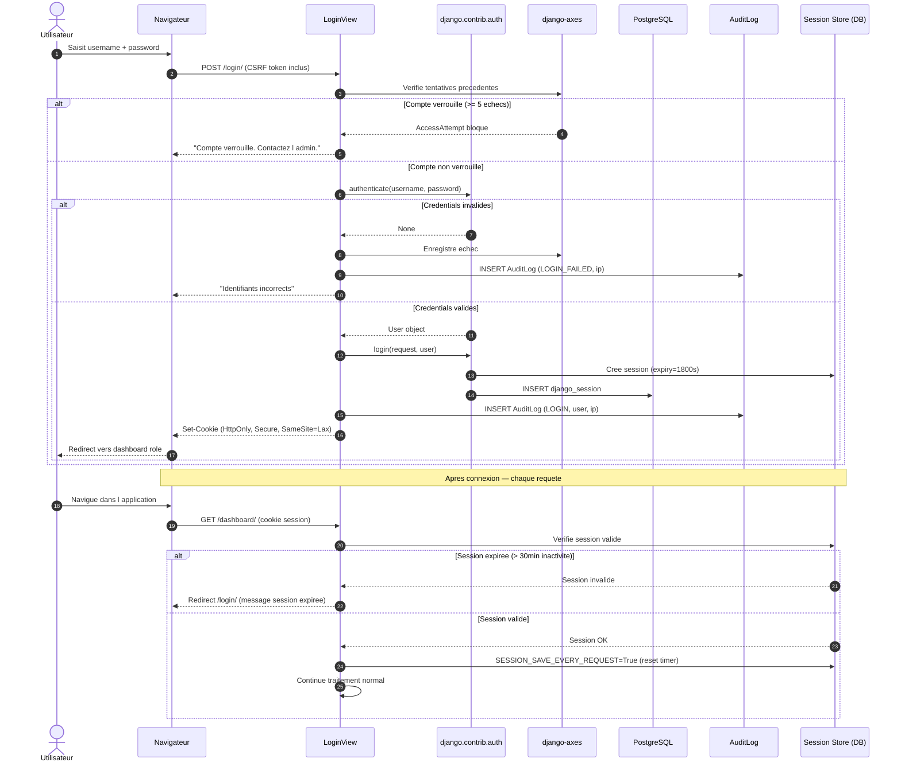
```mermaid
sequenceDiagram
    autonumber
    actor USER as Utilisateur
    participant HTML as Navigateur
    participant VUE as LoginView
    participant AUTH as django.contrib.auth
    participant AXES as django-axes
    participant DB as PostgreSQL
    participant LOG as AuditLog
    participant SESS as Session Store (DB)

    USER->>HTML: Saisit username + password
    HTML->>VUE: POST /login/ (CSRF token inclus)

    VUE->>AXES: Verifie tentatives precedentes
    alt Compte verrouille (>= 5 echecs)
        AXES-->>VUE: AccessAttempt bloque
        VUE-->>HTML: "Compte verrouille. Contactez l admin."
    else Compte non verrouille
        VUE->>AUTH: authenticate(username, password)
        alt Credentials invalides
            AUTH-->>VUE: None
            VUE->>AXES: Enregistre echec
            VUE->>LOG: INSERT AuditLog (LOGIN_FAILED, ip)
            VUE-->>HTML: "Identifiants incorrects"
        else Credentials valides
            AUTH-->>VUE: User object
            VUE->>AUTH: login(request, user)
            AUTH->>SESS: Cree session (expiry=1800s)
            AUTH->>DB: INSERT django_session
            VUE->>LOG: INSERT AuditLog (LOGIN, user, ip)
            VUE-->>HTML: Set-Cookie (HttpOnly, Secure, SameSite=Lax)
            HTML-->>USER: Redirect vers dashboard role
        end
    end

    Note over HTML, SESS: Apres connexion — chaque requete

    USER->>HTML: Navigue dans l application
    HTML->>VUE: GET /dashboard/ (cookie session)
    VUE->>SESS: Verifie session valide
    alt Session expiree (> 30min inactivite)
        SESS-->>VUE: Session invalide
        VUE-->>HTML: Redirect /login/ (message session expiree)
    else Session valide
        SESS-->>VUE: Session OK
        VUE->>SESS: SESSION_SAVE_EVERY_REQUEST=True (reset timer)
        VUE->>VUE: Continue traitement normal
    end
```

#### Description du Mécanisme d'Authentification :

Le diagramme d'authentification et contrôle de session met en œuvre les couches de sécurité fondamentales de Sentinel :
1. **Protection contre le Bruteforce (`django-axes`)** : Avant de tenter de valider les identifiants en base, le middleware de sécurité intercepte la requête HTTP et interroge la table SQL `AccessAttempt`. Si le seuil de 5 tentatives échouées consécutives est dépassé pour l'IP ou l'identifiant, le compte est verrouillé sans solliciter les fonctions d'authentification.
2. **Double Écriture de Piste d'Audit (`AuditLog`)** : Chaque tentative de connexion (réussie avec `LOGIN` ou échouée avec `LOGIN_FAILED`) fait l'objet d'un enregistrement *append-only* asynchrone pour l'historique d'audit, capturant l'adresse IP et l'identité.
3. **Cloisonnement de Données (RBAC applicatif)** : Le cloisonnement inter-départemental est assuré au niveau applicatif, et non par la base de données. Trois mécanismes coopèrent : les middlewares `RoleRequiredMiddleware` et `ExternalIsolationMiddleware` (filtrage des routes selon le rôle et isolation stricte des auditeurs externes), et les *selectors* (ex. `get_recommendations_for_user`) qui restreignent systématiquement les requêtes au périmètre autorisé de l'utilisateur.
4. **Session Glissante** : Le paramètre `SESSION_SAVE_EVERY_REQUEST=True` réinitialise le délai d'expiration de session (30 minutes) à chaque action de l'utilisateur, et le redirige de force vers la page de login en cas d'inactivité prolongée.

> **Note (v2) :** un cloisonnement complémentaire par *Row-Level Security* (RLS) PostgreSQL est prévu pour la version 2, en défense en profondeur du RBAC applicatif actuel.

---

### 4.9 Provisioning des Comptes — Maker / Checker (Story 6.2.0)

Circuit à quatre yeux pour la création de comptes. L'**Admin IT (maker)** soumet une
demande complète (identité + rôle + département + mot de passe **haché dès la
soumission**). Aucun `User` n'existe avant l'approbation. Un **membre du groupe
« Administrateurs Sentinel » (checker)** valide ou rejette. C'est une **révision de
l'ADR-10** : ce flux coexiste avec l'habilitation Audit (attribution/édition des rôles
par l'Audit Admin).

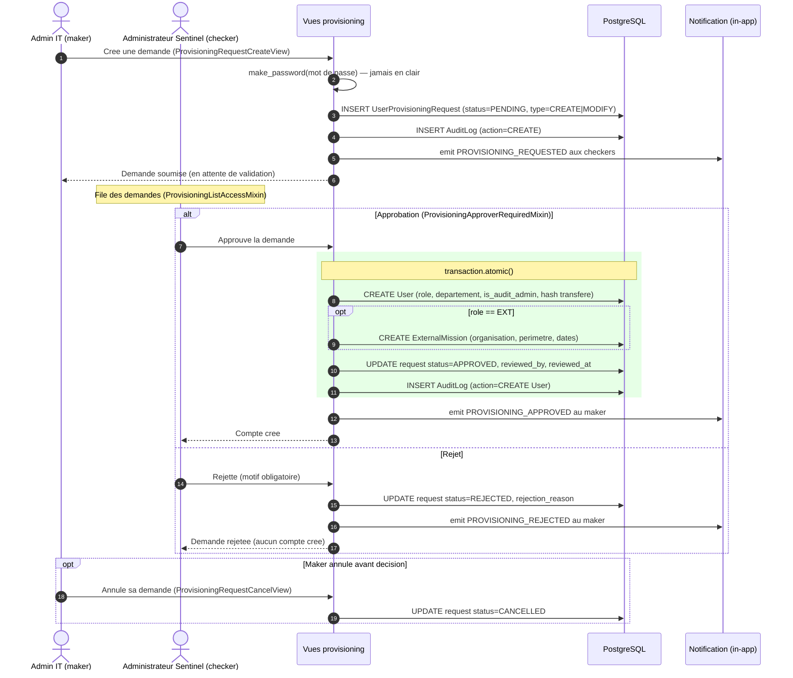
```mermaid
sequenceDiagram
    autonumber
    actor IT as Admin IT (maker)
    actor CK as Administrateur Sentinel (checker)
    participant APP as Vues provisioning
    participant DB as PostgreSQL
    participant NOTIF as Notification (in-app)

    IT->>APP: Cree une demande (ProvisioningRequestCreateView)
    APP->>APP: make_password(mot de passe) — jamais en clair
    APP->>DB: INSERT UserProvisioningRequest (status=PENDING, type=CREATE|MODIFY)
    APP->>DB: INSERT AuditLog (action=CREATE)
    APP->>NOTIF: emit PROVISIONING_REQUESTED aux checkers
    APP-->>IT: Demande soumise (en attente de validation)

    Note over CK: File des demandes (ProvisioningListAccessMixin)

    alt Approbation (ProvisioningApproverRequiredMixin)
        CK->>APP: Approuve la demande
        rect rgb(230, 255, 230)
            Note over APP,DB: transaction.atomic()
            APP->>DB: CREATE User (role, departement, is_audit_admin, hash transfere)
            opt role == EXT
                APP->>DB: CREATE ExternalMission (organisation, perimetre, dates)
            end
            APP->>DB: UPDATE request status=APPROVED, reviewed_by, reviewed_at
            APP->>DB: INSERT AuditLog (action=CREATE User)
        end
        APP->>NOTIF: emit PROVISIONING_APPROVED au maker
        APP-->>CK: Compte cree
    else Rejet
        CK->>APP: Rejette (motif obligatoire)
        APP->>DB: UPDATE request status=REJECTED, rejection_reason
        APP->>NOTIF: emit PROVISIONING_REJECTED au maker
        APP-->>CK: Demande rejetee (aucun compte cree)
    end

    opt Maker annule avant decision
        IT->>APP: Annule sa demande (ProvisioningRequestCancelView)
        APP->>DB: UPDATE request status=CANCELLED
    end
```

#### Description du Mécanisme de Provisioning :

Ce processus est un **Diagramme de Séquence de Provisioning de Comptes (Maker/Checker)**. Il illustre le principe de séparation des tâches (Segregation of Duties — SoD) appliqué à la gestion des habilitations :
1. **Sécurisation de la soumission (Maker)** : L'Admin IT initie la demande en saisissant les informations du compte. Le mot de passe brut saisi est immédiatement transformé en condensat sécurisé (hachage PBKDF2 via `make_password`) côté serveur avant l'insertion dans la table `users_userprovisioningrequest`. Le compte utilisateur réel n'existe pas encore.
2. **Validation Indépendante (Checker)** : La demande en attente (`PENDING`) apparaît dans la file de traitement du Checker (un Administrateur Sentinel habilité). Le Checker peut :
   * **Approuver** : Déclenche une transaction atomique (`transaction.atomic()`) qui crée simultanément le profil de l'utilisateur, configure ses droits, instancie son périmètre de mission externe le cas échéant, et met à jour le statut de la demande.
   * **Rejeter** : Exige la saisie obligatoire d'un motif de rejet. La demande passe à l'état `REJECTED`, aucun utilisateur n'est créé en base.
3. **Intégrité Transactionnelle** : La transaction garantit qu'en cas de panne réseau ou d'erreur sur l'une des écritures SQL, la base de données effectue un Rollback complet (aucun compte "partiellement configuré").

---

## 5. Diagrammes de Cas d'Utilisation

### 5.1 Auditeur Interne

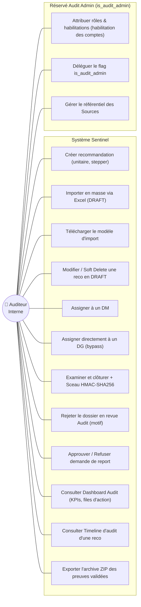
```mermaid
flowchart LR
  subgraph "Système Sentinel"
    UC1["Créer recommandation (unitaire, stepper)"]
    UC2["Importer en masse via Excel (DRAFT)"]
    UC3["Télécharger le modèle d'import"]
    UC4["Modifier / Soft Delete une reco en DRAFT"]
    UC5["Assigner à un DM"]
    UC6["Assigner directement à un DG (bypass)"]
    UC7["Examiner et clôturer + Sceau HMAC-SHA256"]
    UC8["Rejeter le dossier en revue Audit (motif)"]
    UC9["Approuver / Refuser demande de report"]
    UC10["Consulter Dashboard Audit (KPIs, files d'action)"]
    UC11["Consulter Timeline d'audit d'une reco"]
    UC12["Exporter l'archive ZIP des preuves validées"]
  end

  subgraph "Réservé Audit Admin (is_audit_admin)"
    UC13["Attribuer rôles & habilitations (habilitation des comptes)"]
    UC14["Déléguer le flag is_audit_admin"]
    UC15["Gérer le référentiel des Sources"]
  end

  AU(("🔵 Auditeur\nInterne"))

  AU --- UC1
  AU --- UC2
  AU --- UC3
  AU --- UC4
  AU --- UC5
  AU --- UC6
  AU --- UC7
  AU --- UC8
  AU --- UC9
  AU --- UC10
  AU --- UC11
  AU --- UC12
  AU --- UC13
  AU --- UC14
  AU --- UC15
```

### 5.2 Directeur Métier (DM)

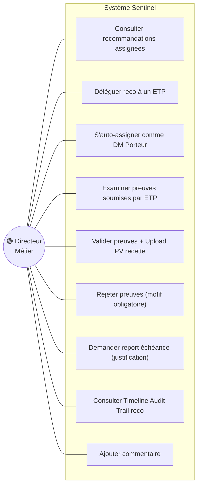
```mermaid
flowchart LR
  subgraph "Système Sentinel"
    UC1["Consulter recommandations assignées"]
    UC2["Déléguer reco à un ETP"]
    UC3["S'auto-assigner comme DM Porteur"]
    UC4["Examiner preuves soumises par ETP"]
    UC5["Valider preuves + Upload PV recette"]
    UC6["Rejeter preuves (motif obligatoire)"]
    UC7["Demander report échéance (justification)"]
    UC8["Consulter Timeline Audit Trail reco"]
    UC9["Ajouter commentaire"]
  end

  DM(("🟢 Directeur\nMétier"))

  DM --- UC1
  DM --- UC2
  DM --- UC3
  DM --- UC4
  DM --- UC5
  DM --- UC6
  DM --- UC7
  DM --- UC8
  DM --- UC9
```

### 5.3 Employé Traitant (ETP)

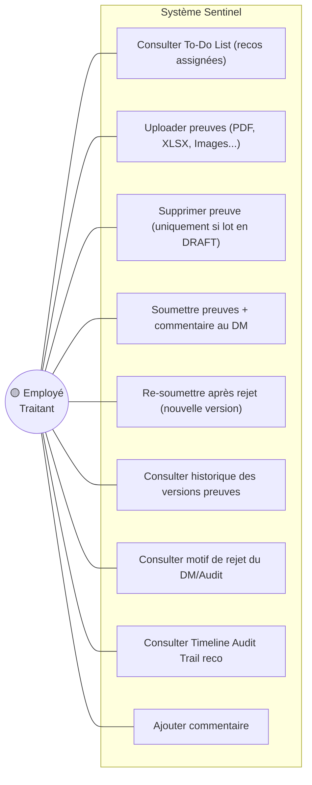
```mermaid
flowchart LR
  subgraph "Système Sentinel"
    UC1["Consulter To-Do List (recos assignées)"]
    UC2["Uploader preuves (PDF, XLSX, Images...)"]
    UC3["Supprimer preuve (uniquement si lot en DRAFT)"]
    UC4["Soumettre preuves + commentaire au DM"]
    UC5["Re-soumettre après rejet (nouvelle version)"]
    UC6["Consulter historique des versions preuves"]
    UC7["Consulter motif de rejet du DM/Audit"]
    UC8["Consulter Timeline Audit Trail reco"]
    UC9["Ajouter commentaire"]
  end

  ETP(("🟡 Employé\nTraitant"))

  ETP --- UC1
  ETP --- UC2
  ETP --- UC3
  ETP --- UC4
  ETP --- UC5
  ETP --- UC6
  ETP --- UC7
  ETP --- UC8
  ETP --- UC9
```

### 5.4 Direction Générale (DG)

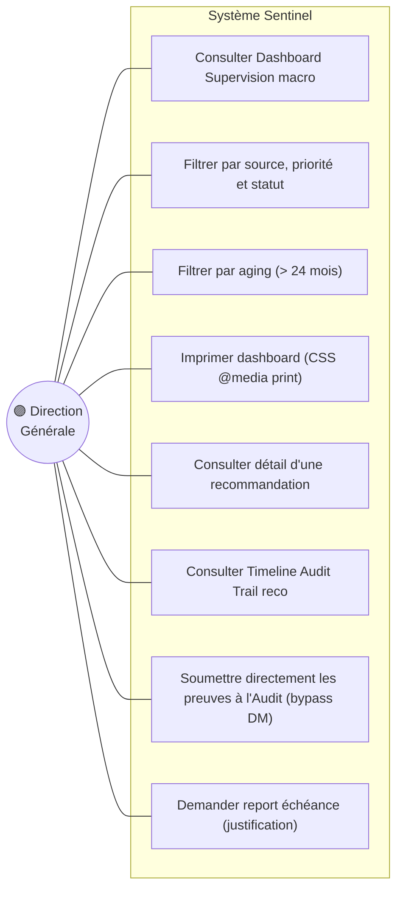
```mermaid
flowchart LR
  subgraph "Système Sentinel"
    UC1["Consulter Dashboard Supervision macro"]
    UC2["Filtrer par source, priorité et statut"]
    UC3["Filtrer par aging (> 24 mois)"]
    UC4["Imprimer dashboard (CSS @media print)"]
    UC5["Consulter détail d'une recommandation"]
    UC6["Consulter Timeline Audit Trail reco"]
    UC7["Soumettre directement les preuves à l'Audit (bypass DM)"]
    UC8["Demander report échéance (justification)"]
  end

  DG(("🟣 Direction\nGénérale"))

  DG --- UC1
  DG --- UC2
  DG --- UC3
  DG --- UC4
  DG --- UC5
  DG --- UC6
  DG --- UC7
  DG --- UC8
```

### 5.5 Auditeur Externe (COBAC / BEAC / CAC)

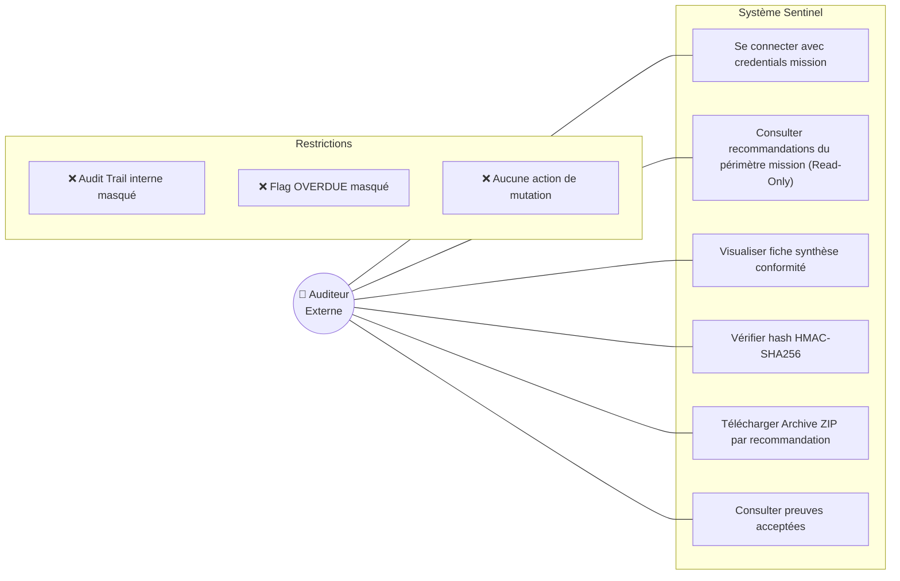
```mermaid
flowchart LR
  subgraph "Système Sentinel"
    UC1["Se connecter avec credentials mission"]
    UC2["Consulter recommandations du périmètre mission (Read-Only)"]
    UC3["Visualiser fiche synthèse conformité"]
    UC4["Vérifier hash HMAC-SHA256"]
    UC5["Télécharger Archive ZIP par recommandation"]
    UC6["Consulter preuves acceptées"]
  end

  subgraph "Restrictions"
    R1["❌ Audit Trail interne masqué"]
    R2["❌ Flag OVERDUE masqué"]
    R3["❌ Aucune action de mutation"]
  end

  EXT(("🔴 Auditeur\nExterne"))

  EXT --- UC1
  EXT --- UC2
  EXT --- UC3
  EXT --- UC4
  EXT --- UC5
  EXT --- UC6
```

### 5.6 Admin IT

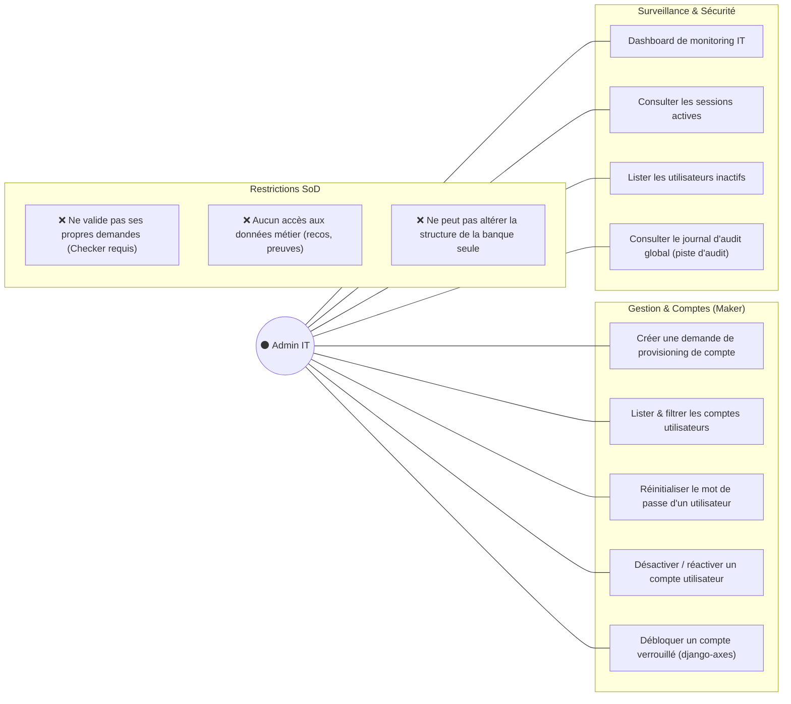
```mermaid
flowchart LR
  subgraph "Gestion & Comptes (Maker)"
    UC1["Créer une demande de provisioning de compte"]
    UC2["Lister & filtrer les comptes utilisateurs"]
    UC3["Réinitialiser le mot de passe d'un utilisateur"]
    UC4["Désactiver / réactiver un compte utilisateur"]
    UC5["Débloquer un compte verrouillé (django-axes)"]
  end

  subgraph "Surveillance & Sécurité"
    UC6["Dashboard de monitoring IT"]
    UC7["Consulter les sessions actives"]
    UC8["Lister les utilisateurs inactifs"]
    UC9["Consulter le journal d'audit global (piste d'audit)"]
  end

  subgraph "Restrictions SoD"
    R1["❌ Ne valide pas ses propres demandes (Checker requis)"]
    R2["❌ Aucun accès aux données métier (recos, preuves)"]
    R3["❌ Ne peut pas altérer la structure de la banque seule"]
  end

  ADMIN(("⚫ Admin IT"))

  ADMIN --- UC1
  ADMIN --- UC2
  ADMIN --- UC3
  ADMIN --- UC4
  ADMIN --- UC5
  ADMIN --- UC6
  ADMIN --- UC7
  ADMIN --- UC8
  ADMIN --- UC9
```

### 5.7 Checker (Administrateur Sentinel)

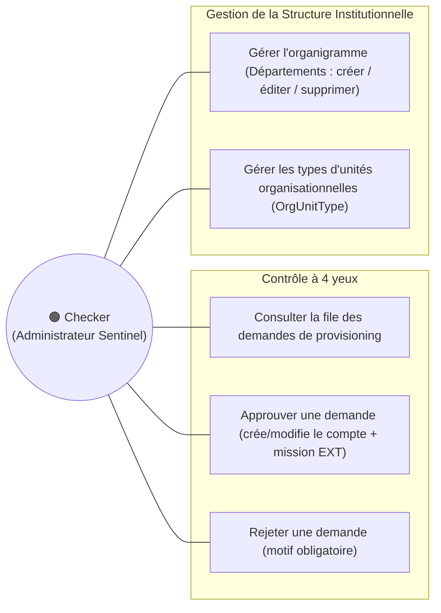
```mermaid
flowchart LR
  subgraph "Contrôle à 4 yeux"
    UC1["Consulter la file des demandes de provisioning"]
    UC2["Approuver une demande (crée/modifie le compte + mission EXT)"]
    UC3["Rejeter une demande (motif obligatoire)"]
  end

  subgraph "Gestion de la Structure Institutionnelle"
    UC4["Gérer l'organigramme (Départements : créer / éditer / supprimer)"]
    UC5["Gérer les types d'unités organisationnelles (OrgUnitType)"]
  end

  CK(("🟤 Checker\n(Administrateur Sentinel)"))

  CK --- UC1
  CK --- UC2
  CK --- UC3
  CK --- UC4
  CK --- UC5
```

---

## 6. Diagramme de Classes (Modèles Cœur)

Ce diagramme présente une version simplifiée et optimisée de l'architecture de données de Sentinel. Il se concentre exclusivement sur les **8 classes métier centrales** et leurs relations fondamentales, omettant volontairement les classes satellites (énumérations, mixins, services techniques) pour mettre en évidence l'essence du système.

```mermaid
classDiagram
    direction LR

    class User {
        +UUID id
        +String username
        +String role
        +Department department
        +Boolean is_audit_admin
        +Boolean is_external
    }

    class Department {
        +UUID id
        +String name
        +String code
        +Department parent
    }

    class Recommendation {
        +UUID id
        +String reference
        +String status
        +String priority
        +Date due_date
        +User created_by
        +User assigned_dm
        +User assigned_etp
        +Boolean is_deleted
        +Boolean is_overdue
    }

    class EvidenceSubmission {
        +UUID id
        +String status
        +Text comment
        +User submitted_by
        +Text review_comment
        +User reviewed_by
    }

    class EvidenceFile {
        +UUID id
        +File file
        +String sha256_hash
        +String mime_type
        +Integer file_size
        +String tag
    }

    class ExtensionRequest {
        +UUID id
        +Date requested_date
        +Text reason
        +String status
        +User requested_by
    }

    class AuditLog {
        +UUID id
        +String action
        +User user
        +UUID object_id
        +JSON changes
        +DateTime created_at
    }

    class HmacSeal {
        +UUID id
        +String hmac_hash
        +JSON sealed_metadata
        +JSON file_hashes
        +DateTime sealed_at
    }

    %% Relations
    User "*" --> "0..1" Department : appartient à
    Recommendation "*" --> "1" User : créée par
    Recommendation "*" --> "0..1" User : assignée au DM
    Recommendation "*" --> "0..1" User : déléguée à ETP
    Recommendation "*" --> "1" Department : direction cible
    EvidenceSubmission "*" --> "1" Recommendation : concerne
    EvidenceSubmission "*" --> "1" User : soumise par
    EvidenceFile "*" --> "1" EvidenceSubmission : rattaché à
    ExtensionRequest "*" --> "1" Recommendation : porte sur
    AuditLog "*" --> "0..1" User : effectuée par
    HmacSeal "1" --> "1" Recommendation : scelle
```

### Synthèse des Modèles Cœur :

| Classe | Rôle dans l'architecture |
|:---|:---|
| **User** | Acteur central du système. Porte l'information du rôle (RBAC) et le département de rattachement pour le cloisonnement des données. |
| **Department** | Représente la structure organisationnelle de la banque (organigramme hiérarchique). |
| **Recommendation** | Entité métier principale. Pilote le cycle de vie via la machine à états (FSM). |
| **EvidenceSubmission** | Le dossier de preuves (lot). Il évolue de l'état brouillon à la soumission pour validation. |
| **EvidenceFile** | Les fichiers physiques (PDF, images) rattachés à une soumission. Validés stricto sensu via *Magic Bytes*. |
| **ExtensionRequest** | Demande formelle de report d'échéance adressée par les métiers à l'Audit. |
| **AuditLog** | Journal d'audit (Piste d'audit). Enregistrement *append-only* assurant la traçabilité de chaque action métier. |
| **HmacSeal** | Sceau cryptographique HMAC-SHA256. Généré à la clôture, il garantit l'intégrité absolue de la recommandation et de ses preuves. |

---

## 7. Diagramme d'Architecture Logicielle

Vue en couches de l'application, suivant la convention **HackSoft** (séparation stricte des responsabilités). Les dépendances sont dirigées du haut vers le bas ; les services transversaux (en pointillés) sont sollicités par plusieurs couches.

```mermaid
flowchart TB
    subgraph PRES["Couche Présentation"]
        BROWSER["Navigateur client<br/>HTMX · Alpine.js"]
        TPL["Templates Django SSR<br/>Tailwind CSS · WhiteNoise"]
    end

    subgraph APP["Couche Application — Apps Django"]
        VIEWS["Vues &amp; URLs<br/>workflow · users · dashboards<br/>audit · notifications · ui"]
    end

    subgraph BUS["Couche Métier (HackSoft)"]
        SVC["Services<br/>écritures &amp; transitions"]
        SEL["Selectors<br/>lectures"]
    end

    subgraph DOM["Couche Domaine"]
        MODELS["Modèles métier"]
        FSM["django-fsm<br/>cycle de vie"]
    end

    subgraph DATA["Couche Persistance"]
        ORM["Django ORM"]
        PG[("PostgreSQL 16")]
    end

    subgraph CROSS["Services transversaux"]
        SEC["Sécurité<br/>django-axes · sessions<br/>middlewares RBAC"]
        Q2["Django-Q2<br/>tâches planifiées"]
        INTEG["Intégrité<br/>AuditLog · Sceau HMAC"]
        NOTIF["Notifications in-app"]
    end

    BROWSER <-->|"HTTP / fragments HTML"| TPL
    TPL --> VIEWS
    VIEWS --> SVC
    VIEWS --> SEL
    SVC --> MODELS
    SEL --> MODELS
    MODELS --> FSM
    MODELS --> ORM
    ORM --> PG

    SEC -.-> VIEWS
    SVC -.-> INTEG
    SVC -.-> NOTIF
    Q2 -.-> SVC
```

### Description (architecture logicielle)

Sentinel repose sur une architecture en couches qui isole chaque responsabilité. La **couche présentation** s'appuie sur le rendu côté serveur (Django SSR) enrichi par HTMX et Alpine.js : le serveur renvoie des fragments HTML plutôt que du JSON, ce qui simplifie le client et renforce la sécurité. La **couche application** regroupe les six modules métier (workflow, users, dashboards, audit, notifications, ui) à travers leurs vues et leurs URLs.

Le cœur de la logique applique la convention HackSoft : la **couche métier** sépare strictement les *services* (toute écriture, incluant les transitions d'état) des *selectors* (toute lecture). Cette séparation rend le code testable et garantit que les changements d'état ne transitent que par des chemins contrôlés. La **couche domaine** porte les modèles et la machine à états `django-fsm`, et la **couche persistance** délègue à l'ORM Django au-dessus de PostgreSQL 16.

Les **services transversaux** sont mobilisés par plusieurs couches : la sécurité (protection anti-bruteforce, sessions, middlewares de contrôle d'accès), les tâches planifiées Django-Q2, l'intégrité (journal d'audit append-only et sceau HMAC), et les notifications in-app. Cette transversalité explique le caractère infalsifiable du système : aucune action métier n'échappe à la traçabilité.

---

## 8. Diagramme d'Architecture Physique (Déploiement)

Déploiement **on-premise** dans le réseau interne de la BICEC, sans accès Internet. L'hôte Docker exécute trois conteneurs. La terminaison TLS est déléguée au reverse proxy de la DSI (prévue en v2, en pointillés) ; en attendant, le poste client atteint directement Gunicorn sur le réseau interne.

```mermaid
flowchart TB
    subgraph LAN["Réseau interne BICEC — on-premise, sans Internet"]
        CLIENT["«device» Poste de travail BICEC<br/>Navigateur web"]

        PROXY["«device» Reverse proxy DSI BICEC<br/>NGINX — terminaison TLS<br/>(prévu v2)"]

        subgraph HOST["«execution environment» Serveur applicatif — Hôte Docker"]
            WEB["«container» web<br/>Gunicorn gthread (4 threads)<br/>+ WhiteNoise<br/>+ Application Django"]
            WORKER["«container» worker<br/>Django-Q2 (qcluster)"]
            DB["«container» db<br/>PostgreSQL 16"]
            VOLP[("Volume pgdata")]
            VOLM[("Volume media")]
            VOLS[("Volume static")]
        end
    end

    CLIENT -.->|"HTTPS (prévu v2)"| PROXY
    PROXY -.->|"HTTP :8000"| WEB
    CLIENT -->|"HTTP :8000 (actuel, LAN)"| WEB
    WEB -->|"TCP :5432"| DB
    WORKER -->|"TCP :5432"| DB
    DB --- VOLP
    WEB --- VOLM
    WORKER --- VOLM
    WEB --- VOLS
```

### Description (architecture physique)

L'application est déployée intégralement sur un serveur interne de la BICEC, conformément à l'exigence de souveraineté de la Loi 2024-017 : aucune donnée ne quitte le réseau de la banque, et le système fonctionne sans connexion Internet. L'hôte Docker orchestre trois conteneurs aux rôles distincts. Le conteneur **web** exécute Gunicorn en mode multi-thread (`gthread`, 4 threads par worker), sert lui-même les fichiers statiques via WhiteNoise, et porte l'application Django. Le conteneur **worker** exécute le cluster Django-Q2 qui traite les tâches planifiées nocturnes (détection des retards, anticipation des échéances). Le conteneur **db** héberge PostgreSQL 16.

La persistance s'appuie sur trois volumes Docker : `pgdata` pour la base, `media` pour les preuves d'audit (partagé entre web et worker), et `static` pour les ressources compilées. La séparation du worker et du serveur web garantit qu'un traitement par lot lourd ne dégrade pas le temps de réponse des utilisateurs.

La terminaison TLS sera assurée par le reverse proxy NGINX de la DSI BICEC (expertise déjà en place), prévu pour la version 2. Dans l'état actuel, les postes clients communiquent directement avec Gunicorn sur le port 8000 à l'intérieur du réseau interne cloisonné.

---

## 9. Cycle de vie d'une recommandation (synthèse pour mémoire)

Vue fonctionnelle du processus complet de traitement d'une recommandation d'audit, du brouillon à la clôture. Destiné à un public non technique, ce diagramme est segmenté en deux parties pour la lisibilité du mémoire. Les détails d'implémentation sont volontairement omis.

### 9.1 Partie A — Création et traitement

```mermaid
sequenceDiagram
    autonumber
    actor AU as Auditeur Interne
    actor DM as Directeur Métier
    actor DG as Direction Générale
    actor ETP as Employé Traitant
    participant S as Sentinel

    rect rgb(230, 245, 255)
        Note over AU, S: Phase 1 — Création
        AU->>S: Crée la recommandation (source, criticité, échéance)
        S-->>AU: Brouillon enregistré

        alt Assignation au Directeur Métier (chemin standard)
            AU->>S: Assigne au Directeur Métier concerné
            S-->>DM: Notification d'assignation
            Note over S: Statut : Assignée
        else Assignation directe à la Direction Générale
            AU->>S: Assigne directement à la Direction Générale
            S-->>DG: Notification d'assignation
            Note over S: Statut : En cours
        end
    end

    rect rgb(255, 245, 230)
        Note over DM, ETP: Phase 2 — Traitement
        alt Traitement via Directeur Métier et Employé Traitant
            DM->>S: Délègue à un Employé Traitant
            S-->>ETP: Notification de prise en charge
            Note over S: Statut : En cours
            ETP->>S: Dépose les preuves documentaires et un commentaire
            ETP->>S: Soumet le dossier au Directeur Métier
            S-->>DM: Notification de soumission
            Note over S: Statut : En attente de validation DM
        else Traitement direct par la Direction Générale
            DG->>S: Dépose les preuves documentaires et un commentaire
            DG->>S: Soumet le dossier directement à l'Audit
            S-->>AU: Notification de soumission DG
            Note over S: Statut : En attente de validation Audit
        end
    end
```

L'Auditeur Interne ouvre le dossier et le qualifie : il renseigne la source de la recommandation, son niveau de criticité et l'échéance réglementaire de mise en conformité. Deux chemins d'assignation sont possibles. Dans le chemin standard, la recommandation est confiée au Directeur Métier de la direction concernée, qui délègue ensuite l'exécution à un Employé Traitant. Ce dernier dépose ses preuves documentaires dans Sentinel avec un commentaire justificatif obligatoire, puis soumet le dossier à la relecture de son Directeur Métier. Dans le chemin direct, réservé aux recommandations de portée stratégique ou transversale, l'Audit assigne la recommandation directement à la Direction Générale. Celle-ci traite et soumet ses preuves sans passer par une validation intermédiaire, et le dossier transite directement vers l'Audit Interne.

### 9.2 Partie B — Validation et clôture

```mermaid
sequenceDiagram
    autonumber
    actor AU as Auditeur Interne
    actor DM as Directeur Métier
    actor DG as Direction Générale
    actor ETP as Employé Traitant
    participant S as Sentinel

    Note over AU, S: Suite — les deux chemins convergent vers la validation Audit

    rect rgb(255, 230, 230)
        Note over DM, AU: Phase 3 — Validation Directeur Métier (chemin standard uniquement)
        opt Chemin standard — validation DM requise
            DM->>S: Examine les preuves soumises par l'ETP
            alt Preuves insuffisantes
                DM->>S: Rejette avec motif obligatoire
                S-->>ETP: Notification de rejet
                Note over ETP, S: L'ETP corrige et re-soumet (nouvelle version tracée)
            else Preuves conformes
                DM->>S: Approuve et joint le procès-verbal de recette
                S-->>AU: Notification de transmission à l'Audit
                Note over S: Statut : En attente de validation Audit
            end
        end
    end

    rect rgb(230, 255, 230)
        Note over AU: Phase 4 — Clôture par l'Audit Interne
        AU->>S: Examine le dossier complet
        alt Dossier insuffisant
            AU->>S: Rejette avec motif obligatoire
            S-->>DM: Notification de rejet (chemin standard)
            S-->>DG: Notification de rejet (chemin direct)
            Note over DM, DG: Le porteur corrige et re-soumet
        else Dossier conforme
            AU->>S: Valide et prononce la clôture
            S->>S: Appose le sceau numérique (SHA-256)
            S-->>AU: Clôture confirmée — dossier immuable
            Note over S: Statut : Clôturée
        end
    end
```

#### Description — Partie B

La Partie B couvre les deux dernières phases du processus : les validations successives et la clôture définitive. Les deux chemins décrits en Partie A convergent ici vers la même étape finale.

La Phase 3 ne s'applique qu'au chemin standard. Le Directeur Métier examine les preuves soumises par l'Employé Traitant. S'il juge le dossier incomplet ou insuffisant, il le rejette en indiquant un motif explicite. L'Employé Traitant prend connaissance du motif, corrige son travail et soumet une nouvelle version. Les versions précédentes ne sont jamais supprimées : elles restent conservées dans la piste d'audit. Lorsque le Directeur Métier est satisfait, il approuve le dossier et y joint son procès-verbal de recette signé, puis le transmet à l'Audit Interne pour décision finale.

La Phase 4 est commune aux deux chemins. L'Audit Interne procède à la vérification finale du dossier complet. Si le dossier est jugé insuffisant, il le rejette avec motif et le porteur, qu'il s'agisse du Directeur Métier ou de la Direction Générale, doit corriger et re-soumettre. Lorsque le dossier est conforme, l'Audit prononce la clôture. Sentinel calcule alors une empreinte numérique SHA-256 sur l'ensemble des métadonnées et des fichiers de preuves, et l'appose comme sceau permanent sur le dossier. Ce sceau garantit qu'aucune modification n'est possible après la clôture et constitue une preuve opposable devant un inspecteur COBAC lors d'une mission de contrôle.

---

## 10. Architecture logicielle — Vue 3 couches

Vue synthétique de l'architecture de Sentinel organisée en trois couches communicantes, dans un style adapté au mémoire. Ce diagramme complète la vue en couches HackSoft (§7) en adoptant une représentation plus proche des standards académiques et industriels.

```mermaid
flowchart LR
    subgraph PRES["COUCHE DE PRÉSENTATION"]
        direction TB
        COMP["Composants visuels\nTemplates Django SSR\nTailwind CSS · Chart.js · Lucide"]
        NAV["Gestionnaire de navigation\nHTMX · Alpine.js\nNavigateur client"]
        COMP <--> NAV
    end

    subgraph APP["COUCHE MÉTIER"]
        direction TB
        FSM["Gestionnaire d'états\ndjango-fsm\ncycle de vie des recommandations"]
        SVC["Services\nécritures & transitions d'état"]
        VIEWS["Gestion des routes\nVues & URLs Django"]
        SEL["Selectors\nlectures & filtres HackSoft"]
        FSM <--> SVC
        SVC <--> VIEWS
        VIEWS <--> SEL
    end

    subgraph DATA["COUCHE D'ACCÈS AUX DONNÉES"]
        direction TB
        ORM["ORM\nDjango ORM"]
        DB[("PostgreSQL 16")]
        ORM <--> DB
    end

    PRES <-->|"HTTP\nFragments HTML\n(Hypermédia HTMX)"| APP
    APP <-->|"QuerySets\nModèles Django"| DATA
```

### Description (vue 3 couches pour mémoire)

L'architecture de Sentinel suit un découpage en trois couches dont les responsabilités sont strictement séparées.

**Couche de présentation.** Le navigateur client exécute HTMX et Alpine.js, deux bibliothèques légères vendorisées localement (aucun CDN). HTMX gère les échanges avec le serveur sous forme de fragments HTML — et non d'appels REST JSON — selon le paradigme hypermédia. Alpine.js prend en charge les micro-états locaux (menus, modales, toggles). Les composants visuels sont rendus côté serveur par le moteur de templates Django avec Tailwind CSS, Chart.js pour les graphiques et Lucide pour les icônes. Le canal entre la présentation et la couche métier est donc **HTTP avec réponses HTML**, ce qui distingue Sentinel d'une architecture SPA classique.

**Couche métier.** Elle concentre la logique applicative selon la convention HackSoft. Le gestionnaire d'états (`django-fsm`) protège les transitions du cycle de vie des recommandations : aucun changement d'état ne peut se produire hors des chemins autorisés. Les Services encapsulent toutes les opérations d'écriture et les déclenchements de notifications. Les Vues et URLs Django constituent le point d'entrée HTTP et orchestrent l'appel aux Services ou aux Selectors. Les Selectors centralisent toutes les lectures et filtres de données, évitant que la logique de requête se disperse dans les vues.

**Couche d'accès aux données.** Le Django ORM traduit les opérations métier en requêtes SQL et retourne des QuerySets ou des instances de modèles. La base de données PostgreSQL 16 persiste les données et sert également de broker pour la file de tâches Django-Q2 (tâches planifiées nocturnes), éliminant le besoin d'un serveur Redis séparé. Le canal entre la couche métier et la couche données utilise les **QuerySets Django** (et non des DTO), ce qui est une caractéristique de l'écosystème Django.

---

## Annexe : Légende des Diagrammes

| Symbole | Signification |
|---|---|
| **FSM** | Finite State Machine (`django-fsm`) |
| **RBAC** | Role-Based Access Control (applicatif) |
| **RLS** | Row-Level Security (PostgreSQL) — *prévu v2* |
| **HMAC-SHA256** | Hash-based Message Authentication Code |
| **Q2** | Django-Q2 (Task Queue asynchrone) |
| **SSR** | Server-Side Rendering (Templates Django) |
| **HTMX** | Hypermedia framework (échanges HTML, pas JSON) |

---

> **Cohérence assurée avec :**
> - **Code implémenté** (`code/apps/*`) — source de vérité au 2026-06-19
> - PRD v2 / Architecture v2 / Product Brief v2 (à resynchroniser sur cette v2 des diagrammes)
> - 6 rôles (AUDIT, DM, ETP, DG, EXT, ADMIN) + acteur Checker (Administrateurs Sentinel)
>
> **Éléments encore non implémentés (signalés dans les diagrammes) :** export ZIP auditeur
> externe (Story 6.7, prévu), import historique clôturé (Story 6.8), intérims/délégation
> (FR4), canal e-mail / digests (post-MVP), cloisonnement de périmètre mission↔reco.
