# Sentinel — Diagrammes Système

> **Version :** 2.0 — resynchronisé sur le code implémenté
> **Date :** 2026-06-19 (révision) · base initiale 2026-03-31
> **Sources :** code `code/apps/*` (source de vérité), PRD v2, Architecture v2, Product Brief v2
> **Format :** Mermaid (compatible GitLab, GitHub, VS Code Preview)
>
> **Note de révision (v2) :** les diagrammes ont été réalignés sur l'implémentation réelle :
> FSM à **6 états** (dont `DRAFT`), modèle de preuves en **2 tables**
> (`EvidenceSubmission` + `EvidenceFile`), **référentiels paramétrables**
> (`RecommendationSource`, `OrgUnitType`), **provisioning Maker/Checker**
> (`UserProvisioningRequest`), **livrables** (`Deliverable`), **lots d'import**
> (`ImportBatch`) et **notifications in-app idempotentes**. Les éléments non encore
> implémentés (export ZIP, import historique, intérims, e-mail) sont marqués
> explicitement « **(backlog)** ».

---

## Table des Matières

1. [Modèle Conceptuel de Données (MCD)](#1-modèle-conceptuel-de-données-mcd)
2. [Entity-Relationship Diagram (ERD)](#2-entity-relationship-diagram-erd)
3. [Diagramme de Machine à États (FSM)](#3-diagramme-de-machine-à-états-fsm)
4. [Diagrammes de Séquence](#4-diagrammes-de-séquence)
   - 4.1 Happy Path complet
   - 4.2 Soumission et Validation de Preuve
   - 4.3 Rejet et Re-soumission
   - 4.4 Demande de Report d'Échéance
   - 4.5 Import Massif en DRAFT (Story 6.5) — Import Historique (Story 6.8, backlog)
   - 4.6 Cycle de Notifications In-App (Scheduler Nocturne)
   - 4.7 Export ZIP Auditeur Externe (Story 6.7 — à implémenter)
   - 4.8 Authentification et Contrôle de Session
   - 4.9 Provisioning des Comptes — Maker / Checker (Story 6.2.0)
5. [Diagrammes de Cas d'Utilisation](#5-diagrammes-de-cas-dutilisation)
   - 5.1 Auditeur Interne
   - 5.2 Directeur Métier (DM)
   - 5.3 Employé Traitant (ETP)
   - 5.4 Direction Générale (DG)
   - 5.5 Auditeur Externe
   - 5.6 Admin IT
   - 5.7 Checker / Administrateur Sentinel
6. [Diagramme de Classes](#6-diagramme-de-classes)

---

## 1. Modèle Conceptuel de Données (MCD)

Le MCD représente les entités métier et leurs relations conceptuelles indépendamment de l'implémentation technique.

```mermaid
erDiagram
    UTILISATEUR {
        string nom
        string prenom
        string email
        string role "AUDIT|DM|ETP|DG|EXT|ADMIN ou vide (coquille vide)"
        boolean is_audit_admin "habilite a attribuer les roles"
        boolean is_external "auditeur externe"
        boolean is_active
    }

    TYPE_UNITE {
        string code "ex DG, DIR, SVC (parametrable)"
        string nom
        int niveau_indicatif
        boolean is_active
    }

    UNITE_ORGANISATIONNELLE {
        string nom
        string code
        boolean is_active
        boolean is_system "heberge les admins Sentinel"
    }

    SOURCE {
        string code "ex COBAC (parametrable)"
        string libelle
        boolean is_external
        boolean is_active
    }

    RECOMMANDATION {
        string reference "unique"
        string libelle_mission
        date date_mission
        text description
        text observations
        text dossiers_anomalies
        string priorite "CRITIQUE|HAUTE|MOYENNE|FAIBLE"
        date date_echeance
        date date_echeance_originale
        string statut_fsm "6 etats dont DRAFT"
        boolean is_overdue
        boolean is_deleted
        string tag_import "IMPORTED si historique"
        datetime cloturee_le
    }

    LIVRABLE {
        string intitule
        int ordre
        boolean is_completed
        datetime complete_le
    }

    SOUMISSION_PREUVE {
        text commentaire
        string statut "DRAFT|PENDING|ACCEPTED|REJECTED|REJECTED_BY_AUDIT"
        text motif_rejet
        datetime revue_le
    }

    FICHIER_PREUVE {
        string nom_original
        string chemin_uuid
        string type_mime "detecte magic bytes"
        int taille_octets
        string sha256
        string tag "JUSTIFICATIF|PV_RECETTE|RAPPORT|AUTRE"
    }

    DEMANDE_REPORT {
        date nouvelle_echeance
        text motif
        string statut "PENDING|APPROVED|REJECTED"
        text commentaire_audit
    }

    LOT_IMPORT {
        string nom_fichier
        string fichier_source "archive xlsx"
        int nb_recommandations
        datetime importe_le
    }

    JOURNAL_AUDIT {
        string action "CREATE|UPDATE|...|TRANSITION|IMPORT|EXTENSION_*"
        string type_entite
        uuid id_entite
        json changements
        string adresse_ip
        datetime horodatage
    }

    SCEAU_HMAC {
        string hash_sha256
        json metadonnees_scellees
        json hashs_fichiers
        datetime date_scellement
    }

    NOTIFICATION {
        string type "16 types in-app"
        boolean is_urgent
        boolean is_read
        string cle_idempotence "unique par (destinataire, cle)"
        datetime creee_le
    }

    MISSION_EXTERNE {
        string organisme
        string perimetre
        date date_debut
        date date_fin
        boolean is_active
    }

    DEMANDE_PROVISIONING {
        string identifiant_demande
        string role_demande
        string statut "PENDING|APPROVED|REJECTED|CANCELLED"
        string type_demande "CREATE|MODIFY"
        text motif_rejet
    }

    TYPE_UNITE ||--o{ UNITE_ORGANISATIONNELLE : "categorise"
    UNITE_ORGANISATIONNELLE ||--o{ UNITE_ORGANISATIONNELLE : "parent de"
    UTILISATEUR }o--o| UNITE_ORGANISATIONNELLE : "rattache a"
    SOURCE ||--o{ RECOMMANDATION : "origine de"
    UNITE_ORGANISATIONNELLE ||--o{ RECOMMANDATION : "concernee par"
    UNITE_ORGANISATIONNELLE ||--o{ RECOMMANDATION : "controlee (mission)"
    UTILISATEUR ||--o{ RECOMMANDATION : "cree"
    UTILISATEUR ||--o{ RECOMMANDATION : "assigne DM ou DG"
    UTILISATEUR ||--o{ RECOMMANDATION : "delegue ETP"
    LOT_IMPORT ||--o{ RECOMMANDATION : "regroupe"
    RECOMMANDATION ||--o{ LIVRABLE : "comporte"
    RECOMMANDATION ||--o{ SOUMISSION_PREUVE : "recoit"
    SOUMISSION_PREUVE ||--o{ FICHIER_PREUVE : "contient"
    UTILISATEUR ||--o{ SOUMISSION_PREUVE : "soumet"
    RECOMMANDATION ||--o{ DEMANDE_REPORT : "fait objet de"
    UTILISATEUR ||--o{ DEMANDE_REPORT : "initie / statue"
    RECOMMANDATION ||--o| SCEAU_HMAC : "scellee par"
    UTILISATEUR ||--o{ JOURNAL_AUDIT : "genere"
    UTILISATEUR ||--o{ NOTIFICATION : "recoit"
    RECOMMANDATION ||--o{ NOTIFICATION : "declenche"
    UTILISATEUR ||--o{ MISSION_EXTERNE : "rattache a"
    UTILISATEUR ||--o{ DEMANDE_PROVISIONING : "soumet (maker) / valide (checker)"
```

> **Note :** la relation M2M `MISSION_EXTERNE → RECOMMANDATION` (cloisonnement de
> périmètre des auditeurs externes) n'est pas encore implémentée — **(backlog)**.

---

## 2. Entity-Relationship Diagram (ERD)

L'ERD détaille la structure de la base de données PostgreSQL avec les types de colonnes, clés primaires/étrangères et contraintes.

```mermaid
erDiagram
    users_orgunittype {
        uuid id PK
        varchar(60) name
        varchar(20) code UK "parametrable (Story 3.7.b)"
        smallint level "indicatif"
        boolean is_active
        timestamp created_at
        timestamp updated_at
    }

    users_department {
        uuid id PK
        varchar(100) name
        varchar(10) code UK
        uuid type_id FK "vers users_orgunittype"
        uuid parent_id FK "self-referencing"
        boolean is_active
        boolean is_system "heberge les admins Sentinel"
        timestamp created_at
        timestamp updated_at
    }

    users_user {
        uuid id PK
        varchar(150) username UK
        varchar(254) email
        varchar(128) password
        varchar(150) first_name
        varchar(150) last_name
        varchar(10) role "AUDIT|DM|ETP|DG|EXT|ADMIN ou vide"
        uuid department_id FK "nullable"
        boolean is_external
        boolean is_audit_admin "ADR-10"
        varchar(100) job_title
        boolean is_active
        boolean is_staff
        timestamp last_login
        timestamp date_joined
    }

    workflow_recommendation_source {
        uuid id PK
        varchar(30) code UK "parametrable (Story 3.7.b)"
        varchar(120) label
        boolean is_external
        boolean is_active
        timestamp created_at
        uuid created_by_id FK "nullable"
    }

    workflow_recommendation {
        uuid id PK
        varchar(50) reference UK
        varchar(255) mission_label
        date mission_date "nullable"
        text description
        text observations
        text anomalous_dossiers
        uuid source_id FK "vers workflow_recommendation_source"
        varchar(10) priority "CRITIQUE|HAUTE|MOYENNE|FAIBLE"
        uuid department_id FK "concernee, nullable"
        uuid controlled_department_id FK "controlee, nullable"
        date due_date
        date original_due_date
        varchar(30) status "FSM 6 etats dont DRAFT"
        boolean is_overdue
        uuid created_by_id FK
        uuid assigned_dm_id FK "nullable (DM ou DG)"
        uuid assigned_etp_id FK "nullable"
        varchar(10) import_tag "IMPORTED|null"
        uuid import_batch_id FK "nullable"
        timestamp closed_at "nullable"
        uuid closed_by_id FK "nullable"
        boolean is_deleted
        timestamp deleted_at "nullable"
        timestamp created_at
        timestamp updated_at
    }

    workflow_deliverable {
        uuid id PK
        uuid recommendation_id FK
        varchar(255) label
        integer order
        boolean is_completed
        timestamp completed_at "nullable"
        uuid completed_by_id FK "nullable"
        timestamp created_at
    }

    workflow_evidencesubmission {
        uuid id PK
        uuid recommendation_id FK
        text comment
        uuid submitted_by_id FK
        varchar(20) status "DRAFT|PENDING|ACCEPTED|REJECTED|REJECTED_BY_AUDIT"
        text review_comment "motif rejet"
        timestamp reviewed_at "nullable"
        uuid reviewed_by_id FK "nullable"
        timestamp created_at
        timestamp updated_at
    }

    workflow_evidencefile {
        uuid id PK
        uuid submission_id FK
        varchar file "chemin UUID"
        varchar(255) original_filename
        integer file_size
        varchar(100) mime_type "magic bytes"
        varchar(64) sha256_hash
        varchar(20) tag "JUSTIFICATIF|PV_RECETTE|RAPPORT|AUTRE"
        uuid uploaded_by_id FK
        timestamp created_at
    }

    workflow_extensionrequest {
        uuid id PK
        uuid recommendation_id FK
        uuid requested_by_id FK "DM ou DG"
        date requested_date
        text reason
        uuid reviewed_by_id FK "nullable"
        timestamp reviewed_at "nullable"
        text audit_comment
        varchar(10) status "PENDING|APPROVED|REJECTED"
        timestamp created_at
    }

    workflow_importbatch {
        uuid id PK
        varchar source_file "xlsx archive, nullable"
        varchar(255) file_name
        uuid created_by_id FK
        integer recommendation_count
        timestamp created_at
    }

    audit_auditlog {
        uuid id PK
        uuid user_id FK "nullable"
        varchar(20) action "CREATE|UPDATE|DELETE|LOGIN|LOGIN_FAILED|LOGOUT|TRANSITION|SYSTEM|EXPORT|EXTENSION_*|IMPORT"
        varchar(50) content_type
        uuid object_id "nullable"
        jsonb changes "before/after"
        inet ip_address "nullable"
        text description
        timestamp created_at
    }

    audit_hmac_seal {
        uuid id PK
        uuid recommendation_id FK "1-to-1 (UK)"
        varchar(64) hmac_hash
        jsonb sealed_metadata
        jsonb file_hashes "sha256 par preuve"
        uuid sealed_by_id FK "nullable"
        timestamp sealed_at
        timestamp created_at
    }

    notifications_notification {
        uuid id PK
        uuid recipient_id FK
        varchar(30) notification_type "16 types"
        uuid recommendation_id FK "nullable"
        varchar(200) title
        text body
        varchar(500) url
        boolean is_urgent
        boolean is_read
        varchar(255) idempotency_key "UNIQUE (recipient, key)"
        timestamp created_at
    }

    users_external_mission {
        uuid id PK
        uuid auditor_id FK "role=EXT"
        varchar(100) organization "COBAC|BEAC|CAC|NIF"
        text scope_description
        date start_date
        date end_date "nullable"
        boolean is_active
        timestamp created_at
        timestamp updated_at
    }

    users_userprovisioningrequest {
        uuid id PK
        varchar(150) requested_username
        varchar(254) requested_email
        varchar(128) hashed_initial_password
        varchar(10) requested_role
        uuid requested_department_id FK "nullable"
        boolean requested_is_audit_admin
        varchar(100) requested_job_title
        varchar(10) status "PENDING|APPROVED|REJECTED|CANCELLED"
        varchar(10) request_type "CREATE|MODIFY"
        text rejection_reason
        uuid requested_by_id FK "maker"
        uuid reviewed_by_id FK "checker, nullable"
        timestamp reviewed_at "nullable"
        uuid target_user_id FK "nullable (MODIFY)"
        timestamp created_at
    }

    users_orgunittype ||--o{ users_department : "type_id"
    users_user }o--o| users_department : "department_id"
    users_department }o--o| users_department : "parent_id"
    workflow_recommendation_source ||--o{ workflow_recommendation : "source_id"
    workflow_recommendation }o--o| users_department : "department_id"
    workflow_recommendation }o--o| users_department : "controlled_department_id"
    workflow_recommendation }o--|| users_user : "created_by_id"
    workflow_recommendation }o--o| users_user : "assigned_dm_id"
    workflow_recommendation }o--o| users_user : "assigned_etp_id"
    workflow_recommendation }o--o| users_user : "closed_by_id"
    workflow_importbatch }o--o{ workflow_recommendation : "import_batch_id"
    workflow_importbatch }o--|| users_user : "created_by_id"
    workflow_deliverable }o--|| workflow_recommendation : "recommendation_id"
    workflow_deliverable }o--o| users_user : "completed_by_id"
    workflow_evidencesubmission }o--|| workflow_recommendation : "recommendation_id"
    workflow_evidencesubmission }o--|| users_user : "submitted_by_id"
    workflow_evidencesubmission }o--o| users_user : "reviewed_by_id"
    workflow_evidencefile }o--|| workflow_evidencesubmission : "submission_id"
    workflow_evidencefile }o--|| users_user : "uploaded_by_id"
    workflow_extensionrequest }o--|| workflow_recommendation : "recommendation_id"
    workflow_extensionrequest }o--|| users_user : "requested_by_id"
    workflow_extensionrequest }o--o| users_user : "reviewed_by_id"
    audit_auditlog }o--o| users_user : "user_id"
    audit_hmac_seal |o--|| workflow_recommendation : "recommendation_id"
    audit_hmac_seal }o--o| users_user : "sealed_by_id"
    notifications_notification }o--|| users_user : "recipient_id"
    notifications_notification }o--o| workflow_recommendation : "recommendation_id"
    users_external_mission }o--|| users_user : "auditor_id"
    users_userprovisioningrequest }o--|| users_user : "requested_by_id"
    users_userprovisioningrequest }o--o| users_user : "reviewed_by_id"
    users_userprovisioningrequest }o--o| users_user : "target_user_id"
    users_userprovisioningrequest }o--o| users_department : "requested_department_id"
```

> **Tâches asynchrones** : la planification nocturne (détection OVERDUE, anticipation
> J-7/J-3) s'appuie sur **Django-Q2**, qui gère ses propres tables (`django_q_*`).
> **Non implémentés (backlog) :** `notifications_digest` (e-mail), table de jonction
> `external_mission_recommendations` (cloisonnement périmètre EXT), `users_interim_delegation`
> (intérims, FR4), table dédiée de heartbeat scheduler.

---

## 3. Diagramme de Machine à États (FSM)

Machine à états finis du cycle de vie d'une recommandation d'audit, gérée par `django-fsm`.

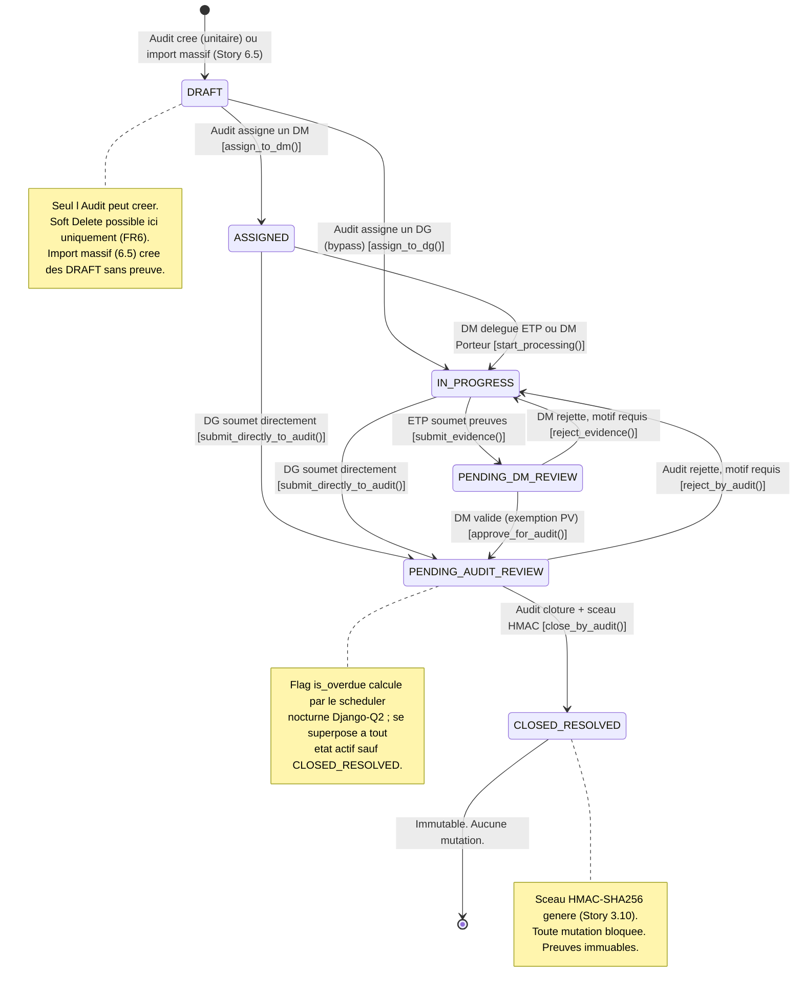
```mermaid
stateDiagram-v2
    [*] --> DRAFT : Audit cree (unitaire) ou import massif (Story 6.5)

    state "DRAFT" as DRAFT
    state "ASSIGNED" as ASSIGNED
    state "IN_PROGRESS" as IN_PROGRESS
    state "PENDING_DM_REVIEW" as PENDING_DM_REVIEW
    state "PENDING_AUDIT_REVIEW" as PENDING_AUDIT_REVIEW
    state "CLOSED_RESOLVED" as CLOSED_RESOLVED

    DRAFT --> ASSIGNED : Audit assigne un DM [assign_to_dm()]
    DRAFT --> IN_PROGRESS : Audit assigne un DG (bypass) [assign_to_dg()]

    ASSIGNED --> IN_PROGRESS : DM delegue ETP ou DM Porteur [start_processing()]
    ASSIGNED --> PENDING_AUDIT_REVIEW : DG soumet directement [submit_directly_to_audit()]

    IN_PROGRESS --> PENDING_DM_REVIEW : ETP soumet preuves [submit_evidence()]
    IN_PROGRESS --> PENDING_AUDIT_REVIEW : DG soumet directement [submit_directly_to_audit()]

    PENDING_DM_REVIEW --> PENDING_AUDIT_REVIEW : DM valide (exemption PV) [approve_for_audit()]
    PENDING_DM_REVIEW --> IN_PROGRESS : DM rejette, motif requis [reject_evidence()]

    PENDING_AUDIT_REVIEW --> CLOSED_RESOLVED : Audit cloture + sceau HMAC [close_by_audit()]
    PENDING_AUDIT_REVIEW --> IN_PROGRESS : Audit rejette, motif requis [reject_by_audit()]

    CLOSED_RESOLVED --> [*] : Immutable. Aucune mutation.

    note right of DRAFT
        Seul l Audit peut creer.
        Soft Delete possible ici uniquement (FR6).
        Import massif (6.5) cree des DRAFT sans preuve.
    end note

    note right of PENDING_AUDIT_REVIEW
        Flag is_overdue calcule par le scheduler
        nocturne Django-Q2 ; se superpose a tout
        etat actif sauf CLOSED_RESOLVED.
    end note

    note right of CLOSED_RESOLVED
        Sceau HMAC-SHA256 genere (Story 3.10).
        Toute mutation bloquee. Preuves immuables.
    end note
```

### 3.1 Machine à États de la Soumission de Preuves (EvidenceSubmission)

Le code modélise les preuves en **deux tables** : une `EvidenceSubmission` (lot) qui
porte le statut ci-dessous, et N `EvidenceFile` rattachés. Les fichiers d'un lot `DRAFT`
sont supprimables ; dès `PENDING`, ils deviennent immuables (append-only).

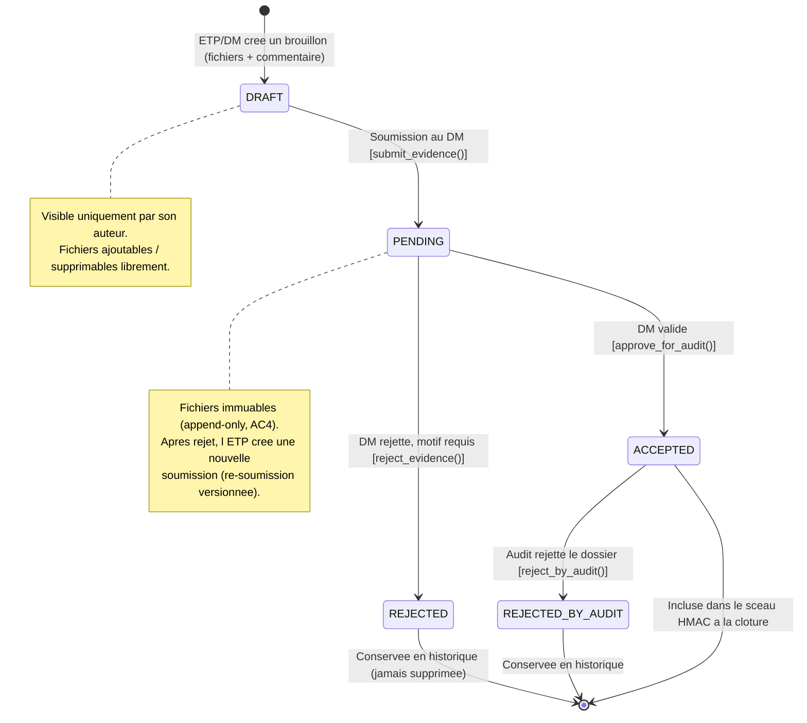
```mermaid
stateDiagram-v2
    [*] --> DRAFT : ETP/DM cree un brouillon (fichiers + commentaire)

    DRAFT --> PENDING : Soumission au DM [submit_evidence()]
    PENDING --> ACCEPTED : DM valide [approve_for_audit()]
    PENDING --> REJECTED : DM rejette, motif requis [reject_evidence()]
    ACCEPTED --> REJECTED_BY_AUDIT : Audit rejette le dossier [reject_by_audit()]

    REJECTED --> [*] : Conservee en historique (jamais supprimee)
    REJECTED_BY_AUDIT --> [*] : Conservee en historique
    ACCEPTED --> [*] : Incluse dans le sceau HMAC a la cloture

    note right of DRAFT
        Visible uniquement par son auteur.
        Fichiers ajoutables / supprimables librement.
    end note

    note right of PENDING
        Fichiers immuables (append-only, AC4).
        Apres rejet, l ETP cree une nouvelle
        soumission (re-soumission versionnee).
    end note
```

### 3.2 Machine à États de la Demande de Report

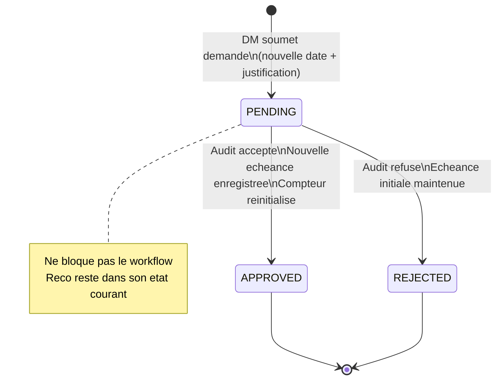
```mermaid
stateDiagram-v2
    [*] --> PENDING : DM soumet demande\n(nouvelle date + justification)

    PENDING --> APPROVED : Audit accepte\nNouvelle echeance enregistree\nCompteur reinitialise
    PENDING --> REJECTED : Audit refuse\nEcheance initiale maintenue

    APPROVED --> [*]
    REJECTED --> [*]

    note right of PENDING
        Ne bloque pas le workflow
        Reco reste dans son etat courant
    end note
```

---

## 4. Diagrammes de Séquence

### 4.1 Happy Path Complet (Assignation → Clôture)

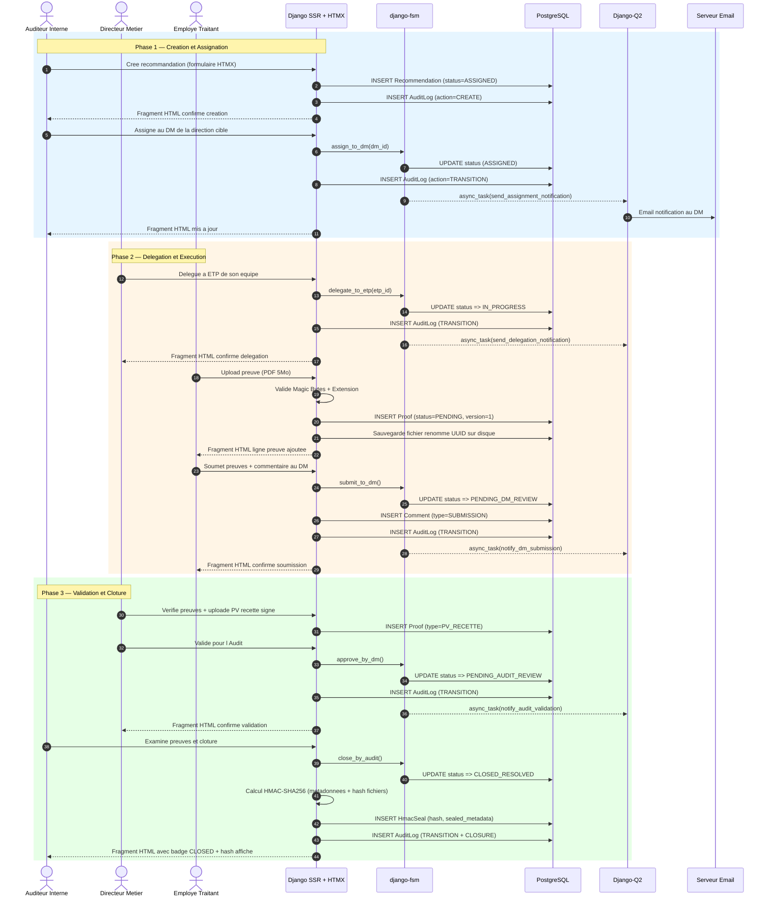
```mermaid
sequenceDiagram
    autonumber
    actor AU as Auditeur Interne
    actor DM as Directeur Metier
    actor ETP as Employe Traitant
    participant APP as Django SSR + HTMX
    participant FSM as django-fsm
    participant DB as PostgreSQL
    participant Q2 as Django-Q2
    participant SMTP as Serveur Email

    rect rgb(230, 245, 255)
        Note over AU, APP: Phase 1 — Creation et Assignation
        AU->>APP: Cree recommandation (formulaire HTMX)
        APP->>DB: INSERT Recommendation (status=ASSIGNED)
        APP->>DB: INSERT AuditLog (action=CREATE)
        APP-->>AU: Fragment HTML confirme creation

        AU->>APP: Assigne au DM de la direction cible
        APP->>FSM: assign_to_dm(dm_id)
        FSM->>DB: UPDATE status (ASSIGNED)
        APP->>DB: INSERT AuditLog (action=TRANSITION)
        FSM-->>Q2: async_task(send_assignment_notification)
        Q2->>SMTP: Email notification au DM
        APP-->>AU: Fragment HTML mis a jour
    end

    rect rgb(255, 245, 230)
        Note over DM, ETP: Phase 2 — Delegation et Execution
        DM->>APP: Delegue a ETP de son equipe
        APP->>FSM: delegate_to_etp(etp_id)
        FSM->>DB: UPDATE status => IN_PROGRESS
        APP->>DB: INSERT AuditLog (TRANSITION)
        FSM-->>Q2: async_task(send_delegation_notification)
        APP-->>DM: Fragment HTML confirme delegation

        ETP->>APP: Upload preuve (PDF 5Mo)
        APP->>APP: Valide Magic Bytes + Extension
        APP->>DB: INSERT Proof (status=PENDING, version=1)
        APP->>DB: Sauvegarde fichier renomme UUID sur disque
        APP-->>ETP: Fragment HTML ligne preuve ajoutee

        ETP->>APP: Soumet preuves + commentaire au DM
        APP->>FSM: submit_to_dm()
        FSM->>DB: UPDATE status => PENDING_DM_REVIEW
        APP->>DB: INSERT Comment (type=SUBMISSION)
        APP->>DB: INSERT AuditLog (TRANSITION)
        FSM-->>Q2: async_task(notify_dm_submission)
        APP-->>ETP: Fragment HTML confirme soumission
    end

    rect rgb(230, 255, 230)
        Note over DM, AU: Phase 3 — Validation et Cloture
        DM->>APP: Verifie preuves + uploade PV recette signe
        APP->>DB: INSERT Proof (type=PV_RECETTE)
        DM->>APP: Valide pour l Audit
        APP->>FSM: approve_by_dm()
        FSM->>DB: UPDATE status => PENDING_AUDIT_REVIEW
        APP->>DB: INSERT AuditLog (TRANSITION)
        FSM-->>Q2: async_task(notify_audit_validation)
        APP-->>DM: Fragment HTML confirme validation

        AU->>APP: Examine preuves et cloture
        APP->>FSM: close_by_audit()
        FSM->>DB: UPDATE status => CLOSED_RESOLVED
        APP->>APP: Calcul HMAC-SHA256 (metadonnees + hash fichiers)
        APP->>DB: INSERT HmacSeal (hash, sealed_metadata)
        APP->>DB: INSERT AuditLog (TRANSITION + CLOSURE)
        APP-->>AU: Fragment HTML avec badge CLOSED + hash affiche
    end
```

### 4.2 Soumission et Validation de Preuve (Détail Technique)

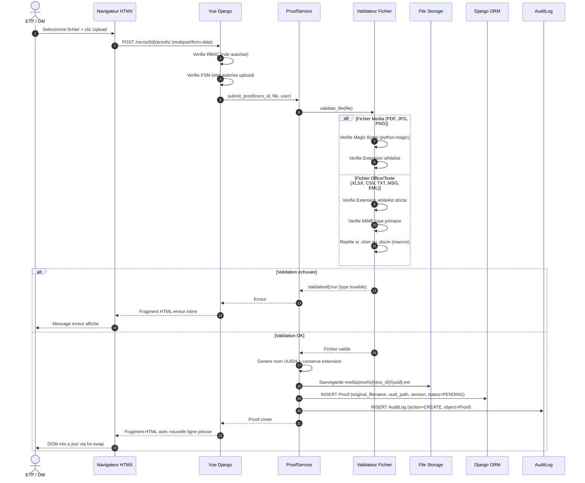
```mermaid
sequenceDiagram
    autonumber
    actor USER as ETP / DM
    participant HTML as Navigateur HTMX
    participant VUE as Vue Django
    participant SVC as ProofService
    participant VALID as Validateur Fichier
    participant DISK as File Storage
    participant ORM as Django ORM
    participant LOG as AuditLog

    USER->>HTML: Selectionne fichier + clic Upload
    HTML->>VUE: POST /recos/{id}/proofs/ (multipart/form-data)

    VUE->>VUE: Verifie RBAC (role autorise)
    VUE->>VUE: Verifie FSM (etat autorise upload)

    VUE->>SVC: submit_proof(reco_id, file, user)
    SVC->>VALID: validate_file(file)

    alt Fichier Media (PDF, JPG, PNG)
        VALID->>VALID: Verifie Magic Bytes (python-magic)
        VALID->>VALID: Verifie Extension whitelist
    else Fichier Office/Texte (XLSX, CSV, TXT, MSG, EML)
        VALID->>VALID: Verifie Extension whitelist stricte
        VALID->>VALID: Verifie MIME type primaire
        VALID->>VALID: Rejette si .xlsm ou .docm (macros)
    end

    alt Validation echouee
        VALID-->>SVC: ValidationError (type invalide)
        SVC-->>VUE: Erreur
        VUE-->>HTML: Fragment HTML erreur inline
        HTML-->>USER: Message erreur affiche
    else Validation OK
        VALID-->>SVC: Fichier valide
        SVC->>SVC: Genere nom UUID4 + conserve extension
        SVC->>DISK: Sauvegarde media/proofs/{reco_id}/{uuid}.ext
        SVC->>ORM: INSERT Proof (original_filename, uuid_path, version, status=PENDING)
        SVC->>LOG: INSERT AuditLog (action=CREATE, object=Proof)
        SVC-->>VUE: Proof creee
        VUE-->>HTML: Fragment HTML avec nouvelle ligne preuve
        HTML-->>USER: DOM mis a jour via hx-swap
    end
```

### 4.3 Rejet et Re-soumission

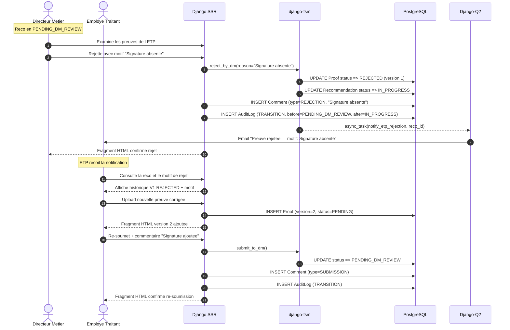
```mermaid
sequenceDiagram
    autonumber
    actor DM as Directeur Metier
    actor ETP as Employe Traitant
    participant APP as Django SSR
    participant FSM as django-fsm
    participant DB as PostgreSQL
    participant Q2 as Django-Q2

    Note over DM: Reco en PENDING_DM_REVIEW

    DM->>APP: Examine les preuves de l ETP
    DM->>APP: Rejette avec motif "Signature absente"
    APP->>FSM: reject_by_dm(reason="Signature absente")
    FSM->>DB: UPDATE Proof status => REJECTED (version 1)
    FSM->>DB: UPDATE Recommendation status => IN_PROGRESS
    APP->>DB: INSERT Comment (type=REJECTION, "Signature absente")
    APP->>DB: INSERT AuditLog (TRANSITION, before=PENDING_DM_REVIEW, after=IN_PROGRESS)
    FSM-->>Q2: async_task(notify_etp_rejection, reco_id)
    Q2->>ETP: Email "Preuve rejetee — motif: Signature absente"
    APP-->>DM: Fragment HTML confirme rejet

    Note over ETP: ETP recoit la notification

    ETP->>APP: Consulte la reco et le motif de rejet
    APP-->>ETP: Affiche historique V1 REJECTED + motif

    ETP->>APP: Upload nouvelle preuve corrigee
    APP->>DB: INSERT Proof (version=2, status=PENDING)
    APP-->>ETP: Fragment HTML version 2 ajoutee

    ETP->>APP: Re-soumet + commentaire "Signature ajoutee"
    APP->>FSM: submit_to_dm()
    FSM->>DB: UPDATE status => PENDING_DM_REVIEW
    APP->>DB: INSERT Comment (type=SUBMISSION)
    APP->>DB: INSERT AuditLog (TRANSITION)
    APP-->>ETP: Fragment HTML confirme re-soumission
```

### 4.4 Demande de Report d'Échéance

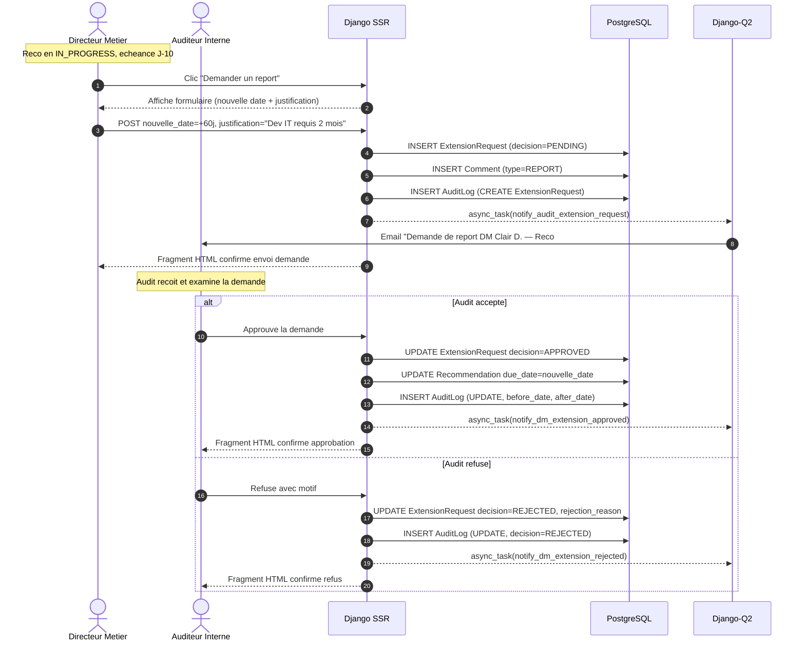
```mermaid
sequenceDiagram
    autonumber
    actor DM as Directeur Metier
    actor AU as Auditeur Interne
    participant APP as Django SSR
    participant DB as PostgreSQL
    participant Q2 as Django-Q2

    Note over DM: Reco en IN_PROGRESS, echeance J-10

    DM->>APP: Clic "Demander un report"
    APP-->>DM: Affiche formulaire (nouvelle date + justification)

    DM->>APP: POST nouvelle_date=+60j, justification="Dev IT requis 2 mois"
    APP->>DB: INSERT ExtensionRequest (decision=PENDING)
    APP->>DB: INSERT Comment (type=REPORT)
    APP->>DB: INSERT AuditLog (CREATE ExtensionRequest)
    APP-->>Q2: async_task(notify_audit_extension_request)
    Q2->>AU: Email "Demande de report DM Clair D. — Reco #42"
    APP-->>DM: Fragment HTML confirme envoi demande

    Note over AU: Audit recoit et examine la demande

    alt Audit accepte
        AU->>APP: Approuve la demande
        APP->>DB: UPDATE ExtensionRequest decision=APPROVED
        APP->>DB: UPDATE Recommendation due_date=nouvelle_date
        APP->>DB: INSERT AuditLog (UPDATE, before_date, after_date)
        APP-->>Q2: async_task(notify_dm_extension_approved)
        APP-->>AU: Fragment HTML confirme approbation
    else Audit refuse
        AU->>APP: Refuse avec motif
        APP->>DB: UPDATE ExtensionRequest decision=REJECTED, rejection_reason
        APP->>DB: INSERT AuditLog (UPDATE, decision=REJECTED)
        APP-->>Q2: async_task(notify_dm_extension_rejected)
        APP-->>AU: Fragment HTML confirme refus
    end
```

### 4.5 Import Massif en DRAFT (Story 6.5) — implémenté

Import « stateless » : un seul formulaire multipart porte le fichier. « Analyser »
fait un dry-run (rien créé) ; « Confirmer » re-soumet le **même** fichier vers l'endpoint
de confirmation, qui crée tout dans une **transaction atomique**. Plafond 50 lignes,
création en `DRAFT` (zéro notification, zéro FSM, zéro assignation).

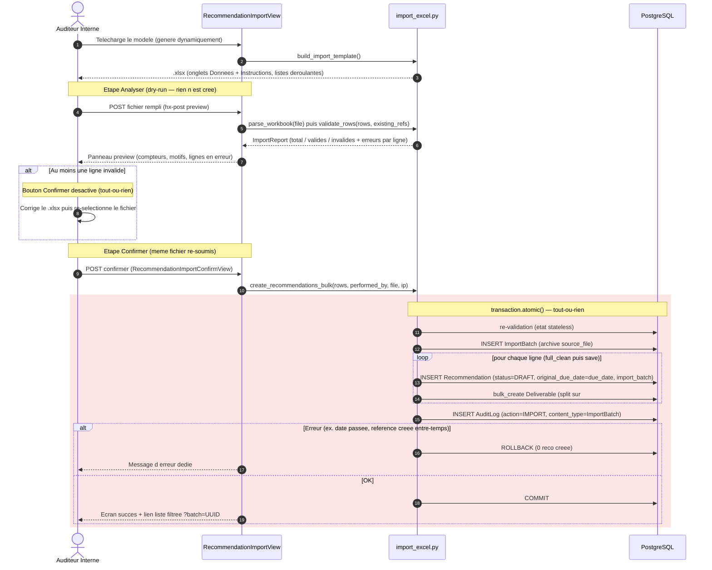
```mermaid
sequenceDiagram
    autonumber
    actor AU as Auditeur Interne
    participant APP as RecommendationImportView
    participant MOD as import_excel.py
    participant DB as PostgreSQL

    AU->>APP: Telecharge le modele (genere dynamiquement)
    APP->>MOD: build_import_template()
    MOD-->>AU: .xlsx (onglets Donnees + Instructions, listes deroulantes)

    Note over AU,APP: Etape Analyser (dry-run — rien n est cree)
    AU->>APP: POST fichier rempli (hx-post preview)
    APP->>MOD: parse_workbook(file) puis validate_rows(rows, existing_refs)
    MOD-->>APP: ImportReport (total / valides / invalides + erreurs par ligne)
    APP-->>AU: Panneau preview (compteurs, motifs, lignes en erreur)

    alt Au moins une ligne invalide
        Note over AU: Bouton Confirmer desactive (tout-ou-rien)
        AU->>AU: Corrige le .xlsx puis re-selectionne le fichier
    end

    Note over AU,APP: Etape Confirmer (meme fichier re-soumis)
    AU->>APP: POST confirmer (RecommendationImportConfirmView)
    APP->>MOD: create_recommendations_bulk(rows, performed_by, file, ip)
    rect rgb(255, 230, 230)
        Note over MOD,DB: transaction.atomic() — tout-ou-rien
        MOD->>DB: re-validation (etat stateless)
        MOD->>DB: INSERT ImportBatch (archive source_file)
        loop pour chaque ligne (full_clean puis save)
            MOD->>DB: INSERT Recommendation (status=DRAFT, original_due_date=due_date, import_batch)
            MOD->>DB: bulk_create Deliverable (split sur ;)
        end
        MOD->>DB: INSERT AuditLog (action=IMPORT, content_type=ImportBatch)
        alt Erreur (ex. date passee, reference creee entre-temps)
            MOD->>DB: ROLLBACK (0 reco creee)
            APP-->>AU: Message d erreur dedie
        else OK
            MOD->>DB: COMMIT
            APP-->>AU: Ecran succes + lien liste filtree ?batch=UUID
        end
    end
```

> **Import historique (Story 6.8 — backlog)** : un second flux, *distinct*, importera les
> recommandations **déjà clôturées** issues des archives (`status=CLOSED_RESOLVED`,
> `import_tag="IMPORTED"`, dates passées acceptées, preuves jointes via ZIP, jusqu'à
> 500 lignes). Il réutilisera `ImportBatch` et le pattern wizard de 6.5. Non encore
> implémenté.

### 4.6 Cycle de Notifications In-App (Scheduler Nocturne)

Implémenté en **in-app uniquement** (Stories 4.0/4.1/4.2). Une planification Django-Q2
appelle `run_nightly_notifications()` qui enchaîne deux services. Chaque notification est
**idempotente** par `(recipient, idempotency_key)` : un 2ᵉ run stable ne crée aucun
doublon, et un changement d'état (report, clôture) **réconcilie** (supprime) les
notifications devenues obsolètes. **Aucun e-mail** (canal e-mail = backlog post-MVP).

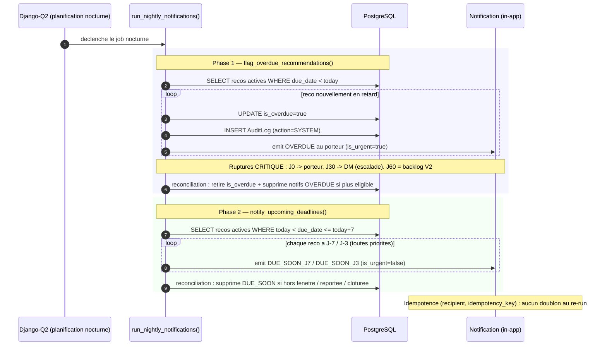
```mermaid
sequenceDiagram
    autonumber
    participant Q2 as Django-Q2 (planification nocturne)
    participant WF as run_nightly_notifications()
    participant DB as PostgreSQL
    participant NOTIF as Notification (in-app)

    Q2->>WF: declenche le job nocturne

    rect rgb(245, 245, 255)
        Note over WF,DB: Phase 1 — flag_overdue_recommendations()
        WF->>DB: SELECT recos actives WHERE due_date < today
        loop reco nouvellement en retard
            WF->>DB: UPDATE is_overdue=true
            WF->>DB: INSERT AuditLog (action=SYSTEM)
            WF->>NOTIF: emit OVERDUE au porteur (is_urgent=true)
        end
        Note over WF,NOTIF: Ruptures CRITIQUE : J0 -> porteur, J30 -> DM (escalade). J60 = backlog V2
        WF->>DB: reconciliation : retire is_overdue + supprime notifs OVERDUE si plus eligible
    end

    rect rgb(245, 255, 245)
        Note over WF,DB: Phase 2 — notify_upcoming_deadlines()
        WF->>DB: SELECT recos actives WHERE today < due_date <= today+7
        loop chaque reco a J-7 / J-3 (toutes priorites)
            WF->>NOTIF: emit DUE_SOON_J7 / DUE_SOON_J3 (is_urgent=false)
        end
        WF->>DB: reconciliation : supprime DUE_SOON si hors fenetre / reportee / cloturee
    end

    Note over NOTIF: Idempotence (recipient, idempotency_key) : aucun doublon au re-run
```

> **Lecture par l'utilisateur :** le badge + le dropdown HTMX de la topbar lisent la table
> `Notification` (non-lues, tri anti-chronologique). Marquage lu individuel / tout.

### 4.7 Export ZIP Auditeur Externe (COBAC)

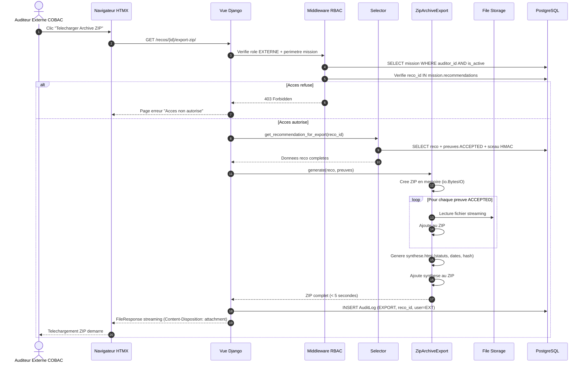
```mermaid
sequenceDiagram
    autonumber
    actor EXT as Auditeur Externe COBAC
    participant HTML as Navigateur HTMX
    participant VUE as Vue Django
    participant RBAC as Middleware RBAC
    participant SEL as Selector
    participant EXP as ZipArchiveExport
    participant DISK as File Storage
    participant DB as PostgreSQL

    EXT->>HTML: Clic "Telecharger Archive ZIP"
    HTML->>VUE: GET /recos/{id}/export-zip/

    VUE->>RBAC: Verifie role EXTERNE + perimetre mission
    RBAC->>DB: SELECT mission WHERE auditor_id AND is_active
    RBAC->>DB: Verifie reco_id IN mission.recommendations

    alt Acces refuse
        RBAC-->>VUE: 403 Forbidden
        VUE-->>HTML: Page erreur "Acces non autorise"
    else Acces autorise
        VUE->>SEL: get_recommendation_for_export(reco_id)
        SEL->>DB: SELECT reco + preuves ACCEPTED + sceau HMAC
        SEL-->>VUE: Donnees reco completes

        VUE->>EXP: generate(reco, preuves)
        EXP->>EXP: Cree ZIP en memoire (io.BytesIO)
        loop Pour chaque preuve ACCEPTED
            EXP->>DISK: Lecture fichier streaming
            EXP->>EXP: Ajoute au ZIP
        end
        EXP->>EXP: Genere synthese.html (statuts, dates, hash)
        EXP->>EXP: Ajoute synthese au ZIP
        EXP-->>VUE: ZIP complet (< 5 secondes)

        VUE->>DB: INSERT AuditLog (EXPORT, reco_id, user=EXT)
        VUE-->>HTML: FileResponse streaming (Content-Disposition: attachment)
        HTML-->>EXT: Telechargement ZIP demarre
    end
```

### 4.8 Authentification et Contrôle de Session

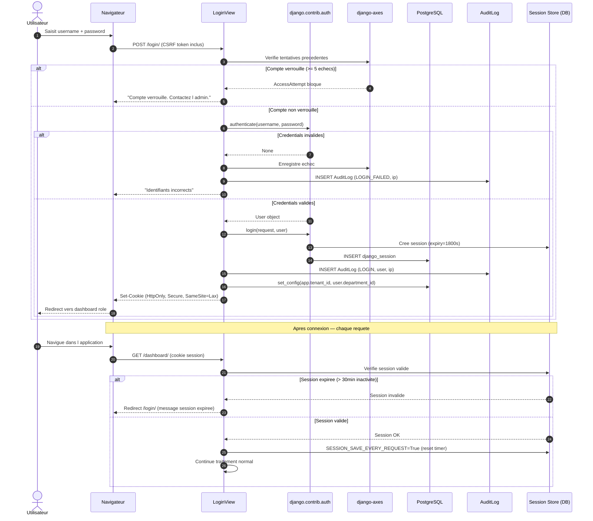
```mermaid
sequenceDiagram
    autonumber
    actor USER as Utilisateur
    participant HTML as Navigateur
    participant VUE as LoginView
    participant AUTH as django.contrib.auth
    participant AXES as django-axes
    participant DB as PostgreSQL
    participant LOG as AuditLog
    participant SESS as Session Store (DB)

    USER->>HTML: Saisit username + password
    HTML->>VUE: POST /login/ (CSRF token inclus)

    VUE->>AXES: Verifie tentatives precedentes
    alt Compte verrouille (>= 5 echecs)
        AXES-->>VUE: AccessAttempt bloque
        VUE-->>HTML: "Compte verrouille. Contactez l admin."
    else Compte non verrouille
        VUE->>AUTH: authenticate(username, password)
        alt Credentials invalides
            AUTH-->>VUE: None
            VUE->>AXES: Enregistre echec
            VUE->>LOG: INSERT AuditLog (LOGIN_FAILED, ip)
            VUE-->>HTML: "Identifiants incorrects"
        else Credentials valides
            AUTH-->>VUE: User object
            VUE->>AUTH: login(request, user)
            AUTH->>SESS: Cree session (expiry=1800s)
            AUTH->>DB: INSERT django_session
            VUE->>LOG: INSERT AuditLog (LOGIN, user, ip)
            VUE->>DB: set_config(app.tenant_id, user.department_id)
            VUE-->>HTML: Set-Cookie (HttpOnly, Secure, SameSite=Lax)
            HTML-->>USER: Redirect vers dashboard role
        end
    end

    Note over HTML, SESS: Apres connexion — chaque requete

    USER->>HTML: Navigue dans l application
    HTML->>VUE: GET /dashboard/ (cookie session)
    VUE->>SESS: Verifie session valide
    alt Session expiree (> 30min inactivite)
        SESS-->>VUE: Session invalide
        VUE-->>HTML: Redirect /login/ (message session expiree)
    else Session valide
        SESS-->>VUE: Session OK
        VUE->>SESS: SESSION_SAVE_EVERY_REQUEST=True (reset timer)
        VUE->>VUE: Continue traitement normal
    end
```

### 4.9 Provisioning des Comptes — Maker / Checker (Story 6.2.0)

Circuit à quatre yeux pour la création de comptes. L'**Admin IT (maker)** soumet une
demande complète (identité + rôle + département + mot de passe **haché dès la
soumission**). Aucun `User` n'existe avant l'approbation. Un **membre du groupe
« Administrateurs Sentinel » (checker)** valide ou rejette. C'est une **révision de
l'ADR-10** : ce flux coexiste avec l'habilitation Audit (attribution/édition des rôles
par l'Audit Admin).

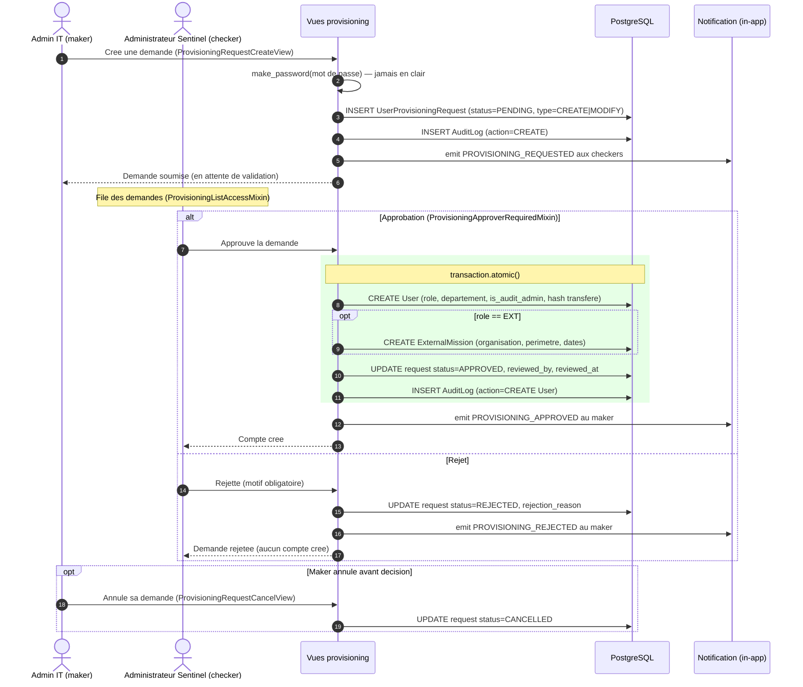
```mermaid
sequenceDiagram
    autonumber
    actor IT as Admin IT (maker)
    actor CK as Administrateur Sentinel (checker)
    participant APP as Vues provisioning
    participant DB as PostgreSQL
    participant NOTIF as Notification (in-app)

    IT->>APP: Cree une demande (ProvisioningRequestCreateView)
    APP->>APP: make_password(mot de passe) — jamais en clair
    APP->>DB: INSERT UserProvisioningRequest (status=PENDING, type=CREATE|MODIFY)
    APP->>DB: INSERT AuditLog (action=CREATE)
    APP->>NOTIF: emit PROVISIONING_REQUESTED aux checkers
    APP-->>IT: Demande soumise (en attente de validation)

    Note over CK: File des demandes (ProvisioningListAccessMixin)

    alt Approbation (ProvisioningApproverRequiredMixin)
        CK->>APP: Approuve la demande
        rect rgb(230, 255, 230)
            Note over APP,DB: transaction.atomic()
            APP->>DB: CREATE User (role, departement, is_audit_admin, hash transfere)
            opt role == EXT
                APP->>DB: CREATE ExternalMission (organisation, perimetre, dates)
            end
            APP->>DB: UPDATE request status=APPROVED, reviewed_by, reviewed_at
            APP->>DB: INSERT AuditLog (action=CREATE User)
        end
        APP->>NOTIF: emit PROVISIONING_APPROVED au maker
        APP-->>CK: Compte cree
    else Rejet
        CK->>APP: Rejette (motif obligatoire)
        APP->>DB: UPDATE request status=REJECTED, rejection_reason
        APP->>NOTIF: emit PROVISIONING_REJECTED au maker
        APP-->>CK: Demande rejetee (aucun compte cree)
    end

    opt Maker annule avant decision
        IT->>APP: Annule sa demande (ProvisioningRequestCancelView)
        APP->>DB: UPDATE request status=CANCELLED
    end
```

---

## 5. Diagrammes de Cas d'Utilisation

### 5.1 Auditeur Interne

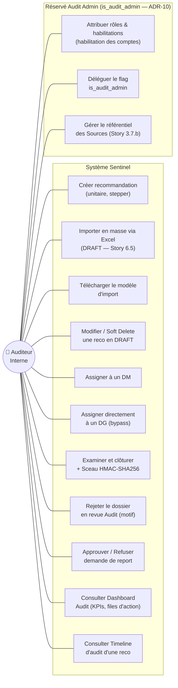
```mermaid
flowchart LR
    subgraph "Système Sentinel"
        UC1["Créer recommandation\n(unitaire, stepper)"]
        UC2["Importer en masse via Excel\n(DRAFT — Story 6.5)"]
        UC3["Télécharger le modèle\nd'import"]
        UC4["Modifier / Soft Delete\nune reco en DRAFT"]
        UC5["Assigner à un DM"]
        UC6["Assigner directement\nà un DG (bypass)"]
        UC7["Examiner et clôturer\n+ Sceau HMAC-SHA256"]
        UC8["Rejeter le dossier\nen revue Audit (motif)"]
        UC9["Approuver / Refuser\ndemande de report"]
        UC10["Consulter Dashboard\nAudit (KPIs, files d'action)"]
        UC11["Consulter Timeline\nd'audit d'une reco"]
    end

    subgraph "Réservé Audit Admin (is_audit_admin — ADR-10)"
        UC12["Attribuer rôles & habilitations\n(habilitation des comptes)"]
        UC13["Déléguer le flag\nis_audit_admin"]
        UC14["Gérer le référentiel\ndes Sources (Story 3.7.b)"]
    end

    AU(("🔵 Auditeur\nInterne"))

    AU --- UC1
    AU --- UC2
    AU --- UC3
    AU --- UC4
    AU --- UC5
    AU --- UC6
    AU --- UC7
    AU --- UC8
    AU --- UC9
    AU --- UC10
    AU --- UC11
    AU --- UC12
    AU --- UC13
    AU --- UC14
```

### 5.2 Directeur Métier (DM)

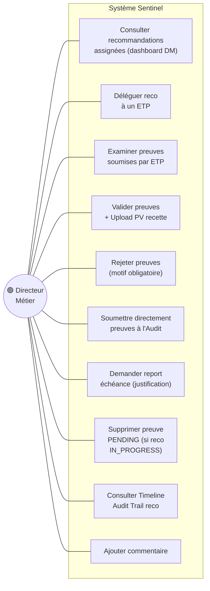
```mermaid
flowchart LR
    subgraph "Système Sentinel"
        UC1["Consulter recommandations\nassignées (dashboard DM)"]
        UC2["Déléguer reco\nà un ETP"]
        UC3["Examiner preuves\nsoumises par ETP"]
        UC4["Valider preuves\n+ Upload PV recette"]
        UC5["Rejeter preuves\n(motif obligatoire)"]
        UC6["Soumettre directement\npreuves à l'Audit"]
        UC7["Demander report\néchéance (justification)"]
        UC8["Supprimer preuve\nPENDING (si reco\nIN_PROGRESS)"]
        UC9["Consulter Timeline\nAudit Trail reco"]
        UC10["Ajouter commentaire"]
    end

    DM(("🟢 Directeur\nMétier"))

    DM --- UC1
    DM --- UC2
    DM --- UC3
    DM --- UC4
    DM --- UC5
    DM --- UC6
    DM --- UC7
    DM --- UC8
    DM --- UC9
    DM --- UC10
```

### 5.3 Employé Traitant (ETP)

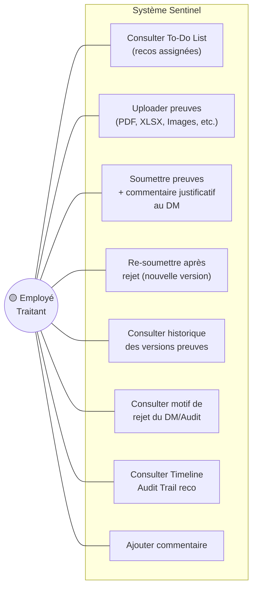
```mermaid
flowchart LR
    subgraph "Système Sentinel"
        UC1["Consulter To-Do List\n(recos assignées)"]
        UC2["Uploader preuves\n(PDF, XLSX, Images, etc.)"]
        UC3["Soumettre preuves\n+ commentaire justificatif\nau DM"]
        UC4["Re-soumettre après\nrejet (nouvelle version)"]
        UC5["Consulter historique\ndes versions preuves"]
        UC6["Consulter motif de\nrejet du DM/Audit"]
        UC7["Consulter Timeline\nAudit Trail reco"]
        UC8["Ajouter commentaire"]
    end

    ETP(("🟡 Employé\nTraitant"))

    ETP --- UC1
    ETP --- UC2
    ETP --- UC3
    ETP --- UC4
    ETP --- UC5
    ETP --- UC6
    ETP --- UC7
    ETP --- UC8
```

### 5.4 Direction Générale (DG)

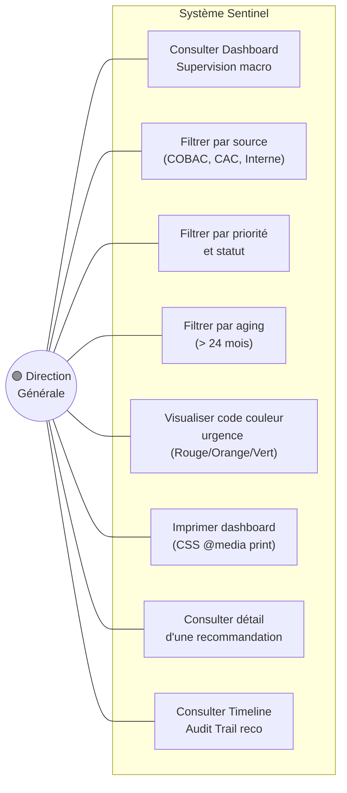
```mermaid
flowchart LR
    subgraph "Système Sentinel"
        UC1["Consulter Dashboard\nSupervision macro"]
        UC2["Filtrer par source\n(COBAC, CAC, Interne)"]
        UC3["Filtrer par priorité\net statut"]
        UC4["Filtrer par aging\n(> 24 mois)"]
        UC5["Visualiser code couleur\nurgence (Rouge/Orange/Vert)"]
        UC6["Imprimer dashboard\n(CSS @media print)"]
        UC7["Consulter détail\nd'une recommandation"]
        UC8["Consulter Timeline\nAudit Trail reco"]
    end

    DG(("🟣 Direction\nGénérale"))

    DG --- UC1
    DG --- UC2
    DG --- UC3
    DG --- UC4
    DG --- UC5
    DG --- UC6
    DG --- UC7
    DG --- UC8
```

### 5.5 Auditeur Externe (COBAC / BEAC / CAC)

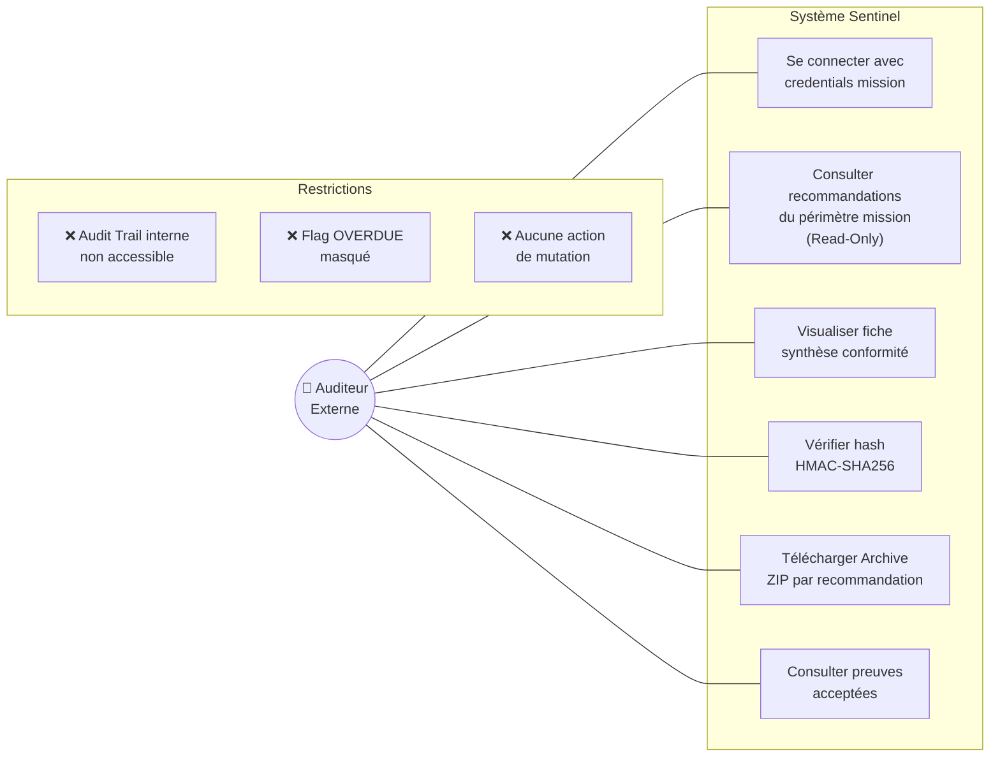
```mermaid
flowchart LR
    subgraph "Système Sentinel"
        UC1["Se connecter avec\ncredentials mission"]
        UC2["Consulter recommandations\ndu périmètre mission\n(Read-Only)"]
        UC3["Visualiser fiche\nsynthèse conformité"]
        UC4["Vérifier hash\nHMAC-SHA256"]
        UC5["Télécharger Archive\nZIP par recommandation"]
        UC6["Consulter preuves\nacceptées"]
    end

    subgraph "Restrictions"
        R1["❌ Audit Trail interne\nnon accessible"]
        R2["❌ Flag OVERDUE\nmasqué"]
        R3["❌ Aucune action\nde mutation"]
    end

    EXT(("🔴 Auditeur\nExterne"))

    EXT --- UC1
    EXT --- UC2
    EXT --- UC3
    EXT --- UC4
    EXT --- UC5
    EXT --- UC6
```

### 5.6 Admin IT

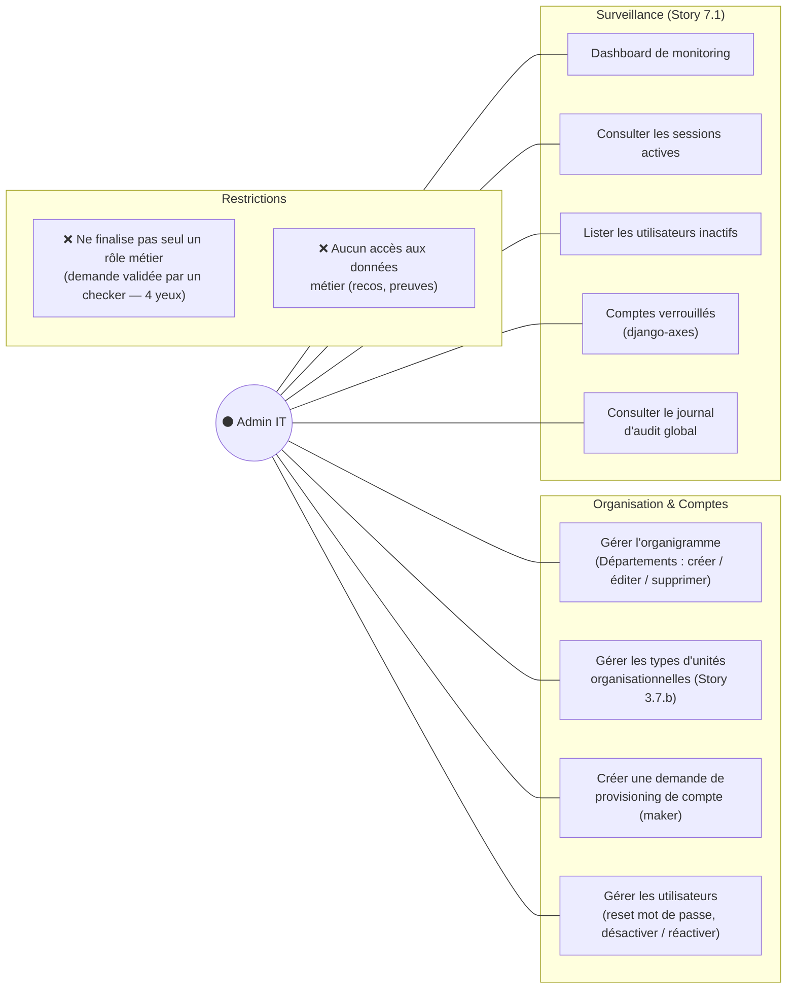
```mermaid
flowchart LR
    subgraph "Organisation & Comptes"
        UC1["Gérer l'organigramme\n(Départements : créer / éditer / supprimer)"]
        UC2["Gérer les types d'unités\norganisationnelles (Story 3.7.b)"]
        UC3["Créer une demande de\nprovisioning de compte (maker)"]
        UC4["Gérer les utilisateurs\n(reset mot de passe, désactiver / réactiver)"]
    end

    subgraph "Surveillance (Story 7.1)"
        UC5["Dashboard de monitoring"]
        UC6["Consulter les sessions actives"]
        UC7["Lister les utilisateurs inactifs"]
        UC8["Comptes verrouillés\n(django-axes)"]
        UC9["Consulter le journal\nd'audit global"]
    end

    subgraph "Restrictions"
        R1["❌ Ne finalise pas seul un rôle métier\n(demande validée par un checker — 4 yeux)"]
        R2["❌ Aucun accès aux données\nmétier (recos, preuves)"]
    end

    ADMIN(("⚫ Admin IT"))

    ADMIN --- UC1
    ADMIN --- UC2
    ADMIN --- UC3
    ADMIN --- UC4
    ADMIN --- UC5
    ADMIN --- UC6
    ADMIN --- UC7
    ADMIN --- UC8
    ADMIN --- UC9
```

### 5.7 Checker / Administrateur Sentinel

Acteur introduit par le provisioning Maker/Checker (Story 6.2.0) : membre du groupe
« Administrateurs Sentinel », distinct du maker (Admin IT). Garant du contrôle à quatre yeux.

```mermaid
flowchart LR
    subgraph "Système Sentinel"
        UC1["Consulter la file des\ndemandes de provisioning"]
        UC2["Approuver une demande\n(crée le compte + mission EXT)"]
        UC3["Rejeter une demande\n(motif obligatoire)"]
    end

    CK(("🟤 Checker\n(Administrateur Sentinel)"))

    CK --- UC1
    CK --- UC2
    CK --- UC3
```

---

## 6. Diagramme de Classes

Architecture Clean (HackSoft Styleguide) avec les couches Models → Selectors → Services → Views.

```mermaid
classDiagram
    direction TB

    %% ===== DOMAIN: USERS =====
    namespace UsersApp {
        class OrgUnitType {
            +UUID id
            +String name
            +String code
            +Integer level
            +Boolean is_active
        }

        class Department {
            +UUID id
            +String name
            +String code
            +OrgUnitType type
            +Department parent
            +Boolean is_active
            +Boolean is_system
            +get_children() QuerySet
            +clean() void
        }

        class User {
            +UUID id
            +String username
            +String email
            +String first_name
            +String last_name
            +String role "vide = coquille vide"
            +Department department
            +Boolean is_external
            +Boolean is_audit_admin
            +String job_title
            +Boolean is_active
            +has_role() Boolean
            +can_manage_users() Boolean
            +is_shell_account() Boolean
        }

        class ExternalMission {
            +UUID id
            +User auditor
            +String organization
            +String scope_description
            +Date start_date
            +Date end_date
            +Boolean is_active
        }

        class UserProvisioningRequest {
            +UUID id
            +String requested_username
            +String requested_email
            +String hashed_initial_password
            +String requested_role
            +Department requested_department
            +Boolean requested_is_audit_admin
            +String status "PENDING|APPROVED|REJECTED|CANCELLED"
            +String request_type "CREATE|MODIFY"
            +User requested_by "maker"
            +User reviewed_by "checker"
            +User target_user
            +clean() void
        }

        class UserSelector {
            +get_users_by_direction(dept_id) QuerySet
            +get_active_dm_for_direction(dept_id) QuerySet
            +get_etp_for_dm(dm_user) QuerySet
        }

        class UserService {
            +create_user(data) User
            +reset_password(user_id) None
            +deactivate_user(user_id) None
            +reactivate_user(user_id) None
        }

        class AccessMixins {
            <<mixins>>
            AuditRequiredMixin
            AuditAdminRequiredMixin
            AdminRequiredMixin
            WorkflowAccessMixin
            ProvisioningApproverRequiredMixin
            ProvisioningListAccessMixin
        }
    }

    %% ===== DOMAIN: WORKFLOW =====
    namespace WorkflowApp {
        class RecommendationSource {
            +UUID id
            +String code
            +String label
            +Boolean is_external
            +Boolean is_active
        }

        class Recommendation {
            +UUID id
            +String reference
            +String mission_label
            +Date mission_date
            +Text description
            +Text observations
            +Text anomalous_dossiers
            +RecommendationSource source
            +PriorityEnum priority
            +Department department
            +Department controlled_department
            +Date due_date
            +Date original_due_date
            +FSMField status "6 etats"
            +Boolean is_overdue
            +User created_by
            +User assigned_dm
            +User assigned_etp
            +String import_tag
            +ImportBatch import_batch
            +DateTime closed_at
            +User closed_by
            +Boolean is_deleted
            +progress_percentage() Integer
            +assign_to_dm(dm) void
            +assign_to_dg(dg) void
            +start_processing() void
            +submit_evidence() void
            +reject_evidence() void
            +approve_for_audit() void
            +submit_directly_to_audit() void
            +close_by_audit() void
            +reject_by_audit() void
        }

        class Deliverable {
            +UUID id
            +Recommendation recommendation
            +String label
            +Integer order
            +Boolean is_completed
            +DateTime completed_at
            +User completed_by
        }

        class EvidenceSubmission {
            +UUID id
            +Recommendation recommendation
            +Text comment
            +User submitted_by
            +SubmissionStatusEnum status
            +Text review_comment
            +DateTime reviewed_at
            +User reviewed_by
        }

        class EvidenceFile {
            +UUID id
            +EvidenceSubmission submission
            +File file
            +String original_filename
            +Integer file_size
            +String mime_type
            +String sha256_hash
            +TagEnum tag
            +User uploaded_by
            +delete() void "interdit si non-DRAFT"
        }

        class ExtensionRequest {
            +UUID id
            +Recommendation recommendation
            +User requested_by
            +Date requested_date
            +Text reason
            +User reviewed_by
            +DateTime reviewed_at
            +Text audit_comment
            +StatusEnum status
        }

        class ImportBatch {
            +UUID id
            +File source_file
            +String file_name
            +User created_by
            +Integer recommendation_count
        }

        class RecommendationSelector {
            +get_recommendations_for_user(user, filters) QuerySet
            +get_recommendation_detail(pk, user) Recommendation
            +get_pending_extension_for_recommendation(reco) ExtensionRequest
            +get_evidence_for_recommendation(reco, user) QuerySet
        }

        class WorkflowService {
            +create_recommendation(data, user) Recommendation
            +soft_delete_recommendation(reco, user) None
            +assign_recommendation_to_dm(reco, dm, user) None
            +assign_recommendation_to_dg(reco, dg, user) None
            +delegate_recommendation_to_etp(reco, etp, user) None
            +flag_overdue_recommendations() Dict
            +notify_upcoming_deadlines() Dict
            +run_nightly_notifications() None
        }

        class EvidenceService {
            +get_or_create_draft_submission(reco, user) EvidenceSubmission
            +add_file_to_draft(submission, file, ...) EvidenceFile
            +submit_evidence_for_recommendation(reco, comment, files, user) None
            +reject_evidence_submission(reco, submission, reason, user) None
            +validate_evidence_for_audit(reco, submission, user) None
            +submit_evidence_by_dg(reco, files, user) None
            +close_recommendation_by_audit(reco, user) None
        }

        class ImportExcelModule {
            <<module import_excel.py>>
            +build_import_template() Workbook
            +parse_workbook(file) RowDraft[]
            +validate_rows(rows, existing_refs) ImportReport
            +create_recommendations_bulk(rows, user, file, ip) ImportBatch
        }

        class ExtensionService {
            +request_extension(reco, date, reason, user) ExtensionRequest
            +approve_extension(reco, ext, comment, user) None
            +reject_extension(reco, ext, comment, user) None
        }
    }

    %% ===== DOMAIN: AUDIT =====
    namespace AuditApp {
        class AuditLog {
            +UUID id
            +User user
            +ActionEnum action
            +String content_type
            +UUID object_id
            +JSONB changes
            +IPAddress ip_address
            +String description
            +DateTime created_at
        }

        class HmacSeal {
            +UUID id
            +Recommendation recommendation
            +String hmac_hash
            +JSONB sealed_metadata
            +JSONB file_hashes
            +User sealed_by
            +DateTime sealed_at
        }

        class CryptoService {
            +generate_recommendation_seal(reco, sealed_by) HmacSeal
            +verify_recommendation_seal(reco) Boolean
            +_build_seal_payload(reco) Dict
        }

        class AuditSelector {
            +get_audit_logs(action, content_type, user_id, dates) QuerySet
        }

        class ZipArchiveExport {
            <<à implémenter — Story 6.7>>
            +generate(reco, preuves) BytesIO
        }
    }

    %% ===== DOMAIN: NOTIFICATIONS =====
    namespace NotificationsApp {
        class Notification {
            +UUID id
            +User recipient
            +NotifTypeEnum notification_type
            +Recommendation recommendation
            +String title
            +Text body
            +String url
            +Boolean is_urgent
            +Boolean is_read
            +String idempotency_key "unique (recipient, key)"
            +DateTime created_at
        }

        class NotificationService {
            +emit_notification(recipient, type, key, ...) Notification
            +notify_porteur(reco, type) None
            +notify_dm(reco, type) None
            +notify_audit_owner(reco, type) None
        }

        class EmailDigest {
            <<backlog post-MVP>>
            +send_weekly_digest(user) None
        }
    }

    %% ===== ENUMS =====
    namespace Enumerations {
        class PriorityEnum {
            <<enumeration>>
            CRITIQUE
            HAUTE
            MOYENNE
            FAIBLE
        }

        class RecoStatusEnum {
            <<enumeration>>
            DRAFT
            ASSIGNED
            IN_PROGRESS
            PENDING_DM_REVIEW
            PENDING_AUDIT_REVIEW
            CLOSED_RESOLVED
        }

        class SubmissionStatusEnum {
            <<enumeration>>
            DRAFT
            PENDING
            ACCEPTED
            REJECTED
            REJECTED_BY_AUDIT
        }

        class TagEnum {
            <<enumeration>>
            JUSTIFICATIF
            PV_RECETTE
            RAPPORT
            AUTRE
        }
    }

    note "Les sources de recommandation ne sont plus un enum :\nelles sont paramétrables via le modèle RecommendationSource (Story 3.7.b)."

    %% ===== RELATIONSHIPS =====
    OrgUnitType "1" --> "*" Department : categorizes
    User "*" --> "0..1" Department : belongs to
    Department "0..1" --> "0..*" Department : parent
    ExternalMission "*" --> "1" User : auditor
    UserProvisioningRequest "*" --> "1" User : requested_by (maker)
    UserProvisioningRequest "*" --> "0..1" User : reviewed_by (checker)

    RecommendationSource "1" --> "*" Recommendation : source
    Recommendation "*" --> "0..1" Department : department
    Recommendation "*" --> "0..1" Department : controlled_department
    Recommendation "*" --> "1" User : created_by
    Recommendation "*" --> "0..1" User : assigned_dm
    Recommendation "*" --> "0..1" User : assigned_etp
    Recommendation "*" --> "0..1" ImportBatch : import_batch
    Deliverable "*" --> "1" Recommendation : belongs to
    EvidenceSubmission "*" --> "1" Recommendation : belongs to
    EvidenceSubmission "*" --> "1" User : submitted_by
    EvidenceFile "*" --> "1" EvidenceSubmission : belongs to
    ExtensionRequest "*" --> "1" Recommendation : for
    ExtensionRequest "*" --> "1" User : requested_by

    AuditLog "*" --> "0..1" User : performed by
    HmacSeal "1" --> "1" Recommendation : seals

    Notification "*" --> "1" User : recipient
    Notification "*" --> "0..1" Recommendation : about

    Recommendation ..> PriorityEnum : uses
    Recommendation ..> RecoStatusEnum : FSM status
    EvidenceSubmission ..> SubmissionStatusEnum : uses
    EvidenceFile ..> TagEnum : uses

    RecommendationSelector ..> Recommendation : reads
    WorkflowService ..> Recommendation : writes
    EvidenceService ..> EvidenceSubmission : writes
    ImportExcelModule ..> ImportBatch : creates
    CryptoService ..> HmacSeal : creates
    NotificationService ..> Notification : creates
    AuditSelector ..> AuditLog : reads
    UserSelector ..> User : reads
    UserService ..> User : writes
    ExtensionService ..> ExtensionRequest : manages
```

---

## Annexe : Légende des Diagrammes

| Symbole | Signification |
|---|---|
| **FSM** | Finite State Machine (`django-fsm`) |
| **RBAC** | Role-Based Access Control (applicatif) |
| **RLS** | Row-Level Security (PostgreSQL) |
| **HMAC-SHA256** | Hash-based Message Authentication Code |
| **Q2** | Django-Q2 (Task Queue asynchrone) |
| **SSR** | Server-Side Rendering (Templates Django) |
| **HTMX** | Hypermedia framework (échanges HTML, pas JSON) |

---

> **Cohérence assurée avec :**
> - **Code implémenté** (`code/apps/*`) — source de vérité au 2026-06-19
> - PRD v2 / Architecture v2 / Product Brief v2 (à resynchroniser sur cette v2 des diagrammes)
> - 6 rôles (AUDIT, DM, ETP, DG, EXT, ADMIN) + acteur Checker (Administrateurs Sentinel)
>
> **Éléments encore non implémentés (signalés dans les diagrammes) :** export ZIP auditeur
> externe (Story 6.7, prévu), import historique clôturé (Story 6.8), intérims/délégation
> (FR4), canal e-mail / digests (post-MVP), cloisonnement de périmètre mission↔reco.
