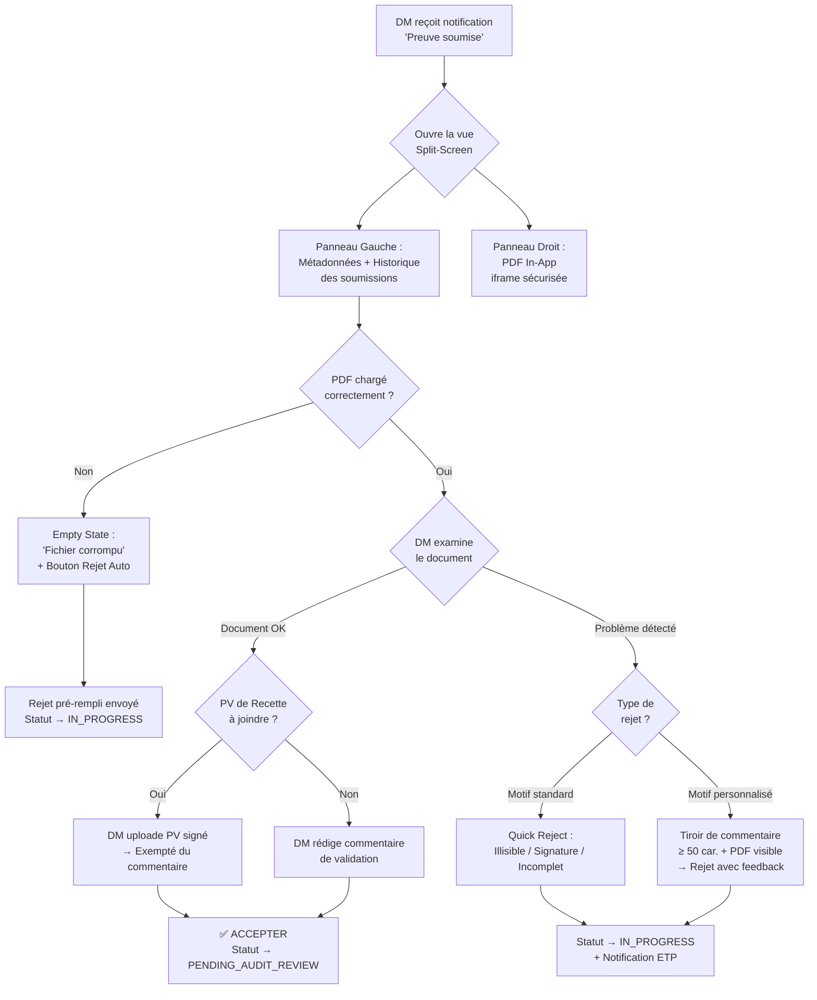
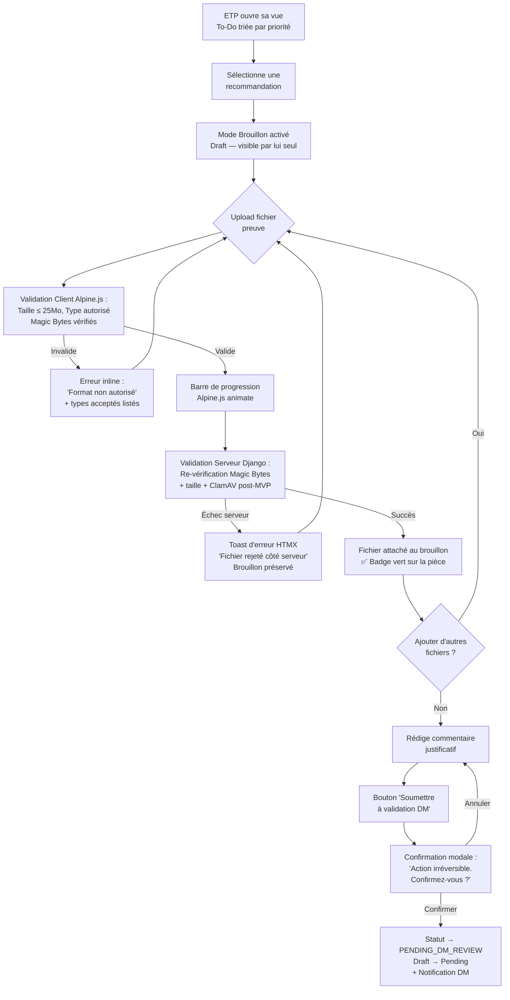
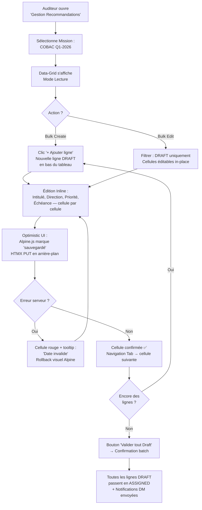

# UX Design Specification bicec--Sentinel

**Author:** Dave Lahe
**Date:** 2026-04-06

---

<!-- UX design content will be appended sequentially through collaborative workflow steps -->

## Executive Summary

### Project Vision

Transformer et centraliser le suivi des recommandations d'audit de la BICEC en remplaçant les silos manuels par un système minimaliste "centré sur l'action". Sentinel doit répondre de façon évidente à : "Qui doit faire quoi, pour quand, et où se trouve la preuve ?". L'outil dictera une conformité irréprochable (COBAC) sans surcharger l'utilisateur de données superflues, dictant l'usage par son ergonomie.

### Target Users

- **Auditeur Interne :** Orchestrateur du système, il a besoin d'une UX de saisie ultra-fluide (composant "Bulk Create" type tableur) comme bouclier contre la charge administrative.
- **Directeur Métier (DM) :** Décideur saturé qui exige une interface de validation à "guichet unique". Il ne doit pas avoir à télécharger les preuves en externe : le système lui doit la prévisualisation immédiate pour permettre la décision en ≤ 3 clics.
- **Employé Traitant (ETP) :** Opérationnel ayant besoin d'une distinction parfaite entre ses propres brouillons révocables (DRAFT), ses preuves soumises sous le regard du DM (PENDING), et une mise en évidence limpide et compréhensible des motifs de rejet pour corriger le tir sans frustration.
- **Direction Générale (DG) :** A besoin d'une supervision résumée allant droit aux risques et goulots d'étranglement (Qu'est-ce qui est OVERDUE ? À cause de qui ?) plutôt que de data-visualisations décoratives.
- **Auditeur Externe :** Requiert un coffre-fort virtuel cloisonné, générant via un export zip en 1-clic un sentiment immédiat de solidité et conformité.

### Key Design Challenges

- **Le Paradoxe DM "Rigueur vs Vitesse" :** Permettre un examen très rigoureux des preuves soumises par les ETP sans jamais obliger le DM à quitter l'application ou à polluer son navigateur avec des téléchargements lourds.
- **Transparence et Empathie sur le Rejet :** Rendre les inévitables cycles itératifs (Soumission → Rejet DM → Nouvelle Soumission) productifs via une UX soulignant exactement ce qui fait défaut.
- **Simplification Radicale (First Principles) :** Résister à la tentation de concevoir des dashboards denses. Concentrer l'information autour d'un seul axe : l'Action ("What's burning?", "What's mine?").

### Design Opportunities

- **Lecteur Documentaire "In-App" :** Intégrer un visualiseur sécurisé de PDF et d'images (iframes locales) directement dans la pop-up ou la page de validation du DM pour maximiser l'adoption.
- **Codes Couleurs Typographiés et Standardisés :** Aligner visuellement les tags d'urgence (Rouge=Critique, Orange=Haute) et les statuts du workflow de manière répétitive pour créer un réflexe cognitif guidant vers la résorption des pénalités réglementaires.
- **Data-Grid Interactif (Friction-less Input) :** Pour l'Audit, fournir une interface de création par lots avec validation en ligne ("cellules rouges" sur erreur) restituant la souplesse d'un Excel mais garantissant la transaction parfaite en base.

## UI Guidelines & Brand Identity (BICEC)

### Visual Identity & Corporate Design
- **Palette Chromatique :** Binôme **Orange Sentinel** (`#E87722`) comme point focal fonctionnel (appels à l'action / CTA, alertes) et **Brun corporate** (`#4A2C2A`) pour les barres de navigation et éléments structurels inspirant la sécurité et la stabilité, complété par des neutres chauds pour le confort visuel.
- **Architecture Typographique :** Utilisation de **Inter** (Bold pour le scan visuel des titres, Regular pour un confort de lecture prolongé). La police **JetBrains Mono** est réservée aux affichages nécessitant une évocation de rigueur technique (codes, références, HMAC).
- **Accessibilité Universelle (WCAG AA) :** Strict respect d'un ratio de contraste minimum de 4.5:1 pour les textes. L'interface sera intégralement navigable au clavier et utilisera un langage clair, dépouillé de jargon inutile.

### UX Design Philosophy & Operational Efficiency
- **Chunking (Réduction de l'effort) :** Décomposer les tâches administratives ou de saisie de preuves en étapes digestibles pour limiter la charge cognitive.
- **Feedback & Visibilité de l'État :** Indiquer systématiquement l'état du système (barres de progression) et fournir un retour visuel immédiat après chaque action (indicateurs de chargement, confirmations vertes) pour neutraliser l'anxiété lors de la manipulation de données.
- **Prévention des erreurs in-line :** Validation des données en temps réel dans les formulaires pour permettre la correction "avant soumission" (particulièrement critique pour prévenir les erreurs lors de la soumission de preuves ou l'import en masse).

### Technical Context & Multi-Platform Coherence
- **Standardisation "One BCP" :** Réutiliser une bibliothèque de composants partagés (boutons, inputs) pour maintenir une cohérence avec l'écosystème web, Cresco et BiPAY.
- **Atomic Design via Django Templates :** Pour contourner la verbosité de Tailwind, les éléments répétitifs seront encapsulés dans des `` ou des composants Django personnalisés. L'UX est factorisée côté backend, et ces composants intègrent directement sur eux les attributs asynchrones de HTMX et le comportement d'interface avec `x-data` d'Alpine.js.

## Core User Experience

### Defining Experience
La plateforme bicec--Sentinel déplace le fardeau du suivi de conformité depuis la mémoire humaine vers des règles système strictes. L'expérience principale réside dans **l'Examen Sans Effort** (*Effortless Verification*). C'est le passage d'un chaos d'emails à des vues ultra-focalisées où l'information inutile est purgée. La décision (Validation/Rejet) devient binaire et instantanée. Chaque action scellée libère l'utilisateur de l'angoisse de la "perte de preuve".

### Platform Strategy
- **Web-First Métier (Dominance Bureau / Desktop) :** L'outil est optimisé pour les navigateurs de bureau classiques, le traitement de documents de conformité exigeant un grand écran.
- **Réactivité via HTMX (SSR MPA) :** Les requêtes partielles assurent que le tableau de bord ne se recharge pas entièrement au clic, tenant le plafond de performance à < 200ms.
- **Isolement Total (On-Premise) :** L'application ne dépend d'aucun composant externe. L'expérience de sécurité inclut une expiration asynchrone (30 min) transparente.

### Effortless Interactions
- **Le Split-Screen de Validation (DM) :** Le Directeur accède au dossier. Au lieu d'un petit bouton, l'écran bascule en "Split-Screen" dédié : l'injonction d'origine est figée à gauche, et le document PDF de la preuve domine 80% de l'écran à droite. Deux immenses boutons flottent en bas : "Accepter" ou "Rejeter". Zéro dossier téléchargé, la règle des "≤ 3 clics" est sublimée.
- **Le Formulaire de Rejet Forcé (DM vers ETP) :** Cliquer sur "Rejeter" paralyse l'écran tant que le DM n'a pas tapé l'instruction de correction directement dans Sentinel (éliminant la fausse excuse du "je te dirai pourquoi par email").
- **Création en Rafale (Audit) :** Interface Data-Grid interactif mass-create pour l'Audit avec validation d'erreurs en ligne (cellules rouges), préservant la fluidité d'utiliser Excel tout en verrouillant l'injection des données en base.

### Critical Success Moments
- **L'Aha Moment du DM :** Le soulagement ressenti lorsqu'il écluse 5 dossiers critiques en 3 minutes car le système l'immerge visuellement dans la preuve, sans perte de contexte mental.
- **La Disparition du "Gendarme" pour l'Audit :** L'Auditeur Interne constate que le moteur asynchrone "Silent Shield" a de lui-même basculé les tâches à l'état `OVERDUE` et prévenu la cible, dépersonnalisant enfin la relance.
- **La Sérénité du Contrôle COBAC :** Quand l'inspecteur génère un export CSV+Zip contenant le Sceau final (HMAC-SHA256) en 1 clic, consolidant la confiance.

### Experience Principles
1. **La preuve vient au décideur :** Immersive et gigantesque (Prévisualisation in-app à 80% d'écran). 
2. **Context Preservation Permanente :** Ne jamais forcer un utilisateur à fermer une fenêtre ou scroller pour se rappeler de *ce qu'il est en train* de valider ou d'uploader. L'injonction d'audit reste collée à l'écran.
3. **Priorisation Visuelle Instinctive :** Emploi strict de la charte BICEC (Jaune/Rouge) pour forcer le regard sur les brèches urgentes (Rouge=Critique, Orange=Haute).
4. **Action Binaire et Ciblée :** Qu'il s'agisse du DM ou de l'ETP, chaque écran de workflow ne propose que deux sorties possibles (Avancer avec preuve ou Reculer avec motif), sans distractions annexes.

## Desired Emotional Response

### Primary Emotional Goals
La charge émotionnelle du suivi des audits bancaires (COBAC) est naturellement anxiogène. Le but ultime de Sentinel est d'offrir une **Sérénité Maîtrisée** et un **Soulagement**. 
L'utilisateur ne doit pas se sentir "surveillé" mais "protégé" par le système.
- **Pour le DM :** Le soulagement ("Je maîtrise mon exposition au risque sans me noyer dans l'administratif").
- **Pour l'Audit Interne :** L'assurance et la confiance ("Mon Audit Trail est inattaquable").
- **Pour l'ETP :** La clarté et la sécurité (Le "Droit à l'erreur" assuré par un buffer psychologique avant soumission finale).

### Emotional Journey Mapping
1. **À la Réception d'une Notification :** Sentiment d'urgence claire mais *sans panique*, le bouton d'action direct figurant dans un email purgé de toute fausse alerte (Trust Guarantee).
2. **Pendant l'interaction clé (Examen / Split-Screen) :** Sentiment de focus extrême. L'environnement clinique remplace le bruit ambiant.
3. **À la validation finale (Le Clic "Accepter") :** Sensation de clôture et de récompense dopaminergique via des micro-animations discrètes (check vert).
4. **Face à un Contrôle COBAC (Le crash-test) :** Transition de l'anxiété historique à un sentiment de fierté institutionnelle, propulsé par l'esthétique infaillible des exports.

### Micro-Emotions
- **Confiance > Confusion :** L'approche binaire de l'interface abolit le doute.
- **Soulagement > Frustration :** La validation in-line de Sentinel (ex: format de fichier incorrect pendant l'upload) prévient la frustration d'un rejet brutal en bout de course.
- **Fierté > Anxiété :** Le tableau de bord du DG et l'interface pour la COBAC transforment une donnée qui fait peur en un résultat auditable dont le porteur (l'Audit) est fier de faire la démonstration.

### Design Implications
- **Sentiment de Sérénité :** Exploitation maximale de l'espace blanc, des surfaces neutres chaudes et du Brun corporate pour une sensation de stabilité enveloppante, réduisant viscéralement la pression.
- **Sentiment de Fierté et Confiance (Le Sceau Institutionnel) :** L'empreinte cryptographique (HMAC) ne sera pas affichée uniquement comme un long hash technique rebutant, mais sera incarnée visuellement par un "Badge d'Intégrité" (sceau visuel) perçu comme un certificat d'authenticité prestigieux.
- **Sentiment de Soulagement (Reward) :** Des micro-animations fluides de transition : l'apparition du check vert confirmant l'absence de retour en arrière inutile.

### Emotional Design Principles
1. **La Zone de Sécurité (Psychological Buffer) :** Sentinel sépare catégoriquement le "brouillon révocable" (DRAFT) de la "soumission au DM" (PENDING) pour déstresser l'ETP face au caractère punitif de la compliance.
2. **Le Design de la Certitude Inébranlable :** Remplacer les vagues notifications ("Enregistré") par des messages de certitude temporelle ("Preuve validée et scellée cryptographiquement le 06/04").
3. **Zero-Fatigue Trust Guarantee :** Une promesse faite dans l'interface que chaque "alerte" est véritablement motivée (Jamais de fausse alerte "au cas où", pour ne jamais griller la confiance de l'utilisateur).

## UX Pattern Analysis & Inspiration

### Inspiring Products Analysis
- **GitHub (Pull Requests) :** Le standard mondial absolu pour la revue d'informations complexes. Son succès repose sur son interface "Split-Screen" qui permet de comparer l'état attendu et la proposition, le tout sur un même écran avec possibilité de commenter en ligne.
- **Linear :** Application de gestion de tâches réputée pour sa vélocité radicale. Son interface puriste (zéro gadget visuel), sa typographie claire et sa rapidité d'exécution sans délai de chargement ont fait de la productivité un plaisir.
- **Airtable / Notion Databases :** Le paradigme moderne du tableau de données. La fluidité d'édition "in-line" des cellules avec validation instantanée (sans jamais soumettre un formulaire entier pour découvrir une erreur) est magistrale.

### Transferable UX Patterns
- **Le Split-View d'Examen (Inspiration GitHub) :** Lors de la validation, la recommandation d'audit reste figée et lisible à gauche, tandis que le gestionnaire (DM) fait défiler le document PDF à droite. Le contexte n'est jamais rompu.
- **La Vélocité par le Clavier (Inspiration Linear) :** Si HTMX le permet avec la même fluidité, implémenter quelques raccourcis clavier de base (`A` pour Accepter la preuve, `R` pour Rejeter avec focus automatique sur la boîte de texte) pour transformer les DMs et l'Audit en "Power Users".
- **Data-Grid Typing (Inspiration Airtable) :** Utiliser une grille dynamique pour l'import de données "Bulk" par l'Audit. Une cellule mal remplie (ex: format de date non COBAC) devient immédiatement rouge, permettant la correction avant la transaction fatale.

### Anti-Patterns to Avoid
- **L'Inception de Modales (Modales imbriquées) :** Empiler les fenêtres pop-up (une modale pour ouvrir la tâche, qui ouvre une autre modale pour le PDF, qui ouvre une modale de confirmation). Cela étouffe l'utilisateur et casse complètement la philosophie "Effortless".
- **Pagination Trompeuse :** Forcer un DM à cliquer sur de multiples pages pour voir ses obligations ou preuves. Préférer le défilement ("Infinite Scroll") maîtrisé ou des vues complètes en un écran.
- **Formulaires Punitifs :** Laisser l'employé remplir 15 champs, puis après le clic "Soumettre", effacer une partie des données sous prétexte d'une erreur d'extension de fichier.

### Design Inspiration Strategy
- **Nous Adoptons :** Le minimalisme visuel de Linear (fusionné avec la charte Orange/Brun) pour la liste des recommandations `OVERDUE` et `PENDING`, où chaque ligne est appel à l'action.
- **Nous Adaptons :** L'approche tableur interactif. L'utilisateur "Audit" aura une expérience fluide de création, mais bridée au schéma strict de la base PostgreSQL (pas de colonnes libres).
- **Nous BANNISSONS :** Tout pattern qui force ou encourage l'action hors-système (téléchargement de DOCX/PDF locaux forçant le DM à utiliser Acrobat Reader plutôt que notre interface intra-navigateur).

## Design System Foundation

### 1.1 Design System Choice
**Approche "Tailwind-Native" avec Django Component Architecture (Stack PETAL)**
L'application s'appuie formellement sur l'architecture technique exigée : **Django + HTMX + Tailwind CSS + Alpine.js**. Le design system sera utilitaire pur via Tailwind et rendu par Django, évitant le dédoublage induit par des librairies monolithiques comme MUI ou Ant Design.

### Rationale for Selection
- **Adéquation Architecturale Parfaite :** L'écosystème Tailwind s'interface magiquement avec Django et HTMX. **Alpine.js** vient exceller pour l'état côté client de l'UI (ouverture de dropdowns, toggle de modales complexes d'inspection ETP/DM) sans initier un lourd vDOM.
- **Performance On-Premise :** Les styles Tailwind sont calculés à la compilation et injectés sous forme de classes CSS minifiées. Le First Contentful Paint est garanti ultra-rapide (< 200ms).
- **Rigueur Typographique & Brand Control :** Tailwind permet de brider facilement le système dans `tailwind.config.js`, rendant impossible pour un développeur d'utiliser une couleur hors du "One BCP" BICEC sans lever une alerte au build.

### Implementation Approach
- **Configuration Verrouillée (`tailwind.config.js`) :** Modification du thème pour n'exposer que les variables de la charte (ex: `colors.sentinel-orange: '#E87722'`) et déclaration globale des polices `Inter` et `JetBrains Mono`.
- **Atomic Design via Django Templates :** Les éléments répétitifs sont encapsulés dans des composants Django (ou des ``). L'UX est factorisée côté backend. Alpine `x-data` est injecté directement sur ces partiels pour l'interactivité.

### Customization Strategy
- **Le Thème "Action-Oriented" :** L'Orange institutionnel sera implémenté exclusivement comme utilitaire d'Appel à l'Action Principal.
- **Design Tokens Stricts :** Tous les espacements seront limités à l'échelle Tailwind standard (multiples de 4px) pour garantir le rythme vertical apaisant requis par nos objectifs émotionnels.

### Technical Guardrails (Pre-Mortem Mitigations)
Afin d'éviter l'effondrement architectural de la stack PETAL (Django/HTMX/Tailwind/Alpine) anticipé lors des simulations, trois règles d'or sont gravées dans les spécifications de conception :
1. **Frontière Alpine.js (UI vs Logic) :** Interdiction absolue d'injecter de la logique métier (calculs, états complexes) dans Alpine. Son rôle est strictement confiné à l'interactivité visuelle éphémère (Toggles, Modales, Transitions temporelles).
2. **Le Contrat Composant Tailwind ("Zero Orphan Classes") :** Tailwind doit être implacablement couplé aux composants Django. Il est prohibé pour les développeurs de semer des dizaines de classes complexes et dupliquées (orphans) dans les vues métier finales. Tout élément d'interface est un composant Backend, garantissant la pérennité du Design System.
3. **Le Pacte HTMX/Alpine (DOM Lifecycle) :** Imposition du pattern standard de ré-initialisation post-changement du DOM. Lors d'un ciblage `hx-swap` de HTMX, le code doit s'assurer que les événements réactivent les listeners Alpine.js du bloc injecté, pour ne jamais créer un composant "zombie" non-réactif.

## 2. Core User Experience (Defining Experience)

### 2.1 Defining Experience
**"Valider une preuve d'audit in-situ, sans jamais quitter Sentinel."**

Si Sentinel réussit une seule chose parfaitement, c'est celle-là : un Directeur Métier (DM) peut lire, comprendre, et sceller définitivement une preuve de conformité en restant entièrement dans l'application, sans téléchargement externe, sans email, et en moins de 3 clics.

### 2.2 User Mental Model
- **Modèle actuel (à remplacer) :** L'utilisateur reçoit un email "Veuillez soumettre votre preuve", télécharge le formulaire Excel, le remplit, attache les pièces dans un email, et attend un accusé de réception qui n'arrive pas. L'état de sa tâche est une boîte noire.
- **Nouveau modèle Sentinel :** Chaque recommandation est un "dossier vivant" avec son propre statut visuel en temps réel. La soumission/validation se passe directement sur ce dossier. L'historique complet est consultable à tout moment.

### 2.3 Success Criteria
- ✅ **Le DM valide en ≤ 3 clics :** Notification → Ouverture du dossier → Lecture de la preuve in-app → Clic "Accepter".
- ✅ **L'ETP soumet sans incertitude :** Le formulaire valide le format et la cohérence des données en temps réel. Aucun rejet serveur ne peut intervenir "à la surprise".
- ✅ **L'Audit saisit en masse :** Un cycle "Bulk Create" puis "Bulk Edit DRAFT" permet de créer et corriger 10 recommandations avec la fluidité d'un tableur en moins de 5 minutes.
- ✅ **Zéro dépendance externe :** L'état de chaque dossier est la seule source de vérité. Pas d'email de confirmation nécessaire.

### 2.4 Novel UX Patterns
- **Adopté (GitHub PR Review) :** Le Split-Screen Lecture-Action pour l'examen de preuves par le DM reste un pattern familier et professionnel.
- **Adapté (Airtable Grid) :** Le Data-Grid interactif pour la saisie (et l'édition inline en DRAFT) est familier de l'écosystème tableur, mais bridé aux règles métier COBAC.
- **Innovant (Sentinel-Specific) :** Le "Formulaire de Rejet Forcé" avec `minlength` contraint (min. 50 caractères) + compteur de progression visible, qui bloque toute navigation jusqu'à la saisie d'un motif exploitable.

### 2.5 Experience Mechanics

#### Le Flux DM (Mécanisme de Validation)
1. **Initiation :** Un email de digest arrive avec un lien direct vers le dossier.
2. **Interaction :** L'écran bascule en mode Split-Screen via Alpine.js (`x-data="{mode: 'split'}"`) : recommandation figée à gauche, iframe PDF sécurisée à droite.
3. **Feedback :** Les boutons "Accepter" (vert XL) et "Rejeter" (rouge XL) flottent en bas. La validation HTMX retourne le nouvel état du dossier via `hx-swap`.
4. **Complétion :** Un micro-badge horodaté "Validé à 09h32 — [Nom DM]" confirme l'action avec une transition CSS douce.
5. **Protection anti double-soumission :** Si le DM accède au même dossier depuis un second onglet après validation, l'UI affiche immédiatement "Ce dossier a déjà été traité le [date]". Côté serveur Django : clé idempotente bloquant un second passage en `APPROVED`.

#### Le Flux ETP (Mécanisme de Soumission de Preuve)
1. **Initiation :** L'ETP accède à son dossier (DRAFT) depuis son tableau de bord "Mes Tâches".
2. **Interaction :** Il glisse-dépose le fichier dans la zone d'upload. Alpine.js déclenche la validation client immédiate (type MIME, taille max).
3. **Feedback :** Cellule verte si valide, rouge avec motif d'erreur si invalide. En cas d'échec réseau en cours d'upload, `hx-indicator` affiche la progression et un message de résilience ("Votre brouillon a été préservé. Réessayez.") s'affiche sans perte de données.
4. **Complétion :** Clic "Soumettre au DM" → transition DRAFT→PENDING via HTMX. Preuve verrouillée, HMAC calculé côté serveur.

#### Le Flux Audit (Mécanisme Bulk Create + Bulk Edit)
1. **Bulk Create :** Interface Data-Grid avec cellules éditables en ligne. Erreurs de format signalées en rouge en temps réel. Soumission transactionnelle globale en fin de session.
2. **Bulk Edit (DRAFT uniquement) :** Tant que les recommandations sont en statut `DRAFT`, la data-grid reste entièrement éditable in-place. L'Audit peut corriger une date limite ou un intitulé sur plusieurs lignes simultanément sans re-ouvrir chaque formulaire individuellement.

#### La Gestion des Erreurs (Règles Universelles)
- **Validation duale obligatoire :** Côté client (Alpine.js) pour la fluidité UX, côté serveur (Django) comme unique source de confiance. Le frontend ne doit jamais être la seule barrière.
- **Aucun formulaire punitif :** En cas d'erreur de validation serveur, le formulaire restitue intégralement les données saisies et indique précisément le champ en faute.
- **Commentaire de Rejet Contraint :** `minlength=50` caractères imposé côté serveur et côté client avec compteur de progression visible (Alpine.js), pour garantir que les retours aux ETP sont actionnables.

## Visual Design Foundation

### Color System

Palette entièrement fondée sur la nouvelle charte ergonomique Sentinel (Orange/Brun), traduite en tokens Tailwind CSS et affinée pour éviter toute confusion entre les états du workflow tout en favorisant le confort visuel.

#### Palette Primaire (Tokens Tailwind)
| Token                  | Valeur Hex  | Rôle Sémantique                                        |
|------------------------|-------------|--------------------------------------------------------|
| `sentinel-orange`      | `#E87722`   | CTA primaire, alertes urgentes, badges clés            |
| `sentinel-orange-dark` | `#C9631A`   | Hover state du CTA orange                              |
| `sentinel-orange-light`| `#FFF3EB`   | Background doux pour les encarts actifs                |
| `sentinel-brown`       | `#4A2C2A`   | Navbar, sidebar, textes importants, stabilité          |
| `sentinel-brown-light` | `#6B4A3A`   | Hover/active states sur fond brun                      |

#### Palette Sémantique (États du Workflow)
| Token                  | Valeur Hex         | Pattern Badge           | Usage UX                                               |
|------------------------|--------------------|-------------------------|--------------------------------------------------------|
| `status-draft`         | `#8B7E74`          | Soft (`bg-gray-100 text-[#8B7E74]`)  | DRAFT — Zone de sécurité psychologique          |
| `status-in-progress`   | `#E87722`          | Soft (`bg-[#FFF3EB] text-[#E87722]`) | IN_PROGRESS — Traitement actif de la reco       |
| `status-pending`       | `#D4A843`          | Soft (`bg-[#FEF9E7] text-[#92700C]`) | PENDING — En attente de décision DM             |
| `status-approved`      | `#2D8B56`          | Solid (`bg-[#D1FAE5] text-[#065F46]`) | APPROVED — Succès validé, scellé                |
| `status-rejected`      | `#C93B3B`          | Soft (`bg-[#FEE2E2] text-[#C93B3B]`) | REJECTED — Retour au travail. Icône ↩️           |
| `status-overdue`       | `#991B1B`          | Solid (`bg-[#991B1B] text-white`)    | OVERDUE — Violation de délai COBAC.             |

#### Palette Neutre (Structure)
| Token                  | Valeur Hex  | Usage                                                  |
|------------------------|-------------|--------------------------------------------------------|
| `surface-base`         | `#FAF7F4`   | Fond global de l'application                           |
| `surface-card`         | `#FFFFFF`   | Fond des cartes / panneaux                             |
| `surface-warm`         | `#F5EDE6`   | Fond pour sections secondaires (hover, sidebar active) |
| `border-subtle`        | `#E8DFD6`   | Séparateurs, bordures de tableaux                      |
| `text-primary`         | `#2D1F1E`   | Corps de texte principal                               |
| `text-secondary`       | `#8B7E74`   | Labels, textes secondaires                             |
| `text-muted`           | `#B5A99E`   | Métadonnées, placeholders                              |

### Typography System

#### Polices
| Rôle                  | Police         | Grammage    | Usage                                          |
|-----------------------|----------------|-------------|------------------------------------------------|
| Titres & Headings     | **Inter**     | Bold/Extra (700-800)  | H1 → H3, scan visuel rapide                   |
| Corps de texte        | **Inter**     | Regular (400) | Paragraphes, formulaires, labels             |
| Données Techniques    | **JetBrains Mono**| Regular (400) | Codes HMAC, références d'audit, numéros      |
| Monospace (Code)      | **JetBrains Mono** | Regular | Hash d'intégrité, métadonnées système        |

#### Hiérarchie Typographique (Échelle Tailwind)
| Niveau  | Classe Tailwind          | Taille  | Grammage | Usage                               |
|---------|--------------------------|---------|----------|-------------------------------------|
| H1      | `text-3xl font-bold`     | 30px    | 700      | Titres de page (Tableau de bord)    |
| H2      | `text-2xl font-bold`     | 24px    | 700      | Titres de section                   |
| H3      | `text-xl font-semibold`  | 20px    | 600      | Titres de cartes/sous-sections      |
| Body    | `text-base font-normal`  | 16px    | 400      | Corps de texte standard             |
| Small   | `text-sm font-normal`    | 14px    | 400      | Labels de formulaire, métadonnées   |
| Micro   | `text-xs font-medium`    | 12px    | 500      | Badges statuts, timestamps          |

### Spacing & Layout Foundation

#### Unité de base : `4px` (Grille Tailwind standard)
Tous les espacements sont des multiples de 4px pour assurer le rythme vertical apaisant exigé par nos objectifs émotionnels (Sérénité Maîtrisée).

#### Structure de Layout (Desktop-First)
```
┌────────────────────────────────────────────────┐
│ Navbar (h-16) — Fond bicec-blue                │
├──────────┬─────────────────────────────────────┤
│ Sidebar  │ Zone Principale (Contenu)            │
│ (w-64)   │ max-w-7xl mx-auto px-6              │
│ bicec-   │                                      │
│ blue/90  │  ┌─────────────────────────────┐    │
│          │  │ Card / Data-Grid             │    │
│          │  │ bg-white rounded-xl          │    │
│          │  │ shadow-sm p-6               │    │
│          │  └─────────────────────────────┘    │
└──────────┴─────────────────────────────────────┘
```
- **Gutter interne des cards :** `p-6` (24px)
- **Espacement entre sections :** `space-y-6` (24px)
- **Espacement entre éléments de liste :** `space-y-3` (12px)

#### Split-Screen DM (Mode Validation)
```
┌───────────────────┬───────────────────────────┐
│ Recommandation    │ Visualiseur PDF (iframe)   │
│ Fixée / Pinned    │ 80% de largeur             │
│ (w-1/3)          │ (w-2/3)                    │
├───────────────────┴───────────────────────────┤
│ [REJETER] (rouge XL)    [ACCEPTER] (vert XL)  │
│ Zone d'action flottante — sticky bottom bar   │
└───────────────────────────────────────────────┘
```

### Accessibility Considerations
- **Ratio de contraste WCAG AA garanti :**
  - Texte `text-primary` (`#111827`) sur `surface-base` (`#F8F9FB`) → ratio > 15:1 ✅
  - Texte blanc sur `bicec-blue` (`#1A3A5C`) → ratio > 8:1 ✅
  - Texte foncé sur `bicec-yellow` (`#FAB50B`) → ratio > 4.5:1 ✅
  - Texte `text-cyan-800` sur `bg-cyan-100` (PENDING) → ratio > 5:1 ✅
  - Texte blanc sur `bg-red-800` (OVERDUE) → ratio > 7:1 ✅
- **Focus rings visibles :** Classe `focus:ring-2 focus:ring-bicec-yellow` sur tous les éléments interactifs (navigation clavier complète).
- **ARIA statuts dynamiques :** Les mises à jour de statut via HTMX (`hx-swap`) seront accompagnées d'attributs `aria-live="polite"` pour les lecteurs d'écran.

## Design Direction Decision

### Design Directions (Vues Stitch)

4 vues clés ont été modélisées et retenues (issues de l'outil Stitch) pour encadrer l'expérience par persona :

| # | Vue / Écran | Rôle Cible | Concept Clé |
|---|-----------|------------|-------------|
| ① | **To-Do List (Dashboard)** | ETP | Alertes OVERDUE, PDEs assignées, KPIs personnels. |
| ② | **Détail Recommandation & Preuves** | ETP | Soumission de preuves, Dropzone résiliente, Historique des retours (Timeline). |
| ③ | **Historique des Preuves** | ETP | Data-table complet des soumissions avec filtres, stats de revue. |
| ④ | **Détail Recommandation & Clôture** | Audit Interne | Supervision, vérification d'Audit Trail et décision finale (Rejeter/Clôturer). |

### Direction Retenue

**Le design system est unifié autour de la charte ergonomique Orange/Brun.** Ces 4 vues représentent le socle interactif validé. Elles abandonnent les anciennes propositions théoriques au profit d'une implémentation pragmatique et fonctionnelle.

### Rationale de Design

- **Vue ① (To-Do List)** : Point d'entrée de l'ETP. Focale sur l'urgence (Bannière rouge pour OVERDUE) afin de responsabiliser sans forcer à chercher l'information.
- **Vue ② (Centre de Preuves)** : Mode Focus. L'ETP ne peut pas se tromper. L'historique d'échange est fusionné avec l'upload de preuves pour qu'il comprenne immédiatement *pourquoi* sa précédente preuve a été rejetée avant d'en soumettre une nouvelle.
- **Vue ③ (Historique)** : Transparence et Empowerement. L'ETP suit ses métriques (Temps de revue, Taux d'acceptation) et réduit son anxiété quant aux "trous noirs" administratifs.
- **Vue ④ (Audit Interne)** : Écran de pouvoir. Consolide toutes les preuves, tous les échanges passés (Audit Trail), et offre une double action destructrice pure : le Rejet (qui relance la boucle) ou la Clôture définitive.

### Approche d'Implémentation

- Les 4 vues partagent les mêmes tokens (palette, typographie Inter/JetBrains Mono, grille).
- Le fichier de maquettes interactives HTML/CSS pur (`ux-design-directions.html`) servira de base canonique pour les templates Django.
- Les composants Tailwind/AlpineJS (Dropzone résiliente, Timeline, Badges, KPIs) devront être extraits en `` dans l'architecture Django.

## User Journey Flows

Sur la base des récits du PRD, 7 flux critiques ont été modélisés pour s'assurer que chaque interaction est couverte et optimisée. Voici les 4 flux principaux :

### ① Cycle de Vie Complet d'une Recommandation (FSM)

```mermaid
stateDiagram-v2
    [*] --> ASSIGNED : Audit crée la reco\n(Bulk ou Unitaire)
    ASSIGNED --> IN_PROGRESS : DM assigne à un ETP\n+ note contextuelle
    IN_PROGRESS --> PENDING_DM_REVIEW : ETP soumet preuves\n(Draft → Pending)
    IN_PROGRESS --> IN_PROGRESS : ETP sauvegarde brouillon\n(visible uniquement par lui)
    PENDING_DM_REVIEW --> IN_PROGRESS : DM rejette\n(motif ≥ 50 car. obligatoire)
    PENDING_DM_REVIEW --> PENDING_AUDIT_REVIEW : DM valide\n+ PV de recette signé
    PENDING_AUDIT_REVIEW --> IN_PROGRESS : Audit rejette\n(retour à l'ETP)
    PENDING_AUDIT_REVIEW --> CLOSED_RESOLVED : Audit clôture ✅\n→ Sceau HMAC-SHA256
    
    note right of PENDING_DM_REVIEW
        Flag OVERDUE activé par le Scheduler
        si date limite franchie
        (Superposé à tout statut sauf CLOSED)
    end note
```



### ② Validation DM (Split-Screen Experience)



### ③ Soumission ETP (Upload Résilient)



### ④ Audit Bulk Create (Data-Grid Experience)



### Flow Optimization Principles

- **≤ 3 clics pour valider** (KPI PRD). Le Split-Screen permet : Ouvrir → Examiner → Accepter.
- **Zéro perte de données.** Les brouillons sont auto-sauvegardés toutes les 30s (HTMX `hx-trigger="every 30s"`).
- **Feedback immédiat.** Chaque action a une réponse visuelle en < 200ms (Optimistic UI Alpine).
- **Récupération gracieuse.** Erreur serveur = toast + état préservé. Jamais de page blanche.

### Journey Patterns

- **Confirmation irréversible :** Toute action modifiant le statut (Soumettre, Accepter, Rejeter) affiche une confirmation modale.
- **Quick Actions récurrentes :** Les motifs de rejet répétitifs sont proposés en 1 clic (Direction ② Quick Reject).
- **Optimistic UI :** Alpine.js montre le résultat immédiatement, HTMX confirme en arrière-plan. Rollback visuel si erreur.

## UX Consistency Patterns

### Button Hierarchy
- **Primary:** `bg-bicec-yellow text-bicec-blue font-bold px-4 py-2 rounded-lg`. (1 max par écran).
- **Secondary / Destructive:** `bg-transparent border-2 border-red-200 text-red-700`. (Actions alternatives).
- **Ghost:** `text-gray-500 hover:bg-gray-100`. (Filtres, menus).

### Feedback Patterns
- **Optimistic UI First :** Alpine modifie l'état visuel en < 50ms.
- **HTMX Toasts :** Succès (auto-dismiss 3s). Erreurs (Require action, ne disparaissent pas seuls).
- **Messages Erreur Inline :** Sous le champ concerné, texte rouge `text-sm text-red-600`.

### Form Patterns
- **Golden Rule "Non Punitif" :** Tout formulaire soumis avec une erreur réseau/serveur est réaffiché avec 100% des données saisies conservées (via renvoi du HTML complet par Django HTMX).
- **Validation Progressive :** Côté client (Alpine) d'abord pour les longueurs/formats évidents, puis Côté serveur pour la vérification des règles métier et Magic Bytes. 

### Navigation Patterns
- **Sticky Topnav :** Toujours visible pour situer l'utilisateur.
- **Breadcrumbs :** Sur les vues profondes (ex: Data-Grid, Split-Screen).
- **Keyboard A11y :** Support intégral de `Tab`, `Echap` (fermeture modales), et `Enter` (soumission primaire).

### Empty States
- Toujours composés de : Icône SVG opacité faible + Titre rassurant + Action (le cas échéant). Interdiction stricte de laisser une grille data-table vide sans message contextuel.

## Component Strategy

### Design System Components
- **Approche** : Tailwind-Native "Utility-First" + Alpine.js.
- **Fondations** : Exploitation stricte des 30 tokens définis dans la Visual Foundation (Couleurs BICEC, ombres, typographie Roboto/JetBrains Mono).
- **Zéro dépendance UI lourde** : Pas de Vue/React/MUI pour conserver un SSR ultra-rapide (< 200ms) compatible avec HTMX.

### Custom Components

#### 1. StatusBadge
- **Purpose:** Identifier l'état du workflow FSM (plus le flag OVERDUE).
- **Anatomy:** `inline-flex rounded-full px-3 py-1 text-xs font-bold`.
- **Variants:** 6 couleurs sémantiques.
- **Interaction:** Les badges sont réactifs (mis à jour en direct via `hx-swap` sans recharger).

#### 2. SplitScreenValidator & ActionDrawer
- **Purpose:** Interface de décision du Directeur Métier sans friction.
- **Anatomy:** Layout Dual-Pane (Grid 35% / 65%). 
- **States:** Le tiroir (`ActionDrawer`) glisse du bas (géré par `x-show` dans Alpine) pour saisir le motif de rejet sans masquer la preuve PDF.
- **Accessibility:** Touche `Echap` ferme le tiroir, focus automatique sur le `textarea`.

#### 3. OptimisticDataGridRow
- **Purpose:** Édition massive de recommandations pour l'Audit.
- **Behavior:** Composant Alpine autonome (`x-data`).
- **States:** 
  - *Editing* (Bordure jaune `bicec-yellow`).
  - *Saving* (Icône spinner discret).
  - *Error* (Bordure rouge, restauration de la valeur précédente).

#### 4. ResilientDropzone
- **Purpose:** Upload technique protégé pour l'ETP.
- **Validation:** Double passe (Alpine.js pour le format/taille → HTMX/Django pour le Magic Byte final).
- **Feedback:** Barre de progression dynamique.

#### 5. ExecutiveKPICard
- **Purpose:** Tableau de bord DG (Direction 4).
- **Anatomy:** Chiffre massif, label court, delta de progression (hausse/baisse).
- **Highlight:** Bordure latérale épaisse (jaune, rouge ou bleu) selon la gravité.

### Component Implementation Strategy

- **Template System :** Implémentation via le moteur de templates de Django (``).
- **Comportement JavaScript :** Encapsulé au plus près du HTML avec Alpine.js (`x-data`). Zéro fichier JS global "spaghetti".
- **Compositsation HTMX :** Les composants interagissent avec le backend en échangeant des fragments HTML purs (ex: le backend renvoie le `<tr class="error">` exact si la sauvegarde échoue).

### Implementation Roadmap

- **Phase 1 - Core Components (Sprint 1) :** Typography, Boutons, Alertes, StatusBadges, Layout Principal.
- **Phase 2 - Form & Workflow Components (Sprint 2) :** ResilientDropzone, Modales de confirmation (`dialog` natif HTML5), Inputs avec validation Alpine.
- **Phase 3 - Complex Views (Sprint 3) :** SplitScreenValidator (iframe PDF tierce), OptimisticDataGridRow.
- **Phase 4 - Dashboarding (Sprint 4) :** ExecutiveKPICards, Timelines d'activité.

## Responsive Design & Accessibility

### Responsive Strategy
- **Desktop-First :** Priorité aux postes de travail bancaires (95% des usages).
- **Modes d'adaptation :**
  - **Data-Grid :** Vue tabulaire (Desktop) → Scroll horizontal avec colonnes critiques fixées (Tablette) → Liste de cartes (Mobile).
  - **Split-Screen :** Side-by-side (Desktop) → Stack vertical (Tablette/Mobile).
  - **Navigation :** Sidebar fixe (Desktop) → Drawers latéraux (Tablette/Mobile).

### Breakpoint Strategy
- Utilisation des points de rupture Tailwind CSS :
  - `md` (768px) : Passage en UI Tablette/Mobile (Menus repliés).
  - `lg` (1024px) : Activation de la Sidebar complète et du Split-Screen.

### Accessibility Strategy (WCAG 2.1 AA)
- **Visuels :** Palette sémantique à haut contraste. Bordure de focus obligatoire (`focus:ring-bicec-yellow`).
- **Lecteurs d'écran :** HTML5 sémantique (`main`, `nav`, `section`). Utilisation de `aria-live="polite"` pour les swaps HTMX.
- **Clavier :** Support intégral des touches Tab/Enter pour toutes les actions de validation.
- **Indicateurs :** Aucune information ne repose uniquement sur la couleur (ex: les icônes accompagnent systématiquement les badges de statut).

### Testing Strategy
- **Responsive :** Test sur simulateurs Chrome/Safari + tablettes physiques (iPad/Android).
- **Accessibilité :** Audit via l'outil WAVE + parcours manuel "clavier seul".
- **Performance :** Simulation de réseau lent (Intranet saturé) pour garantir que les fragments HTMX restent fluides.

### Implementation Guidelines
- **Unités :** Utilisation de `rem` pour la typo et `vw`/`vh` pour les cadres de mise en page.
- **Cibles :** Boutons tactiles de min 44px de hauteur sur les vues mobiles/tablettes.
- **ARIA :** Ajout automatique de `aria-label` pour les boutons icon-only (ex: Rejet Rapide).
