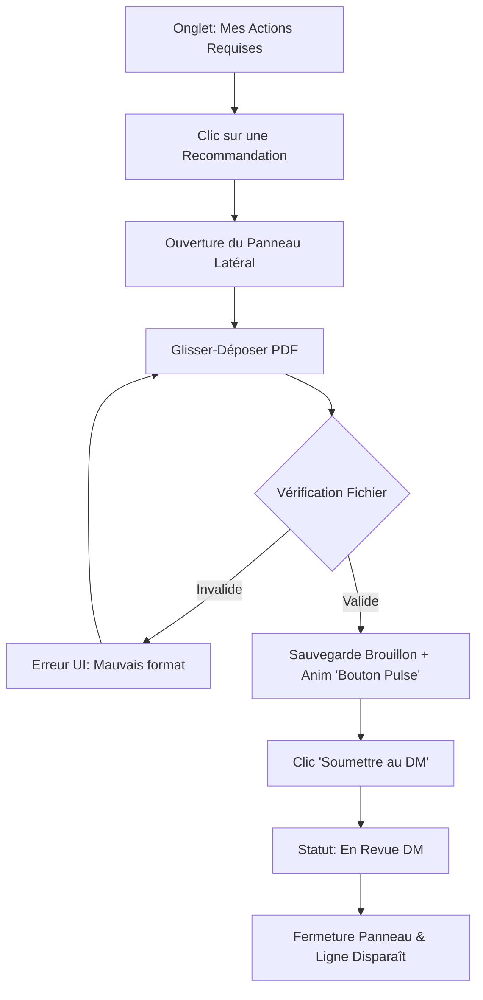

# UX Design Specification bicec--Sentinel

**Author:** Dave Lahe
**Date:** 2026-03-30T04:53:55+02:00

---

<!-- UX design content will be appended sequentially through collaborative workflow steps -->

## Executive Summary

### Project Vision
Sentinel est une plateforme On-Premise conçue pour éradiquer le risque de pénalités réglementaires (COBAC) à la BICEC. Elle remplace les processus manuels (Excel) par un flux centralisé et infalsifiable à 5 états (HMAC-SHA256). **Du point de vue UX, Sentinel n'est pas qu'un outil de conformité : c'est un moteur de productivité qui élimine les frictions, clarifie instantanément "chez qui est la balle", et transforme une obligation légale subie en un processus fluide et rapide.**

### Target Users
1. **Audit Interne (Jean-Paul M.) :** Le chef d'orchestre. Besoin d'une vue consolidée temps réel, d'actions en masse (Bulk) **sécurisées par des modales de double-confirmation**, et d'outils de relance automatisés.
2. **Directeur Métier / Audité (Claire D.) :** La responsable. Besoin d'une vue synthétique, de délégation sans effort, et d'un processus de validation expéditif **(actions groupées, ≤ 3 clics).**
3. **Employé Traitant / Opérationnel (Marc T.) :** L'exécutant. Besoin d'une "To-Do List" priorisée visuellement (Rouge/Orange/Vert) avec un module d'upload **prévenant les erreurs en amont**.
4. **Direction Générale :** Le superviseur. Besoin d'un tableau de bord ultra-synthétique (< 5 min).
5. **Auditeur Externe (COBAC) :** L'inspecteur. Accès sécurisé et restreint pour exporter les dossiers.

### Key Design Challenges
- **Friction d'Adoption & Objectif "Zéro Formation" :** L'interface doit être assez intuitive pour être utilisée sans manuel. Modèles de réponses rapides pour les rejets et actions en masse sans perte de contrôle. 
- **Visualisation d'un Flux Complexe (FSM) :** La 'Timeline' doit indiquer explicitement **"Balle dans le camp de : [Rôle]"**. Utilisation de palettes de couleurs strictement sémantiques (Rouge/Orange/Vert) pour guider l'attention, sans décoration superflue.
- **Rétroactions et Performance :** L'interface HTMX doit répondre en moins de 200ms pour maintenir l'illusion d'une application locale et ne pas frustrer l'utilisateur lors du chargement des "To-Do Lists".

### Design Opportunities
- **Le Dashboard "My To-Do List" :** Espaces hyper-focalisés n'affichant que les actions immédiates, avec onglets séparant "Mon action requise" de la "Supervision".
- **Feedback Immédiat (SPA-like) :** Utiliser HTMX/Alpine.js pour des validations instantanées de fichiers et éviter tout rafraîchissement de page inutile.
- **Timeline de Progression :** Transformer l'Audit Trail en une frise chronologique visuelle.

## Core User Experience

### Defining Experience
L'interaction centrale de Sentinel est le **"Relais de Preuve"**. L'expérience globale est définie par la fluidité avec laquelle un dossier passe d'un acteur à l'autre (Assignation → Exécution → Validation métier → Clôture Audit). Ce processus ne doit pas ressembler à une lourde corvée administrative, mais à un passage de témoin rapide et parfaitement tracé. La valeur du produit réside dans la vitesse de cette transaction et la tranquillité d'esprit (zéro sanction) qu'elle génère.

### Platform Strategy
- **Application Web "On-Premise" (Desktop First) :** Conçue principalement pour une utilisation sur ordinateur de bureau (navigateurs modernes au sein du réseau sécurisé BICEC).
- **Interactivité "SPA-like" via HTMX :** Bien qu'il s'agisse d'une application multipages classique, les interactions (uploads, changements de statuts, filtres) s'effectueront sans rechargement complet de la page pour garantir une réactivité sub-seconde (< 200ms).

### Effortless Interactions
- **Validation "Zéro Saisie" (DM) :** Un Directeur Métier téléversant un "PV de Recette" signé doit pouvoir valider un dossier vers l'Audit en 3 clics maximum, sans obligation de rédiger un long commentaire justificatif manuel.
- **Upload Magique (ETP) :** Zone de glisser-déposer (Drag & Drop) évidente, avec validation instantanée côté client du format (PDF/JPG) et du poids avant l'envoi au serveur.
- **Filtres Dynamiques :** Un simple clic sur un badge "En Retard" filtre instantanément le tableau de bord sans que la page ne saute.

### Critical Success Moments
- **L'Aha Moment du DM :** Lorsqu'il se connecte, constate que sa To-Do list est strictement limitée à ses seules priorités urgentes du jour, valide une preuve en quelques clics, et voit sa liste se vider instantanément avec une micro-animation de succès.
- **La Disparition du Retard :** Le moment où un dossier "OVERDUE" (rouge vif anxiogène) repasse au vert, provoquant un soulagement immédiat.
- **Le Sceau de Clôture :** L'apparition visuelle du "Hash HMAC-SHA256" définitif lors de la clôture par l'Audit, débloquant un sentiment d'irrévocabilité absolue.

### Experience Principles
1. **Zéro Formation Requise :** L'interface doit être si évidente qu'un DM remplaçant, fraîchement affecté, peut l'utiliser le jour même sans manuel.
3. **Pardonner et Guider :** Anticiper les erreurs (ex: fausses extensions, clôtures en masse accidentelles) via des garde-fous immédiats (HTMX/Alpine) empêchant même la faute de se produire.

## Desired Emotional Response

### Primary Emotional Goals
Sentinel vise trois états émotionnels majeurs :
1. **L'Empowerment et le Soulagement (Directeurs Métiers & ETP) :** Passer d'une corvée subie à une action valorisante. Chaque recommandation clôturée est une victoire contre le risque réglementaire.
2. **L'Omniscience (Direction Générale & Audit) :** La sensation grisante d'avoir une vue "God-Mode", instantanée et parfaitement exacte de la conformité de tout l'établissement.
3. **La Confiance et le Calme Sous Pression (Tous) :** La certitude que le système ne perdra jamais rien. Lors des sprints COBAC, la vélocité technique absolue du système agit comme un stabilisateur émotionnel.

### Emotional Journey Mapping
- **Lors de la connexion (Discovery) :** Sentiment de **Clarté**. L'interface ne hurle pas ; elle montre sobrement ce qui nécessite une attention immédiate.
- **Pendant l'action cœur (Soumettre/Valider) :** Sentiment de **Certitude**. Le système indique explicitement que l'action a réussi (ex: "Balle chez l'Audit") transférant instantanément le poids mental de l'utilisateur vers le processus.
- **Fin de tâche (To-Do List vide) :** Sentiment d'**Accomplissement**. Voir la liste se vider jusqu'à l'Empty State procure une vraie récompense psychologique.
- **En cas de retard ou révision :** L'interface doit transformer l'anxiété en un "Nudge" constructif. Une erreur n'est pas une punition, c'est une étape de collaboration.

### Micro-Emotions
- **Collaboration vs Punition :** Utiliser la terminologie *"Révision Requise" (Orange)* plutôt que *"Rejeté" (Rouge)* pour déstigmatiser les allers-retours entre opérationnels et Audit.
- **Sérénité vs Scepticisme :** La présence visible du Hash (HMAC-SHA256) rassure sur l'inviolabilité du système face à la COBAC.
- **Accomplissement vs Frustration :** Les micro-interactions valident la réussite des actions instantanément.

### Design Implications
- **Notifications Empathiques :** Le ton des alertes doit être celui d'un *Facilitateur* et non d'un inspecteur de police.
- **Friction Productive pour la Confiance :** Le bouton "Valider une preuve" s'active uniquement après que le document ait été physiquement affiché, donnant au validateur la confiance totale.
- **Utilisation stricte des couleurs :** Le niveau d'anxiété est géré par l'UI. Pas de rouge décoratif. Le rouge est exclusif aux retards stricts. Le orange pour la collaboration en cours (révisions).

### Emotional Design Principles
1. **Zéro Ambiguïté :** Le feedback système explique toujours exactement "chez qui est la balle".
3. **Célébrer la Clôture :** Traiter une recommandation est une victoire métier. L'interface doit le souligner positivement.

## UX Pattern Analysis & Inspiration

### Inspiring Products Analysis
Pour Sentinel, nous nous inspirons de références majeures de l'UX B2B moderne :
1. **Linear (Gestion de projet) :** Excellent pour la vitesse pure. Linear n'utilise pas de spinners (chargements) intrusifs, offre des raccourcis clavier partout, et utilise des couleurs strictes et minimalistes pour les statuts.
2. **Superhuman (Client Email) :** Le champion de l'"Inbox Zero". Il transforme l'anxiété d'une boîte pleine en une suite d'actions mécaniques et satisfaisantes.
3. **Airtable (Bases de données) :** L'équilibre parfait entre une interface web moderne et la puissance des filtres classiques façon Excel, indispensable pour l'adoption en milieu bancaire.

### Transferable UX Patterns
**Modèles de Navigation & Vitesse :**
- **Filtres Tabulaires Façon "Excel" (Airtable) :** Des filtres de colonnes empilables et très lisibles, rassurant les utilisateurs habitués aux tableurs.
- **L'Optimistic UI (Linear) :** Mettre à jour l'interface visuellement à l'instant même où l'utilisateur clique (ex: Clôture en masse), pendant que le serveur travaille en arrière-plan.

**Modèles d'Interaction (Bulk & Triage) :**
- **Guidage Actif (Bouton Pulsant) :** Dès qu'une preuve est uploadée en asynchrone, le bouton d'envoi final s'anime (Pulse) pour éviter le syndrome du "dossier abandonné en cours de route".
- **Multi-sélection type Gmail :** Cases à cocher pour des actions de clôture en masse complétées par une modale de confirmation finale.

### Anti-Patterns to Avoid
- **L'Anti-pattern "Jira" (Surcharge cognitive) :** Des formulaires de mise à jour avec 20 champs optionnels. Les écrans ne doivent demander que l'action stricte nécessaire.
- **La Validation Silencieuse / Bouton Oublié :** Permettre un upload de fichier réussi sans indiquer clairement à l'utilisateur qu'il lui reste une dernière action (cliquer sur Soumettre) pour faire avancer le workflow.
- **Les Modales Imbriquées :** Ouvrir une modale dans une modale. Préférer les panneaux latéraux (Slide-overs).

### Design Inspiration Strategy
**What to Adopt (À adopter) :**
- L'approche "Inbox Zero" (Superhuman) pour les tableaux de bord des Directeurs Métiers. 
- Les feedbacks "Optimistic UI" couplés à HTMX pour simuler une vélocité locale instantanée.

**What to Avoid (À exclure) :**
- Les formulaires complexes à étapes multiples (Wizard).
- L'abandon des codes visuels d'Excel sous prétexte de modernité (conserver les filtres clairs).

## 2. Core User Experience

### 2.1 Defining Experience
**Le "Relais de Preuve" (The Proof Relay)**
L'interaction qui définit Sentinel est l'acte de transférer la responsabilité d'une recommandation. Pour un Directeur Métier (DM), c'est le moment décisif d'appuyer sur "Approuver et Transmettre à l'Audit". Pour l'Audit, c'est le clic final sur "Sceller et Clôturer". Si ce relais est perçu comme instantané, sécurisant et exempt de friction, l'application rencontrera une adoption totale.

### 2.2 User Mental Model
- **Modèle Actuel :** La boîte mail (anxiogène, difficile à tracer) et le fichier Excel partagé (asynchrone, écrasements de données).
- **Le Modèle Sentinel :** La "Boîte de Réception (Inbox) à Zéro". Les utilisateurs doivent percevoir Sentinel non pas comme une base de données passive type Excel, mais comme un flux de travail actif à trier (comme une boîte mail priorisée ou des Pull Requests). Le but quotidien est de la vider.

### 2.3 Success Criteria
- **Validation "Sans Clavier" :** Si la preuve documentée est conforme, le DM doit pouvoir la valider uniquement à la souris (≤ 3 clics), sans que le système l'oblige à taper manuellement "Je valide ce point".
- **Décharge Mentale Instantanée :** Dès l'instant du clic, l'interface doit visuellement (changement de couleur, animation) confirmer que "la balle n'est plus dans son camp".
- **Réactivité Perçue :** L'action doit sembler s'exécuter instantanément (<100ms perçues) via l'approche *Optimistic UI* (Alpine.js + HTMX).

### 2.4 Novel UX Patterns
**L'Action Contextuelle "Friction Productive"**
- *L'approche :* Pour éviter les validations "à l'aveugle" depuis un listing (génératrices d'erreurs et d'angoisse), Sentinel utilise un panneau latéral interactif (Slide-over). Le bouton d'approbation global n'est visuellement activé que lorsque le document de preuve PDF a été affiché ou scrollé dans ce panneau.
- *Bénéfice :* Cela garantit la certitude (Confiance) tout en préservant l'extrême rapidité de la navigation (Vitesse).

### 2.5 Experience Mechanics
**Le Flux d'Approbation Standard (Le Relais) :**
1. **Initiation :** Depuis son *Dashboard* (onglet "Mon Action Requise"), l'utilisateur clique sur une recommandation en gras.
2. **Interaction :** Un panneau latéral glisse fluidement de la droite. Il affiche l'historique compact des échanges et, surtout, l'aperçu direct du document de preuve (PDF).
3. **Validation :** L'utilisateur consulte le PDF. Le bouton "Approuver" s'illumine. Il clique.
4. **Achèvement (Feedback) :** Le panneau se rétracte instantanément. La ligne du tableau devient verte, affiche le macaron "Balle chez : Rôle Suivant", et glisse majestueusement hors de l'onglet "Mon Action Requise".

## Visual Design Foundation

### Color System
- **Couleur de Marque (Brand) :** La palette principale sera rigoureusement alignée avec la **charte graphique officielle de la BICEC**. Les bleus corporatifs seront utilisés pour définir la hiérarchie de navigation et les actions primaires non-destructives.
- **Couleurs Sémantiques Strictes (Garde-fous) :**
  - 🔴 `red-600` : **OVERDUE** (Retard strict, action critique immédiate).
  - 🟠 `amber-500` : **REVISION / PENDING** (Action à venir, ou retour pour correction).
  - 🟢 `emerald-500` : **RESOLVED** (Conforme, clos, rassurant).
- **Base Neutre :** Nuances de gris (ex: `gray-50` pour les fonds, `gray-200` pour les bordures douces) pour que les couleurs sémantiques ressortent comme des feux de signalisation sur une toile de fond très calme.

### Typography System
- **Police Principale :** *Inter* (Google Fonts) ou police spécifiée par la charte BICEC si exigeante sur le digital. Une police sans-serif moderne, optimisée pour la lisibilité des interfaces denses en données.
- **Chiffres Tabulaires :** Activation obligatoire de `tabular-nums` en CSS pour que les dates, IDs et montants s'alignent parfaitement à la verticale.
- **Hiérarchie Claire :** Contraste marqué par la lisibilité : Titres forts (`font-semibold`, `text-gray-900`) et métadonnées douces (`text-sm`, `text-gray-500`).

### Spacing & Layout Foundation
- **Densité Professionnelle :** Système d'espacement standard base 4 (Tailwind). Les tableaux utiliseront un espacement "Dense" (`p-2` ou `p-3`) pour maximiser l'affichage des lignes sans scroller, adapté aux grands écrans de la banque.
- **Architecture de Page :** Navigation latérale (Sidebar) très fine pour laisser la place maximale (100% de la largeur restante) aux grilles de données complexes.
- **Slide-overs plutôt que Modales :** L'ouverture d'un détail de recommandation se fera via un panneau latéral glissant, permettant de conserver le contexte visuel de la liste en arrière-plan.

### Accessibility Considerations
- **Contraste Sécurisé :** Les textes sur les badges de statut (ex: texte blanc sur badge jaune/orange) seront rigoureusement testés pour respecter la norme WCAG AA.
- **Navigation Périphérique :** États `:hover` (survol de la souris) et `:focus` (navigation au clavier) intenses et visibles sur chaque ligne de tableau pour guider les auditeurs.

## Design Direction Decision

### Design Directions Explored
1. **Linear (Sidebar & Slide-over) :** Rapide mais manque de visibilité globale sur les données pour un profil bancaire très hiérarchique.
2. **Airtable (Full-width Data Grid) :** Rassurant (façon Excel), mais lourd à interagir pour un flux de validation (pas d'aperçu direct de document).
3. **Superhuman (Triage Focus) :** Excellent pour la vitesse, mais crée un "tunnel visuel" trop aveugle pour un manager voulant vérifier d'un coup d'œil sa charge de travail globale.

### Chosen Direction
**L'Hybride : "La Grille Augmentée" (Airtable + Linear + HTMX)**
Nous adoptons un modèle hybride : une vue principale "Pleine Largeur" de type tableur avancé (filtres et tris excel-like) pour le confort analytique, couplée à un système d'interaction par Panneau Latéral (Slide-over) pour le traitement des preuves sans jamais perdre le contexte de la liste.

### Design Rationale
- **Rassurer par la donnée :** Les banquiers ont besoin de tableaux clairs pour se sentir en contrôle (Objectif émotionnel d'Omniscience).
- **Vitesse par le Contexte :** Le Slide-over latéral permet d'afficher la preuve (PDF) tout en gardant un œil sur la charge restante (la grille Excel en arrière-plan).
- **L'Ascenseur Séquentiel (Triage) :** L'action "Valider" charge instantanément (via HTMX) la recommandation suivante dans le Slide-over déjà ouvert, créant une boucle d'accomplissement extrêmement addictive (Flow State de l'Inbox Zero).

### Implementation Approach
- **Tableau (HTML/Tailwind) :** Un composant de table sémantique pur HTML stylisé avec Tailwind, rendu côté serveur par Django.
- **Interactions HTMX :** Les clics sur les lignes déclenchent des requêtes `hx-get` qui ciblent le `#slide-over-container` caché initialement sur le côté droit de l'écran.
- **Réactivité Locale (Alpine.js) :** Alpine.js gère la transition CSS (glissement) du panneau, l'interception de la touche "Echap" pour le fermer, et l'affichage d'un indicateur de chargement ultra-léger lors des validations HMAC.

## User Journey Flows

### 1. Dépôt d'une Preuve (Rôle : ETP)
**Objectif :** L'Employé Temps Plein (ETP) fournit le document requis pour répondre à l'infraction.
**Optimisation :** Bouton "Soumettre" pulsant pour éviter l'oubli après un upload (L'Anti-pattern du bouton oublié).


### 2. Le "Relais de Preuve" (Rôle : Directeur Métier)
**Objectif :** Le DM vérifie le travail de l'ETP et valide la transmission à l'Audit.
**Optimisation :** "Friction Productive" garantissant que le DM ne clique pas à l'aveugle, suivie par une Optimistic UI (vitesse absolue).
```mermaid
graph TD
    A[Onglet: Validations en Attente] --> B[Clic sur Recommandation]
    B --> C[Ouverture Panneau avec Aperçu PDF]
    C --> D{Consultation de la Preuve}
    D -->|Non visionnée| E[Bouton 'Valider' Désactivé]
    E --> D
    D -->|Visionnée / Scrollée| F[Bouton 'Valider' Activé (Vert)]
    F --> G{Décision}
    G -->|Rejeter| H[Clic Tag Rapide: Motif Révision]
    H --> I[Retour à l'ETP statut 'Orange']
    G -->|Valider| J[Clic 'Approuver vers Audit']
    J --> K[Optimistic UI: Ligne Validée & Cachée instantanément]
    K --> L[Requête HTMX Transmise à l'Audit]
```

### 3. Clôture Cryptographique (Rôle : Audit Interne)
**Objectif :** L'Audit vérifie et scelle définitivement la recommandation avec une empreinte HMAC.
**Optimisation :** Triage séquentiel ininterrompu.
```mermaid
graph TD
    A[Onglet: Preuves à Sceller] --> B[Clic sur Recommandation]
    B --> C[Aperçu PDF & Historique]
    C --> D{Audit Review}
    D -->|Rejet| E[Clic Tag Rapide Rejet + Renvoi au DM]
    D -->|Validation| F[Clic 'Sceller & Clôturer']
    F --> G[Génération HMAC-SHA256 en DB]
    G --> H[Verrouillage RLS du Dossier]
    H --> I[Statut 'Clôturé' (Vert)]
    I --> J[Auto-chargement fluide du prochain dossier dans le panneau]
```

### Journey Patterns & Optimizations
- **Navigation :** Tous les flux partent d'une vue tabulaire globale pour aller vers un contexte isolé dans le panneau latéral (Sidebar -> Slide-over). L'utilisateur n'est jamais redirigé vers une nouvelle page.
- **Réduction de la Charge Mentale :** La règle du "Zéro Clavier" : hors motif de rejet très spécifique, toutes les validations (et même les rejets courants grâce aux Tags Rapides) s'effectuent strictement à la souris ou aux raccourcis clavier.
- **Feedback & Résilience :** L'élimination immédiate des lignes traitées (Optimistic UI) procure un sentiment de progression. **En cas d'échec réseau, le composant réapparaît de lui-même (Rollback UI) garantissant la confiance absolue (zéro perte d'information).**
- **Escalade Automatique : Arrivé à J-0 (OVERDUE), le système se charge de relancer les retardataires, soulageant les Directeurs Métiers du fardeau de la micro-gestion.**

## Component Strategy

### Design System Components
**Composants Fondateurs (Issus de Tailwind UI / Preline) :**
- Boutons standards et Dropdowns.
- Formulaires de filtrage de base (Inputs texte, Select, Datepicker).
- Badges de statuts (Customisés avec nos couleurs sémantiques).
- "Toasts" de notification (pour les retours d'erreurs réseau).

### Custom Components
Ces composants critiques doivent être développés sur-mesure en utilisant Tailwind CSS et les comportements dynamiques de Alpine.js / HTMX :

#### 1. Le Panneau de Preuve (Proof Slide-over)
**Purpose :** Afficher simultanément les détails d'une recommandation et le document PDF attaché, sans quitter la page courante.
**Anatomy :**
- Header avec ID et Statut fixé en haut.
- Colonne de gauche (30%) : Historique des interactions et méta-données.
- Colonne de droite (70%) : Visionneuse PDF native (`<object>` ou iframe).
- Footer fixé en bas : Boutons d'action ("Sceller", "Rejeter").
**Interactions (HTMX/Alpine) :** S'ouvre en glissant de la droite vers la gauche. La fermeture s'effectue par clic en dehors du panneau ou via la touche `Echap` (interceptée par Alpine.js).

#### 2. La Grille Bancaire (HTMX DataGrid)
**Purpose :** Afficher de gros volumes de recommandations, filtrables et triables comme dans Excel, tout en permettant le rechargement partiel des lignes modifiées (Optimistic UI).
**Anatomy :**
- Entêtes de colonnes avec icônes de tri interactives.
- Lignes (rows) ultra-denses (`p-2`) contenant des checkbox pour la multi-sélection.
**Interactions (HTMX) :** Chaque ligne (tr) est un micro-composant capable de faire un `hx-swap="outerHTML"` avec le serveur pour se mettre à jour ou s'effacer d'elle-même (ex: lors d'une validation) sans recharger tout le tableau.

#### 3. Le Bouton "Pulsant" (Smart Submit Button)
**Purpose :** Éviter l'anti-pattern du bouton oublié post-upload par l'ETP.
**States :**
- *Disabled* : Grisé tant qu'aucun fichier n'est chargé.
- *Loading* : Spinner affiché pendant l'upload HTMX.
- *Action Required* : Passe au Vert vif et ajoute une animation CSS `animate-pulse` dès que l'upload est confirmé par le serveur, guidant irrésistiblement le regard de l'ETP vers l'acte final de soumission.

### Component Implementation Strategy
- **Structure Django :** Chaque composant sur-mesure sera codé comme un template fragmenté (`partials/components/...`) pour être inclus dans n'importe quelle vue ou renvoyé proprement par HTMX sans surcharger le DOM.
- **Accessibilité :** Les modales et Slide-overs intégreront la gestion du Focus Trap (le clavier ne peut pas interagir avec la grille en arrière-plan tant que le panneau est ouvert).

### Implementation Roadmap
- **Phase 1 (Core) :** Le HTMX DataGrid et le Panneau de Preuve (Slide-over). Essentiels pour valider le coeur du "Relais de Preuve" (MVP).
- **Phase 2 (Feedback & Flow) :** Les composants d'alerte (Toast Network Retry) et le Smart Submit Button pour fluidifier l'expérience des ETP.
- **Phase 3 (Productivity) :** La multi-sélection (Bulk Action) sur la Grille Bancaire pour accélérer le traitement à grand volume.

## UX Consistency Patterns

### Button Hierarchy
**Règle :** L'œil doit être attiré par le "Happy Path" (le chemin de la réussite comptable).
- **Primary Action (Le Chemin Vert) :** Ex: `Approuver`, `Soumettre`, `Sceller`. Toujours en fond plein vert (`emerald-600`), placé systématiquement à droite ou en bas à droite des formulaires.
- **Negative/Destructive Action :** Ex: `Rejeter`. Visuellement subordonné pour éviter les erreurs (Bordure rouge ou texte gris souligné, jamais de fond plein rouge sauf pour confirmer la suppression d'un utilisateur).
- **Secondary Action :** Ex: `Filtrer`, `Annuler`. Boutons fantômes (Ghost buttons) ou bordures grises (`slate-200`) pour ne pas polluer l'attention.

### Feedback Patterns (La Règle du Silence Vert)
**Règle :** Ne pas punir l'efficacité par du bruit visuel.
- **Success (Succès) :** Géré par l'**Optimistic UI**. Lorsqu'un Directeur valide 50 preuves d'affilée, on supprime simplement les lignes. L'absence de la ligne EST la preuve du succès. On n'affiche PAS de popup verte "Succès" à chaque clic (Anti-pattern de fatigue visuelle).
- **Network / Server Error :** "Toast" rouge vif émergeant en bas à droite de l'écran avec un bouton "Réessayer" persistant jusqu'à l'action de l'utilisateur.
- **Warning / Action Required :** Clignotement subtil de la ligne (Pulse orange/rouge) pour attirer l'attention sans bloquer l'écran.

### Form Patterns (Philosophie "Zéro Clavier")
**Règle :** La saisie de texte libre est la principale source de friction et d'erreur dans les audits bancaires.
- **Sélecteurs au lieu de Textes :** Privilégier systématiquement les listes déroulantes (Select), les boutons radio et les "Tags rapides" (Quick Tags) pour les motifs de rejet.
- **Auto-save (Sauvegarde automatique) :** Aucun formulaire lourd ne requiert un clic "Enregistrer le brouillon". Alpine.js et HTMX sauvegardent la saisie à chaque perte de focus (`hx-trigger="blur"`).

### Empty States (États Vides)
**Règle :** Un écran vide ne doit jamais sembler cassé. Il doit récompenser l'utilisateur.
- **Inbox Zero :** Lorsqu'il n'y a plus d'Action Requise, l'écran affiche une illustration apaisante et un message d'**Empowerment** (ex: "Toutes vos recommandations sont traitées. Excellent travail, [Nom].").

## Responsive Design & Accessibility

### Responsive Strategy (Desktop-First Business logic)
Bien que développé avec Tailwind (qui suit techniquement le *mobile-first CSS*), la conception de Sentinel est pensée pour le **Desktop**.
- **Desktop (1024px et +) : Cible Principale.** L'interface exploite 100% de la largeur pour afficher les grilles de données (DataGrid) complexes et ouvrir les panneaux latéraux (Slide-overs) contenant les PDFs de preuve sans masquer la liste sous-jacente.
- **Tablet (768px - 1023px) :** Le panneau latéral (Slide-over) prendra une plus grande proportion de l'écran (ex: 80% de large) pour garantir la lisibilité du PDF.
- **Mobile (<768px) : Dégradation gracieuse (Graceful degradation).** Réservé à l'urgence (Un Directeur validant une preuve dans le taxi). Le tableau de bord complexe devient une simple liste verticale de cartes. L'aperçu PDF occupe 100% de l'écran.

### Breakpoint Strategy
Nous utiliserons les points d'arrêt standards et robustes de Tailwind CSS :
- `md` (768px) : Bascule de la vue Mobile vers la Tablette.
- `lg` (1024px) : Déploiement complet de l'expérience Desktop (Sidebar visible, Grille de données dense).
- `xl` (1280px) : Optimisation pour l'affichage côte à côte (Liste + PDF très lisible).

### Accessibility Strategy (WCAG AA)
Dans un contexte bancaire institutionnel, Sentinel visera le **Niveau AA du WCAG 2.1**.
- **Contraste Sémantique :** Une attention extrême sera portée au contraste des "Badges de Statut" (ex: texte blanc sur fond `amber-500`) souvent illisibles.
- **Navigation au Clavier pour les Experts :** Les Auditeurs doivent pouvoir naviguer dans les tableaux, ouvrir une preuve, la fermer (`Escape`), et passer à la ligne suivante (`Tab` / `Flèches directionnelles`) sans jamais toucher la souris.
- **Focus Management (Gestion de l'attention) :** L'ouverture du panneau latéral de preuve doit *capturer* le focus du clavier (Focus Trap) pour éviter que l'utilisateur n'interagisse accidentellement avec le tableau en arrière-plan.

### Testing & Implementation
- **Tests Navigateurs :** Priorité absolue sur **Google Chrome** et **Microsoft Edge** (les navigateurs standards déployés sur les postes de la banque).
- **Implémentation CSS :** Utilisation intensive des macros Tailwind (changement d'empilement Flexbox de la vue mobile `flex-col` à la vue bureau `flex-row`).

## Design System Foundation

### 1.1 Design System Choice
**Système Thématique basé sur Tailwind CSS (ex: Tailwind UI, Preline ou DaisyUI)**
L'approche choisie est d'utiliser une bibliothèque de composants HTML/Tailwind pré-construits. Cela nous fournit un catalogue de blocs (Tableaux, Modales, Badges) prêts à être animés localement par Alpine.js et dynamisés par le serveur via HTMX.

### Rationale for Selection
1. **Cohérence avec l'Architecture (SSR + HTMX) :** Notre stack étant "Backend-First" (rendu par Django), nous avons besoin de composants sous forme de HTML pur, et non de composants JavaScript complexes. Les bibliothèques basées sur Tailwind fournissent exactement cela.
2. **Vitesse de Développement (Time-to-Market) :** Utiliser des blocs pré-testés permet aux développeurs de se concentrer sur la logique métier critique (le flux FSM, le typage RLS, les sceaux cryptographiques) plutôt que sur l'alignement CSS des boutons.
3. **Personnalisation Bancaire et Sur-mesure :** Contrairement à un Material Design très rigide, l'approche Tailwind permet d'imposer notre propre palette de couleurs (strictement sémantique) sans lutter contre des styles prédominants.

### Implementation Approach
- Les composants HTML seront intégrés en tant que `templates` réutilisables dans Django (via des `includes` ou une librairie comme `django-components`), garantissant le principe DRY (Don't Repeat Yourself).
- Les interactions dynamiques au rendu local (fermer une alerte enfant, ouvrir un menu déroulant) seront gérées par les directives Alpine.js directement "in-line" dans les balises HTML.
- Tailwind CSS sera configuré pour purger et compiler un fichier CSS final ultra-léger, essentiel pour maintenir notre objectif de performance (< 200ms de temps de réponse).

### Customization Strategy
- **Tokens Sémantiques :** Le fichier `tailwind.config.js` sera étendu pour intégrer nos couleurs dictées par l'état d'urgence du workflow (ex: `bg-overdue-red`, `text-safe-green`, `border-revision-orange`).
- **Épuration du Bruit Visuel :** Les composants importés du Design System seront volontairement dépouillés de leurs effets superflus (ombres très marquées, gradients complexes) pour coller au principe "Zéro Ambiguïté" et abaisser la charge cognitive des Directeurs Métiers.
